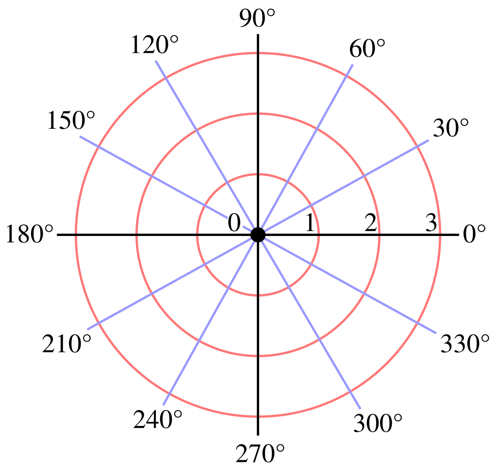

This page lists the various conventions TinyFFR uses (in no particular order):

!!! note ""
	## 3D Handedness / Orientation { : style="margin-top:0.5em" }

	* The world and any local 3D space is by default right-handed:
		* +X points left
		* +Y points up
		* +Z points forward

	* Rotations in 3D are specified as an angle and an axis
		* The angle specifies an anti-clockwise angle when the axis is pointing towards you
		* Alternatively: The angle specifies a clockwise angle when looking along/"down" the axis

!!! note ""
	## 2D Handedness / Orientation { : style="margin-top:0.5em" } 

	* In most contexts any 2D system follows trigonometric / cartesian defaults:
		* +X points right
		* +Y points up

	* 2D rotations are always assumed to be anti-clockwise when the angle is positive
	
	* 2D angles are always in polar form, e.g. right is 0°, up is 90°, left is 180°, down is 270°:
		* { : style="max-width:200px;" }

	??? info "Exception: Windows / Desktop Pixels"
		* When dealing *specifically* with window and/or desktop pixel co-ordinates, the top-left corner is the `(0, 0)` origin point, therefore:
			* +X points right
			* +Y points down
		
		This also affects the mouse/pointer tracking, therefore properties like `CursorDelta` follow this convention.

!!! note ""
	## Textures & Materials { : style="margin-top:0.5em" }

	* Texture origins (`(0, 0)`) start at the bottom-left corner.
	* Normal maps:
		* +X points towards the positive mesh tangent direction
		* +Y points towards the positive mesh bitangent direction
		* +Z points out of the texture, up away from the surface. Normal maps' Z should always be positive or 0, never negative.
		* Normal maps expected in "OpenGL"/"GL" format. Not "DirectX"/"DX" format.
	* ORM maps:
		* Occlusion: Max value is brightest (least occlusion), min value is darkest (most occlusion). Is used as a multiplier for indirect lighting.

!!! note ""
	## Units { : style="margin-top:0.5em" }

	* Scalar values (e.g. `float`) are assumed to be in meters
		* This is just a convention, nothing happens if you break it unless you wish to use "real-world" values for lighting

!!! note ""
	## Front-Face Winding Order { : style="margin-top:0.5em" }

	* TinyFFR expects front-facing polygons/triangles to be in anti-clockwise (:flag_us: *counterclockwise*) order.

!!! note ""
	## Math { : style="margin-top:0.5em" }

	* All matrices are row-major
	* `Transform` matrix is laid out in following format:

		```csharp
		var rotVect = RotationQuaternion.AsVector4();
		var rotVectSquared = rotVect * rotVect;

		var rowA = new Vector4(
			1f - 2f * rotVectSquared.Y - 2f * rotVectSquared.Z,
			2f * rotVect.X * rotVect.Y + 2f * rotVect.Z * rotVect.W,
			2f * rotVect.X * rotVect.Z - 2f * rotVect.Y * rotVect.W,
			0f
		) * Scaling.X;
		var rowB = new Vector4(
			2f * rotVect.X * rotVect.Y - 2f * rotVect.Z * rotVect.W,
			1f - 2f * rotVectSquared.X - 2f * rotVectSquared.Z,
			2f * rotVect.Y * rotVect.Z + 2f * rotVect.X * rotVect.W,
			0f
		) * Scaling.Y;
		var rowC = new Vector4(
			2f * rotVect.X * rotVect.Z + 2f * rotVect.Y * rotVect.W,
			2f * rotVect.Y * rotVect.Z - 2f * rotVect.X * rotVect.W,
			1f - 2f * rotVectSquared.X - 2f * rotVectSquared.Y,
			0f
		) * Scaling.Z;

		return new Matrix4x4(
			rowA.X, rowA.Y, rowA.Z, rowA.W,
			rowB.X, rowB.Y, rowB.Z, rowB.W,
			rowC.X, rowC.Y, rowC.Z, rowC.W,
			Translation.X, Translation.Y, Translation.Z, 1f
		);
		```
			
	* `Camera` projection matrix is laid out in following format:

		```csharp
		var near = parameters.NearPlaneDistance;
		var far = parameters.FarPlaneDistance;

		var h = MathF.Tan(parameters.VerticalFovRadians * 0.5f) * near;
		var w = h * parameters.AspectRatio;

		var left = -w;
		var right = w;
		var bottom = -h;
		var top = h;

		return new Matrix4x4(
			(near * 2f) / (right - left),			0f,										0f,										0f,
			0f,										(near * 2f) / (top - bottom),			0f,										0f,
			(right + left) / (right - left),		(top + bottom) / (top - bottom),		-(far + near) / (far - near),			-1f,
			0f,										0f,										-(2f * far * near) / (far - near),		0f
		),
		```

	* `Camera` model matrix is laid out in following format:

		```csharp
		var p = parameters.Position.ToVector3();
		var z = parameters.ViewDirection.ToVector3();
		var x = Vector3.Cross(z, parameters.UpDirection.ToVector3());
		var y = Vector3.Cross(x, z);
		z = -z;

		return new Matrix4x4(
			m11: x.X, m12: x.Y, m13: x.Z,
			m21: y.X, m22: y.Y, m23: y.Z,
			m31: z.X, m32: z.Y, m33: z.Z,
			m41: p.X,
			m42: p.Y,
			m43: p.Z,
			m14: 0f,
			m24: 0f,
			m34: 0f,
			m44: 1f
		);
		```

	* All `IVect` types are four floating point values internally. When converting to `Vector4` the `W` value will be set accordingly:
		* `Vect` W value is 0f
		* `Direction` W value is 0f
		* `Location` W value is 1f