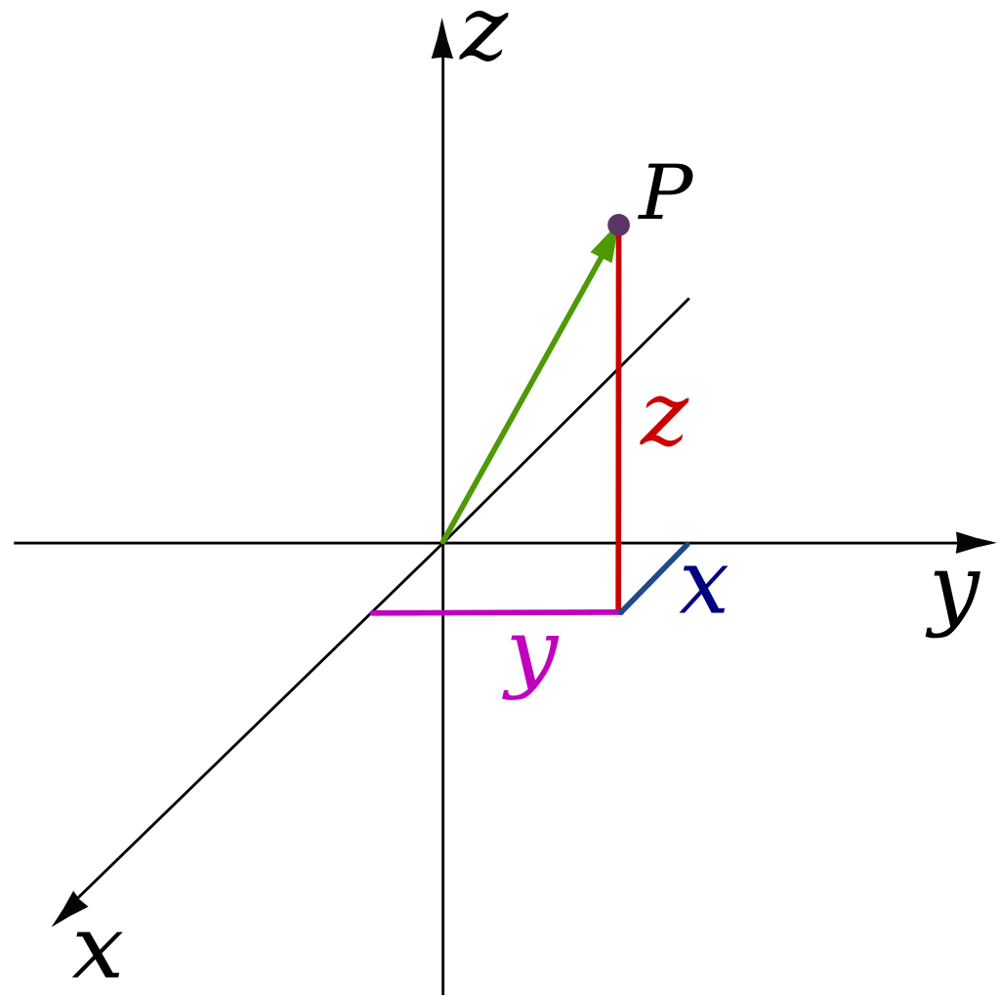

TinyFFR has a replete API for 3D/2D math and geometry operations. This page serves as a quick overview of each available mathematical type and its intended usage.

This page attempts to be beginner-friendly and does not assume any prior linear algebra / 3D math knowledge. Depending on your personal level of knowledge you may wish to skip some paragraphs that explain concepts you're already familiar with.

Finally, note that this page only describes the surface-level, most common operations available on each mathematical type. Explore the types in the [reference docs](/reference/index.md) or via your IDE to see all defined functions.

## 3D Vectors

All 3D worlds and scenes in TinyFFR are described by a three-dimensional [cartesian co-ordinate system](https://en.wikipedia.org/wiki/Three-dimensional_space). These systems use three axes all defined to be orthogonal to each other, known as the X-axis, the Y-axis, and the Z-axis.

### Locations

A `Location` instance represents a single point in 3D space. It defines three properties, `X`, `Y`, and `Z`, and these properties denote a distance along the X, Y, and Z axes. Specifically, the value in `X`, `Y`, and `Z` indicate how far from the *world origin* this location is. Positive values indicate movement in one direction along their respective axis, negative values indicate movement in the opposite direction. The positive and negative directions are defined arbitrarily (see [Conventions](conventions.md)). The world's origin-point is defined as being at `(X = 0, Y = 0, Z = 0)`.

{ : style="max-width: 300px;" }
/// caption
The point "P" is a `Location` with `X` = `1f`, `Y` = `2f`, `Z` = `3f`.

The black arrows indicate the X-axis, Y-axis, and Z-axis.

The centre-point where all axes cross in this diagram is the aforementioned *world origin*.
///

#### Creating Locations

```csharp
// Create a location with X = 1, Y = 2, Z = 3
var location = new Location(1f, 2f, 3f);

// Create a location by implicit conversion from ValueTuple<float, float, float>
var location = (Location) (1f, 2f, 3f);

// Create a Location by modifying an existing one
var location2 = location1 with { X = 0f };

// Create a Location by adding/subtracting a Vect to an existing one
// (Vects explained further below)
var location2 = location1 + new Vect(7f, 8f, 9f);
var location2 = location1 - new Vect(7f, 8f, 9f);
```

#### Common Operations

```csharp
// Calculate the distance between two Locations
var distance = location1.DistanceFrom(location2);
```

### Directions

It's common to want to describe a *direction* in 3D. Examples of directions include "Left", "Down", or really any arbitrary way you can point in 3D space. The `Direction` struct allows us to describe exactly this.

You can think of a `Direction` as an "arrow" pointing one specific way. The arrow does not have any defined position/location in space or any defined length, we just know which way it is pointing.

??? abstract "Direction Structure"
	Internally, a `Direction` *does* actually have a length and has `X`, `Y`, and `Z` properties just like a `Location`.

	However, a `Direction`'s length is always either `1f` or `0f`. TinyFFR manages the `X`/`Y`/`Z` properties to enforce this. This is done to make sure the `Direction` is always "unit length"-- in other words, `Direction`s are secretly just specially-named [unit vectors](https://en.wikipedia.org/wiki/Unit_vector).

	For most intents and purposes it's better to think of a `Direction` as a more abstract concept (e.g. the arrow pointing one specific way).

	It's only in very niche scenarios that you should need to access or care about the `X`/`Y`/`Z` properties of a `Direction`. They can not be set with a `with` statement.

	

There is a special case `Direction` known as the "None" direction. As its name implies it denotes the *absence* of any direction.

#### Creating Directions

```csharp
// Create a Direction using the built-in static fields
var dir = Direction.Forward;
var dir = Direction.Right;
var dir = Direction.None;

// Calculate the direction from one Location to another
var dir = location1.DirectionTo(location2);

// Calculate the direction of a Vect
// (Vects explained further below)
var dir = vect.Direction;

// Create a Direction using proportional weights
// (this specifies the RELATIVE length of the arrow along the 
// three cartesian axes and is rarely useful. This is NOT setting 
// the X/Y/Z properties directly, only their ratio)
var dir = new Direction(1f, 2f, 3f);
```

#### Common Operations

```csharp
// Get the opposite direction
// (these lines produce an identical result)
var dir2 = dir1.Flipped;
var dir2 = -dir1;

// Get the angle between two directions
// (these lines produce an identical result)
var angle = dir1.AngleTo(dir2)
var angle = dir1 ^ dir2;

// Rotate a direction
// (Rotations explained further below)
// (these lines produce an identical result)
var dir2 = dir1.RotatedBy(rotation);
var dir2 = dir1 * rotation;
```

### Vects

A `Vect` is almost identical to a `Direction` but has one key difference: It has a specific length.

`Vect`s still do not have any defined position/location in the world, just a constituent `Direction` and `Length`.

A `Vect` also has an `X`, `Y`, and `Z` property which indicate the length of the arrow along each axis.

??? question "Why 'Vect' instead of 'Vector'?"
	`Vect` is short for [Vector](https://en.wikipedia.org/wiki/Euclidean_vector). However, we use `Vect` instead of `Vector` for three reasons:

	1. The in-built `System.Numerics` C# namespace already defines a similar data type named [Vector](https://learn.microsoft.com/en-us/dotnet/api/system.numerics.vector?view=net-9.0).
	2. A "Vector" has an alternative meaning as a list/resizable array in some software contexts.
	3. `Location` and `Direction` are actually vectors too, just specialized forms of vectors. `Vect` is specifically a vector that is not a `Location` or `Direction`. 

#### Creating Vects

```csharp
// Create a Vect with from a Direction and length
// (these lines produce an identical result)
var vect = Vect.FromDirectionAndDistance(direction, 3f);
var vect = direction * 3f;

// Create a Vect representing the direction and distance between two Locations
// (these lines produce an identical result)
var vect = location1.VectTo(location2);
var vect = location1 >> location2;

// Create a Vect that is:
// 		1 unit along the positive X direction,
// 		2 units along the negative Y direction,
//		0 units along the Z direction
var vect = new Vect(1f, -2f, 0f);

// Create a Vect by implicit conversion from ValueTuple<float, float, float>
var vect = (Vect) (1f, -2f, 0f);

// Create a Vect that is 1 unit along every direction
var vect = new Vect(1f);

// Create a Vect by modifying an existing one
var vect2 = vect1 with { X = 0f };
```

#### Common Operations

```csharp
// Calculate Vect length
var length = vect.Length;

// Calculate Vect Direction
var dir = vect.Direction;

// Get a Vect with the same length but pointing in the opposite Direction
// (these lines produce an identical result)
var vect2 = vect1.Reversed;
var vect2 = -vect1;

// Adjust Vect length
var vect2 = vect1.WithLength(10f);
var vect2 = vect1.WithLengthIncreasedBy(10f);
var vect2 = vect1.WithLengthDecreasedBy(10f);
var vect2 = vect1.WithMaxLength(10f);
var vect2 = vect1.WithMinLength(10f);
var vect2 = vect1 * 10f; // Scale the length up by 10
var vect2 = vect1 / 10f; // Scale the length down by 10

// Adjust Vect Direction
var vect2 = vect1.WithDirection(dir);

// Add two Vects together
// (The resultant Vect is the combined arrow + length you'd get from moving along
// the first Vect and then the second one; 
// see https://mathworld.wolfram.com/VectorAddition.html)
var vect3 = vect1 + vect2;

// Subtract one Vect from another
// (The resultant Vect is the combined arrow + length you'd get from moving along
// the first Vect and then moving along the "Reversed" second one)
var vect3 = vect1 - vect2;

// Rotate a Vect
// (Rotations explained further below)
// (these lines produce an identical result)
var vect2 = vect1.RotatedBy(rotation);
var vect2 = vect1 * rotation;
```

## Angles & Rotations

### Angles

The `Angle` type represents any angle in 2D or 3D. The (ostensible) unit of any `Angle` is degrees.

??? abstract "Angle Internal Units"
	Internally, angles are actually stored as values in [radians](https://en.wikipedia.org/wiki/Radian) for performance reasons, hence the 'ostensible' qualifier above.

	However, every public method/property on `Angle` works to convert to/from degrees, unless otherwise specified. Therefore you can think of all `Angles` as being in degrees.

	The reasoning behind this decision is long-winded, but if you're interested you can read here: [Angle.cs at commit #d660e3db](https://github.com/Egodystonic/TinyFFR/blob/d660e3dbb00e75aca3d13011ee8860846e4b7040/TinyFFR/Math/Angle.cs#L107)

#### Creating Angles

```csharp
// Create an Angle that is 90°
// (these lines produce an identical result)
var angle = new Angle(90f);
var angle = 90f;

// Create an Angle using another unit
var angle = Angle.FromRadians(Math.PI);
var angle = Angle.FromFullCircleFraction(0.5f);

// Calculate the Angle between two Directions
// (these lines produce an identical result)
var angle = Angle.FromAngleBetweenDirections(dir1, dir2);
var angle = dir1 ^ dir2;

// Find the polar Angle of a 2D vector
// (XYPairs explained further below)
var angle = xyPair.PolarAngle!.Value;
```

#### Common Operations

```csharp
// Add or subtract angles
var angle3 = angle1 + angle2;
var angle3 = angle1 - angle2;

// Multiply / divide (scale) angle
var angle2 = angle1 * 3f;
var angle2 = angle1 / 3f;

// Get opposite angle
// (these lines produce an identical result)
var angle2 = angle1.Negated;
var angle2 = -angle1;

// Convert back to some unit
var degrees = angle.Degrees;
var radians = angle.Radians;
```

### Rotations

The simplest description of a `Rotation` is as something that represents a transition from one `Direction` to another in 3D space.

Specifically speaking, `Rotation`s are defined by two key properties: An `Axis` and an `Angle`. 

??? tip "Rotations are *not* Orientations or Directions"
	Sometimes it can be easy to accidentally think of rotations as being *facing directions* or *orientations of objects*; but this is incorrect. Rotations are strictly a description of how to *transition* things in 3D space.

	For example, a `Rotation` might represent the __transition__ of a teacup from being right-way-up to being upside-down. The `Rotation` instance does *not* represent the teacup being in any particular orientation, rather it represents a movement of 180° around a particular axis. If you apply the same `Rotation` again the teacup will go back from being upside-down to being right-way-up.


## Useful Interfaces

TODO mention random, span conversion, ToStringDesc, and so on