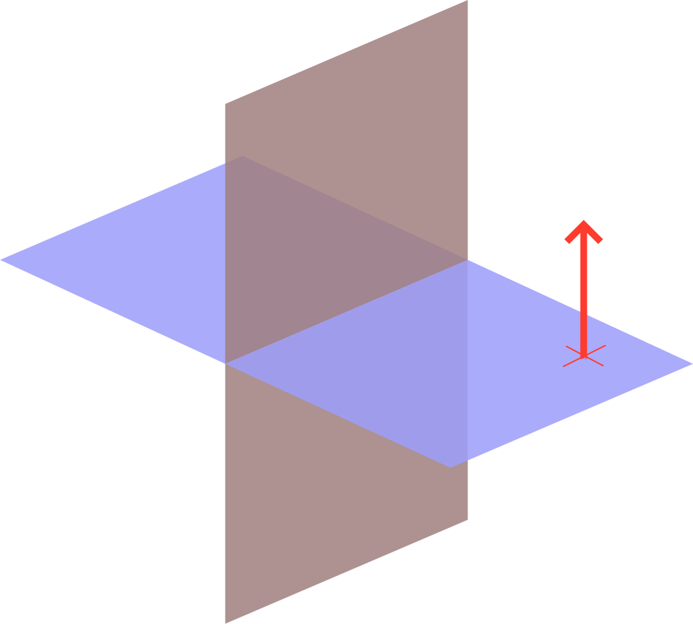

TinyFFR has a replete API for 3D/2D math and geometry operations. This page serves as a quick overview of each available mathematical type and its intended usage.

This page attempts to be beginner-friendly and does not assume any prior linear algebra / 3D math knowledge. Depending on your personal level of knowledge you may wish to skip some paragraphs that explain concepts you're already familiar with.

Finally, note that this page only describes the surface-level, most common operations available on each mathematical type. Explore the types in the [reference docs](/reference/index.md) or via your IDE to see all defined functions.

## Vectors

All 3D worlds and scenes in TinyFFR are described by a three-dimensional [cartesian co-ordinate system](https://en.wikipedia.org/wiki/Three-dimensional_space). These systems use three axes all defined to be orthogonal to each other, known as the X-axis, the Y-axis, and the Z-axis.

### Location

A `Location` instance represents a single point in 3D space. It defines three properties, `X`, `Y`, and `Z`, and these properties denote a distance along the X, Y, and Z axes. Specifically, the value in `X`, `Y`, and `Z` indicate how far from the *world origin* this location is. Positive values indicate movement in one direction along their respective axis, negative values indicate movement in the opposite direction. The positive and negative directions are defined arbitrarily (see [Conventions](conventions.md)). The world's origin-point is defined as being at `(X = 0, Y = 0, Z = 0)`.

{ : style="max-width: 300px;" }
/// caption
The point "P" is a `Location` with `X` = `1f`, `Y` = `2f`, `Z` = `3f`.

The black arrows indicate the X-axis, Y-axis, and Z-axis.

The centre-point where all axes cross in this diagram is the aforementioned *world origin*.
///

#### Creating Locations

```csharp
// Create a location with X = 1, Y = 2, Z = 3
var location = new Location(1f, 2f, 3f);

// Create a location by implicit conversion from ValueTuple<float, float, float>
var location = (Location) (1f, 2f, 3f);

// Create a Location by modifying an existing one
var location2 = location1 with { X = 0f };
```

#### Common Operations

```csharp
// Calculate the distance between two Locations
var distance = location1.DistanceFrom(location2);

// "Move" a Location (Vects explained further below)
// (these lines produce an identical result)
var location2 = location1.MovedBy(new Vect(-1f, -2f, -3f));
var location2 = location1 + new Vect(-1f, -2f, -3f);
var location2 = location1 - new Vect(1f, 2f, 3f);
```

### Direction

It's common to want to describe a *direction* in 3D. Examples of directions include "Left", "Down", or really any arbitrary way you can point in 3D space. The `Direction` struct allows us to describe exactly this.

You can think of a `Direction` as an "arrow" pointing one specific way. The arrow does not have any defined position/location in space or any specific length, we just know which way it is pointing.

??? abstract "Direction Internals"
	Internally, a `Direction` *does* actually have a length and has `X`, `Y`, and `Z` properties just like a `Location`.

	However, a `Direction`'s length is always either `1f` or `0f`. TinyFFR manages the `X`/`Y`/`Z` properties to enforce this. This is done to make sure the `Direction` is always "unit length"-- in other words, `Direction`s are secretly just specially-named [unit vectors](https://en.wikipedia.org/wiki/Unit_vector).

	If you really want to use a `Direction` as a unit vector, the `ToVector3()` method will convert it to a `System.Numerics.Vector3` for you.

	For most intents and purposes it's better to think of a `Direction` as a more abstract concept (e.g. the arrow pointing one specific way). Its length is irrelevant. It's only in very niche scenarios that you should even need to access or care about the `X`/`Y`/`Z` properties of a `Direction`. They can not be set with a `with` statement.
	

There is a special case `Direction` known as the "None" direction. As its name implies it denotes the *absence* of any direction.

#### Creating Directions

```csharp
// Create a Direction using the built-in static fields
var dir = Direction.Forward;
var dir = Direction.Right;
var dir = Direction.None;

// Calculate the direction from one Location to another
var dir = location1.DirectionTo(location2);

// Calculate the direction of a Vect
// (Vects explained further below)
var dir = vect.Direction;

// Create a Direction using proportional weights
// (this specifies the RELATIVE length of the arrow along the 
// three cartesian axes and is rarely useful. This is NOT setting 
// the X/Y/Z properties directly, only their ratio)
var dir = new Direction(1f, 2f, 3f);
```

#### Common Operations

```csharp
// Get the opposite direction
// (these lines produce an identical result)
var dir2 = dir1.Flipped;
var dir2 = -dir1;

// Get the angle between two directions
// (these lines produce an identical result)
var angle = dir1.AngleTo(dir2)
var angle = dir1 ^ dir2;

// Rotate a direction
// (Rotations explained further below)
// (these lines produce an identical result)
var dir2 = dir1.RotatedBy(rotation);
var dir2 = dir1 * rotation;
```

### Vect

A `Vect` is almost identical to a `Direction` but has one key difference: It *does* have a specific length.

`Vect`s still do not have any defined position/location in the world, just a constituent `Direction` and `Length`.

A `Vect` also has an `X`, `Y`, and `Z` property which indicate the length of the arrow along each axis.

??? question "Why 'Vect' instead of 'Vector'?"
	TinyFFR uses `Vect` instead of `Vector` as its main vector type name for four reasons:

	1. The in-built `System.Numerics` C# namespace already defines a similar data type named [Vector](https://learn.microsoft.com/en-us/dotnet/api/system.numerics.vector?view=net-9.0).
	2. A "Vector" has an alternative meaning as a list/resizable array in some software contexts.
	3. `Location` and `Direction` are actually vectors too, just specialized forms of vectors. `Vect` is specifically a vector that is not a `Location` or `Direction`.
	4. It's not completely unexpected that someone may be using TinyFFR with other 3D/math libraries that also define their own "Vector" type.

#### Creating Vects

```csharp
// Create a Vect with from a Direction and length
// (these lines produce an identical result)
var vect = Vect.FromDirectionAndDistance(direction, 3f);
var vect = direction * 3f;

// Create a Vect representing the direction and distance between two Locations
// (these lines produce an identical result)
var vect = location1.VectTo(location2);
var vect = location1 >> location2;

// Create a Vect that is:
// 		1 unit along the positive X direction,
// 		2 units along the negative Y direction,
//		0 units along the Z direction
var vect = new Vect(1f, -2f, 0f);

// Create a Vect by implicit conversion from ValueTuple<float, float, float>
var vect = (Vect) (1f, -2f, 0f);

// Create a Vect that is 1 unit along every direction
var vect = new Vect(1f);

// Create a Vect by modifying an existing one
var vect2 = vect1 with { X = 0f };
```

#### Common Operations

```csharp
// Calculate Vect length
var length = vect.Length;

// Calculate Vect Direction
var dir = vect.Direction;

// Get a Vect with the same length but pointing in the opposite Direction
// (these lines produce an identical result)
var vect2 = vect1.Reversed;
var vect2 = -vect1;

// Adjust Vect length
var vect2 = vect1.WithLength(10f);
var vect2 = vect1.WithLengthIncreasedBy(10f);
var vect2 = vect1.WithLengthDecreasedBy(10f);
var vect2 = vect1.WithMaxLength(10f);
var vect2 = vect1.WithMinLength(10f);
var vect2 = vect1 * 10f; // Scale the length up by 10
var vect2 = vect1 / 10f; // Scale the length down by 10

// Adjust Vect Direction
var vect2 = vect1.WithDirection(dir);

// Add two Vects together
// (The resultant Vect is the combined arrow + length you'd get from moving along
// the first Vect and then the second one; 
// see https://mathworld.wolfram.com/VectorAddition.html)
var vect3 = vect1 + vect2;

// Subtract one Vect from another
// (The resultant Vect is the combined arrow + length you'd get from moving along
// the first Vect and then moving along the "Reversed" second one)
var vect3 = vect1 - vect2;

// Rotate a Vect
// (Rotations explained further below)
// (these lines produce an identical result)
var vect2 = vect1.RotatedBy(rotation);
var vect2 = vect1 * rotation;
```

## Angles & Rotations

### Angle

The `Angle` type represents any angle in 2D or 3D. The (ostensible) unit of any `Angle` is degrees.

??? abstract "Angle Internals"
	Internally, angles are actually stored as values in [radians](https://en.wikipedia.org/wiki/Radian) for performance reasons, hence the 'ostensible' qualifier above.

	However, every public method/property on `Angle` works to convert to/from degrees, unless otherwise specified. Therefore you can think of all `Angles` as being in degrees.

	The reasoning behind this decision is long-winded, but if you're interested you can read here: [Angle.cs at commit #d660e3db](https://github.com/Egodystonic/TinyFFR/blob/d660e3dbb00e75aca3d13011ee8860846e4b7040/TinyFFR/Math/Angle.cs#L107)

#### Creating Angles

```csharp
// Create an Angle that is 90°
// (these lines produce an identical result)
var angle = new Angle(90f);
var angle = 90f;

// Create an Angle using another unit
var angle = Angle.FromRadians(Math.PI);
var angle = Angle.FromFullCircleFraction(0.5f);

// Calculate the Angle between two Directions
// (these lines produce an identical result)
var angle = Angle.FromAngleBetweenDirections(dir1, dir2);
var angle = dir1 ^ dir2;

// Find the polar Angle of a 2D vector
// (XYPairs explained further below)
var angle = xyPair.PolarAngle!.Value;
```

#### Common Operations

```csharp
// Add or subtract angles
var angle3 = angle1 + angle2;
var angle3 = angle1 - angle2;

// Multiply / divide (scale) angle
var angle2 = angle1 * 3f;
var angle2 = angle1 / 3f;

// Get opposite angle
// (these lines produce an identical result)
var angle2 = angle1.Negated;
var angle2 = -angle1;

// Convert back to some unit
var degrees = angle.Degrees;
var radians = angle.Radians;
```

### Rotation

A `Rotation` instance has two properties, `Angle` and `Axis`, describing a turn of __N__ degrees (the `Angle`) around a given __Direction__ (the `Axis`).

For example, let's visualize a `Rotation` of `90°` around `Direction.Down`: Imagine holding a pencil in your hand and pointing it directly at the floor (that's your `Down` axis). Then, imagine one side of the pencil has some writing on it facing away from your body, and then imagine turning the pencil so that the writing is now facing to your right: You just made a 90° rotation around the down axis(1).
{ .annotate }

1. When looking along the `Axis` direction, the `Angle` is a clockwise turn.

??? tip "Rotations are *not* Orientations or Directions"
	Sometimes it can be easy to accidentally think of rotations as being *facing directions* or *orientations of objects*; but this is incorrect. Rotations are strictly a description of how to *transition* things in 3D space by turning them.

	For example, a `Rotation` might represent the __transition__ of a teacup from being right-way-up to being upside-down. The `Rotation` instance does *not* represent the teacup being in any particular orientation or ending up in any particular orientation, rather it simply represents a turn of a certain amount around a particular axis (i.e. `180° around Left`). 
	
	If you apply the same `Rotation` twice to the teacup, the teacup will end up being in the same orientation as it started in, because you're simply applying the exact same 180° turn twice.

#### Creating Rotations

```csharp
// Create an Rotation that is 90° around Down
// (these lines produce an identical result)
var rot = new Rotation(90f, Direction.Down);
var rot = 90f % Direction.Down;

// Create a Rotation derived from a start and end Direction
// (these lines produce an identical result)
var rot = Rotation.FromStartAndEndDirection(dir1, dir2);
var rot = dir1 >> dir2;

// Modify an existing Rotation
var rot2 = rot1 with { Angle = 100f };
var rot2 = rot1 with { Axis = Direction.Forward };
var rot2 = rot1.WithAngleIncreasedBy(10f);
var rot2 = rot1.WithAngleDecreasedBy(10f);
var rot3 = rot1.WithAxisRotatedBy(rot2); // More niche
```

#### Common Operations

```csharp
// Rotate a Direction or a Vect
// (these lines produce an identical result for the given direction/vect)
var dir2 = dir1 * rot;
var vect2 = vect1 * rot;
var dir2 = dir1.RotatedBy(rot);
var vect2 = vect1.RotatedBy(rot);
var dir2 = rot.Rotate(dir1);
var vect2 = rot.Rotate(vect1);

// Rotate various Geometric types
var line2 = line1 * rot;
var plane2 = plane1 * rot;

// Reverse a Rotation
// (these lines produce an identical result)
var rot2 = rot1.Reversed;
var rot2 = -rot1;

// Scale a Rotation
var rot2 = rot1 * 0.5f;
var rot2 = rot1 / 2f;

// Combine Rotations
var rot3 = rot1.CombinedAndNormalizedWith(rot2);

// Interpolate (blend between) Rotations
var rot3 = Rotation.Interpolate(rot1, rot2, 0.5f); // 0.5f = 50% between rot1 and rot2
```

## Shapes

### Plane

A `Plane` represents an infinitely-long-and-wide surface that splits 3D space in two halves.

{ : style="max-width:300px;" }
/// caption
This image depicts two planes in space at right-angles to each other.

The red arrow shows one plane's __normal__, i.e. a direction pointing exactly orthogonally out of its surface.

Planes stretch out infinitely far along their width/breadth; they only appear to 'end' in this image because it's not possible to show infinite distance on a web page.
///

`Plane`s are specified in TinyFFR by two properties: 

* A `Normal` which is a `Direction` pointing exactly orthogonally out of the plane (that's the red arrow in the diagram above);
* A `PointClosestToOrigin` which is a `Location` on the plane closest to the world origin (`(0, 0, 0)`).

#### Creating Planes

```csharp
// From just a Normal. The PointClosestToOrigin will be set as (0, 0, 0), meaning
// the Plane will go "through" the world origin
var plane = new Plane(direction);

// From a Normal and any point that is on the plane.
// The point supplied can be the closest point to the origin but it doesn't have to be.
// The constructor will calculate the PointClosestToOrigin automatically.
var plane = new Plane(direction, location);

// From a Normal and a distance along that Normal direction that you
// must travel from the world origin to get to the plane
var plane = new Plane(direction, distance);

// From a PointClosestToOrigin only
// The second parameter specifies whether the Normal points towards the world origin
var planeNullable = Plane.FromPointClosestToOrigin(direction, true);

// From a triangle in 3D space
// The Normal will face "out" from the triangle, where the "out" facing direction is the one
// you see when the given points cycle anti-clockwise
var planeNullable = Plane.FromTriangleOnSurface(location1, location2, location3);
```

#### Common Operations

```csharp
// Flip the Plane (splits 3D space the same but the Normal faces the opposite direction)
// (these lines produce an identical result)
var plane2 = plane1.Flipped;
var plane2 = -plane1;

// Move the Plane around
var plane2 = plane1 + vect;
var plane2 = plane1 - vect;
var plane2 = plane1.MovedBy(vect);

// Rotate the Plane
var plane2 = plane1.RotatedAroundOriginBy(rotation);
var plane2 = plane1.RotatedBy(rotation, pivotPoint);
var plane2 = plane1 * (rotation, pivotPoint);

// Split 3D space
var locationIsInFirstHalf = plane.FacesTowards(location);
var locationIsInSecondHalf = plane.FacesAwayFrom(location);

// Determine if things are on the plane
var locationIsOnPlane = plane.Contains(location);
var locationIsOnPlane = plane.Contains(location, planeThickness);
```

### Sphere

???+ failure "Not Yet Available"
	Documentation for this type will be written once ["World" shapes](https://github.com/Egodystonic/TinyFFR/issues/17) have been added to TinyFFR.

	Please note: The type itself is already available, but the documentation is not.

### Cuboid

???+ failure "Not Yet Available"
	Documentation for this type will be written once ["World" shapes](https://github.com/Egodystonic/TinyFFR/issues/17) have been added to TinyFFR.

	Please note: The type itself is already available, but the documentation is not.

## Line-Likes

### Line

???+ failure "Not Yet Available"
	Documentation for this type will be written once ["World" shapes](https://github.com/Egodystonic/TinyFFR/issues/17) have been added to TinyFFR.

	Please note: The type itself is already available, but the documentation is not.

### Ray

???+ failure "Not Yet Available"
	Documentation for this type will be written once ["World" shapes](https://github.com/Egodystonic/TinyFFR/issues/17) have been added to TinyFFR.

	Please note: The type itself is already available, but the documentation is not.

### BoundedRay

???+ failure "Not Yet Available"
	Documentation for this type will be written once ["World" shapes](https://github.com/Egodystonic/TinyFFR/issues/17) have been added to TinyFFR.

	Please note: The type itself is already available, but the documentation is not.

## 2D

### XYPair&lt;T&gt;

This type represents a pair of two numeric values of type `T` (typically `float` or `int`), `X` and `Y`.

In some contexts it makes sense to think of a `XYPair<T>` as a 2D vector, accordingly `XYPair<T>` has an API defined for vector or trigonometric math. For the examples below we'll mostly use `XYPair<float>`, but they apply equally to any type `T`:

#### Creating XYPairs

```csharp
// Via constructor
var pair = new XYPair<float>(1f, -1f);
var pair = new XYPair<float>(1f); // X and Y both set to 1f

// From implicit conversion from ValueTuple<T, T>
var pair = (XYPair<float>) (1f, 1f);

// Modify an existing pair
var pair2 = pair1 with { X = 3f };
var pair2 = pair1 with { Y = -3f };

// From an angle and length
// This example creates a 2D vector "pointing up" with length 10
// Length argument is '10f'
// Angle argument is '90f' and corresponds to trigonometric/polar co-ordinate (1)
var pair = XYPair<float>.FromPolarAngleAndLength(90f, 10f);
```

1. 	See [Conventions](conventions.md#2d-handedness-orientation):

	{ : style="max-width:200px;" }

#### Common Operations

```csharp
// Get the length of the vector
var length = pair.Length;

// Get the angle of the vector
// Angle is trigonometric/polar co-ordinate (1)
var angle = pair.PolarAngle;

// Get the angle between two vectors
// (these lines produce an identical result)
var angle = pair1.AngleTo(pair2);
var angle = pair1 ^ pair2;

// Rotate the vector
var pair2 = pair1.RotatedAroundOriginBy(angle);
var pair2 = pair1.RotatedBy(angle, pivotPair);

// Add/subtract pairs
var pair3 = pair1 + pair2;
var pair3 = pair1 - pair2;

// Get the distance between two pairs (when treating them as points)
var dist = pair1.DistanceFrom(pair2);

// Scale pairs
var pair2 = pair1 / 3f;
var pair2 = pair1 * 2f;
var pair2 = pair1.ScaledBy(0.5f);
var pair2 = pair1.ScaledBy(-1f);

// Cast to another numeric type
var intPair = floatPair.Cast<int>();
var intPair = floatPair.Round<float, int>(MidpointRounding.ToEven);
```

1. 	See [Conventions](conventions.md#2d-handedness-orientation):

	{ : style="max-width:200px;" }

### DimensionConverter

In some cases you may wish to convert between 3D vectors (`Locations`, `Directions` and `Vects`) and 2D ones (`XYPairs`) by imagining a `Plane` in __3D__ space is actually something that represents a __2D__ surface. The `DimensionConverter` allows you to do exactly this. It uses four parameters to convert between 2D and 3D:

* The `ZBasis` property is a `Direction` that indicates which way in 3D space points "away" from the plane(1).
{ .annotate }

	1. This is essentially the Plane's `Normal`.

* The `XBasis` and `YBasis` properties indicate which directions in 3D space point along the positive X and positive Y directions when converting to 2D(1).
{ .annotate }

	1. 	These two properties should usually be orthogonal to each other and orthogonal to `ZBasis`, but not necessarily.

* The `Origin` indicates where in the 3D world constitutes `(0, 0)` in 2D space.

Here's an example of using a `DimensionConverter`:

```csharp
// This sets up the simplest configuration of
// a dimension converter; +X and +Y in 3D map
// to +X and +Y in 2D, and the origin of both
// co-ordinate systems is at (0, 0, 0)
var dc = new DimensionConverter(
	xBasis: Direction.Left,
	yBasis: Direction.Up,
	zBasis: Direction.Forward,
	origin: Location.Origin
);

// This converts a Location to an XYPair<float>.
// We see "<1, 2>" on the console.
var location3d = new Location(1f, 2f, 3f);
Console.WriteLine(dc.ConvertLocation(location3d));

// This converts an XYPair<float> to a Location.
// We see "<1, 2, 3>" on the console.
// Note that we can optionally specify our Z-axis dimension
// when converting back to 3D.
var location2d = new XYPair<float>(1f, 2f);
Console.WriteLine(dc.ConvertLocation(location2d, zAxisDimension: 3f));
```

#### Creating DimensionConverters

```csharp
// From just a ZBasis:
// If you don't care about which way +X and +Y map to from 2D to 3D, you can just specify ZBasis.
// The constructor will pick directions for X and Y for you that are mutually orthogonal.
// The Origin point will be (0, 0, 0).
var dc = new DimensionConverter(zDirection);

// From just a ZBasis and also an Origin:
// This is the same as above but lets you set where in the 3D world maps to (0, 0) in 2D.
var dc = new DimensionConverter(zDirection, originPoint);

// From all three basis directions:
// The Origin point will be (0, 0, 0).
var dc = new DimensionConverter(xDirection, yDirection, zDirection);

// From all three basis directions and an Origin:
var dc = new DimensionConverter(xDirection, yDirection, zDirection, originPoint);

// From all three basis directions, but making sure they're all mutually orthogonal:
// The first argument specifies which direction will not change (the other directions will
// be orthogonalized around it).
var dc = DimensionConverter.FromBasesWithOrthogonalization(Axis.Z, xDir, yDir, zDir);
var dc = DimensionConverter.FromBasesWithOrthogonalization(Axis.Z, xDir, yDir, zDir, originPoint);

// From a Plane
var dc = plane.CreateDimensionConverter();
var dc = plane.CreateDimensionConverter(originPoint);
var dc = plane.CreateDimensionConverter(originPoint, xDir);
var dc = plane.CreateDimensionConverter(originPoint, xDir, yDir);
```

#### Common Operations

```csharp
// Converting Locations back/forward
var xyPair = dc.ConvertLocation(location);
var location = dc.ConvertLocation(xyPair);
var location = dc.ConvertLocation(xyPair, zDistance);

// Converting Vects back/forward
var xyPair = dc.ConvertVect(vect);
var vect = dc.ConvertVect(xyPair);
var vect = dc.ConvertVect(xyPair, zDistance);

// Converting Directions back/forward
var xyPairNullable = dc.ConvertDirection(direction);
var directionNullable = dc.ConvertDirection(xyPair);
```

## Transforms

### Transform

A `Transform` represents three distinct operations that can be applied to other 3D objects combined in to one operation: A `Scaling` plus a `Rotation` plus a `Translation` (translation is the mathematical term for movement).

One `Transform` instance represents the combination of all three (scale, rotation, translate), and can be applied to various things in TinyFFR including `ModelInstance`s, `Vect`s, and `BoundedRay`s. The order of the operations is important and is as follows: `Scaling`, then `Rotation`, then finally `Translation`.

* The `Scaling` is a `Vect` which describes how the target object should be scaled in each dimension.
* The `Rotation` is a `Rotation` which describes how the target object should be turned in 3D.
* The `Translation` is a `Vect` which describes how the target object should be moved through 3D space.

??? info "Transformation Origins"
	When applying a `Transform` to some types, you can optionally specify a `Location` that is the *transformation origin*; that is the point in space that the target item is scaled from and rotated around.

	When not supplied, the world origin is assumed to be the origin point.

#### Creating Transforms

```csharp
// Factory methods
var transform = Transform.FromScalingOnly(3f);
var transform = Transform.FromScalingOnly((1f, 2f, 3f));
var transform = Transform.FromRotationOnly(90f % Direction.Down);
var transform = Transform.FromTranslationOnly(new Vect(1f, 2f, 3f));

// Constructor
var transform = new Transform(
	translation: new Vect(1f, 2f, 3f),
	rotation: 90f % Direction.Down,
	scaling: new Vect(1f, 2f, 3f)
)
```

#### Common Operations

```csharp
// Apply transform
var vect2 = transform.AppliedTo(vect1);
var location2 = location1.TransformedBy(transform);
var location2 = location1.TransformedBy(transform, transformationOriginPoint);

// Get the opposite or "inverse" transform
var transform2 = transform1.Inverse;
```

### Transform2D

`Transform2D` is the two-dimensional counterpart to `Transform`. It represents a `Scaling`, `Rotation` and `Translation` on a 2D object. Like with `Transform`, the order of operations is `Scaling`, then `Rotation`, then `Translation`.

`Transform2D`s are used for things like altering material textures or transforming `XYPair`s.

* The `Scaling` is an `XYPair<float>` which describes how the target object should be scaled in each dimension.
* The `Rotation` is an `Angle` which describes how the target object should be turned in 2D. Positive values indicate anti-clockwise rotations (see [Conventions](conventions.md)).
* The `Translation` is an `XYPair<float>` which describes how the target object should be moved through 2D space.

#### Creating Transform2Ds

```csharp
// Factory methods
var transform = Transform2D.FromScalingOnly(3f);
var transform = Transform2D.FromScalingOnly((1f, 2f));
var transform = Transform2D.FromRotationOnly(90f);
var transform = Transform2D.FromTranslationOnly(new XYPair<float>(1f, 2f));

// Constructor
var transform = new Transform2D(
	translation: new XYPair<float>(1f, 2f),
	rotation: 90f,
	scaling: new XYPair<float>(1f, 2f)
)
```

#### Common Operations

```csharp
// Apply transform
var xyPair2 = transform.AppliedTo(xyPair1);
var xyPair2 = xyPair1.TransformedBy(transform);
var xyPair2 = xyPair1.TransformedBy(transform, transformationOriginPoint);

// Get the opposite or "inverse" transform
var transform2 = transform1.Inverse;
```