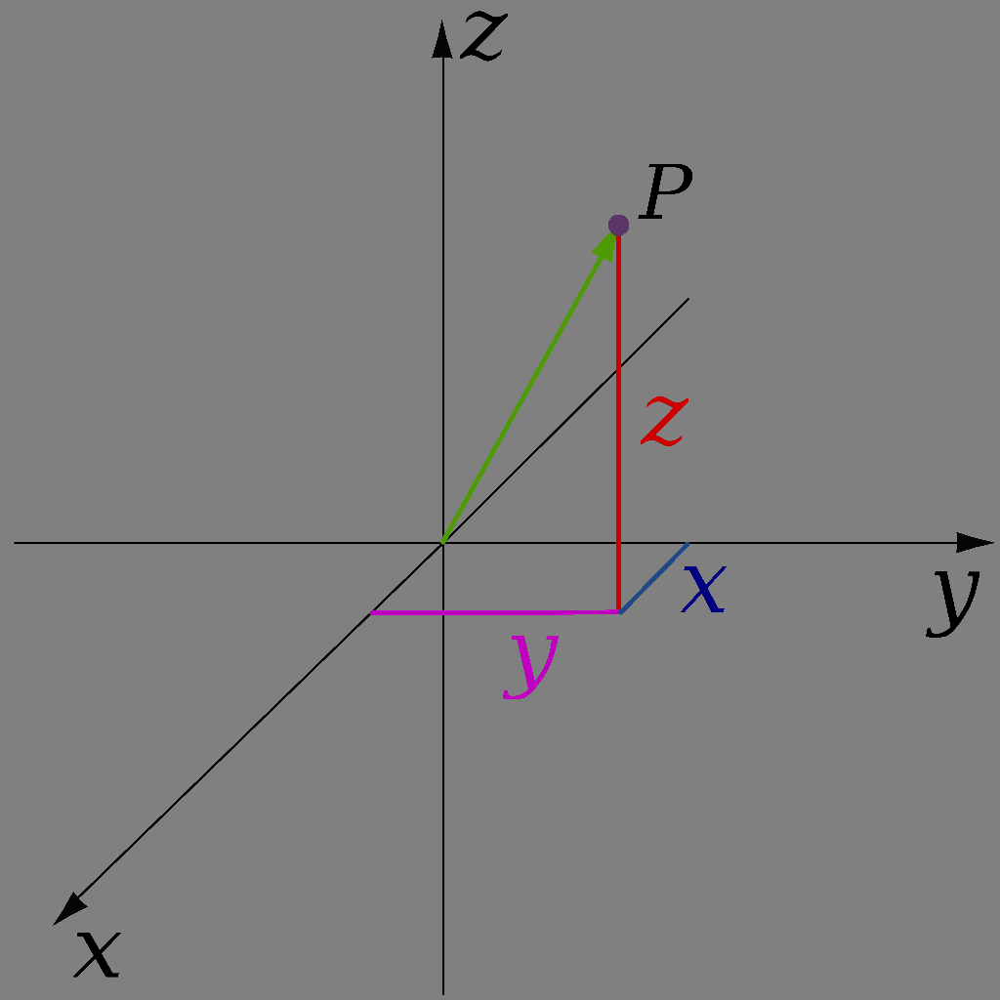

TinyFFR has a replete API for 3D/2D math and geometry operations. This page serves as a quick overview of each available mathematical type and its intended usage.

This page attempts to be beginner-friendly and does not assume any prior linear algebra / 3D math knowledge. Depending on your personal level of knowledge you may wish to skip some paragraphs that explain concepts you're already familiar with.

Finally, note that this page only describes the surface-level, most common operations available on each mathematical type. Explore the types in the [reference docs](/reference/index.md) or via your IDE to see all defined functions.

## Location

All 3D worlds and scenes in TinyFFR are described by a three-dimensional [cartesian co-ordinate system](https://en.wikipedia.org/wiki/Three-dimensional_space). These systems use three axes all defined to be orthogonal to each other, known as the X-axis, the Y-axis, and the Z-axis.

A `Location` instance represents a single point in 3D space. It defines three properties, `X`, `Y`, and `Z`, and these properties denote a distance along the X, Y, and Z axes. Specifically, the value in `X`, `Y`, and `Z` indicate how far from the *world origin* this location is. Positive values indicate movement in one direction along their respective axis, negative values indicate movement in the opposite direction. The positive and negative directions are defined arbitrarily (see [Conventions](conventions.md)). The world's origin-point is defined as being at `(X = 0, Y = 0, Z = 0)`.

{ : style="max-width: 300px;" }
/// caption
The point "P" is a `Location` with `X` = `1f`, `Y` = `2f`, `Z` = `3f`.

The black arrows indicate the X-axis, Y-axis, and Z-axis.

The centre-point where all axes cross in this diagram is the aforementioned *world origin*.
///

### Creating Locations

```csharp
// Create a location with X = 1, Y = 2, Z = 3
var location = new Location(1f, 2f, 3f);

// Create a location by implicit conversion from ValueTuple<float, float, float>
var location = (Location) (1f, 2f, 3f);

// Create a Location by modifying an existing one
var location2 = location1 with { X = 0f };

// Create a Location by adding/subtracting a Vect to an existing one
// (Vects explained further below)
var location2 = location1 + new Vect(7f, 8f, 9f);
var location2 = location1 - new Vect(7f, 8f, 9f);
```

### Common Operations

```csharp
// Calculate the distance between two Locations
var distance = location1.DistanceFrom(location2);
```

## Direction

It's common to want to describe a *direction* in 3D. Examples of directions include "Left", "Down", or even "45° up plus 30° to the right". The `Direction` struct allows us to describe exactly this.

You can think of a `Direction` as an "arrow" pointing one specific way. The arrow does not have any defined position/location in space or any defined length, we just know which way it is pointing.

??? abstract "Direction Structure"
	Technically, a `Direction` *does* actually have a length and has `X`, `Y`, and `Z` properties just like a `Location`.

	A `Direction`'s length is always either `1f` or `0f`. TinyFFR manages the `X`/`Y`/`Z` properties to enforce this.

	It's only in very niche scenarios that you should need to access or care about the `X`/`Y`/`Z` properties of a `Direction`. They can not be set with a `with` statement.

	For most intents and purposes it's better to think of a `Direction` as a more abstract concept (e.g. the arrow pointing one specific way).

There is a special case `Direction` known as the "None" direction. As its name implies it denotes the *absence* of any direction.

### Creating Directions

```csharp
// Create a Direction using the built-in static fields
var dir = Direction.Forward;
var dir = Direction.Right;
var dir = Direction.None;

// Calculate the direction from one Location to another
var dir = location1.DirectionTo(location2);

// Calculate the direction of a Vect
// (Vects explained further below)
var dir = vect.Direction;

// Create a Direction using proportional weights
// (this specifies the RELATIVE length of the arrow along the 
// three cartesian axes and is rarely useful. This is NOT setting 
// the X/Y/Z properties directly, only their ratio)
var dir = new Direction(1f, 2f, 3f);
```

### Common Operations

```csharp
// Get the opposite direction
// (these lines produce an identical result)
var dir2 = dir1.Flipped;
var dir2 = -dir1;

// Get the angle between two directions
// (these lines produce an identical result)
var angle = dir1.AngleTo(dir2)
var angle = dir1 ^ dir2;

// Rotate a direction
// (Rotations explained further below)
// (these lines produce an identical result)
var dir2 = dir1.RotatedBy(rotation);
var dir2 = dir1 * rotation;
```

## Vect

A `Vect` is almost identical to a `Direction` but has one key difference: It has a specific length.

`Vect`s (short for [Vectors](https://en.wikipedia.org/wiki/Euclidean_vector)) do not have any defined position/location in the world

???+ question "Why 'Vect' instead of 'Vector'?"
	

## Useful Interfaces

TODO mention random, span conversion, ToStringDesc, and so on