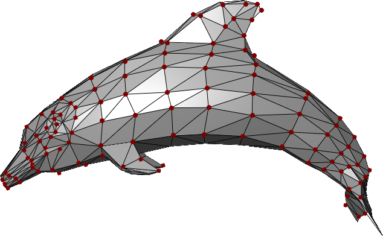
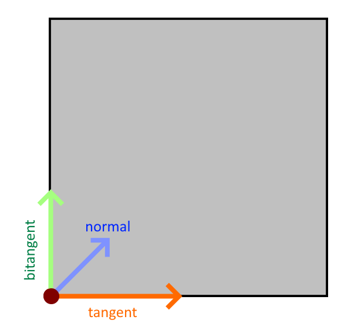

A mesh is a set/group of polygons defining the shape of a 3D object. Meshes do not define the surface material of an object, only its polygonal layout.


/// caption
This example shows multiple triangular polygons connected together to define the mesh shape of a dolphin.

Every polygon is defined by a set of three vertices (vertices here are the dark-red dots).
///


## MeshVertex & VertexTriangle

In TinyFFR, every mesh is comprised of a list of `MeshVertex` values and a list of `VertexTriangle` values together.

The `MeshVertex` list simply specifies every vertex in the mesh (the red dots in the image above). It does not make any connection between them.

The `VertexTriangle` list details how to connect those vertices in to triangular polygons.

### MeshVertex

Each `MeshVertex` has the following properties:

* __Location__ :material-arrow-right: This is the position of the vertex relative to all others and relative the implied mesh centre-point at `(0, 0, 0)`.
* __TextureCoords__ :material-arrow-right: This is the [UV map co-ordinates](https://en.wikipedia.org/wiki/UV_mapping) for the surface at this point, i.e. it specifies where on any texture applied to the surface of the mesh this vertex maps to. A value of `(0f, 0f)` indicates that this vertex maps to the bottom-left corner of a given texture; a value of `(1f, 1f)` maps to the top-right corner, etc. Does not need to be in the range `(0f, 0f)` to `(1f, 1f)`; texture wrapping is applied automatically.
* __TangentRotation__ :material-arrow-right: In a nutshell, this quaternion is used in tangent-space to rotate the positive-U axis to the tangent vector; from which the bitangent and normals are calculated.

The __TangentRotation__ is a `Quaternion` and is not intuitive to understand; so a static method on `MeshVertex` is provided to help create it(1):
{ .annotate }

1. Additionally, an overloaded constructor for `MeshVertex` can take the three arguments to this static method and invoke it for you at construction time.

<span class="def-icon">:material-code-block-parentheses:</span> `CalculateTangentRotation(Direction tangent, Direction bitangent, Direction normal)`

:   Pass the `tangent`, `bitangent`, and `normal` for your vertex to this method and it will generate the correct `TangentRotation` for you.

	* The __tangent__ is the direction that points along the *positive-U axis*; that is the direction where the texture co-ordinates `U` value increases.
	* The __bitangent__ is the direction that points along the *positive-V axis*; that is the direction where the texture co-ordinates `V` value increases.
	* The __normal__ is the direction facing exactly perpendicularly away from the surface being described at this vertex, away from the front face of the surface.

	A diagram of these three values is shown for the highlighted vertex below:

{ : style="width:300px;" }
/// caption
In this crude diagram, imagine we are looking directly at the front face of a cube.

For the highlighted vertex at the bottom left, we show the three directions required for calculating the tangent-frame rotation:

* The __tangent__ (orange arrow) points along the positive-U axis (this is the direction pointing from left-to-right along any textures mapped to this surface).

* The __bitangent__ (green arrow) points along the positive-V axis (this is the direction pointing from bottom-to-top along any textures mapped to this surface).

* The __normal__ (blue arrow) points out of the screen, towards you (this is the direction pointing directly "out", away from the front-face of the surface) (this arrow is not pointing diagonally on the 2D surface, it is pointing up and straight out away from the surface).
///

### VertexTriangle

With an ordered list (or span) of `MeshVertex` instances, you can specify the way those vertices combine to form triangles using their indices in that list.

Accordingly, a `VertexTriangle` has only three properties: __IndexA__, __IndexB__, __IndexC__. Each index is an integer that indexes in to a `MeshVertex` list/span; together forming one triangle.

The order the vertices are specified in within the triangle is important and define the triangle's *winding order*. When looking at the visible (front) face of the triangle, the vertices should be specified in an anti-clockwise order (it doesn't matter which one comes first, just the respective order). This is a [convention](conventions.md) in TinyFFR. If your vertices are specified with a *clockwise* winding order, the triangle will not be rendered except when looking from the inside out or behind the mesh.

## Creating Meshes

Meshes can be loaded via the factory's `AssetLoader` (see [Loading Assets](/examples/loading_assets.md)) or created from triangles/vertices using the `IMeshBuilder` interface (found via the factory at `factory.MeshBuilder` or `factory.AssetLoader.MeshBuilder`).

### MeshCreationConfig

All ways to create meshes have methods that can take a `MeshCreationConfig`. This struct allows you to modify how the mesh is created and has the following properties:

<span class="def-icon">:material-card-bulleted-outline:</span> `FlipTriangles`

:   Set to `true` to reverse the winding-order of triangles in the mesh (i.e. flip the mesh "inside-out").

<span class="def-icon">:material-card-bulleted-outline:</span> `InvertTextureU`

:   Set to `true` to swap the direction of texture `U` co-ordinates by inverting them.

	"Inverting" means flipping the values so that `1f` becomes `0f`, `0.3f` becomes `0.7f`, and so-on.

<span class="def-icon">:material-card-bulleted-outline:</span> `InvertTextureV`

:   Set to `true` to swap the direction of texture `V` co-ordinates by inverting them.

	"Inverting" means flipping the values so that `1f` becomes `0f`, `0.3f` becomes `0.7f`, and so-on.

<span class="def-icon">:material-card-bulleted-outline:</span> `LinearRescalingFactor`

:	Resizes the mesh by scaling all vertex `Location`s by the given amount (with respect to `(0, 0, 0)`).

<span class="def-icon">:material-card-bulleted-outline:</span> `OriginTranslation`

:	Moves all vertices' `Location`s by the inverse of this value in order to create a shift of the local origin point.

	For example, if this value is `(1, 2, 3)`, all vertex `Location`s will have `(-1, -2, -3)` added to them.

### MeshGenerationConfig

When generating a mesh from a polygon group or other structure (such as a shape description), you can specify a `MeshGenerationConfig` that controls how the mesh vertices are generated. This struct has the following properties:

<span class="def-icon">:material-card-bulleted-outline:</span> `TextureTransform`

:   A `Transform2D` specifying how to modify the `UV`s (i.e. `TextureCoords`) globally across the mesh.

	The `Translation` of the transform is added to every `TextureCoords` value. For example, for a given vertex if a `TextureCoords` pair would have been `(0.3f, 0.6f)` and the `Translation` property is `(-0.2f, 0.1f)`, the resultant value will be `(0.1f, 0.7f)`.

	The `Rotation` of the transform rotates every `TextureCoords` value around the 2D origin (`(0, 0)`) anti-clockwise. For example, for a given vertex if a `TextureCoords` pair would have been `(0.3f, 0.6f)` and the `Rotation` property is `90°`, the resultant value will be `(-0.6f, 0.3f)`.

	The `Scaling` of the transform has its reciprocal(1) multiplied with every `TextureCoords` value. For example, for a given vertex if a `TextureCoords` pair would have been `(0.3f, 0.6f)` and the `Scaling` property is `(2f, 0.1f)`, the resultant value will be `(0.15f, 6f)`.
	{ .annotate }

	1. 	The __reciprocal__ is applied as this is usually what a user *actually* wants when thinking about scaling UV coords.

		For example, scaling a surface dimension by `2f` *feels* like it should blow the texture up (i.e. "zoom in") to 200% along that axis. To achieve that, we actually have to *halve* the coords along that axis, hence why we apply the reciprocal.

		If you don't want this behaviour, specify the reciprocal of your scaling factor in the transform; easily done with the `XYPair<float>.Reciprocal` property.

### Using Shape Definitions

Perhaps the easiest way to create a mesh programmatically is to use a `Cuboid` to define the overall mesh shape:

```csharp
_ = meshBuilder.CreateMesh( // (1)!
	new Cuboid(1f, 2f, 3f)
);

_ = meshBuilder.CreateMesh( // (2)!
	new Cuboid(1f, 2f, 3f),
	new Transform2D((0.1f, 0.2f), 90f, (0.5f, 0.75f)),
	centreTextureOrigin: true
);

_ = meshBuilder.CreateMesh( // (3)!
	new Cuboid(1f, 2f, 3f),
	centreTextureOrigin: false,
	new MeshGenerationConfig { TextureTransform = Transform2D.None },
	new MeshCreationConfig { OriginTranslation = new Vect(0.5f) }
);
```

1. 	This simple invocation creates a new `Mesh` in the shape of a 1m x 2m x 3m cuboid.

	All of the vertices in the resultant mesh will have their texture coords and tangent rotations set to sensible values.

2. 	This invocation creates a 1m x 2m x 3m cuboid but also specifies a texture transform.

	The texture transform defines how the UV-coordinates should be transformed on the surface of the mesh (see above). In this example we:

	* Specify a *translation* (movement) of `0.1f` for surface textures in the X/U direction and `0.2f` in the Y/V direction;
	* Specify a *rotation* of `90°`, meaning surface textures will be rotated by 90° anti-clockwise;
	* Specify a *scaling* of all surface textures by `0.5f` (50%) in the X/U direction and `0.75f` in the Y/V direction.

	We also specify `centreTextureOrigin` as `true`. When `true`, all textures will have their `(0, 0)` origin point (e.g. their bottom-left corner) be placed on the centre of each cuboid face. When `false`, all textures will have bottom-left corner placed on the bottom-left vertex of each cuboid face. By default this value is `false`.

3. 	This invocation creates a 1m x 2m x 3m cuboid but specifies the `MeshGenerationConfig` and `MeshCreationConfig` objects directly.

	See above for more information on these objects.

### Using Polygons

It is possible to create a mesh using one or more `Polygon`s.

???+ warning "Triangulation"
	When creating a `Mesh` using one or more `Polygon`s, the mesh builder will *triangulate* your polygons for you automatically (triangulation is the process of breaking down the polygon in to `VertexTriangle`s).

	Note however that if you specify your vertices in the wrong winding order, or supply degenerate polygons (i.e. polygons with holes, crossing edges, non-coplanar vertices, or fewer than 3 vertices) the call to `CreateMesh(...)` will throw an exception.

#### Polygon Struct

The `Polygon` struct has the following properties/arguments: 

__Vertices__ :material-arrow-right: A `ReadOnlySpan<Location>` which defines the polygon's points in 3D space.

* All vertices must be coplanar (defined on the same plane through space).
* The vertices are expected to form a complete enclosed polygon. They define the polygon's edges implicitly by their ordering: Each vertex is assumed to form an edge with the next one in the span, and the final vertex is assumed to connect back to the first.
* The polygon is expected to be "simple"; i.e. it does not need to be convex but it is expected that there are no holes and no edges intersect.

__Normal__ :material-arrow-right: The `Direction` facing "out" or "away from" the front-face of the polygon.

* For example, if the polygon is meant to be viewed by a camera looking forward, the normal should be `Direction.Backward`.
* The normal should be orthogonal to the plane the vertices are defined on.

__IsWoundClockwise__ :material-arrow-right: A `bool` indicating whether or not the vertices are specified in a clockwise winding order.

* This order is as-seen when looking at the polygon in the direction opposite to its normal; i.e. when looking directly at its front face.
* By default this is `false`. You should specify anti-clockwise polygons when possible as this is the default TinyFFR works with.

It is possible to construct a `Polygon` without specifying its `Normal`. The constructor will then use the static method `Polygon.CalculateNormalForAnticlockwiseCoplanarVertices()` to 'detect' the normal. In some cases using this method may be unavoidable (e.g. if generating polygons dynamically) but this method does have a non-negligible performance cost.

`CalculateNormalForAnticlockwiseCoplanarVertices()` assumes:

* There are at least three vertices;
* The vertices are coplanar;
* The vertices are specified in an anti-clockwise winding order.

If your vertices do not meet these criteria you must specify the `Normal` yourself or an exception will be thrown.

#### Using a Single Polygon

It's possible to specify a "mesh" using a single polygon. This can be useful for creating camera-facing flat planes and/or "billboards".

```csharp
var pointsMemory = factory.ResourceAllocator.CreatePooledMemoryBuffer<Location>(4);
var points = pointsMemory.Span; // (1)!
points[0] = new Location(0.5f, -0.5f, 0f); // (2)!
points[1] = new Location(-0.5f, -0.5f, 0f);
points[2] = new Location(-0.5f, 0.5f, 0f);
points[3] = new Location(0.5f, 0.5f, 0f);
var polygon = new Polygon(points, normal: Direction.Backward); // (3)!
using var mesh = meshBuilder.CreateMesh(polygon); // (4)!
factory.ResourceAllocator.ReturnPooledMemoryBuffer(pointsMemory); // (5)!
```

1.	We want to create a mesh that is four vertices defining a square so firstly we rent a 4-length `Location` span using the factory's [Resource Allocator](resources.md#pooled-memory-buffers).

	You could also [stackalloc](https://learn.microsoft.com/en-us/dotnet/csharp/language-reference/operators/stackalloc) the data in this instance, but for larger polygons you may need heap memory, so we show that example here.

2.	Next we define four points in a square formation. We want the square to "face" the forward direction so define them all in the XY plane (Z remains constant).

	Note that their ordering is important: We specify them in an anti-clockwise order with respect to our front-face view direction.

3.	Here we create our `Polygon` struct, passing in the `points` span as our vertices and `Direction.Backward` as the normal.

4.	Here we pass the `polygon` to `CreateMesh()`, which returns us a triangulated `Mesh` resource that has all its vertices' `TextureCoords`, `Location`, and `TangentRotation` properties set correctly.

5.	Finally we return the rented `pointsMemory` back to the factory.

The mesh builder picks sensible defaults for you regarding each vertex's `TextureCoords`. However, if you want more control of how textures/materials are laid out on your polygon surface, you can supply additional arguments to `CreateMesh()`:

```csharp
using var mesh = meshBuilder.CreateMesh(
	polygon,
	textureUDirection: Direction.Up, // (1)!
	textureVDirection: Direction.Left, // (2)!
	textureOrigin: points[0], // (3)!
	new MeshGenerationConfig { /* generation options here, e.g. texture transform */ },
	new MeshCreationConfig { /* creation options here */ }
);
```

1.	This sets the direction of the positive U axis across the plane of the polygon.

	Ideally this value should be orthogonal to the normal (i.e. the direction should be parallel to the polygon plane).

2.	This sets the direction of the positive V axis across the plane of the polygon.

	Ideally this value should be orthogonal to the normal (i.e. the direction should be parallel to the polygon plane).

3.	This sets where on the mesh the texture origin (i.e. the bottom-left corner of any applied texture) should sit.

#### Using Multiple Polygons

Of course for most meshes you'll want to specify multiple polygons. For this purpose, the mesh builder provides a specialized collection; `IMeshPolygonGroup`. You simply add `Polygon`s to the group and then pass the group to a `CreateMesh()` overload when ready. 

???+ warning "IMeshPolygonGroup Memory"
	It is safe / valid to dispose of any memory in use by `Polygon`s after they're added to the group (the group makes a copy of their data). 
	
	This does mean however the memory footprint of a group can get quite large with complex meshes consisting of many vertices.

	In order to eliminate GC pressure, the memory internal to a polygon group is pooled; however this means the group must be disposed when no longer needed. Neglecting to dispose the group will cause your application to leak memory.

	It is safe to dispose the group after it has been passed to `CreateMesh()` and you no longer need the data it contains. You should not pass a disposed group to `CreateMesh()`.

	Note that after disposal the buffers used by the group may be re-used by another group. Holding on to the reference of a group or continuing to use it in any way after it is disposed is not permitted.

The following example shows how to make a two-sided square:

```csharp
var polyGroup = meshBuilder.AllocateNewPolygonGroup(); // (1)!

var pointsMemory = factory.ResourceAllocator.CreatePooledMemoryBuffer<Location>(4);
var points = pointsMemory.Span;

points[0] = new Location(0.5f, -0.5f, 0f);
points[1] = new Location(-0.5f, -0.5f, 0f);
points[2] = new Location(-0.5f, 0.5f, 0f);
points[3] = new Location(0.5f, 0.5f, 0f);
polyGroup.Add( // (2)!
	new Polygon(points, normal: Direction.Backward)
);

points[0] = new Location(0.5f, -0.5f, 0f);
points[1] = new Location(0.5f, 0.5f, 0f);
points[2] = new Location(-0.5f, 0.5f, 0f);
points[3] = new Location(-0.5f, -0.5f, 0f);
polyGroup.Add( // (3)!
	new Polygon(points, normal: Direction.Forward), 
	textureUDirection: Direction.Left, 
	textureVDirection: Direction.Up, 
	textureOrigin: points[3]
);

using var mesh = meshBuilder.CreateMesh( // (4)!
	polyGroup,
	new MeshGenerationConfig { /* specify generation options here */ },
	new MeshCreationConfig { /* specify creation options here */ }
);

polyGroup.Dispose();  // (5)!
factory.ResourceAllocator.ReturnPooledMemoryBuffer(pointsMemory);
```

1.	Here we allocate a new polygon group using the mesh builder.

	We must remember to dispose the group after creating the mesh.

2.	Here, we add a polygon to the polygon group.

	One the polygon is added we can re-use its memory (the polygon group takes a copy).

3.	Here we add the next polygon to the group.

	The `Add()` method allows us to specify the texture U/V directions and the texture origin.

	You may recall these are the same as the optional parameters for defining a single polygon; these arguments set the directions of positive U and positive V for the texture map, and where on the polygon the texture origin should be.

4.	Here we pass the polygon group to `CreateMesh()`, which will triangulate the whole group and give us back a new `Mesh` resource.

5.	Finally we must remember to dispose the polygon group as well as returning any rented memory buffers.

### Using MeshVertex Spans

Finally, it's possible to create a mesh directly using a `Span<MeshVertex>` and `Span<VertexTriangle>` if you want absolute control of vertex data and triangulation methods.

The following example recreates the single-polygon example from above with "raw" vertices/triangles:

```csharp
var verticesMemory = factory.ResourceAllocator.CreatePooledMemoryBuffer<MeshVertex>(4);
var trianglesMemory = factory.ResourceAllocator.CreatePooledMemoryBuffer<VertexTriangle>(2);
var vertices = verticesMemory.Span;
var triangles = trianglesMemory.Span;

vertices[0] = new MeshVertex(
	location: (0.5f, -0.5f, 0f),
	textureCoords: (0f, 0f),
	tangent: Direction.Right,
	bitangent: Direction.Up,
	normal: Direction.Backward
);
vertices[1] = new MeshVertex(
	location: (-0.5f, -0.5f, 0f),
	textureCoords: (1f, 0f),
	tangent: Direction.Right,
	bitangent: Direction.Up,
	normal: Direction.Backward
);
vertices[2] = new MeshVertex(
	location: (-0.5f, 0.5f, 0f),
	textureCoords: (1f, 1f),
	tangent: Direction.Right,
	bitangent: Direction.Up,
	normal: Direction.Backward
);
vertices[3] = new MeshVertex(
	location: (0.5f, 0.5f, 0f),
	textureCoords: (0f, 1f),
	tangent: Direction.Right,
	bitangent: Direction.Up,
	normal: Direction.Backward
);

triangles[0] = new(0, 1, 2);
triangles[1] = new(2, 3, 0);

using var mesh = meshBuilder.CreateMesh(
	vertices,
	triangles,
	new MeshCreationConfig { /* specify creation options here */ }
);

factory.ResourceAllocator.ReturnPooledMemoryBuffer(trianglesMemory);
factory.ResourceAllocator.ReturnPooledMemoryBuffer(verticesMemory);
```

#### Reading & Modifying

The factory's `AssetLoader` lets you read mesh data in to a vertex and triangle buffer. You can use this to modify a loaded mesh's data and then pass it to `CreateMesh()` in the same way:

```csharp
var assLoad = factory.AssetLoader;

var meshMetadata = assLoad.ReadMeshMetadata(@"Path\To\mesh.gltf");
var vertexBuffer = factory.ResourceAllocator
	.CreatePooledMemoryBuffer<MeshVertex>(meshMetadata.VertexCount);
var triangleBuffer = factory.ResourceAllocator
	.CreatePooledMemoryBuffer<VertexTriangle>(meshMetadata.TriangleCount);
assLoad.ReadMesh(@"Path\To\mesh.gltf", vertexBuffer.Span, triangleBuffer.Span);

// Modify data in vertexBuffer and triangleBuffer here 

using var mesh = assLoad.MeshBuilder.CreateMesh(
	vertexBuffer.Span, 
	triangleBuffer.Span, 
	new MeshCreationConfig { }
);
factory.ResourceAllocator.ReturnPooledMemoryBuffer(triangleBuffer);
factory.ResourceAllocator.ReturnPooledMemoryBuffer(vertexBuffer);
```