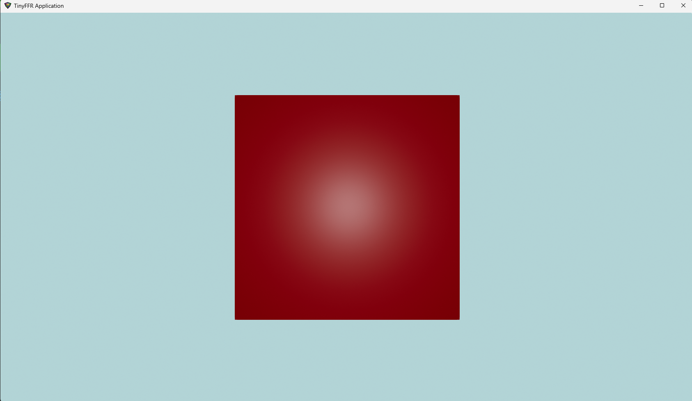

{ align=right : style="max-width:300px;" }

This tutorial will show you how to get started with the basics of TinyFFR. In this example, we will:

* Create a window;
* Create a cube and a light source;
* Create a camera;
* Create a 'scene' to hold the cube, light, and camera;
* Create a renderer to take the scene and render it through the camera to the window;
* Handle the user holding the space-bar to rotate the cube.

If you prefer to start with a complete example first and work your way through the code, jump to the [Complete Example](#complete-example) heading below. Otherwise, this page will take you step-by-step through creating a red cube as shown in the image above.
{ : style="margin-top:3em;" }

## Code

### Namespaces

We will need to import the following namespaces:

```csharp
using Egodystonic.TinyFFR;
using Egodystonic.TinyFFR.Factory.Local;
using Egodystonic.TinyFFR.Environment.Input;
```

All namespaces in the library start with `Egodystonic.TinyFFR`.

### Creating the Factory

The next thing we need to do is create the *factory object*. This is the "root" object that we will use to create all other resources in TinyFFR:

```csharp
using var factory = new LocalTinyFfrFactory();
```

The `factory` is the "entry point" of the library, and exposes for us a set of builders that we can use to create meshes, materials, lights, windows, etc.

Most resources in TinyFFR implement the `IDisposable` interface, and they must be disposed by the user (you) when no longer needed. The factory object is no exception to this. For this example, we will use [C#'s `using` syntax](https://learn.microsoft.com/en-us/dotnet/fundamentals/runtime-libraries/system-idisposable#the-c-f-and-visual-basic-using-statement) to automatically dispose the factory at the end of the example. You may wish to manually dispose the factory yourself instead, depending on your application's architecture.

For deeper documentation on the factory, see: [:material-lightbulb: The Factory](/concepts/factory.md)
{ : style="font-size:0.8em;" }

### Creating the Cube Mesh

Every object that is eventually rendered to the screen in a 3D scene is made up of a *mesh* of polygons. You do not need to understand how these meshes are formed; all you need to know is that in order to create a cube for our scene we firstly need a cube *mesh*.

??? question "What is a polygon? What is a mesh?"
	In a nutshell:

	* A __polygon__ is a set of points (vertices) that describe a flat surface, usually a triangle.
	* A __mesh__ is a grouping of multiple polygons that together describe the surfaces of a 3D shape.

	As well as each polygon's position, a mesh specifies some geometric properties such as the direction each vertex (corner) faces, and how to lay out textures on the object's surface.

	The mesh builder that we will use below can help create a list of polygons laid out in a cube/cuboid shape with all of these properties set correctly.

We can use the factory's *mesh builder* to build such a mesh:

```csharp
var meshBuilder = factory.MeshBuilder; // (1)!

var cubeDesc = new Cuboid(1f); // (2)!
using var cubeMesh = meshBuilder.CreateMesh(cubeDesc); // (3)!
```

1.  The `MeshBuilder` is a factory interface that helps us build meshes, either via specifying polygons or shapes (in our case we will specify a cuboid shape).

2. 	`cubeDesc` is just a description of a 1m x 1m x 1m cube. It is not a mesh itself, just an instance of a `Cuboid` (which is a struct simply used to describe a cuboid's shape/dimensions).

	Most floating-point values (technically *scalars*) in TinyFFR are generally assumed to be in meters; but you can choose any 'base unit' you like depending on your application.
	
	The constructor for `Cuboid` can take three parameters instead of one if you prefer a separate width, depth, and height. In this example though we are specifying that our `Cuboid` should just be 1 meter in every dimension.
	
3. `CreateMesh` can take a variety of different parameters, for now we just supply our description of a cuboid to generate a polygon mesh of that shape.

Because the resultant `cubeMesh` is a disposable resource, we once again use the `using` pattern to make sure it's disposed when we're done.

For deeper documentation on meshes, see: [:material-lightbulb: Meshes](/concepts/meshes.md)
{ : style="font-size:0.8em;" }

### Creating a Material for the Cube

You may think that we've specified everything we need to put our cube in front of a camera, but hold on! All we've done so far is create a *mesh* for the cube, i.e. a description of a layout of polygons that defines the __shape__ of the cube. 

We will also need a *material* that describes the __surface__ of the cube. At the most fundamental level, we can create a material that describes the cube's surface as a single colour.

We can use the factory's *material builder* to build such a material:

```csharp
var materialBuilder = factory.MaterialBuilder; // (1)!

using var colorMap = materialBuilder.CreateColorMap(StandardColor.Maroon); // (2)!
using var material = materialBuilder.CreateOpaqueMaterial(colorMap); // (3)!
```

1. The material builder helps us create materials programmatically (rather than, say, loading them from texture files).
2. 	A color map is basically a 2D texture (e.g. an image/bitmap) that will be applied to the surface of a mesh.

	`CreateColorMap()` takes a variety of parameters, but in this example we're using an [implicit conversion](https://learn.microsoft.com/en-us/dotnet/csharp/language-reference/operators/user-defined-conversion-operators) from `StandardColor` to `ColorVect` to specify a single uniform color. If you want to experiment, you can try providing a `ColorVect` directly instead, the type is fairly simple to use!

3. "Opaque" means non-transparent, i.e. we're creating a material that you can not see through. Most real-world materials are opaque, and because transparent materials have a higher performance cost to render, it makes sense that you'll be creating opaque materials most of the time.

??? question "Color Map vs Material"
	You might wonder why there's a two-step process to creating a material: We create a "color map" first, and then use that to create an "opaque material". 

	In actuality, a material is more than just the colour of something; objects generally have an array of parameters used to describe their surface such as roughness, metallicness, and distortions ('normals') on their surface. 
	
	`CreateOpaqueMaterial()` can take more parameters to specify such values with more texture maps, but for this initial example we only care to specify a colour, so we just supply a `colorMap`.

Finally, the `colorMap` and `material` are both disposable resources, so again we use the `using` pattern to make sure they get disposed.

For deeper documentation on materials, see: [:material-lightbulb: Materials](/concepts/materials.md)
{ : style="font-size:0.8em;" }

### Creating a Cube Instance

Now that we have a cube *mesh* and a *material* loaded on to the GPU, we can use these two assets to make a single *instance* of a cube to put in our rendered scene:

```csharp
var objectBuilder = factory.ObjectBuilder;

using var cube = objectBuilder.CreateModelInstance(cubeMesh, material);
```

The *object builder* is another interface exposed via our factory object that helps us build 'objects' to put in our scene. 

We pass in our `cubeMesh` and our `material` to `CreateModelInstance()`, and it returns one "model instance" that combines them together to create one instance of a complete maroon-coloured cube model(1).
{ .annotate }

1. A "model" is a mesh + material pair (and sometimes more, but always at least a mesh & material).

The returned `cube` instance is, of course, a disposable resource again (hopefully you're spotting a pattern by now!).

### Illuminating the Cube

To make things feel "3D" we generally need to simulate light sources in scenes. Therefore we will add a single point-light(1) to our scene.
{ .annotate }

1. A point light is the simplest form of light source. Imagine a single "point" in space emitting light evenly all around itself in a sphere: That's a point light!

To create a light, we use the *light builder*:

```csharp
var lightBuilder = factory.LightBuilder;

using var light = lightBuilder.CreatePointLight(Location.Origin); // (1)!
```

1. 	We're passing only one argument to `CreatePointLight()`: Where in the world to place the light. 

	We can specify any `Location` in the world we like, but for now we'll place the light at the very centre of our 3D world, otherwise known as the world's `Origin`.

As always, the `light` is disposable.

??? info "Indirect Illumination"
	By default, all scenes also have an amount of indirect ambient illumination that is emitted by the scene backdrop. Therefore, it's not actually necessary to add a light at all to see the cube.

	However, ambient scene-wide illumination tends to be very flat and uninteresting, and you'll usually want at least one dynamic light source to provide a convincing 3D effect.

For deeper documentation on lighting, see: [:material-lightbulb: Lighting](/concepts/lighting.md)
{ : style="font-size:0.8em;" }

### Putting Together a Scene

Now that we have a cube and a light, we need to place them in a *scene*. A scene is just an abstract concept that can be thought of as a "space" or "world" to place objects. Scenes also have backdrops, and you can have multiple scenes at any time. 

For now, we'll just create one scene, and add our light and our cube to it:

```csharp
var sceneBuilder = factory.SceneBuilder;

using var scene = sceneBuilder.CreateScene(); // (1)!

scene.Add(cube); // (2)!
scene.Add(light); // (3)!
```

1. 	You can specify a different backdrop colour for your scene here if you wish.
	
	For example, for a red backdrop, use `CreateScene(backdropColor: ColorVect.FromRgb24(0xFF0000))`.

2. 	The cube instance we created earlier will not be shown until it's added to a scene (and then the scene must be rendered, more on that below). 
	
	The scene tracks which objects have been added to itself already; adding or removing the same object to/from the same scene twice has no effect (it is an [idempotent](https://en.wikipedia.org/wiki/Idempotence) operation).

3. 	Just like the cube, our light will have no effect until it's added to a rendered scene.

Of course, the `scene` is a disposable resource, just like the other resources so far.

For deeper documentation on scenes, see: [:material-lightbulb: Scenes & Rendering](/concepts/scenes_and_rendering.md)
{ : style="font-size:0.8em;" }

### Creating a Window

Before we can render anything, we need a window to render it all in to. Let's create the window now:

```csharp
var displayDiscoverer = factory.DisplayDiscoverer; // (1)!
var windowBuilder = factory.WindowBuilder;

var primaryDisplay = displayDiscoverer.Primary 
	?? throw new InvalidOperationException("No displays connected!"); // (2)!

using var window = windowBuilder.CreateWindow(primaryDisplay); // (3)!
```

1. The `DisplayDiscoverer` does exactly as its name describes and helps us find connected displays on the current machine. It can also show you the supported resolutions and refresh rates of each display.
2. 	This line sets `primaryDisplay` to the `Primary` display as discovered by the display discoverer. If the machine only has one display, that display is always the primary display; otherwise it will usually be the "main" monitor on a multi-monitor setup.

	However, it is possible that the machine is running in a "headless" state (i.e. no displays at all are connected). In this case, `displayDiscoverer.Primary` will actually be `null`. 
	
	Therefore, this line of code is checking that there *is* a primary display by checking `Primary` against `null`, and if there is no display whatsoever it throws an exception for now (using [the C# null-coalescing operator](https://learn.microsoft.com/en-us/dotnet/csharp/language-reference/operators/null-coalescing-operator)).

3. 	Here we simply create a new window on the primary display. 
	
	You can provide more parameters to `CreateWindow()` if you want to control things like the window title, size, position etc. The only required parameter is the target display-- the library will fill in sensible defaults for everything else for you for now.

Unlike other resources, the `primaryDisplay` is not disposable as you can not 'dispose' or otherwise destroy a display-- it's just a part of the application's environment. 

The `window`, of course, *is* disposable so we instantiate it with the `using` pattern as usual.

For deeper documentation on windows, see: [:material-lightbulb: Displays & Windows](/concepts/displays_and_windows.md)
{ : style="font-size:0.8em;" }

### Creating a Camera and Renderer

We now have:

* A cube instance;
* A point light;
* A scene that we've placed them both in, and;
* A window to render everything to.

The final things we need to create are a *camera* to capture the scene, and a *renderer* that takes everything together and produces a final output.

```csharp
var cameraBuilder = factory.CameraBuilder;
var rendererBuilder = factory.RendererBuilder;

using var camera = cameraBuilder.CreateCamera();
camera.Position = Location.Origin; // (1)!
camera.ViewDirection = Direction.Forward; // (2)!
cube.Position = camera.Position + Direction.Forward * 2f; // (3)!

using var renderer = rendererBuilder.CreateRenderer(scene, camera, window);
```

1. 	We can specify any `Location` in the world we like for the camera's position, but for now we'll place it at the very centre of our 3D world (otherwise known as the world's `Origin`). This is the same position we placed the point-light in.

	If you're worried that the camera might somehow "obscure" or "block" the point-light, don't worry. The camera is a purely abstract concept and does not have any actual physical presence or interaction with anything in our scene. 
	
	In fact, the camera is not actually part of the scene at all. We don't even add it to the scene, it's only used to *capture* the scene. To that end, the same camera can be used to capture multiple scenes if desired.

2. 	We can also specify any `Direction` we want the camera to look in, but for now we just pick the "forward" direction-- in geometric terms this is equivalent to saying the camera is looking along the positive Z-axis.

	On the next line we will move our cube instance in front of the camera by placing it further along that same axis.

3.	On this line we're setting the cube's position 2m in front of the camera. 

	The expression `camera.Position + Direction.Forward * 2f` evaluates to a new `Location` that is two meters in front of our camera.
	
	Another way to understand it is that `camera.Position + Direction.Forward * 2f` is calculating "the camera's position (`camera.Position`) *plus* two meters in the forward direction (`Direction.Forward * 2f`)", or put another way: "Add two meters on to `camera.Position` in the `Forward` direction".

	Because the camera is looking forward, this will place the cube right in front of it.

The `camera` can be set up with various properties such as its position, field-of-view, up direction, etc. For now we're happy with most of the defaults, so we just want to set its position to be at the origin of our world and make sure it's looking forward.

??? question "Why 'Forward'?" 	
	There's nothing "special" about the `Forward` direction (or any other direction). It's a [convention](/concepts/conventions.md) in TinyFFR that "Forward" points along the positive Z-axis, but in a scene ("world space") there's nothing particularly important about any axis in particular. 

	In fact, you could just as easily recreate this whole scene with the cube "above" the camera and have the camera's `ViewDirection` be `Direction.Up`; or even set up the whole scene with everything looking in some completely arbitrary direction. 
	
	Ultimately we need to pick *some* direction to set up our scene in, and picking the `Forward` direction feels the most natural so that's why we make the camera face `Forward`. In general, sticking to the conventions set up in TinyFFR should help you keep your scenes oriented as things get more complex, but it's not a necessity.

Unlike the `cube` instance and the `light`, the camera is __not__ added to the scene as it is not *part* of the scene; it is only used to *capture* the scene for the `renderer`.

The `renderer` is like the final bit of glue that takes a scene, a camera, and a window and puts them all together to produce an output. Another way to think of a renderer is as something that takes two inputs (a camera and a scene) and uses them to take a "snapshot" each frame to be shown on the output (the window).

For deeper documentation on cameras & renderers, see: [:material-lightbulb: Scenes & Rendering](/concepts/scenes_and_rendering.md)
{ : style="font-size:0.8em;" }

### Rendering at 60Hz, Handling Input

Finally we can render the scene. Most rendering applications want to approximate something realtime, so we're going to render at a fixed framerate of 60Hz for now.

TinyFFR makes it easy to manage a render loop and measure the timing between frames with an `ApplicationLoop`. The `ApplicationLoop` also makes it easy to react to input events (such as keyboard keys, mouse buttons, and gamepad inputs):

```csharp

var appLoopBuilder = factory.ApplicationLoopBuilder;
using var loop = appLoopBuilder.CreateLoop(60); // (2)!

while (!loop.Input.UserQuitRequested) { // (3)!
	var deltaTime = (float) loop.IterateOnce().TotalSeconds; // (4)!

	if (loop.Input.KeyboardAndMouse.KeyIsCurrentlyDown(KeyboardOrMouseKey.Space)) { // (5)!
		var cubeRotationSpeedPerSec = new Rotation(90f, Direction.Down); // (1)!
		cube.RotateBy(cubeRotationSpeedPerSec * deltaTime); // (6)!
	}

	renderer.Render(); // (7)!
}
```

1. 	This line creates a "rotation" that we'll use to rotate our cube on the next line.

	Rotations in TinyFFR are stored as an *angle* in degrees and an *axis*. In this line, we're creating a rotation that is represented as "__90°__ around the __down__ axis".
	
	To get a good understanding of this, imagine holding a pencil in your hand and pointing it directly at the floor (that's your `Down` axis). Now, imagine one side of the pencil has some writing on it facing away from your body, and then imagine turning the pencil so that the writing is now facing to your right: You just made a 90° rotation around the down axis!

	Now, simply imagine that instead of turning a pencil you were turning a cube in exactly the same way. The variable `cubeRotationSpeedPerSec` is defining exactly this rotation for our cube-- we want it to spin around the `Down` axis at a rate of `90°` per second.

2. The `60` here is the desired framerate in Hz. If you want an unlocked framerate, pass `null`.
3. 	`loop.Input.UserQuitRequested` will be `true` when the user has requested the application exit via any of the built-in means for the OS.

	In most cases, this will be when the user tries to close the window with the :fontawesome-solid-square-xmark: button.

4. 	`loop.IterateOnce()` will block the current thread until it's time to render the next frame (i.e. after 16.666ms if we're rendering at 60 frames per second). When `loop.IterateOnce()` returns, it's time for the next frame.

	The return value of `loop.IterateOnce()` will be a [TimeSpan](https://learn.microsoft.com/en-us/dotnet/api/system.timespan?view=net-9.0) that tells you how long has elapsed since the last frame. At a 60Hz framerate, this will ideally be 16.666ms, but due to various factors it may vary. 
	
	We use this value to extract a `deltaTime` in seconds.

5. This line checks if, for the current frame, the user is currently holding down the space bar. Remember, this loop is iterating 60 times per second.
6. 	This applies the rotation we created above to the cube. 

	`cube.RotateBy()` does as its name implies: It rotates our `cube` instance in the scene.

	The argument to `RotateBy()` is the rotation we wish to apply to the cube. In this example, we're supplying our `cubeRotationSpeedPerSec` (which is `90° around Down`) scaled by `deltaTime` (i.e. we're multiplying the rotation speed by the fraction of a second that has elapsed since the last frame).

	If we change our framerate, `deltaTime` will change to reflect the larger or smaller timespan between frames. Multiplying the rotation by `deltaTime` therefore ensures that the animation rate stays the same no matter what framerate we're running at.
	
	Even if your requested framerate is always the same, it can still be inconsistent during the lifetime of the application if you have system stutters. Therefore, scaling your animations by the measured frame time each frame is usually desirable.

7. 	Finally, this call to `Render()` updates the `window` with the latest `scene` as captured by our `camera`. 

	Remember, `renderer.Render()` is being called 60 times per second- thereby giving the illusion of a moving image!

For deeper documentation on input handling, see: [:material-lightbulb: Input](/concepts/input.md)
{ : style="font-size:0.8em;" }

### Complete Example

This example is written as a single file (e.g. using C#'s [top-level statements](https://learn.microsoft.com/en-us/dotnet/csharp/tutorials/top-level-statements)). You may need to move the actual code in to a method if necessary.

```csharp
using Egodystonic.TinyFFR;
using Egodystonic.TinyFFR.Factory.Local;
using Egodystonic.TinyFFR.Environment.Input;


// "Creating the Factory" (1)
using var factory = new LocalTinyFfrFactory();


// "Creating the Cube Mesh" (2)
var meshBuilder = factory.MeshBuilder;

var cubeDesc = new Cuboid(1f);
using var cubeMesh = meshBuilder.CreateMesh(cubeDesc);


// "Creating a Material for the Cube" (3)
var materialBuilder = factory.MaterialBuilder;

using var colorMap = materialBuilder.CreateColorMap(StandardColor.Maroon);
using var material = materialBuilder.CreateOpaqueMaterial(colorMap);


// "Creating a Cube Instance" (4)
var objectBuilder = factory.ObjectBuilder;

using var cube = objectBuilder.CreateModelInstance(cubeMesh, material);


// "Illuminating the Cube" (5)
var lightBuilder = factory.LightBuilder;

using var light = lightBuilder.CreatePointLight(Location.Origin);


// "Putting Together a Scene" (6)
var sceneBuilder = factory.SceneBuilder;

using var scene = sceneBuilder.CreateScene();

scene.Add(cube);
scene.Add(light);


// "Creating a Window" (7)
var displayDiscoverer = factory.DisplayDiscoverer;
var windowBuilder = factory.WindowBuilder;

var primaryDisplay = displayDiscoverer.Primary 
	?? throw new InvalidOperationException("No displays connected!");

using var window = windowBuilder.CreateWindow(primaryDisplay);


// "Creating a Camera and Renderer" (8)
var cameraBuilder = factory.CameraBuilder;
var rendererBuilder = factory.RendererBuilder;

using var camera = cameraBuilder.CreateCamera();
camera.Position = Location.Origin;
camera.ViewDirection = Direction.Forward;
cube.Position = camera.Position + Direction.Forward * 2f;

using var renderer = rendererBuilder.CreateRenderer(scene, camera, window);


// "Rendering at 60Hz, Handling Input" (9)
var appLoopBuilder = factory.ApplicationLoopBuilder;
using var loop = appLoopBuilder.CreateLoop(60);

while (!loop.Input.UserQuitRequested) {
	var deltaTime = (float) loop.IterateOnce().TotalSeconds;

	if (loop.Input.KeyboardAndMouse.KeyIsCurrentlyDown(KeyboardOrMouseKey.Space)) {
		var cubeRotationSpeedPerSec = new Rotation(90f, Direction.Down);
		cube.RotateBy(cubeRotationSpeedPerSec * deltaTime);
	}

	renderer.Render();
}
```

1. [:material-arrow-up: Scroll up to "Creating the Factory"](#creating-the-factory)
2. [:material-arrow-up: Scroll up to "Creating the Cube Mesh"](#creating-the-cube-mesh)
3. [:material-arrow-up: Scroll up to "Creating a Material for the Cube"](#creating-a-material-for-the-cube)
4. [:material-arrow-up: Scroll up to "Creating a Cube Instance"](#creating-a-cube-instance)
5. [:material-arrow-up: Scroll up to "Illuminating the Cube"](#illuminating-the-cube)
6. [:material-arrow-up: Scroll up to "Putting Together a Scene"](#putting-together-a-scene)
7. [:material-arrow-up: Scroll up to "Creating a Window"](#creating-a-window)
8. [:material-arrow-up: Scroll up to "Creating a Camera and Renderer"](#creating-a-camera-and-renderer)
8. [:material-arrow-up: Scroll up to "Rendering at 60Hz, Handling Input"](#rendering-at-60hz-handling-input)

## Result


## Shortened Example

The code in this example is made deliberately verbose in order to teach various concepts. However, it's possible to write the exact same application a little terser if you prefer. 

Here's the same "Hello Cube" reduced to a shorter form:

```csharp
using Egodystonic.TinyFFR;
using Egodystonic.TinyFFR.Factory.Local;
using Egodystonic.TinyFFR.Environment.Input;

using var factory = new LocalTinyFfrFactory();
using var cubeMesh = factory.MeshBuilder.CreateMesh(new Cuboid(1f));
using var colorMap = factory.MaterialBuilder.CreateColorMap(StandardColor.Maroon);
using var material = factory.MaterialBuilder.CreateOpaqueMaterial(colorMap);
using var cube = factory.ObjectBuilder.CreateModelInstance(cubeMesh, material, initialPosition: (0f, 0f, 2f));
using var light = factory.LightBuilder.CreatePointLight();
using var scene = factory.SceneBuilder.CreateScene();

scene.Add(cube);
scene.Add(light);

using var window = factory.WindowBuilder.CreateWindow(factory.DisplayDiscoverer.Primary!.Value);
using var camera = factory.CameraBuilder.CreateCamera();

using var renderer = factory.RendererBuilder.CreateRenderer(scene, camera, window);
using var loop = factory.ApplicationLoopBuilder.CreateLoop(60);
var input = loop.Input;
var kbm = input.KeyboardAndMouse;

while (!input.UserQuitRequested) {
	var deltaTime = (float) loop.IterateOnce().TotalSeconds;
	if (kbm.KeyIsCurrentlyDown(KeyboardOrMouseKey.Space)) cube.RotateBy(90f % Direction.Down * deltaTime);
	renderer.Render();
}
```


