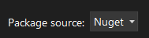

TinyFFR is currently provided as a .NET9 NuGet package targeting Windows x64 platforms only (1). If you already know how to use NuGet all you need to do is install `Egodystonic.TinyFFR` from the standard Nuget package source. Otherwise, follow one of guides below, depending on your preferred environment:
{ .annotate }

1. Support for other platforms is planned for the future. See [github](https://github.com/Egodystonic/TinyFFR/issues/26).

## Visual Studio

With Visual Studio, the easiest way to add TinyFFR is via the NuGet package manager. 

1. Right-click on the project you wish to add TinyFFR to and select "Manage NuGet Packages": 
	- 
	{ : style="list-style: none;" }
2. In the package browser, make sure your package source is set to "Nuget" (or "All"): 
	- 
	{ : style="list-style: none;" }
3. In the search box, type "TinyFFR", and you should see the TinyFFR package show up. The official name of the package is "Egodystonic.TinyFFR" by `EgodystonicStudios`: 
	- 
	{ : style="list-style: none;" }
4. Select the package from the list and then on the right `Install` the latest stable version: 
	- 
	{ : style="list-style: none;" }
5. You should now see TinyFFR in the `Installed` tab: 
	- 
	{ : style="list-style: none;" }

For more assistance using NuGet in Visual Studio, consult [the official documentation](https://learn.microsoft.com/en-us/nuget/quickstart/install-and-use-a-package-in-visual-studio).

## Visual Studio Code

TinyFFR can be installed via the command palette in VS Code, assuming you have the [C# Dev Kit](https://marketplace.visualstudio.com/items?itemName=ms-dotnettools.csdevkit) installed. Follow [the official instructions on installing a NuGet package](https://code.visualstudio.com/docs/csharp/package-management) to add `Egodystonic.TinyFFR` to your project. 

## Editing the .csproj File Manually

To add the TinyFFR package manually by editing the .csproj file, simply add a `<PackageReference>` to `Egodystonic.TinyFFR`:

```xml
<ItemGroup>
  <PackageReference Include="Egodystonic.TinyFFR" Version="M.m.p" /> <!-- (1)! -->
</ItemGroup>
```

1. Replace "`M.m.p`" with the actual version number of the package you'd like to install. See [the TinyFFR Github page](https://github.com/Egodystonic/TinyFFR/) for the latest versions.

## Commandline

To install TinyFFR via commandline, use the .NET CLI. In your project's root directory, run the following command:

```plaintext
dotnet add package Egodystonic.TinyFFR
```

## Other Environments

For other environments follow the instructions provided by the environment author for working with NuGet packages and add `Egodystonic.TinyFFR` from the official Nuget source.

Help is always available on the [discussions tab on TinyFFR's Github page](https://github.com/Egodystonic/TinyFFR/discussions/categories/help-assistance).

