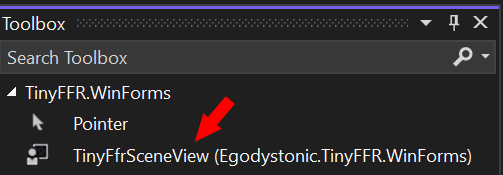

It's possible to render TinyFFR scenes as a Windows Forms control.

## Installation

Install `Egodystonic.TinyFFR.WinForms` from Nuget in to your Winforms application project.(1)
{ .annotate }

1. This package contains a transitive reference to `Egodystonic.TinyFFR` so you won't need to explicitly install both, but if you do decide to reference both please make sure their version numbers match.

## TinyFfrSceneView

TinyFFR integration is offered primarily as a `TinyFfrSceneView` control which can be used like any other Winforms control. A `TinyFfrSceneView` allows you to invoke `Render()` on a given `Renderer`(1) (set as a property on the control), and the updated scene will be displayed on this control's client area.
{ .annotate }

1. You must bind a specific "Bindable" renderer; see bullet points below.



The following properties can be adjusted for a `TinyFfrSceneView` (some via the properties box at design time, some must be set programmatically):

* The `FallbackBrush` property is optional and can be used to set the fill brush of the control when no renderer has been set and/or when no scene has been rendered.

* The `InternalRenderResolution` property is also optional and can be used to set the internal resolution scenes will be rendered at before being scaled to the size of the control.(1) If left unset, scenes will always be rendered at the size of the control bounds.
	{ .annotate }

	1. The height and width of the render resolution of a scene view must both be between `1` and `32768`.

* The `Renderer` property must be set to a `Renderer` instance created via the `CreateBindableRenderer` extension method on an `IRendererFactory` instance. Attempting to set a non-bindable renderer will fail. See next section:

### The Renderer

The `Renderer` should be created via `CreateBindableRenderer` using a pre-created `Scene` and `Camera`; e.g:

```csharp 
sceneView.Renderer = factory.RendererBuilder.CreateBindableRenderer(scene, camera, factory.ResourceAllocator); // (1)!
```

1. This extension method is provided in the `Egodystonic.TinyFfr.WinForms` package under the `Egodystonic.TinyFFR.Rendering` namespace (the same namespace as the `IRendererBuilder` type).

Each time you invoke `Render()` on this `Renderer` it will invoke an update to the frame/image for any `TinyFfrSceneView` that has it set as the `Renderer` property.

You should not set a disposed `Renderer` or a non-bindable `Renderer` to a `TinyFfrSceneView`'s `Renderer` property. Similarly, you should not dispose a `Renderer` and leave it set on a `TinyFfrSceneView`. The `Renderer` property *can* be set to `null` (at which point the `FallbackBrush` will be used to fill the control's client area).

## Input, Loop, and Threading

The [input and application-loop management subsystem](/concepts/input.md) is mostly disabled when using Winforms integration. 

* Input should be handled via Winforms' built-in input layer instead.
* All interaction with your UI and TinyFFR should be done in the UI Dispatcher context (e.g. on the UI thread).

???+ warning "ApplicationLoop contraindicated"
	When using TinyFFR standalone you must use the `ApplicationLoop` system in order to access user input events and set a framerate/tickrate. However, UI frameworks (such as Windows Forms) already have a separate built-in render loop and input handling rubric and it is **not** advisable to mix the two approaches. 
	
	Attempting to access input data via TinyFFR's `ApplicationLoop`/`ILatestInputRetriever` could cause your Winforms application to "miss" input events. Instead, use Winforms' built-in event system to manage input events. When integrating TinyFFR with Winforms it is advisable to *not* create any `ApplicationLoop` instances if possible.

	If you want to create a render/tick loop, see the "Automatic Animation" section below, which offers an alternative mechanism that doesn't directly create an `ApplicationLoop`.

	If you still want to use `ApplicationLoop`s for niche scenarios, it is advisable to set the config value `IterationShouldRefreshGlobalInputStates` to `false` when creating them.

### Automatic Animation

If your application requires the scene view to be animated you can achieve this via the extension method "`StartWinFormsUiLoop()`" supplied on the `ILocalApplicationLoopBuilder` interface.(1)
{ .annotate }

1. This extension method is provided in the `Egodystonic.TinyFfr.WinForms` package under the `Egodystonic.TinyFFR.WinForms` namespace.

This method allows you to supply a callback delegate that will be invoked at a target frequency (e.g. 30Hz) on the UI context (e.g. the UI thread). You can render your scene on each tick (like you would inside an `ApplicationLoop` in a standalone TinyFFR application):

```csharp
// Example Tick function
void Tick(TimeSpan deltaTime) {
	// Render one frame each tick
	sceneView.Renderer.Render();

	// Manipulate objects in the scene also
	_instance.RotateBy((float) deltaTime.TotalSeconds * 130f % Direction.Up);
	_instance.RotateBy((float) deltaTime.TotalSeconds * 80f % Direction.Right);

	// It's safe to touch UI/control data and TinyFFR objects here; this function is guaranteed to be executed on the UI context
	MyBoundProperty = SomeNewValue();
}

// You can start this loop like so...
var loopTerminationDisposable = factory.ApplicationLoopBuilder.StartWinFormsUiLoop(Tick);

// Dispose "loopTerminationDisposable" to stop the loop...
loopTerminationDisposable.Dispose();
```

This function schedules your tick/render loop on the pre-existing Winforms UI dispatcher loop, integrating it in to the UI subsystem, and is preferred over creating an `ApplicationLoop` manually (see warning above). The function takes optional arguments as follows:

<span class="def-icon">:material-code-block-parentheses:</span> `StartWinFormsUiLoop(tickCallback, tickRateHz, name)`

:   * `tickCallback` is the `Action<TimeSpan>` that you wish to be invoked on the UI thread/context. The singular argument is a `TimeSpan` indicating the "delta time" since the last 'tick'.

	* `tickRateHz` is optional, this sets the target framerate for the animation loop. Please note that the maximum framerate may be limited by the UI framework compositor and/or dispatcher loop mechanism. You should also note that the 'consistency' (e.g. jitter) of the framerate will likely be much more variable than with a typical standalone TinyFFR application loop.

	* `name` is optional, this will set the name of the underlying `ApplicationLoop` resource used internally by TinyFFR.

	This function returns an `IDisposable` that should be disposed when you wish to terminate the loop.