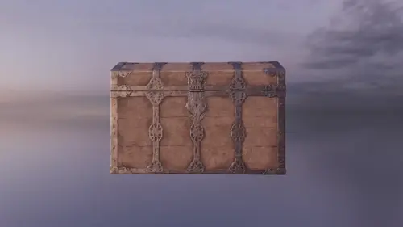

It's possible to load images/textures, backdrops, and 3D meshes from files using the `AssetLoader`.

??? example "Continuing "Hello Cube""
	In the "Hello Cube" example we created a cube mesh with the `MeshBuilder` and a simple maroon color map with the `MaterialBuilder` like this:
	
	`#!csharp using var cubeMesh = meshBuilder.CreateMesh(new Cuboid(1f));`

	`#!csharp using var colorMap = materialBuilder.CreateColorMap(StandardColor.Maroon);`

	Following this tutorial, you will be able to replace your mesh and material with downloaded alternatives. You can follow the complete example below, or you can search online to find many websites that offer free assets such as [ambientCG](https://ambientcg.com/), [Poly Haven](https://polyhaven.com/), or [Pixel-Furnace](https://textures.pixel-furnace.com/).

	Remember that you may need to reposition and/or rescale your model instances depending on how large they are. If the camera ends up "inside" a model instance you may see nothing at all due to back-face culling(1).
	{ .annotate }

	1. __Back-face culling__ is the mechanism by which most rendering engines optimise the rendering of opaque models by not showing the "inside" or "back-faces" of a given mesh.

## Mesh Loading

??? info "Supported File Formats"
	TinyFFR integrates an open-source library "assimp" and through that library supports various 3D mesh/model file formats.
	
	The list of supported file formats can be seen in assimp's [FileFormats.md](https://github.com/assimp/assimp/blob/v5.3.1/doc/Fileformats.md):

	- 3D
	- [3DS](https://en.wikipedia.org/wiki/.3ds)
	- [3MF](https://en.wikipedia.org/wiki/3D_Manufacturing_Format)
	- AC
	- [AC3D](https://en.wikipedia.org/wiki/AC3D)
	- ACC
	- AMJ
	- ASE
	- ASK
	- B3D
	- [BLEND](https://en.wikipedia.org/wiki/.blend_(file_format))
	- [BVH](https://en.wikipedia.org/wiki/Biovision_Hierarchy)
	- CSM
	- COB
	- [DAE/Collada](https://en.wikipedia.org/wiki/COLLADA)
	- [DXF](https://en.wikipedia.org/wiki/AutoCAD_DXF)
	- ENFF
	- [FBX](https://en.wikipedia.org/wiki/FBX)
	- [glTF 1.0](https://en.wikipedia.org/wiki/GlTF#glTF_1.0) + GLB
	- [glTF 2.0](https://en.wikipedia.org/wiki/GlTF#glTF_2.0):
		- At the moment for glTF2.0 the following extensions are supported:
		- KHR_lights_punctual ( 5.0 )
		- KHR_materials_pbrSpecularGlossiness ( 5.0 )
		- KHR_materials_unlit ( 5.0 )
		- KHR_texture_transform ( 5.1 under test )
	- HMB
	- IFC-STEP
	- IRR / IRRMESH
	- [LWO](https://en.wikipedia.org/wiki/LightWave_3D)
	- LWS
	- LXO
	- [M3D](https://bztsrc.gitlab.io/model3d)
	- MD2
	- MD3
	- MD5
	- MDC
	- MDL
	- MESH / MESH.XML
	- MOT
	- MS3D
	- NDO
	- NFF
	- [OBJ](https://en.wikipedia.org/wiki/Wavefront_.obj_file)
	- [OFF](https://en.wikipedia.org/wiki/OFF_(file_format))
	- [OGEX](https://en.wikipedia.org/wiki/Open_Game_Engine_Exchange)
	- [PLY](https://en.wikipedia.org/wiki/PLY_(file_format))
	- PMX
	- PRJ
	- Q3O
	- Q3S
	- RAW
	- SCN
	- SIB
	- SMD
	- [STP](https://en.wikipedia.org/wiki/ISO_10303-21)
	- [STL](https://en.wikipedia.org/wiki/STL_(file_format))
	- TER
	- UC
	- VTA
	- X
	- [X3D](https://en.wikipedia.org/wiki/X3D)
	- XGL
	- ZGL

	TinyFFR does not currently support some more esoteric features of 3D model formats such as scenes or exported material systems.

### Simple Import

We can load a mesh using the `AssetLoader`'s `LoadMesh()` function:

```csharp
using var mesh = factory.AssetLoader.LoadMesh(@"Path\To\mesh.gltf"); // (1)!
```

1. 	This loads the mesh file at `Path\To\mesh.gltf`. 

	You must make sure any supporting files for the given mesh are in the expected folder/relative paths (for example, most `.gltf` files expect at least a `.bin` file with the same name to be present alongside it).

### Customized Import

The example above shows the simplest way to import a mesh from a file. However, often you may need to customize some parameters of the import process to correctly import your mesh. `LoadMesh` has the following overload for this purpose:

<span class="def-icon">:material-code-block-parentheses:</span> `LoadMesh(ReadOnlySpan<char> filePath, in MeshCreationConfig config)`

:   This overload takes a `filePath` just like before, but also lets us specify a `MeshCreationConfig` object that has some customizations on how the mesh should be altered before being loaded on to the GPU.

Here we show an example of how to use this overload:

```csharp
using var mesh = factory.AssetLoader.LoadMesh(
	@"Path\To\mesh.gltf",
	new MeshCreationConfig {
		FlipTriangles = false, // (1)!
		InvertTextureU = false, // (2)!
		InvertTextureV = false, // (3)!
		LinearRescalingFactor = 1f, // (4)!
		OriginTranslation = Vect.Zero // (5)!
	}
);
```

1. 	`FlipTriangles` can be set to `true` if your mesh is being imported "inside-out" (e.g. you can see its interior but not the exterior).

	Most rendering engines (including TinyFFR) employ something called __back-face culling__, which is a performance optimisation where the rendering of the inside of opaque models is skipped. However, which side of a mesh is its inside, or 'back side', is determined its' polygons'/triangles' *winding order*. 
	
	The [convention](/concepts/conventions.md) in TinyFFR is that front-facing polygons should have an anti-clockwise order with respect to the camera. Some exporters may export their models with a clockwise order however; and in this case you can simply flip the triangles by specifying `FlipTriangles = true`.

2.	`InvertTextureU`, if set to `true`, will *mirror* all textures & materials shown on the mesh surface in the __X/horizontal__ direction.

	This may be useful in cases where the mesh has been exported with an inverted/flipped texture-mapping convention. You may need to use this and `InvertTextureV` in conjunction with `FlipTriangles` for some meshes to get them to display correctly.

3.	`InvertTextureV`, if set to `true`, will *mirror* all textures & materials shown on the mesh surface in the __Y/vertical__ direction.

	This may be useful in cases where the mesh has been exported with an inverted/flipped texture-mapping convention. You may need to use this and `InvertTextureU` in conjunction with `FlipTriangles` for some meshes to get them to display correctly.

4.	`LinearRescalingFactor` can be used to resize the mesh as it is imported. This is useful when there may be a mismatch between the units used in the original modelling software and those used by your application.

	The specified value is a simple linear factor / coefficient of the original imported size:

	* Values greater than `1f` will expand the mesh's size (e.g. `1.5f` increases its size by 50%).

	* Values less than `1f` will reduce the mesh's size (e.g. `0.5f` decreases its size by 50%).

	* Negative values also invert the mesh and will generally turn it inside-out.

	For example, if a mesh was exported with a size of `1f` meaning 1 foot, but you want `1f` to mean 1 meter, you could set your `LinearRescalingFactor` to `1f / 3.28084f`.

	??? question "Why only a uniform scalar? Why can I not rescale the mesh differently for each axis?"
		Only a uniform rescale maintains a mesh's integrity regarding its vertex data.

		Although we may think of a polygon mesh as just being points in space, each vertex also generally contains pre-baked data such as tangents, bitangents, normals, and texture U/V data.

		A uniform scaling maintains the correctness of this additional data, but non-uniform scaling will break this information. If you need a non-uniform scaling of mesh data, it is best to go back to the authoring program it was originally created with and make the change there.

		If you want to non-uniformly rescale *model instances* after importing the *mesh*, that is fine and can be done later. This parameter is instead concerned with applying a universal rescale to the imported polygon data.

5.	`OriginTranslation` can be used to move the local-origin point of the mesh (by default that is the point `(0, 0, 0)` in the mesh data). Often you will want the origin point of a mesh to be its centre (technically ["centroid"](https://en.wikipedia.org/wiki/Centroid)) or somewhere at its base.

	When placing a model instance in a scene, the mesh's origin point indicates the exact point on that mesh that be positioned at the requested spot in the scene/world.
	
	When rotating and scaling model instances, the underlying mesh's origin point will also be used as the default point around which that model will be transformed. For example, pick up anything around you right now and imagine rotating it in 3D space: You must select a point in or around that object to rotate it *around* (even if that's simply the centre of that object).

	A value of `Vect.Zero` (e.g. `(0f, 0f, 0f)`) makes no adjustment to the mesh's origin point. Otherwise, the specified value moves the origin point in the mesh by the given amount, e.g. `(1f, 2f, 3f)` moves the origin point by 1 in the X direction, 2 in the Y direction, and 3 in the Z direction.

### Reading Mesh Data

You can also read mesh data in to C# rather than loading it directly on to the GPU:

```csharp
var assLoad = factory.AssetLoader;

var meshMetadata = assLoad.ReadMeshMetadata(@"Path\To\mesh.gltf"); // (1)!
var vertexBuffer = factory.ResourceAllocator
	.CreatePooledMemoryBuffer<MeshVertex>(meshMetadata.VertexCount);
var triangleBuffer = factory.ResourceAllocator
	.CreatePooledMemoryBuffer<VertexTriangle>(meshMetadata.TriangleCount);
assLoad.ReadMesh(@"Path\To\mesh.gltf", vertexBuffer.Span, triangleBuffer.Span); // (2)!

// Do stuff with vertexBuffer and triangleBuffer 

// Optional: Create a mesh and load it on to the GPU with the MeshBuilder:
using var mesh = assLoad.MeshBuilder.CreateMesh(vertexBuffer.Span, triangleBuffer.Span, new MeshCreationConfig());

// Don't forget to return the rented buffers
factory.ResourceAllocator.ReturnPooledMemoryBuffer(triangleBuffer);
factory.ResourceAllocator.ReturnPooledMemoryBuffer(vertexBuffer);
```

1. `ReadMeshMetadata()` will tell you how many vertices and triangles the mesh comprises of. You can then use this data to allocate vertex/triangle buffers.
2. `ReadMesh()` will read a mesh's vertices and triangles in to preallocated buffers.

## Texture Loading

??? info "Supported File Formats"
	TinyFFR integrates an open-source library "stb_image" and through that library supports various image formats.
	
	The list of supported file formats can be seen in [stb_image.h](https://github.com/nothings/stb/blob/master/stb_image.h):

	* JPEG/JPG
	* PNG
	* GIF
	* BMP
	* TGA
	* PSD
	* HDR
	* PIC
	* PNM

	TinyFFR does not currently support some more esoteric formats or compression types for the image formats listed above.

### Simple Import

We can load a texture/image using the `AssetLoader`'s `LoadTexture()` function:

```csharp
using var colorMap = factory.AssetLoader.LoadTexture(@"Path\To\texture.jpg");
```

### Customized Import

Just like with meshes, you can customize the import according to some parameters. To do this, we can use an overload of `LoadTexture()`:

<span class="def-icon">:material-code-block-parentheses:</span> `LoadTexture(ReadOnlySpan<char> filePath, in TextureCreationConfig config)`

:   This overload takes a `filePath` just like before, but also lets us specify a `TextureCreationConfig` object that has some customizations on how the texture should be altered before being loaded on to the GPU.

Here we show an example of how to use this overload:

```csharp
using var normalMap = factory.AssetLoader.LoadTexture(
	@"Path\To\texture.jpg",
	new TextureCreationConfig {
		FlipX = false, // (1)!
		FlipY = false, // (2)!
		GenerateMipMaps = true, // (3)!
		InvertXRedChannel = false, // (4)!
		InvertYGreenChannel = false,
		InvertZBlueChannel = false,
		InvertWAlphaChannel = false, 
	}
);
```

1. `FlipX`, if set to `true`, will mirror/flip the image along its horizontal/X-axis.
2. `FlipY`, if set to `true`, will mirror/flip the image along its vertical/Y-axis.
3. 	`GenerateMipMaps` should generally be left as `true` unless the image/texture needs to retain maximum quality at all distances from the camera. 

	[Mipmaps](https://en.wikipedia.org/wiki/Mipmap) are a technique used to improve performance and reduce aliasing of objects at distance.

	You may also wish to disable mipmap generation to reduce video RAM consumption in constrained scenarios.

4. 	`InvertXRedChannel`, if set to `true`, will negate the red channel of the image. Likewise, `InvertYGreenChannel`, `InvertZBlueChannel`, and `InvertWAlphaChannel` will invert the green, blue, and alpha colour channels.

	Negation in this context means inverting the strength of the colour for each pixel; i.e. if a pixel had 100% strength of this colour it will now have 0%; if it had 80% it will have 20%; and so on.

	This is mostly useful when dealing with image maps that are defining things other than colour/albedo/diffuse values (such as ORM maps and normal maps). If the channel for a given value in such a map was exported with a reversed meaning, this parameter can be used to invert/reverse it back.

	For example, if we want to use a "metallic" map that defines `0f` as metallic and `1f` as non-metallic we will need to invert that value for use in TinyFFR.


### Importing Normal Maps

By [convention](/concepts/conventions.md) TinyFFR expects normal maps in "OpenGL"/"GL" format. If you're using a normal map that has been exported in "DirectX"/"DX" format however, you may need to invert its green channel to flip the normals' Y direction, otherwise your material's lighting may look incorrect:

```csharp
using var normalMap = factory.AssetLoader.LoadTexture(
	@"Path\To\NormalMap.jpg",
	new TextureCreationConfig {
		InvertYGreenChannel = true,
	}
);
```

### Importing ORM Maps

When loading ambient occlusion, roughness, and metallic maps you may be provided them as three separate texture files. TinyFFR provides a convenience method on the `AssetLoader` to read all three files in a single pass and combine them in to an ORM map:

```csharp
using var ormMap = factory.AssetLoader.LoadAndCombineOrmTextures(
	@"Path\To\ambient_occlusion.bmp",
	@"Path\To\roughness.bmp",
	@"Path\To\metallic.bmp"
);
```

You can also specify an optional `TextureCreationConfig` as the fourth parameter to adjust the image as necessary before loading on the GPU.

### Importing Specularity Maps

Sometimes you may be dealing with assets that use [an older material model](https://en.wikipedia.org/wiki/Blinn%E2%80%93Phong_reflection_model) and you may be given a "specularity"/"specular" map.

Although there is no 1:1 conversion from a specularity map to a PBR model (which is what TinyFFR uses), you can import the specular map as an approximate roughness map by inverting it:

```csharp
using var roughnessTex = factory.AssetLoader.LoadTexture(
	@"Path\To\specular.bmp",
	new TextureCreationConfig {
		InvertXRedChannel = true,
		InvertYGreenChannel = true,
		InvertZBlueChannel = true,
	}
);
```

### Importing HDRs / Backdrops

To load environment backdrops (sometimes known as [cubemaps](https://en.wikipedia.org/wiki/Cube_mapping)) we need a 360 HDR texture. We can then load that as an `EnvironmentCubemap` resource:

```csharp
using var hdr = factory.AssetLoader.LoadEnvironmentCubemap(@"mysky.hdr");
```

Then, we can set that cubemap/HDR as the backdrop to our scene:

```csharp
scene.SetBackdrop(hdr, 1f); // (1)!
```

1. 	The second parameter here is optional, and sets the intensity of indirect light emitted by the backdrop on to all objects in the scene. `1f` is the default and represents "100%" brightness (an arbitrarily chosen default that tries to work well for most images). `0.5f` represents 50%, `2f` represents 200%, etc. `0f` will disable indirect lighting.

	If you prefer to work with physical units (e.g. Lux) you can use the static method on `Scene` named `LuxToBrightness()` which will allow you to convert a lux value in to a brightness parameter.

### Reading Texture Data

Just like with mesh data, it's possible to read texture data in to C# rather than loading it straight on to the GPU:

```csharp
var assLoad = factory.AssetLoader;

var textureMetadata = assLoad.ReadTextureMetadata(@"Path\To\tex.jpg"); // (1)!
var texelBuffer = factory.ResourceAllocator
	.CreatePooledMemoryBuffer<TexelRgb24>(textureMetadata.Width * textureMetadata.Height);

assLoad.ReadTexture(@"Path\To\tex.jpg", texelBuffer.Span); // (2)!

// Do stuff with texelBuffer here

// Optional: Load the texture on to the GPU with the material builder
using var colorMap = assLoad.MaterialBuilder.CreateTexture(
	texelBuffer.Span, 
	new TextureGenerationConfig { Height = textureMetadata.Height, Width = textureMetadata.Width}, 
	new TextureCreationConfig()
);

// Don't forget to return the rented buffer
factory.ResourceAllocator.ReturnPooledMemoryBuffer(texelBuffer);
```

1. `ReadTextureMetadata()` will tell you the width and height of the texture in texels. You can then use this data to allocate a texel buffer.
2. `ReadTexture()` will read a texture's texel data in to a preallocated buffer.

## Complete Example: "Treasure Chest" + "Belfast Sunset"

{ style="width:500px;border-radius:12px"}
/// caption
Camera rotating around a treasure chest with a sunset backdrop.

Please note: The preview above is heavily compressed for quick load in this manual.
///

For this example, we will use two assets sourced from popular online free asset repository [Poly Haven](https://polyhaven.com):

* We will use the "Treasure Chest" model at [https://polyhaven.com/a/treasure_chest](https://polyhaven.com/a/treasure_chest), and, 
* We will use the "Belfast Sunset (Pure Sky)" HDRI at [https://polyhaven.com/a/belfast_sunset_puresky](https://polyhaven.com/a/belfast_sunset_puresky).

* When downloading the Treasure Chest asset, select the "glTF" format (__not__ "Blend", which is the default); and extract the compressed archive. We can then load the treasure chest mesh simply with `LoadMesh()`, and load the textures in the "textures" folder with `LoadTexture()`.
* When downloading the Belfast Sunset asset, select the "HDR" format. We can then load the backdrop with `LoadEnvironmentCubemap()`.

In this example code we load the treasure chest and the sky and then automate the camera rotating around the treasure chest instance:

```csharp
using var factory = new LocalTinyFfrFactory();
var assLoad = factory.AssetLoader;

using var mesh = assLoad.LoadMesh(
	@"treasure_chest_4k.gltf" // (1)!
); 
using var colorMap = assLoad.LoadTexture(
	@"textures\treasure_chest_diff_4k.jpg" // (2)!
); 
using var normalMap = assLoad.LoadTexture(
	@"textures\treasure_chest_nor_gl_4k.jpg" // (3)!
); 
using var ormMap = assLoad.LoadTexture(
	@"textures\treasure_chest_arm_4k.jpg" // (4)!
); 
using var material = assLoad.MaterialBuilder.CreateOpaqueMaterial(
	colorMap,
	normalMap,
	ormMap
);
using var modelInstance = factory.ObjectBuilder.CreateModelInstance(
	mesh, 
	material, 
	initialPosition: (0f, -0.3f, 0f) // (5)!
);


using var hdr = assLoad.LoadEnvironmentCubemap(@"belfast_sunset_puresky_4k.hdr");
using var scene = factory.SceneBuilder.CreateScene();

scene.Add(modelInstance);
scene.SetBackdrop(hdr, 0.7f); // (6)!

var cameraDistance = 1.3f; // (7)!
var chestToCameraStartVect = Direction.Backward * cameraDistance; // (8)!
using var camera = factory.CameraBuilder.CreateCamera(
	initialPosition: Location.Origin + chestToCameraStartVect, // (9)!
	initialViewDirection: Direction.Forward // (10)!
);

using var window = factory.WindowBuilder.CreateWindow(factory.DisplayDiscoverer.Primary!.Value);
using var renderer = factory.RendererBuilder.CreateRenderer(scene, camera, window);
using var loop = factory.ApplicationLoopBuilder.CreateLoop(60);

var cameraRotationPerSec = 90f % Direction.Down; // (11)!
while (!loop.Input.UserQuitRequested) {
	_ = loop.IterateOnce().TotalSeconds;

	var currentRotation = 
		cameraRotationPerSec * (float) loop.TotalIteratedTime.TotalSeconds; // (12)!
	
	camera.Position = 
		Location.Origin + chestToCameraStartVect * currentRotation; // (13)!

	camera.ViewDirection = 
		(camera.Position >> Location.Origin).Direction; // (14)!

	renderer.Render();
}
```

1. 	Here we simply load the treasure chest mesh (the `.gltf` file). 

	The load operation will fail if the `.bin` file is not present alongside it.

2.	In this step we load the "diff", or *diffuse* texture as our colour map. A material's *diffuse* (or sometimes *albedo*) map is usually what you'll want to load as its color map.

3.	Here we load the normal map. Make sure you're using the "GL"/OpenGL format, and not the "DX"/DirectX format.

4.	This is loading the ORM map for the treasure chest. 

	Note that in this model the map is labelled as an "ARM" map, this is the same as an ORM map (__A__ = Ambient Occlusion, __O__ = Occlusion; both refer to the same thing).

5.	We set the initial position of our model instance slightly below the world origin (by 30cm). This is because the chest mesh's origin point is at its base, not at its centroid; so it will appear slightly above the camera without readjusting it downward slightly.
	
	We could also alternatively shift its origin point upwards at the point we load the mesh, but generally speaking it makes sense for its origin point to be at its base (because it makes placing it on "floor" surfaces easier).

	(In TinyFFR by default the Y-axis is the up/down axis, and a negative value indicates 'down').

6.	Here we set our loaded HDR image as the scene's backdrop. 

	We also set the indirect lighting brightness of the backdrop to 70%. This is completely an aesthetic choice, but as the cloud scene is a sunset one it can make sense to reduce the indirect lighting brightness a little.

7. 	On this line we're defining how far we want the camera to be from the treasure chest as it orbits it. For this example, we've chosen 1.3 metres.

8. 	Here we're creating a `Vect` that represents the starting displacement from the treasure chest (at the world's origin) to the camera.

	We do this by multiplying `Direction.Backward` by our selected `cameraDistance`.

	We will then rotate this `Vect` over time in our application loop below and use it to continuously reposition our camera in an orbiting motion around the treasure chest.

	For more information on `Vect`s, see: [Math & Geometry](/concepts/math_and_geometry.md).

9.	We set the initial location of the camera to the world's origin *plus* the `chestToCameraStartVect` (i.e. backwards by 1.3m).

	This means the camera starts 1.3m behind the treasure chest (the camera is at `(0, 0, -1.3)`, and the treasure chest is at `(0, -0.3, 0)`).

10.	We set the initial view direction (i.e. the direction the camera is pointing) as `Forward`.

	The camera is positioned 1.3m behind the treasure chest and will be facing forward; therefore it will be looking at the chest.

11. Here we set a rotation/orbit speed for the camera as __90 degrees per second__ around the __Down__ axis.

	For more information about rotations, see: [Math & Geometry](/concepts/math_and_geometry.md).

12. We work out the current rotation around the treasure chest by multiplying the `cameraRotationPerSec` by the number of seconds that have elapsed so far.

	For example, when `TotalSeconds` is `1`, our `currentRotation` will be __90° around Down__. When `TotalSeconds` is `2`, it will be __180° around Down__, and so on.

13. We reposition the camera each frame according to the `currentRotation`. 

	We simply rotate the original `chestToCameraStartVect` by the `currentRotation` and add the resultant `Vect` on to `Location.Origin` to calculate the new camera position.

14. Finally, we turn the camera each frame to make sure it's always facing the treasure chest.

	We work out which way the camera should be facing by taking the `Vect` from its position to the world origin (`camera.Position >> Location.Origin`) and then determining the `Direction` of that `Vect` (`.Direction`).

	Again, if you need more help with the built-in math API, see: [Math & Geometry](/concepts/math_and_geometry.md).