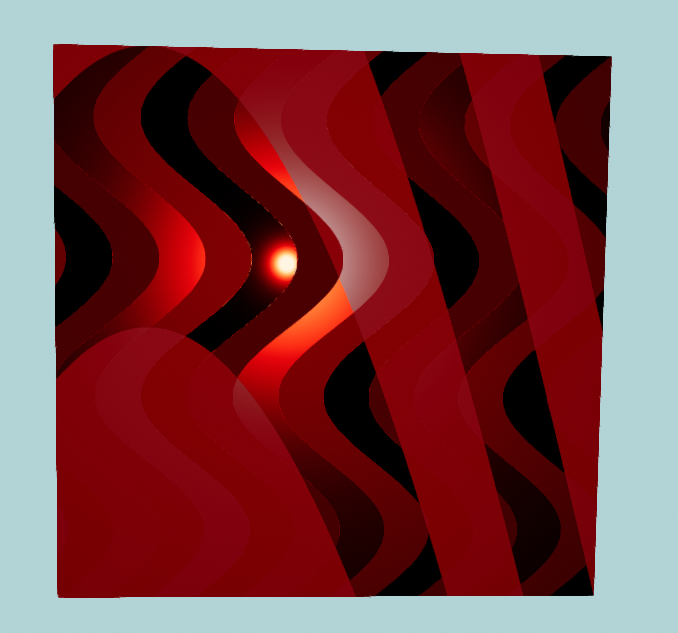
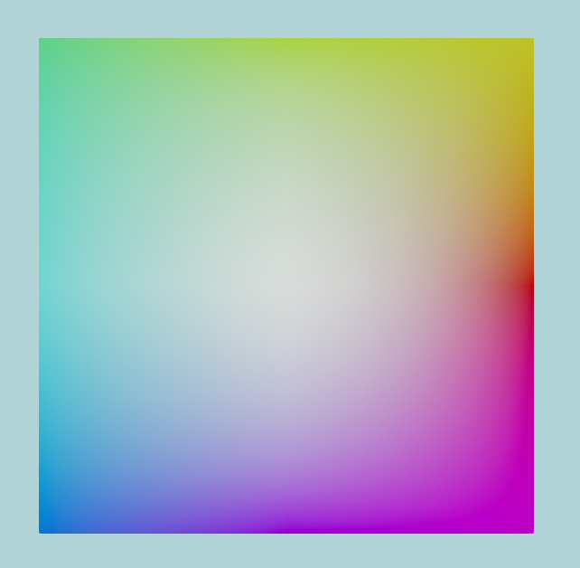

You can use the built-in texture pattern generators to create interesting color maps, normal maps, and ORM maps for your materials.

??? example "Continuing "Hello Cube""
	In the "Hello Cube" example we created a simple color map with a maroon colour:
	
	`#!csharp using var colorMap = materialBuilder.CreateColorMap(StandardColor.Maroon);`

	You can try out the examples below by simply replacing the `colorMap` with some more interesting patterns!

	If you're feeling adventurous you can also experiment with adding a `normalMap` and even an `ormMap` to the cube's material too.

??? question "What are Color, Normal, and ORM Maps?"
	A 'map' is ultimately just 2D texture/bitmap, and all three map types (color, normal, ORM) work together to form a single material.
	
	:material-palette: A __color__ map is the texture that provides the surface colors (sometimes known as the 'albedo' or 'diffuse') for the material.

	:material-axis-arrow: A __normal__ map is the texture that affects how lighting bounces off the material surface by defining which direction each pixel "faces" relative to the flat surface. Normal maps can be used to give the illusion of surface 'texture' or detail without actually having to modify the polygon mesh (a huge performance improvement).

	:material-texture: An __ORM__ map is actually three values baked in to one texture, and is used to add additional information about the nature of the material surface:

	* :material-alpha-o-box-outline: The __Occlusion__ channel is stored in the Red pixel data of the texture and defines on a scale of 0.0 to 1.0 how much light is blocked (or 'occluded') from reaching each pixel on the material surface. For example, if you're trying to simulate a surface of wooden boards, it's likely that less light will reach in the crevices between the boards than on the surface of the boards themselves.

	* :material-alpha-r-box-outline: The __Roughness__ channel is stored in the Green pixel data of the texture and defines on a scale of 0.0 to 1.0 how 'rough' the material is at each pixel of its surface. This value is used to determine how 'shiny' the light reflections are on each part of the surface.
	
	* :material-alpha-m-box-outline: The __Metallic__ channel is stored in the Blue pixel data of the texture and defines on a scale of 0.0 to 1.0 how 'metallic' the material is at each pixel of its surface. In reality, most materials' surfaces' texel data should always be 0.0 (non-metallic) or 1.0 (metallic). This value is used to determine how reflections and lighting interacts with the surface.

	For more information, see: [:octicons-arrow-right-24: Materials](/concepts/materials.md)

All texture patterns can be created by using the static methods on the `TexturePattern` class, located in the `Egodystonic.TinyFFR.Assets.Materials` namespace.

Any type of map can be created with any pattern type, it just depends what type of value you specify for the pattern's "value" arguments:

* For color maps, you should make a texture pattern of `ColorVect`s.
* For normal maps, you should make a texture pattern of `Direction`s.
* For occlusion, roughness, or metallic maps, you should make a texture pattern of `Real`s.

The following examples will show you how to create texture patterns:

## Chequerboard Color Maps

=== "Bordered, 2 Colours"

	{ style="max-height:200px;max-width:200px;border-radius:12px"}
	/// caption
	Chequerboard texture pattern
	///

	For this first example, we will create a color map using a `ChequerboardBordered` texture pattern:

	```csharp
	using var colorMap = materialBuilder.CreateColorMap(
		TexturePattern.ChequerboardBordered(
			borderValue: ColorVect.FromRgb24(0x880000), // (1)!
			borderWidth: 8, // (2)!
			firstValue: ColorVect.White, // (3)!
			secondValue: ColorVect.Black, // (4)!
			repetitionCount: (8, 8), // (5)!
			cellResolution: 120 // (6)!
		)
	);
	```

	1. 	This line is setting the colour of the chequerboard borders.

		`ColorVect.FromRgb24()` allows you to specify colours as hex codes. You can also create a `ColorVect` from hue/saturation/lightness using `ColorVect.FromHueSaturationLightness()`, or specify the RGB components directly by using the constructor (i.e. `new ColorVect(r, g, b)`).

	2.	This line sets the width of the border around each cell (square), in pixels.

	3. 	This is setting the colour of the first cell (square) and every even-numbered cell after that.

	4. 	This is setting the colour of the second cell (square) and every odd-numbered cell after that.

	5.	This is setting the number of repetitions (i.e. the grid size of the texture). We want an 8x8 board so we specify repetition count as `(8, 8)`. 

		Note: In actuality, the type of the expression `(8, 8)` is [ValueTuple&lt;int, int&gt;](https://learn.microsoft.com/en-us/dotnet/api/system.valuetuple-2?view=net-9.0). The tuple is being implicitly converted to an `XYPair<int>`, which a TinyFFR type that `repetitionCount` is declared as.

	6.	This is setting the size, in pixels, of the width and depth of each cell (square).

=== "Bordered, 4 Colours"

	There are some overloads of `ChequerboardBordered` that can take a `thirdValue` and/or `fourthValue` too if you prefer. Here's another example using four colours and an uneven repetition count:

	{ style="max-height:200px;max-width:200px;border-radius:12px"}
	/// caption
	Four colours picked at random, uneven repetition count
	///

	```csharp
	using var colorMap = materialBuilder.CreateColorMap(
		TexturePattern.ChequerboardBordered(
			borderValue: ColorVect.RandomOpaque(),
			borderWidth: 16,
			firstValue: ColorVect.RandomOpaque(),
			secondValue: ColorVect.RandomOpaque(),
			thirdValue: ColorVect.RandomOpaque(),
			fourthValue: ColorVect.RandomOpaque(),
			repetitionCount: (10, 6),
			cellResolution: 200
		)
	);
	```

=== "Unbordered"

	There is also a variant pattern called `Chequerboard` (instead of `ChequerboardBordered`) that does not include a border:

	{ style="max-height:200px;max-width:200px;border-radius:12px"}
	/// caption
	Red / yellow / green / blue, no border
	///

	```csharp
	using var colorMap = materialBuilder.CreateColorMap(TexturePattern.Chequerboard(
		firstValue: ColorVect.FromStandardColor(StandardColor.Red), // (1)!
		secondValue: ColorVect.FromStandardColor(StandardColor.Green),
		thirdValue: ColorVect.FromStandardColor(StandardColor.Blue),
		fourthValue: ColorVect.FromStandardColor(StandardColor.Yellow)
	));
	```

	1. 	`ColorVect.FromStandardColor()` can also be replaced with just an implicit conversion from `StandardColor`, e.g. you can write this line simply as:

		`#!csharp firstValue: StandardColor.Red,`

## Circle or Rectangle Color Maps

=== "3x3 Circles"

	{ style="max-height:200px;max-width:200px;border-radius:12px"}
	/// caption
	Nine bordered circles
	///

	In this example, we create a 3x3 'grid' of bordered circles. We specify each colour in [HSL](https://en.wikipedia.org/wiki/HSL_and_HSV) format with the static method `ColorVect.FromHueSaturationLightness()`. The first argument to `FromHueSaturationLightness()` is a hue angle in degrees, the second is a saturation (from 0.0 to 1.0), and the third is a lightness (also from 0.0 to 1.0):

	```csharp
	using var colorMap = materialBuilder.CreateColorMap(TexturePattern.Circles(
		interiorValue: ColorVect.FromHueSaturationLightness(180f, 0.6f, 0.33f), // (1)!
		borderValue: ColorVect.FromHueSaturationLightness(-70f, 1f, 0.5f), // (2)!
		paddingValue: ColorVect.FromHueSaturationLightness(240f, 0.3f, 0.7f), // (3)!
		repetitions: (3, 3) // (4)!
	));
	```

	1. This is the colour of the interior of each circle.
	2. This is the colour of the border of each circle.
	3. This is the colour between the circles.
	4. Just like with the chequerboard patterns, this specifies the number of circles in each direction.

=== "Interpolated Circle"

	{ style="max-height:200px;max-width:200px;border-radius:12px"}
	/// caption
	A single bordered circle with interpolated colouring
	///

	Some of the overloads for `TexturePattern.Circle()` work with interpolatable values (`ColorVect` is interpolatable). In the following example, we will set colour values for the top, left, right, and bottom of the border and interior of a circle, and the texture pattern will interpolate values around the circle between those four "stops".

	This example also uses some slightly more complicated constructions for `ColorVect`s:
	
	1. As we saw in the previous example, we can specify colours in HSL format. The first argument to `ColorVect.FromHueSaturationLightness()` is the hue angle.
	2. To make our interpolated colour wheel look nice, we set the right, top, left and bottom hue angles by converting them from corresponding `Orientation2D` values. `Orientation2D` is an enum that represents some base axes in 2D, and we can convert an `Orientation2D` to an `Angle` with the method `ToPolarAngle()`.
	3. `ToPolarAngle()` can return `null` if we invoke it on `Orientation2D.None`, but as we know we are not trying to convert a `None` orientation to an angle, we can use the [null-forgiving operator](https://learn.microsoft.com/en-us/dotnet/csharp/language-reference/operators/null-forgiving) and assume there's a `Value`.

	```csharp
	var rightAngle = Orientation2D.Right.ToPolarAngle()!.Value;
	var topAngle = Orientation2D.Up.ToPolarAngle()!.Value;
	var leftAngle = Orientation2D.Left.ToPolarAngle()!.Value;
	var bottomAngle = Orientation2D.Down.ToPolarAngle()!.Value;

	using var colorMap = materialBuilder.CreateColorMap(TexturePattern.Circles(
		interiorValueRight: ColorVect.FromHueSaturationLightness(rightAngle, 1f, 0.3f),
		interiorValueTop: ColorVect.FromHueSaturationLightness(topAngle, 1f, 0.3f),
		interiorValueLeft: ColorVect.FromHueSaturationLightness(leftAngle, 1f, 0.3f),
		interiorValueBottom: ColorVect.FromHueSaturationLightness(bottomAngle, 1f, 0.3f),

		borderValueRight: ColorVect.FromHueSaturationLightness(rightAngle + 90f, 1f, 0.5f), // (1)!
		borderValueTop: ColorVect.FromHueSaturationLightness(topAngle + 90f, 1f, 0.5f),
		borderValueLeft: ColorVect.FromHueSaturationLightness(leftAngle + 90f, 1f, 0.5f),
		borderValueBottom: ColorVect.FromHueSaturationLightness(bottomAngle + 90f, 1f, 0.5f),

		paddingValue: ColorVect.White.WithLightness(0.2f), // (2)!

		repetitions: (1, 1)
	));
	```

	1. Notice that we're shifting the hue colour angle for each border stop by 90°, mostly to help it stand out from the interior colour wheel.
	2. `WithLightness()` returns a new `ColorVect` with the HSL lightness adjusted to the given value (in this case we're returning `White` with a lightness of `0.2`).

=== "Simple Rectangles"

	{ style="max-height:200px;max-width:200px;border-radius:12px"}
	/// caption
	A very simple repetition of red rectangles on a green background
	///

	This example shows how to generate a rectangles pattern using only two arguments. If desired, it's also possible to specify a `borderValue`, but this is optional:

	```csharp
	using var colorMap = materialBuilder.CreateColorMap(
		TexturePattern.Rectangles(
			interiorValue: new ColorVect(1f, 0f, 0f),
			paddingValue: new ColorVect(0f, 1f, 0f)
		)
	);
	```

=== "Bordered Squares"

	{ style="max-height:200px;max-width:200px;border-radius:12px"}
	/// caption
	Four squares each with multi-coloured borders
	///

	Not only can you specify a border for each "rectangle", but you can actually specify a different value for the top, left, bottom and right sides (optionally):

	```csharp
	using var colorMap = materialBuilder.CreateColorMap(
		TexturePattern.Rectangles(
			interiorSize: (64, 64),
			borderSize: (8, 8),
			paddingSize: (32, 32),
			interiorValue: new ColorVect(1f, 1f, 1f),
			borderRightValue: new ColorVect(1f, 1f, 0f),
			borderTopValue: new ColorVect(1f, 0f, 0f),
			borderLeftValue: new ColorVect(0f, 1f, 0f),
			borderBottomValue: new ColorVect(0f, 0f, 1f),
			paddingValue: new ColorVect(0f, 0f, 0f),
			repetitions: (2, 2)
		)
	);
	```

## Circle or Rectangle Normal Maps

???+ failure "Subject to Change"
	[The way normal patterns are generated will be changed in v0.3](https://github.com/Egodystonic/TinyFFR/issues/90).

	`TexturePattern`s will still be used, but instead of specifying `Direction`s you will a different custom type that's easier to work with.

	You can still create normal patterns now with `Directions`, but be aware that you will have to change your code eventually.

=== "Rectangular Studs"

	{ style="max-height:200px;max-width:200px;border-radius:12px"}
	/// caption
	This cube has a flat color map but the normal map gives it the impression of having 'studs' on its surface
	///

	Normal maps in TinyFFR are specified as 2D textures of `Direction`s. Just like with `ColorVect`s, we can use the texture pattern generator to create `Direction` patterns.

	??? question "What does the 'Direction' of a pixel mean in a normal map?"
		Normal maps are textures, but instead of the pixels representing colours (RGB) they represent directions (XYZ).

		In the real world, most surfaces aren't perfectly flat but actually have slight grooves and imperfections. Normal maps attempt to model those imperfections and patterns by specifying the *direction* each pixel of the surface is facing (relative to the overall surface plane) and are used when calculating lighting reflections to provide a more realistic-looking material.

	??? question "Why are they called 'normal' maps?"
		You might be confused if you've never come across this terminology before, and be wondering if there's such a thing as an "abnormal" map or a "weird" map. But be assured, no such thing exists.
		
		In math/geometry, a [normal vector](https://en.wikipedia.org/wiki/Normal_(geometry)) is the name given to the vector (e.g. arrow) that points exactly perpendicularly out from a surface. This represents exactly what we're trying to model with a normal map: We want a texture that describes how our surface/material is deformed on the per-pixel level, for more realistic lighting.

		The term "normal" ultimately comes from Latin; a "norma" was a carpenter's tool for making right-angles.

	By [convention](/concepts/conventions.md), `Direction.Forward` is the "default" direction for a surface's pixel. Any pixel whose direction is set to `new Direction(x: 0f, y: 0f, z: 1f)` (which is the same as `Direction.Forward`) will be rendered as perfectly straight/plumb with respect to the surface.

	That means we can make "interesting" normal maps by specifying some pixels that don't face perfectly forward.

	??? question "What about when my cube surface isn't actually facing forward?"
		You might be wondering why we're specifying everything as facing 'forward' by default when in a real 3D scene it's unlikely most surfaces will be facing exactly forward.
		
		Everything in a normal map is a direction specified *relative* to a conventional 'flat' direction (the convention in TinyFFR is `Direction.Forward` being the 'flat' direction).

		When your surface itself isn't *actually* facing forward in the world/scene, it doesn't matter. The normals are specified *in relation to* whichever direction the surface is *actually* facing-- that direction is considered "forward" in the context of the normal map lighting calculations. The renderer translates your normal directions on a per-frame basis depending on the actual direction the material surface is facing.

	??? warning "Normals should never face inward"
		It generally doesn't make sense to have normals with a negative Z component. In a physical sense, this would imply the surface for that pixel faces inward. 
		
		Materials with inward-facing normals will not react in any sensible way with lighting. They will appear to only be lit from behind, and the reflections will be reversed. Note also that this behaviour is not even guaranteed-- it is undefined and may change in future.

	For this first example, we will create a normal map that gives the impression of rectangular 'studs' sticking out of our surface by using the `Rectangles` texture pattern:

	```csharp
	using var normalMap = materialBuilder.CreateNormalMap(TexturePattern.Rectangles(
		interiorSize: (64, 64),
		borderSize: (8, 8),
		paddingSize: (32, 32),
		interiorValue: new Direction(0f, 0f, 1f),
		borderRightValue: new Direction(1f, 0f, 1f),
		borderTopValue: new Direction(0f, 1f, 1f),
		borderLeftValue: new Direction(-1f, 0f, 1f),
		borderBottomValue: new Direction(0f, -1f, 1f),
		paddingValue: new Direction(0f, 0f, 1f),
		repetitions: (6, 6)
	));
	```

	To use it, the `normalMap` is supplied to `CreateOpaqueMaterial()` alongside your `colorMap`:

	```csharp
	using var material = materialBuilder.CreateOpaqueMaterial(
		colorMap: colorMap, 
		normalMap: normalMap
	);
	```

=== "Circular Indents"

	???+ failure "Pending Changes"
		This example will be written once [the planned changes to normal map patterns](https://github.com/Egodystonic/TinyFFR/issues/90) have been completed.

## Line & Circle ORM Maps

=== "Metallic Strips"

	{ style="max-height:200px;max-width:200px;border-radius:12px"}
	/// caption
	The lines along this surface alternate between metallic and non-metallic strips.
	///

	In this first example for ORM maps, we will specify just a metallic pattern. Specifically, we will use the `Lines` pattern to create metallic 'bands'/'strips' horizontally across our material surface:

	```csharp
	var metallicPattern = TexturePattern.Lines<Real>( // (1)!
		firstValue: 0f, // (2)!
		secondValue: 1f, // (3)!
		horizontal: true, // (4)!
		numRepeats: 5 // (5)!
	);

	using var ormMap = materialBuilder.CreateOrmMap(metallicPattern: metallicPattern); // (6)!

	using var material = materialBuilder.CreateOpaqueMaterial( // (7)!
		colorMap: colorMap, 
		ormMap: ormMap
	);
	```

	1. 	We must specify that this is a pattern of `Real` values (which is the type of value used to create metallic, roughness, or occlusion patterns).

		??? abstract "Why Real instead of just float?"
			`Real` is a TinyFFR type that thinly wraps floating point values with implicit conversions to and from `float`. Its name comes from the mathematical terminology for a [real number](https://en.wikipedia.org/wiki/Real_number) (which is what floating point values represent).
			
			`Real` implements our interpolatable interface (`IInterpolatable<>`) which means we can use it in patterns that interpolate (like the [interpolated circle example](#__tabbed_2_2) above).

			Eventually, when C# gets a way to implement interfaces on pre-existing types (i.e. via a 'shapes' or 'extension everything' proposal), we may be able to do away with `Real` entirely.

			You could also rely on type inference instead of specifying the type parameter explicitly if you specify your values (e.g. `firstValue`, `secondValue`, etc.) as `Real` rather than `float`; but the approach shown in the example tends to be cleaner.

	2.	A value of `0f` indicates that the first line in our pattern will be non-metallic.
	3.	A value of `1f` indicates that the second line in our pattern will be metallic. 
	
		Remember, metallic-map values should generally always only consist of 0f and 1f. Interim values are valid and defined behaviour, but are only really useful for special effects and transitions. A material can't really be "half-metallic" in the real world, and in a rendering context it tends to look odd.

	4.	This makes our lines horizontal. If you specify `false` for this parameter, the lines will be vertical instead.
	5.	This indicates how many times we'd like the pattern to repeat (i.e. how many times we want our `firstValue` and `secondValue` to band across the texture).

		Because we wrote `5`, we will see 10 bands in total (5 of `firstValue`/non-metallic and 5 of `secondValue`/metallic).

	6.	When creating an ORM map there are three optional parameters; one each for occlusion, roughness, and metallicness.

		If you just want to specify a metallic pattern like we're doing here, you can explicitly name the `metallicPattern` argument. The library will fill in sensible defaults for you for the roughness and occlusion.

	7.	Finally we pass our `ormMap` to `CreateOpaqueMaterial()` just like we did with the `colorMap` and `normalMap`. 
	
		If you're not passing in a `normalMap` make sure you explicitly name the arguments to the method like we're doing here to make sure you don't accidentally pass your `ormMap` as a `normalMap`.

=== "Perturbed Metallic and Roughness"

	{ style="max-height:200px;max-width:200px;border-radius:12px"}
	/// caption
	The larger lines are metallic and non-metallic bands. The thinner lines vary in their roughness value.

	Example is shown on a cube that is slightly rotated to best show off lighting at an oblique angle.
	///

	In this next example we will:
	
	1. Create a *metallic* pattern with curved lines,
	2. Create a *roughness* pattern with wavy lines,
	3. Overlay them over each other in to one ORM map.

	??? tip "Reminder: Flat Colouring"
		For this example, we have specified a simple flat colour map ("maroon"). 
		
		All the striations and banding effects shown in this example are just a result of defining differing values for the roughness and metallicness of our material. The underlying colour is all just maroon (dark red).

	Perturbation is an optional parameter to the `Lines` texture pattern that applies a sinusoidal (wave-like) distortion to the lines. There are two parameters to the texture pattern that affect perturbation:

	<span class="def-icon">:material-code-json:</span> `perturbationMagnitude`
	
	:	Defines how 'deep' the curves/waves are.
	
		A value of `0f` means no perturbation (this is the default). Generally speaking, values between `0f` and `0.5f` will look the best, but any value is permitted. 
		
		Higher values can start to simulate other materials like wood grains. 
		
		Negative values have all the same properties as positive values but reverse the direction of the waves.

	<span class="def-icon">:material-code-json:</span> `perturbationFrequency`
	
	:	Defines how many times the waves/curves will repeat.
	
		Any value is permitted. Values above `1f` make wave patterns, values below `1f` simply distort the lines in to a curve shape. 
	
		Negative values have all the same properties as positive values but reverse the direction of the curves.

	```csharp
	var roughnessPattern = TexturePattern.Lines<Real>( // (1)!
		firstValue: 0f,
		secondValue: 0.7f,
		thirdValue: 0.3f,
		fourthValue: 1f,
		horizontal: false,
		numRepeats: 3,
		perturbationMagnitude: 0.1f,
		perturbationFrequency: 2f
	);
	var metallicPattern = TexturePattern.Lines<Real>(
		firstValue: 0f,
		secondValue: 1f,
		horizontal: true,
		numRepeats: 1,
		perturbationMagnitude: 2f,
		perturbationFrequency: -0.3f
	);

	using var ormMap = materialBuilder.CreateOrmMap( // (2)!
		roughnessPattern: roughnessPattern, 
		metallicPattern: metallicPattern
	);
	```

	1. 	This line pattern uses four values to specify four roughness bands (`0f` is perfectly smooth, `1f` is maximally rough).

		`Line` patterns can have up to ten values.

	2.	In this example we're passing in a roughness and metallic map to `CreateOrmMap()`. Make sure you name the arguments to avoid accidentally specifying the wrong type of pattern or map.

=== "Occluded Circular Divots"

	???+ failure "Pending Changes"
		This example will be written once [the planned changes to normal map patterns](https://github.com/Egodystonic/TinyFFR/issues/90) have been completed.

## Plain Fills & Gradients

=== "Roughness Gradient over Plain Metal"

	{ style="max-height:200px;max-width:200px;border-radius:12px"}
	/// caption
	A single light is shining against this dark-red metal cube.

	The metal is shiniest at the top and rougher at the bottom.
	///

	The last two types of pattern currently supported are `PlainFill`s and `Gradient`s.

	In this example we will use a `PlainFill` to create a fully metallic surface, and then use a `GradientVertical` to vary the roughness from top-to-bottom:

	```csharp
	using var ormMap = materialBuilder.CreateOrmMap(
		roughnessPattern: TexturePattern.GradientVertical<Real>(0f, 1f), // (1)!
		metallicPattern: TexturePattern.PlainFill<Real>(1f) // (2)!
	);

	using var material = materialBuilder.CreateOpaqueMaterial(
		colorMap: colorMap, 
		ormMap: ormMap
	);
	```

	1. This creates a vertical gradient from 0 (smooth) to 1 (rough) for the `roughnessPattern`.
	2. This sets a plain fill of 1 (metal) for the whole `metallicPattern`.

=== "Rainbow Square"

	{ style="max-height:200px;max-width:200px;border-radius:12px"}
	/// caption
	Rainbow color map created with a gradient texture pattern.
	///
	
	This example shows how to use the `Gradient()` pattern to create a rainbow color map. We're adjusting the hue angle for each colour by 45 degrees as we go around the 'circle' of the gradient:

	```csharp
	using var colorMap = materialBuilder.CreateColorMap(
		TexturePattern.Gradient(
			right:			ColorVect.FromHueSaturationLightness(0f, 1f, 0.5f),
			topRight:		ColorVect.FromHueSaturationLightness(45f, 1f, 0.5f),
			top:			ColorVect.FromHueSaturationLightness(90f, 1f, 0.5f),
			topLeft:		ColorVect.FromHueSaturationLightness(135f, 1f, 0.5f),
			left:			ColorVect.FromHueSaturationLightness(180f, 1f, 0.5f),
			bottomLeft:		ColorVect.FromHueSaturationLightness(225f, 1f, 0.5f),
			bottom:			ColorVect.FromHueSaturationLightness(270f, 1f, 0.5f),
			bottomRight:	ColorVect.FromHueSaturationLightness(315f, 1f, 0.5f),
			centre:			ColorVect.White
		)
	);
	using var material = materialBuilder.CreateOpaqueMaterial(colorMap);
	```

??? info "Gradient and Plain Fill Pattern Types"
	There are multiple variants of `Gradient`/fill patterns available:
	
	<span class="def-icon">:material-code-block-parentheses:</span> `PlainFill()`

	:   The plain fill pattern does as its name implies. It takes a single argument that is the value for the full color, normal, occlusion, roughness, or metallic map.

		In the first example we're using it to create a metallic map that makes our material fully metallic all over.

	<span class="def-icon">:material-code-block-parentheses:</span> `GradientVertical()`

	:   This pattern interpolates between a `top` and `bottom` value and produces a vertical gradient.
	
		It can also take an optional `centre` value if you wish for a skewed/non-linear gradient.

	<span class="def-icon">:material-code-block-parentheses:</span> `GradientHorizontal()`

	:   This pattern interpolates between a `left` and `right` value and produces a horizontal gradient.
	
		It can also take an optional `centre` value if you wish for a skewed/non-linear gradient.

	<span class="def-icon">:material-code-block-parentheses:</span> `GradientRadial()`

	:   This pattern interpolates between an `inner` and `outer` gradient and produces a radial (circular) gradient.
	
		You can also specify whether to `fringeCorners`, i.e. whether the corners of the resultant map texture should go a little past the `outer` value. If `true` the corners of the map will 'fringe' past `outer`. If `false` the corners will be clamped to the `outer` value.

	<span class="def-icon">:material-code-block-parentheses:</span> `Gradient()`

	:   Finally, this more general purpose gradient pattern lets you specify a value at nine different points (the four corners, the four sides, and the centre).
	
		The pattern will interpolate between all nine values across the map texture.


## Transforms

Finally, every texture pattern (except `PlainFill`) takes a `Transform2D` parameter named `transform` that can be used to apply a rescaling, rotation, and shifting/movement to the final texture pattern.

* A `scaling` will take the pattern and shrink or expand it.
* A `rotation` will take the pattern and rotate it.
* A `translation` will take the pattern and shift/move it.
* You can supply any one of these "transformations", or all three, or anything in between(1).
 { .annotate }

	1. When supplying more than one type of transformation, they will always be applied in a specific order:

		1. Scaling first,
		2. Then rotation,
		3. Then translation.

We will start off with this untransformed color map:

```csharp
using var colorMap = materialBuilder.CreateColorMap(
	TexturePattern.ChequerboardBordered<ColorVect>(
		borderValue: StandardColor.Black,
		firstValue: StandardColor.Red,
		secondValue: StandardColor.Green,
		thirdValue: StandardColor.Blue,
		fourthValue: StandardColor.Purple,
		borderWidth: 8,
		transform: Transform2D.None // (1)!
	)
);
```

1. 	Only this line will change in the following three examples.

	(Supplying `Transform.None` to the `transform` argument is the same as supplying no argument at all.)

{ style="max-height:200px;max-width:200px;border-radius:12px"}
/// caption
This color map has a transform of `None` applied, i.e. no transformation is made.

The  tabs below show the three different transformation types being applied to it:
///

=== "Scaling"

	{ style="max-height:200px;max-width:200px;border-radius:12px"}
	/// caption
	Scaling transform applied to the original color map. 
	///

	In this example we apply a scaling transformation of 50% in the horizontal direction and 200% in the vertical direction:
	
	```csharp
	using var colorMap = materialBuilder.CreateColorMap(
		TexturePattern.ChequerboardBordered<ColorVect>(
			borderValue: StandardColor.Black,
			firstValue: StandardColor.Red,
			secondValue: StandardColor.Green,
			thirdValue: StandardColor.Blue,
			fourthValue: StandardColor.Purple,
			borderWidth: 8,
			transform: new Transform2D(scaling: (0.5f, 2f)) // (1)!
		)
	);
	```

	1. This transform is specifying a 0.5x scaling in the X (horizontal) direction and a 2.0x scaling in the Y (vertical) direction.

	??? question "Why does scaling down the horizontal size *increase* the number of columns etc.?"
		This may or may not confuse you depending on your perception of the scaled image, but if it *does* confuse you, here's the explanation:
		
		Somewhat counterintuitively, *decreasing* the horizontal (X-axis) scaling of the pattern to 50% has __doubled__ the number of columns we see. Similarly, *increasing* the vertical (Y-axis) scaling to 200% has __halved__ the number of rows.

		Nonetheless, this is correct. Here's the explanation of what a scaling transform is doing: 
		
		* Imagine a scaling factor less than `1.0f` as like a vice grip 'squashing' the image. In this example we've 'squashed' the pattern along its X-axis to half its original width. The squashed pattern then simply repeats over and over left-to-right.
		* Imagine a scaling factor greater than `1.0f` like a pinch-and-zoom-in effect on the image. In this example we've 'expanded' the pattern along its Y-axis to double its original height. The bottom half of the expanded pattern is then lost past the bottom of our image.

		Another way to think of it is simply consider the size of each original square in the original, unscaled chequerboard pattern. Now look at what's happened to the size of each square post-scaling: Each square has become 50% as wide but 200% as tall.

	???+ note "Negative scaling factors"
		You can also flip the outcome (i.e. mirror the image vertically or horizontally) by supplying a negative scaling factor.

=== "Rotation"

	{ style="max-height:200px;max-width:200px;border-radius:12px"}
	/// caption
	Rotation transform applied to the original color map. 
	///

	In this example we apply an anticlockwise rotation transform of 10°:
	
	```csharp
	using var colorMap = materialBuilder.CreateColorMap(
		TexturePattern.ChequerboardBordered<ColorVect>(
			borderValue: StandardColor.Black,
			firstValue: StandardColor.Red,
			secondValue: StandardColor.Green,
			thirdValue: StandardColor.Blue,
			fourthValue: StandardColor.Purple,
			borderWidth: 8,
			transform: new Transform2D(rotation: 10f) // (1)!
		)
	);
	```

	1. This transform is specifying a 10 degree rotation in the anticlockwise direction.

	???+ note "Clockwise Rotations"
		You can rotate clockwise by supplying a negative value for `rotation` in your `transform`.

		The reason positive values result in an anticlockwise rotation in TinyFFR is just a [convention](/concepts/conventions.md), although it's worth noting this is ultimately just conforming to a [general convention in trigonometry](https://math.stackexchange.com/questions/1749279/why-are-the-trig-functions-defined-by-the-counterclockwise-path-of-a-circle).

=== "Translation"

	???+ failure "Pending Changes"
		This example will be written once [the planned changes to texture pattern translations](https://github.com/Egodystonic/TinyFFR/issues/94) have been completed.


		