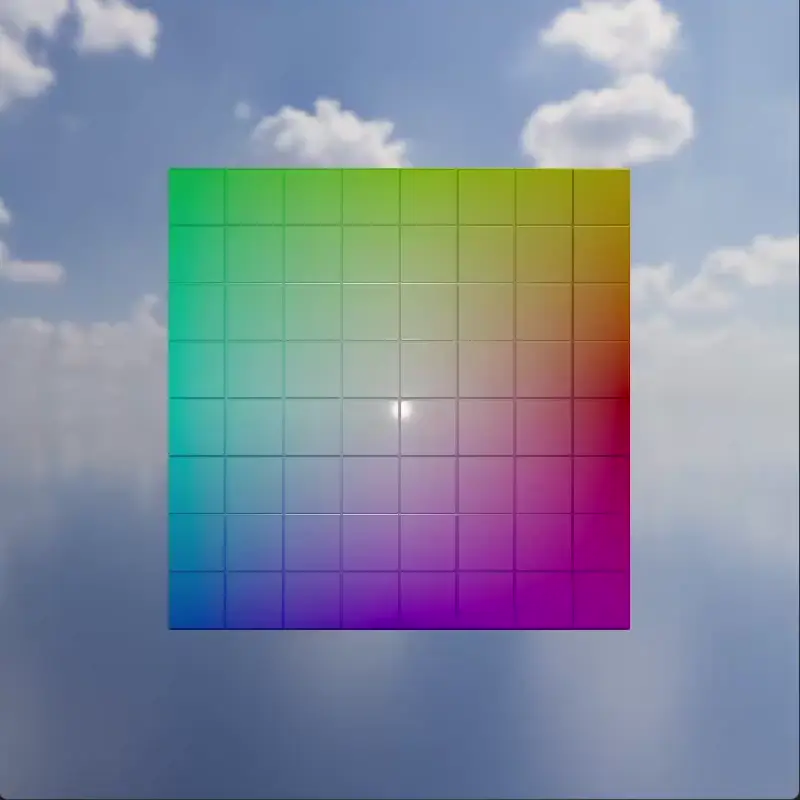

# 3D Rendering in C\# Made Easy

{ align=right : style="height:200px;width:200px;border-radius:12px"}

TinyFFR (*Tiny* *F*ixed *F*unction *R*enderer) is a C# .NET9 library designed to help you render things in 3D:

* Delivered via [NuGet](https://www.nuget.org/packages/Egodystonic.TinyFFR/)
* Supports :fontawesome-brands-windows: Windows, :fontawesome-brands-apple: MacOS (Apple Silicon only), :fontawesome-brands-linux: Linux (Debian/Ubuntu)
* Integration support for WPF, Avalonia, Winforms
* Free for commercial and non-commercial use ([see license](https://github.com/Egodystonic/TinyFFR/blob/main/LICENSE.md))
* Physically-based rendering (via [filament](https://github.com/google/filament))
* Asset loading (via [assimp](https://github.com/assimp/assimp) and [stb_image](https://github.com/nothings/stb))
* Window management and input handling (via [SDL](https://github.com/libsdl-org/SDL))
* Fully-abstracted math & geometry API - no pre-existing 3D or linear algebra knowledge required
* Zero-GC design

## Key Features

-   :material-puzzle:{ .lg .middle : style="margin-right:0.3em" } __Lightweight__

    ---

    TinyFFR is primarily designed for C#/.NET programmers that want to render 3D scenes or objects without needing to integrate a game engine or write against a raw graphics API (it's tiny!).

-   :material-shape-polygon-plus:{ .lg .middle : style="margin-right:0.3em" } __Integrated Asset Loading__

    ---

    TinyFFR makes it easy to load assets such as images, 3D models, textures and HDR cubemaps by integrating popular open-source asset loading libraries such as `assimp` and `stb_image`. 

-   :fontawesome-solid-window-restore:{ .lg .middle : style="margin-right:0.3em" } __Window & Input Handling__

    ---

    TinyFFR helps you discover connected displays, create & manage windows, and capture/process user input with a rich API that supports keyboard, mouse, and gamepad on Windows, Wayland, X11 and MacOS.

-   :octicons-device-camera-video-16:{ .lg .middle : style="margin-right:0.3em" } __Easy Scene Building__

    ---

    TinyFFR provides ways to quickly organise and build 3D scenes (including lights, objects, and backdrops) all with a few lines of code. The library does not require writing shader code or even understanding modern material models. 

-   :material-vector-polygon:{ .lg .middle : style="margin-right:0.3em" } __Minimal Math Required__

    ---

    TinyFFR comes integrated with an abstracted math API that uses plain-English terminology. No prior knowledge of 3D rendering or linear algebra is required. You don't need to know what a quaternion is.

-   :fontawesome-solid-stopwatch-20:{ .lg .middle : style="margin-right:0.3em" } __Zero-GC Design__

    ---

    TinyFFR is designed from the ground-up as a non-garbage-generating library; the API works primarily with struct-based handles around unmanaged or pooled resources, resulting in a zero-jitter, smooth rendering experience.

  

## When to use TinyFFR

__:fontawesome-solid-info: TinyFFR is just a renderer.__

:octicons-check-16: Consider TinyFFR if you don't need "game engine" features such as physics, audio, or environment editing (or you want to add your own implementations for those on top).
{ : style="margin-left:1em" }

:octicons-x-12: TinyFFR may not be for you if you need everything a modern game engine provides and you're not willing or able to add those features another way.
{ : style="margin-left:1em" }

---

__:fontawesome-solid-info: TinyFFR is fixed-function.__

:octicons-check-16: Consider TinyFFR if you don't want to write shaders or design materials and just want to quickly render scenes using a fixed selection of material types for your objects.
{ : style="margin-left:1em" }

:octicons-x-12: TinyFFR may not be for you if you want more flexibility in defining materials and their shading.
{ : style="margin-left:1em" }

---

__:fontawesome-solid-info: TinyFFR is currently in very early prerelease.__ 

:octicons-check-16: Consider TinyFFR if you're okay with using a library that may be missing key features or 
have performance issues and bugs at this early stage. 
{ : style="margin-left:1em" }

:octicons-x-12: TinyFFR may not be for you if you need a mature option at this point in time, [although the source is available!](https://github.com/Egodystonic/TinyFFR)
{ : style="margin-left:1em" }

## Where to Start

### :material-cogs: Learn by Example

If you want to just get stuck in and writing code with TinyFFR, head to the examples section:
{ : style="margin-left:1em" }

[:octicons-arrow-right-24: Examples](/examples/index.md)
{ : style="margin-left:1em" }

### :material-lightbulb: Understand the Concepts

If you want to understand the concepts and design of TinyFFR's API, head to the concepts section:
{ : style="margin-left:1em" }

[:octicons-arrow-right-24: Concepts](/concepts/index.md)
{ : style="margin-left:1em" }

### :fontawesome-solid-book: Read the Reference Documentation

When you're ready to dive deep in to TinyFFR, head to the reference documentation:
{ : style="margin-left:1em" }

[:octicons-arrow-right-24: Reference Docs](/reference/index.md)
{ : style="margin-left:1em" }