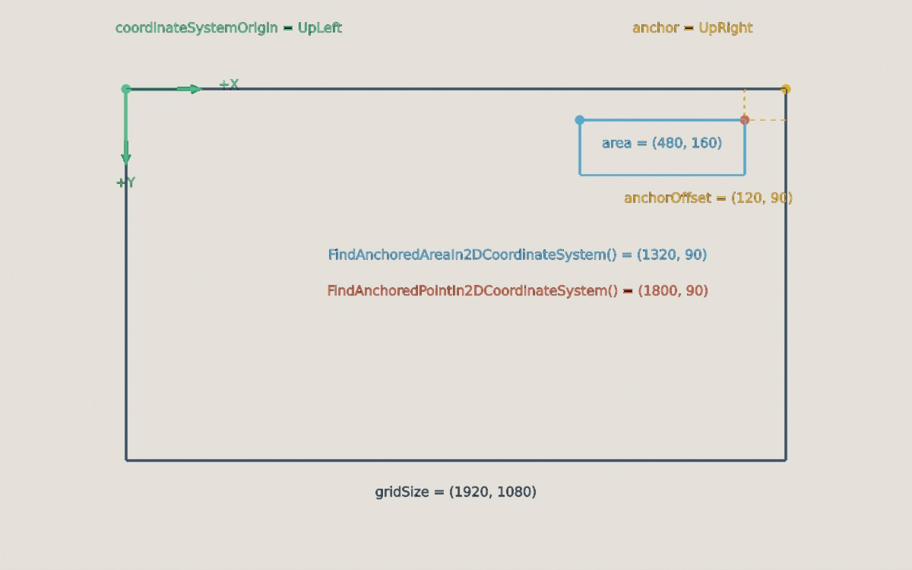

<div class="grid cards" markdown>

-   :chestnut:{ : style="margin-right:0.3em" } __In a nutshell...__

    * `XYPair<T>` is a pair of numbers (`X` and `Y`), used for sizes, pixel coordinates, and 2D vectors. :material-arrow-right: [XYPair](#xypair)
    * `Transform2D` is the 2D equivalent of a `Transform`, used for things like texture transforms. :material-arrow-right: [Transform2D](#transform2d)
    * A `DimensionConverter` converts between 3D locations/directions and 2D coordinates on a flat surface. :material-arrow-right: [DimensionConverter](#dimensionconverter)

</div>

In 2D, TinyFFR uses the usual mathematical [conventions](conventions.md#2d-coordinates): `+X` is right, `+Y` is up, and positive angles turn anticlockwise (with 0° pointing right).

## XYPair

An `XYPair<T>` is a pair of numbers, `X` and `Y`, of any numeric type `T` (usually `int` or `float`). TinyFFR uses them for many different things, including window and texture sizes (`XYPair<int>`), pixel coordinates, and 2D vectors and positions (`XYPair<float>`).

```csharp
var size = new XYPair<int>(1920, 1080); // (1)!
XYPair<float> position = (0.5f, 0.25f); // (2)!
var square = new XYPair<int>(512); // (3)!
var wider = size with { X = 2560 }; // (4)!
var upAndLeft = XYPair<float>.FromPolarAngleAndLength(135f, 2f); // (5)!
```

1.	A pair with an `X` of 1920 and a `Y` of 1080.

2.	A tuple converts implicitly to an `XYPair<T>`, so many TinyFFR methods let you just write `(x, y)`.

3.	A pair with the same `X` and `Y` (512, 512).

4.	A copy of `size` with a different `X`.

5.	A 2D vector of length 2, pointing 135° anticlockwise from right (i.e. up and to the left). `FromPolarAngle()` creates one of length 1, and `FromOrientationAndLength()` creates one pointing towards an [`Orientation2D`](#2d-orientations).

<span class="def-icon">:material-card-bulleted-outline:</span> `Length` / `LengthSquared`

:   The length of the pair, treated as a 2D vector.

<span class="def-icon">:material-card-bulleted-outline:</span> `PolarAngle`

:   The angle the pair points around a circle (0° is right, 90° is up, and so on), or `null` for `(0, 0)`.

<span class="def-icon">:material-card-bulleted-outline:</span> `Ratio` / `Area`

:   `X` divided by `Y` (e.g. the aspect ratio of a size, so `(1920, 1080)` gives 1.78), or `null` if `Y` is 0; and `X` multiplied by `Y` (e.g. the number of pixels in an image of that size).

<span class="def-icon">:material-card-bulleted-outline:</span> `Absolute` / `Negated` / `Reciprocal`

:   Each component made positive, flipped in sign, or replaced by 1 divided by it (`null` if either component is 0).

<span class="def-icon">:material-code-block-parentheses:</span> `Cast<TNew>()` / `Round<T, TNew>()`

:   Converts to another number type. `Cast()` simply converts each component (so `(2.7f, -2.7f)` becomes `(2, -2)` as integers), whereas `Round()` rounds to the nearest whole number first (`(3, -3)`).

<span class="def-icon">:material-code-block-parentheses:</span> `AngleTo(other)` / `SignedAngleTo(other)`

:   The angle between this pair and `other` (treating both as vectors). `AngleTo()` is always between 0° and 180°; `SignedAngleTo()` is positive if `other` is anticlockwise from this pair, and negative if it's clockwise. `pair1 ^ pair2` is equivalent to `AngleTo()`.

<span class="def-icon">:material-code-block-parentheses:</span> `RotatedAroundOriginBy(angle)` / `RotatedBy(angle, pivot)`

:   The pair, treated as a point, rotated (anticlockwise for positive angles) around `(0, 0)` or around `pivot`.

<span class="def-icon">:material-code-block-parentheses:</span> `DistanceFrom(other)` / `Dot(other)` / `Cross(other)`

:   The distance between two pairs (treated as points), and the dot and 2D cross products (treated as vectors).

<span class="def-icon">:material-code-block-parentheses:</span> `WithLength(length)` / `WithMaxLength(max)` / ...

:   The pair, treated as a vector, resized to a given length (or clamped to a maximum or minimum length) while still pointing the same way.

<span class="def-icon">:material-code-block-parentheses:</span> `XYPair<T>.Interpolate(start, end, distance)`

:   The pair `distance` of the way from `start` to `end`.

Pairs also support `+` and `-` (with another pair), `*` and `/` by a single number or another pair (component by component, e.g. `(2, 3) * (4, 5)` is `(8, 15)`), and conversion to and from `System.Numerics.Vector2` (`ToVector2()`, `FromVector2()`).

### 2D Orientations

The 2D orientation enums give names to the eight compass directions on a flat surface, in the same way as the [3D orientation enums](angle_rotation_orientation.md#orientation). They're used by things like [canvas placement](canvas_scenes.md#placement) and [render sub-areas](compositing.md#render-sub-areas).

| Enum | Values |
| :-- | :-- |
| `Orientation2D` | `Right`, `UpRight`, `Up`, `UpLeft`, `Left`, `DownLeft`, `Down`, `DownRight` (and `None`, often meaning "the centre") |
| `DiagonalOrientation2D` | The four corners: `UpRight`, `UpLeft`, `DownLeft`, `DownRight` |
| `HorizontalOrientation2D` / `VerticalOrientation2D` | `Left`/`Right` and `Up`/`Down` |
| `Axis2D` | `X` and `Y` |

`orientation.ToPolarAngle()` gives the angle an orientation points in (e.g. `UpRight` is 45°), and `angle.PolarOrientation` gives the orientation nearest an angle. `HorizontalOrientation2D.Left.Plus(VerticalOrientation2D.Up)` combines two into `UpLeft`.

## Transform2D

A `Transform2D` is the 2D equivalent of a [`Transform`](transform.md): a `Scaling` (an `XYPair<float>`), a `Rotation` (an `Angle`, anticlockwise for positive values), and a `Translation` (an `XYPair<float>`), applied in that order. It works in the same way as a `Transform`, including combining transforms with `*` and converting to and from matrices (`Matrix3x2`).

TinyFFR uses `Transform2D`s mainly to adjust how textures are mapped on to surfaces, for example when [generating meshes](creating_meshes.md#meshgenerationconfig) or [texture patterns](texture_patterns.md).

```csharp
var transform = new Transform2D( // (1)!
	translation: (0.5f, 0f),
	rotation: 90f,
	scaling: (2f, 1f)
);
var moveOnly = Transform2D.FromTranslationOnly((0.5f, 0f)); // (2)!
var transformed = new XYPair<float>(1f, 0f) * transform; // (3)!
var aroundPivot = new XYPair<float>(1f, 0f).TransformedBy(transform, pivot); // (4)!
var combined = first * second; // (5)!
var as3D = transform.To3D(); // (6)!
```

1.	A transform that doubles the width, rotates 90° anticlockwise, and then moves 0.5 to the right. Each argument is optional.

2.	A transform that only moves things. `FromRotationOnly()` and `FromScalingOnly()` work the same way, and `Transform2D.None` does nothing.

3.	`(1, 0)` scaled to `(2, 0)`, rotated to `(0, 2)`, and then moved to `(0.5, 2)`. `transform.AppliedTo(pair)` is equivalent.

4.	The same, but scaling and rotating around `pivot` rather than `(0, 0)`.

5.	A single transform equivalent to applying `first` and then `second`.

6.	The equivalent 3D `Transform`, with 2D X and Y mapped to the world's X and Y axes (and rotations around the world's Z axis). Pass a [`DimensionConverter`](#dimensionconverter) to map the 2D plane differently. `transform.To2D()` converts a 3D `Transform` the other way.

## DimensionConverter

A `DimensionConverter` treats a flat surface in the 3D world as a 2D coordinate system, so you can convert 3D `Location`s, `Vect`s, and `Direction`s to `XYPair<float>`s and back. It's defined by:

* `XBasis` and `YBasis`: the 3D directions that 2D `+X` and `+Y` point along;
* `ZBasis`: the 3D direction pointing straight out of the surface (2D has no Z, but converting back to 3D can take a distance along this direction);
* `Origin`: the 3D location of `(0, 0)` in 2D.

```csharp
var converter = new DimensionConverter( // (1)!
	xBasis: Direction.Left,
	yBasis: Direction.Up,
	zBasis: Direction.Forward,
	origin: Location.Origin
);
var flattened = converter.ConvertLocation(new Location(1f, 2f, 3f)); // (2)!
var restored = converter.ConvertLocation(flattened, 3f); // (3)!
var floorConverter = new Plane(Direction.Up).CreateDimensionConverter(Location.Origin, Direction.Left); // (4)!
```

1.	A converter where 2D X and Y are simply the world's X and Y axes.

2.	`(1, 2)`: the location's position on the surface (its distance along `ZBasis` is dropped).

3.	`(1, 2, 3)`: back to 3D, 3m along `ZBasis` from the surface. (Leave out the distance to put the location on the surface itself.)

4.	A converter for the ground plane, with 2D `+X` pointing along the world's `Left`. If you don't pass the X (and Y) direction, one is chosen for you.

<span class="def-icon">:material-code-block-parentheses:</span> `ConvertLocation()` / `ConvertVect()` / `ConvertDirection()`

:   Convert between 3D and 2D in either direction. `ConvertDirection()` returns `null` if the direction has no 2D equivalent (e.g. a direction pointing straight out of the surface).

<span class="def-icon">:material-code-block-parentheses:</span> `DimensionConverter.FromBasesWithOrthogonalization(axis, xBasis, yBasis, zBasis)`

:   Creates a converter from three directions that may not be exactly at right-angles to each other, adjusting two of them so they are. `axis` picks which of the three is kept as given.

## Anchoring Helpers

[`MathUtils`](math_utility_methods.md#mathutils) has three helpers for positioning things within a rectangular 2D grid (such as a screen, window, or texture), relative to one of its corners or edges. Canvases already do this for you (see [Placement](canvas_scenes.md#placement)), but these helpers are useful when doing similar layout calculations yourself.

Each takes:

* `gridSize`: The size of the grid/canvas (e.g. a window's size in pixels);
* `coordinateSystemOrigin`: Which corner of the grid/canvas is `(0, 0)` (e.g. `DiagonalOrientation2D.UpLeft` for pixel coordinates, which start at the top-left);
* `anchor`: Which corner or edge to measure from (or the centre, `Orientation2D.None`);
* `anchorOffset`: How far from the anchor; positive values move *inwards* from an edge, in the same way as canvas object positions.


/// caption
A point and an area anchored 120 pixels left of and 90 pixels below the top-right corner of a 1920x1080 grid, in coordinates measured from the top-left corner.
///

```csharp
var point = MathUtils.FindAnchoredPointIn2DCoordinateSystem( // (1)!
	gridSize: (1920, 1080),
	coordinateSystemOrigin: DiagonalOrientation2D.UpLeft,
	anchor: Orientation2D.UpRight,
	anchorOffset: (120, 90)
);
var areaCorner = MathUtils.FindAnchoredAreaIn2DCoordinateSystem( // (2)!
	gridSize: (1920, 1080),
	coordinateSystemOrigin: DiagonalOrientation2D.UpLeft,
	anchor: Orientation2D.UpRight,
	anchorOffset: (120, 90),
	area: (480, 160)
);
var normalized = MathUtils.FindAnchorInNormalized2DCoordinateSystem( // (3)!
	DiagonalOrientation2D.DownLeft,
	Orientation2D.UpRight
);
```

1.	Returns `(1800, 90)`: 120 pixels in from the right edge and 90 pixels down from the top edge.

2.	Returns `(1320, 90)`: Where to start drawing a 480x160 area so that its top-right corner sits at the anchored point (i.e. the corner of the area nearest the origin). The area grows away from its anchor rather than overlapping the edge.

3.	Returns `(1, 1)`: The position of the top-right corner in a 1x1 grid starting at the bottom-left.
