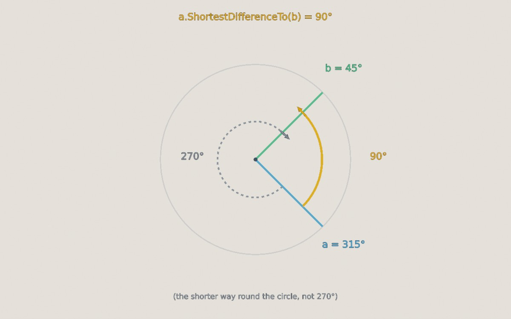
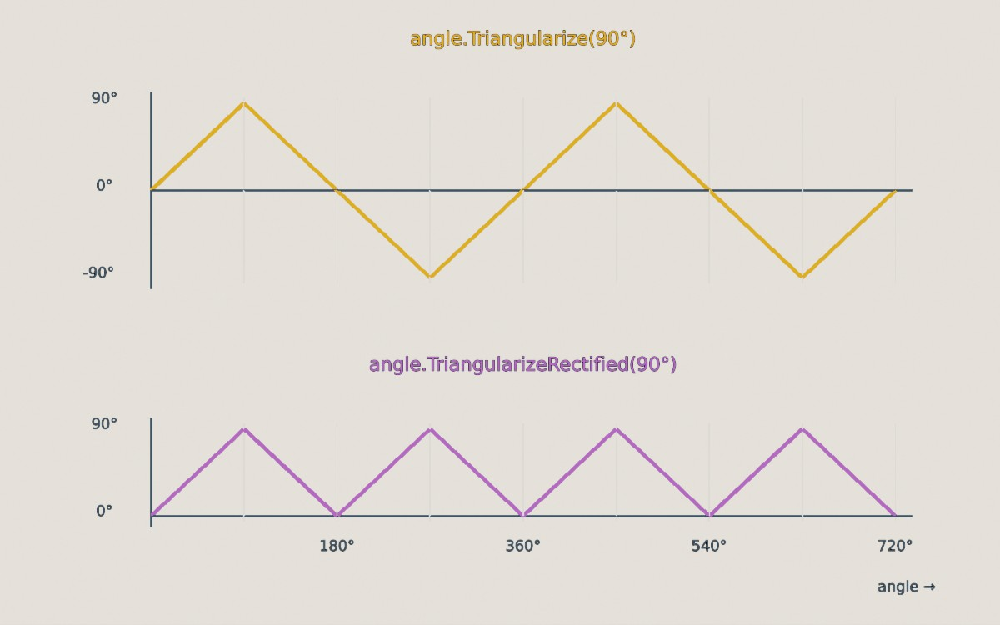
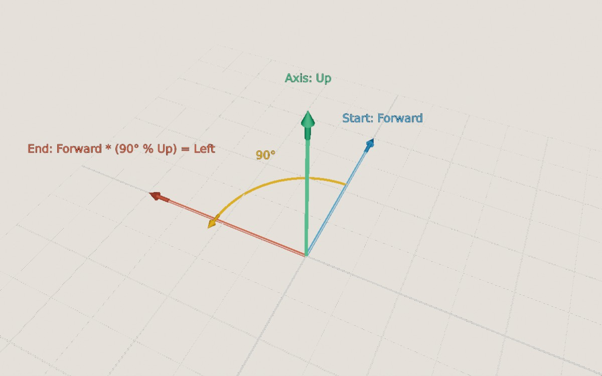

<div class="grid cards" markdown>

-   :chestnut:{ : style="margin-right:0.3em" } __In a nutshell...__

    * An `Angle` is expressed in degrees, and can be created implicitly from a `float` (e.g. `90f`). :material-arrow-right: [Angle](#angle)
    * A `Rotation` is a turn of a given `Angle` around an axis `Direction` (e.g. `90f % Direction.Up`). It describes a *change* of direction, not a direction itself. :material-arrow-right: [Rotation](#rotation)
    * The `Orientation` enums name the 26 directions made of Left/Right, Up/Down, and Forward/Backward (e.g. `Orientation.LeftUp`). :material-arrow-right: [Orientation](#orientation)

</div>

## Angle

An `Angle` is an amount of turn. TinyFFR ostensibly works in degrees; every `float` you pass as an angle, and every value you read back (unless stated otherwise), is in degrees.

??? abstract "Angle Internals"
	Internally an `Angle` is stored in radians, as that's what the underlying math operations use. Its public API converts to and from degrees, so you can think of every `Angle` as being in degrees.

```csharp
Angle quarterTurn = 90f; // (1)!
var alsoQuarterTurn = new Angle(90f); // (2)!
var fromRadians = Angle.FromRadians(MathF.PI); // (3)!
var halfCircle = Angle.HalfCircle; // (4)!
var between = direction1 ^ direction2; // (5)!
```

1.	A `float` converts implicitly to an `Angle` in degrees, so anywhere an `Angle` is expected you can simply write a number.

2.	The same, using the constructor.

3.	180°, created from radians. `Angle.FromFullCircleFraction(0.5f)` gives the same result.

4.	Built-in constants: `Zero`, `EighthCircle`, `SixthCircle`, `QuarterCircle`, `ThirdCircle`, `HalfCircle`, `ThreeQuarterCircle`, and `FullCircle`.

5.	The angle between two [directions](vector_types.md#direction) (from 0° to 180°). Equivalent to `Angle.FromAngleBetweenDirections(direction1, direction2)`.

<span class="def-icon">:material-card-bulleted-outline:</span> `Degrees` / `Radians` / `FullCircleFraction`

:   The angle in degrees, in radians, or as a fraction of a full circle (e.g. 180° is `0.5f`).

<span class="def-icon">:material-card-bulleted-outline:</span> `Sine` / `Cosine`

:   The sine and cosine of the angle. `Angle.FromSine()` and `Angle.FromCosine()` go the other way.

<span class="def-icon">:material-card-bulleted-outline:</span> `Normalized`

:   The equivalent angle between 0° and 360° (e.g. -90° becomes 270°, and 450° becomes 90°).

<span class="def-icon">:material-card-bulleted-outline:</span> `Absolute` / `Negated`

:   The angle with any minus sign removed, or with its sign flipped. The unary `-` operator also negates: `-angle`.

<span class="def-icon">:material-code-block-parentheses:</span> `ShortestDifferenceTo(other)`

:   The smallest angle between this angle and `other` when both are treated as positions around a circle, always between 0° and 180°. For example, between 315° and 45° it's 90°, not 270°.


/// caption
The shortest difference between 315° and 45° is 90° (the orange arc), rather than the 270° you'd get by going the other way round (the dashed arc).
///

<span class="def-icon">:material-code-block-parentheses:</span> `Clamp(min, max)` / `ClampZeroToHalfCircle()` / `ClampZeroToFullCircle()` / `ClampNegativeHalfCircleToHalfCircle()` / ...

:   Restricts the angle to a range.

<span class="def-icon">:material-code-block-parentheses:</span> `Triangularize(peak)` / `TriangularizeRectified(peak)`

:   Treats this angle as a position along a [triangle wave](https://en.wikipedia.org/wiki/Triangle_wave) that rises to `peak`, falls to `-peak` (or to 0°, for the rectified version), and rises again, returning the wave's value. This is handy for making something swing back and forth at a constant speed: Feed in an angle that increases over time (e.g. `loop.TotalIteratedTime` multiplied by some speed), and use the result to rotate something.


/// caption
The output of `Triangularize(90°)` and `TriangularizeRectified(90°)` as the input angle increases from 0° to 720°.
///

<span class="def-icon">:material-code-block-parentheses:</span> `Angle.Interpolate(start, end, distance)` / `Angle.InterpolateShortestPath(start, end, distance)`

:   An angle `distance` of the way from `start` to `end`. `Interpolate()` treats the angles as plain numbers, whereas `InterpolateShortestPath()` takes the shorter way around the circle. For example, halfway from 0° to 270° is 135° with `Interpolate()`, but 315° with `InterpolateShortestPath()`.

Angles also support the usual arithmetic and comparison operators: `+`, `-`, `*` and `/` (by a `float`), and `<`, `>`, `<=`, `>=`.

??? info "Comparing Angles"
	`==` compares angles exactly, so 0° and 360° are *not* equal, even though they point the same way around a circle. Use `IsEquivalentWithinCircleTo()` to check whether two angles point the same way (e.g. 0° and 360°, or 90° and 450°), and `Equals(other, tolerance)` to allow for small floating-point errors. See [Equality](equality.md) for more on comparing values.

## Rotation

A `Rotation` is a turn of some `Angle` around an *axis* (a `Direction`). For example, a rotation of 90° around `Up` turns something that faces `Forward` so that it faces `Left`.


/// caption
A rotation (the yellow object) of 90° around `Up`. Looking down on the `Up` rotation axis (i.e. with the axis pointing towards you), positive angles turn anticlockwise: `Forward` turns in to `Left`.
///

Positive angles turn anticlockwise when the axis is pointing towards you (or equivalently, clockwise when looking along the axis). Negative angles turn the other way.

```csharp
var turn = new Rotation(90f, Direction.Up); // (1)!
var sameTurn = 90f % Direction.Up; // (2)!
var between = direction1 >> direction2; // (3)!
var bigger = turn with { Angle = 180f }; // (4)!
var none = Rotation.None; // (5)!
```

1.	A rotation of 90° around `Up`.

2.	The same rotation, written with the `%` operator (read as "90° around Up"). `Direction.Up % 90f` is equivalent.

3.	The rotation that turns `direction1` in to `direction2` (by the shortest turn). Equivalent to `Rotation.FromStartAndEndDirection(direction1, direction2)` and `direction1.RotationTo(direction2)`.

4.	A copy of `turn` with a different angle (`Axis` can be changed the same way).

5.	A rotation that does nothing.

??? tip "Don't Confuse Rotations with Orientations"
	It's easy to think of a `Rotation` as describing which way something is facing, but that's wrong. Actually, a `Rotation` describes how to *change* which way something is facing. For example, "Facing forward" is a direction/orientation; "turn 90° to the left" is a rotation.

	Put another way: A rotation of 180° around `Left` turns a teacup upside-down. Applying the same rotation again turns it the right way up again: The rotation is the same both times, but its effect depends on which way the teacup was facing to begin with.

### Applying Rotations

```csharp
var rotatedDirection = direction * rotation; // (1)!
var rotatedVect = vect * rotation; // (2)!
var rotatedLocation = location.RotatedBy(rotation, pivot); // (3)!
myObject.RotateBy(rotation); // (4)!
```

1.	Rotates a direction. Equivalent to `direction.RotatedBy(rotation)` and `rotation.Rotate(direction)`.

2.	Rotates a `Vect` (keeping its length).

3.	Rotates a location around a pivot point.

4.	Rotates an object in the scene (see [Scene Objects](scene_objects.md)). Cameras, lights, and most other world objects can be rotated in the same way.

### Combining & Modifying Rotations

```csharp
var combined = rotation1 + rotation2; // (1)!
var undone = -rotation; // (2)!
var half = rotation * 0.5f; // (3)!
var difference = rotation1.NormalizedDifferenceTo(rotation2); // (4)!
```

1.	A single rotation equivalent to applying `rotation1` and *then* `rotation2`. The order matters: In general, turning one way and then another doesn't give the same result as doing the two turns the other way round. Equivalent to `rotation1.CombinedAndNormalizedWith(rotation2)`.

2.	The opposite rotation (the same angle in the other direction), which undoes `rotation`. Equivalent to `rotation.Reversed`.

3.	A rotation around the same axis by half the angle. `rotation / 2f` is equivalent.

4.	The rotation that, applied after `rotation1`, gives `rotation2`.

<span class="def-icon">:material-code-block-parentheses:</span> `WithAngleIncreasedBy(angle)` / `WithAngleDecreasedBy(angle)`

:   The same axis, with a larger or smaller angle.

<span class="def-icon">:material-code-block-parentheses:</span> `WithAxisRotatedBy(otherRotation)`

:   The same angle, around an axis that has itself been rotated by `otherRotation`.

<span class="def-icon">:material-card-bulleted-outline:</span> `Normalized`

:   An equivalent rotation with an angle between 0° and 180°. (Turning by 270° around one axis is the same as turning by 90° around the opposite axis.)

<span class="def-icon">:material-code-block-parentheses:</span> `Rotation.FromStartAndEndOrientation(startForward, startUp, endForward, endUp)`

:   The rotation that turns something facing `startForward` (with `startUp` as its up direction) so that it faces `endForward` (with `endUp` as its up). Unlike `FromStartAndEndDirection()`, this also controls the "roll" around the facing direction, which is needed to fully align objects and cameras.

<span class="def-icon">:material-code-block-parentheses:</span> `AngleAroundAxis(axis)`

:   How far this rotation turns things around `axis` (which needn't be its own axis), as a signed angle. For example, "how much does this rotation spin something around the up direction?"

<span class="def-icon">:material-code-block-parentheses:</span> `Rotation.Interpolate(start, end, distance)`

:   A rotation that is between `start` to `end`, at the normalized `distance`, interpolated such that it turns at a constant rate at every `distance`. 

	`AccuratelyInterpolate()` always uses the precise (but slower) method, and `ApproximatelyInterpolate()` the faster approximation, which is only accurate when the two rotations are within about 90° of each other. `Interpolate()` picks between them for you.

??? info "Comparing Rotations"
	The same turn can be described in more than one way. For example, 90° around `Left` and -90° around `Right` both have exactly the same effect, as do 0° and 360° around any axis. `==` compares the angle and axis exactly, so it treats these as different.

	* `IsEquivalentForAllDirectionsTo(other)` checks whether two rotations always have the same effect.
	* `IsEquivalentForSingleDirectionTo(other, direction)` checks whether two rotations have the same effect on one particular direction.
	* The `^` operator gives the angle between two rotations (e.g. how different they are). See [Equality](equality.md) for more on comparing values.

??? abstract "Rotation Internals"
	Internally, 3D graphics usually represent rotations as [versors](https://en.wikipedia.org/wiki/Quaternions_and_spatial_rotation). TinyFFR uses an angle and axis because they're far easier to understand and harder to misuse, but quaternions/versors can be faster when applying the same rotation many times or combining many rotations.

	`rotation.ToQuaternion()` and `Rotation.FromQuaternion()` convert between the two (as `System.Numerics.Quaternion`), and many TinyFFR methods that accept a `Rotation` also accept a `Quaternion` directly.
	
	See more here: [Quaternion vs Rotation](quaternion_vs_rotation.md).

## Orientation

The orientation enums give names to the 26 directions that point along, or exactly between, the three axes, such as `Left`, `UpForward`, or `RightDownBackward`. They're useful when you want to refer to a general direction by name, rather than as a precise `Direction`.

| Enum | Values | Examples |
| :-- | :-- | :-- |
| `CardinalOrientation` | The 6 directions along a single axis | `Left`, `Up`, `Backward` |
| `IntercardinalOrientation` | The 12 directions between two axes | `LeftUp`, `DownForward`, `RightBackward` |
| `DiagonalOrientation` | The 8 directions between all three axes | `LeftUpForward`, `RightDownBackward` |
| `Orientation` | All 26 of the above | `Left`, `LeftUp`, `LeftUpForward` |
| `XAxisOrientation` / `YAxisOrientation` / `ZAxisOrientation` | The two directions along one axis | `Left` / `Right`, `Up` / `Down`, `Forward` / `Backward` |
| `Axis` | The three axes themselves (without a sign) | `X`, `Y`, `Z` |

Every enum also has a `None` value. The names are always written in X, Y, Z order (e.g. `LeftUpForward`, never `UpLeftForward`).

```csharp
var direction = Orientation.LeftUp.ToDirection(); // (1)!
var nearest = someDirection.NearestOrientation.AsEnum; // (2)!
var combined = Orientation.Left | Orientation.Up; // (3)!
var cameraLeft = camera.GetRelativeOrientationDirection(Orientation.Left); // (4)!
```

1.	The `Direction` that points the named way (here, halfway between left and up). `Direction.FromOrientation(Orientation.LeftUp)` is equivalent.

2.	The named orientation closest to `someDirection`. `NearestOrientation.AsDirection` gives it as a `Direction`. `NearestOrientationCardinal`, `NearestOrientationIntercardinal`, and `NearestOrientationDiagonal` restrict the choice to one kind.

3.	The orientation enums are flags, so they can be combined: `Left | Up` is `LeftUp`.

4.	The direction that's *left* relative to the camera (i.e. taking which way it's facing in to account), rather than the world's `Left`.

<span class="def-icon">:material-code-block-parentheses:</span> `IsCardinal()` / `IsIntercardinal()` / `IsDiagonal()`

:   Whether an `Orientation` lies along one axis, between two, or between all three.

<span class="def-icon">:material-code-block-parentheses:</span> `GetXAxis()` / `GetYAxis()` / `GetZAxis()` / `GetAxisSign(axis)` / `WithAxisSign(axis, sign)`

:   Inspect or change an orientation one axis at a time. For example, `Orientation.LeftUp.GetXAxis()` is `XAxisOrientation.Left`, and its sign along `Axis.Z` is `0`.

<span class="def-icon">:material-code-block-parentheses:</span> `AsGeneralOrientation()`

:   Converts a `CardinalOrientation`, `IntercardinalOrientation`, `DiagonalOrientation`, or per-axis orientation to the equivalent `Orientation`.

<span class="def-icon">:material-code-block-parentheses:</span> `OrientationUtils.CreateOrientation(x, y, z)` / `OrientationUtils.CreateOrientationFromValueSigns(x, y, z)`

:   Builds an `Orientation` from three per-axis orientations, or from the signs of three numbers (e.g. `(1, -2, 0)` gives `LeftDown`). The per-axis orientations can also be combined with `Plus()`: `XAxisOrientation.Left.Plus(YAxisOrientation.Up)` is `LeftUp`.

To loop over every value of a kind, use [`OrientationUtils`](math_utility_methods.md#orientationutils)`.All3DOrientations`, `AllCardinals`, `AllIntercardinals`, `AllDiagonals`, or `AllAxes`. `Direction.AllCardinals` (and so on) list the same orientations as `Direction`s. Each `All[...]` property does *not* include `None`.

[2D equivalents](2d_types.md#2d-orientations) (`Orientation2D`, `DiagonalOrientation2D`, etc.) are used for things like [canvas placement](canvas_scenes.md#placement) and [render sub-areas](compositing.md#render-sub-areas).
