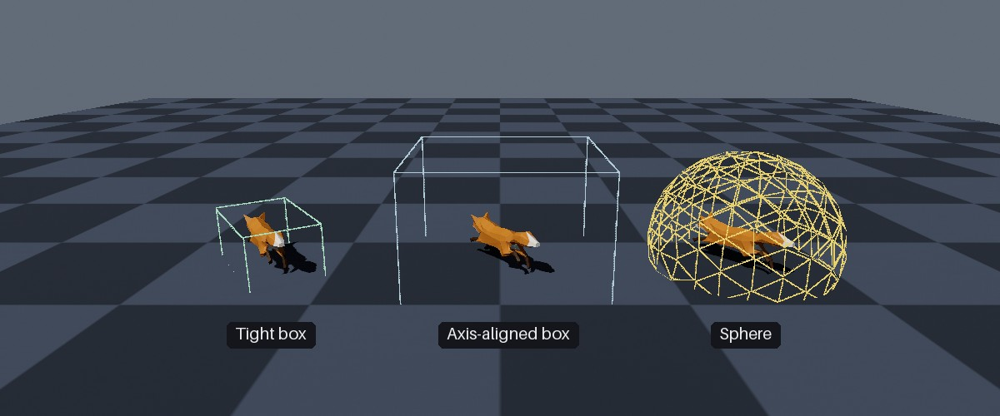

<div class="grid cards" markdown>

-   :chestnut:{ : style="margin-right:0.3em" } __In a nutshell...__

    * A bounding box is a virtual box enclosing an object's geometry, used by the renderer to exclude objects outside the camera's POV. :material-arrow-right: [Bounding Boxes](#bounding-boxes)
    * Every model instance has its own bounding box, which can be read in model space or world space, and overridden per instance. :material-arrow-right: [Instance Bounds](#instance-bounds)
    * Bounding boxes don't follow changes to an object's geometry automatically; an out-of-date box can make objects disappear or be missed by scene queries. :material-arrow-right: [Keeping Bounding Boxes Accurate](#keeping-bounding-boxes-accurate)

</div>

{ : style="width:77%;" }
/// caption
Three instances of a rotated, non-uniformly scaled fox, showing (from left to right) the results of `GetWorldSpaceBoundingBox()`, `GetWorldSpaceAxisAlignedBoundingBox()`, and `GetWorldSpaceBoundingSphere()`.
///

## Bounding Boxes

```csharp
var box = instance.GetWorldSpaceBoundingBox(); // (1)!
Console.WriteLine($"The instance occupies a {box.Width} x {box.Height} x {box.Depth} box at {box.Position}.");
```

1.	Returns the box (in world space, i.e. after the instance's position, rotation, and scaling are applied) that encloses the instance.

A *bounding box* is a box that encloses all of an object's geometry. A mesh may consist of thousands of triangles, but its bounding box is just a box; so it's far quicker to answer questions such as "is this object on screen?" or "does this ray hit this object?" using the box rather than the triangles. The trade-off is precision: The box also encloses empty space around the object, so answers based on it are approximate.

TinyFFR uses bounding boxes for:

* **Culling:** Each frame, the renderer skips drawing any object whose bounding box is entirely off screen. This saves a great deal of work in large scenes, and needs no action from you.
* **Scene queries:** Ray and shape queries test against objects' bounding boxes rather than their triangles (see [Scene Queries](scenes.md#scene-queries)).
* **Sizing:** Methods such as `SetSize()` and `CalculateScalingForSize()` use the bounding box to work out how large an object is (see [Size](scene_objects.md#size)).

## Mesh Bounds

```csharp
var box = mesh.BoundingBox; // (1)!
var rotationSafeBox = mesh.AxisAlignedBoundingBox; // (2)!
var sphere = mesh.BoundingSphere; // (3)!
```

1.	The tightest box enclosing the mesh.

2.	A larger "axis-aligned" box enclosing the mesh regardless of its rotation.

3.	A sphere enclosing the mesh regardless of its rotation.

Every mesh's bounds are calculated once, when it's created or loaded. All three are in the mesh's own space (*model space*), i.e. relative to the mesh's origin, before any object's position, rotation, or scaling is applied:

<span class="def-icon">:material-card-bulleted-outline:</span> `BoundingBox`

:   The smallest box, aligned with the mesh's own axes, that encloses all of its geometry. This is the box each model instance starts with (see below).

<span class="def-icon">:material-card-bulleted-outline:</span> `AxisAlignedBoundingBox`

:   A box that encloses the mesh at *any* rotation. It's considerably larger than `BoundingBox` (e.g. for a long, thin mesh), but it never needs recalculating as an object turns-- the object will always fit completely inside it.

<span class="def-icon">:material-card-bulleted-outline:</span> `BoundingSphere`

:   A sphere that encloses the mesh at any rotation (the sphere enclosing `BoundingBox`).

Because `AxisAlignedBoundingBox` and `BoundingSphere` are designed to work at any rotation, they're only valid when scaled by the same amount on every axis. TinyFFR's world-space versions of them (see below) always scale by the object's largest scaling component, for this reason.

### Margin & Overrides

When a mesh's bounding box is calculated from its vertices, it's enlarged by `MeshCreationConfig.BoundingBoxAdditionalMargin` (`0.03f`, i.e. 3cm, by default) to absorb small inaccuracies in the calculation. Alternatively, you can supply the bounding box yourself via `MeshCreationConfig.BoundingBoxOverride` (the margin is still applied); this is useful when you know your mesh's geometry will later move beyond its initial extents (e.g. via animation or [dynamic vertices](dynamic_meshes_and_mutable_grids.md)) or you want to skip the calculation step. `MeshCreationConfig` is explained in [Loading Meshes](loading_meshes.md#customizing-the-load-operation).

Skeletal meshes are a special case, as their bounding box must enclose every pose their animations may put them in; this is explained in [Skeletal Meshes](skeletal_meshes.md#bounding-boxes).

If you need to calculate a bounding box for your own data, [`PositionedCuboid`](shapes.md#positioned-shapes)`.FromBoundingBoxCalculation()` calculates the smallest box enclosing a span of vertices or `Location`s (optionally with a margin).

## Instance Bounds

```csharp
var modelSpaceBox = instance.GetModelSpaceBoundingBox(); // (1)!
instance.SetModelSpaceBoundingBox(modelSpaceBox.WithAllExtentsAdjustedBy(1f)); // (2)!
```

1.	Gets this instance's own bounding box, in model space.

2.	Replaces this instance's bounding box with one 1m larger in every dimension (i.e. 50cm on each side). Other instances of the same mesh are unaffected.

Every model instance has its own bounding box, in model space(1). This is the box actually used for culling and scene queries (after the instance's transform is applied). It starts out as a copy of its mesh's `BoundingBox`, and can be changed per instance:
{ .annotate }

1.	"Model space" means the box is defined in the co-ordinate system of the object's underlying `Mesh`; not in the co-ordinate space of your scene/world.

	See "World Space" below for the world-space options.

<span class="def-icon">:material-code-block-parentheses:</span> `GetModelSpaceBoundingBox()`

:   Returns the instance's current bounding box, in model space.

<span class="def-icon">:material-code-block-parentheses:</span> `SetModelSpaceBoundingBox(box)`

:   Replaces the instance's bounding box (in model space) with the given box. The mesh, and other instances using it, are unaffected.

<span class="def-icon">:material-code-block-parentheses:</span> `TriggerManualBoundingBoxRecalculation()`

:   Recalculates the instance's bounding box from its own vertices. This only applies to instances whose vertices have been altered (see [Per-Instance Vertex Mutation](dynamic_meshes_and_mutable_grids.md#per-instance-vertex-mutation)); otherwise it does nothing.

Changing an instance's `Mesh` resets its bounding box to that of the new mesh, discarding any box you've set.

### World Space

To find the volume an instance occupies in the world (i.e. with its position, rotation, and scaling applied), use one of these methods:

<span class="def-icon">:material-code-block-parentheses:</span> `GetWorldSpaceBoundingBox()`

:   Returns the instance's bounding box, rotated and scaled with the instance, as a `PositionedRotatedCuboid`. This is the tightest of the world-space bounds, and always reflects the instance's current bounding box (including any box you've set). This is the box scene queries ultimately test against.

<span class="def-icon">:material-code-block-parentheses:</span> `GetWorldSpaceAxisAlignedBoundingBox()`

:   Returns a box aligned with the world's axes (a `PositionedCuboid`) that encloses the instance. It's derived from the mesh's `AxisAlignedBoundingBox`, so it's quick to calculate but loose: For the fox in the image above, its volume is about 13 times that of `GetWorldSpaceBoundingBox()`.

<span class="def-icon">:material-code-block-parentheses:</span> `GetWorldSpaceBoundingSphere()`

:   Returns a sphere (a `PositionedSphere`) that encloses the instance. It's derived from the mesh's `BoundingSphere`. Spheres are the quickest of all shapes to test against, so scene queries use this as a first, coarse check before testing `GetWorldSpaceBoundingBox()`.

`GetWorldSpaceAxisAlignedBoundingBox()` and `GetWorldSpaceBoundingSphere()` are derived from the *mesh's* bounds, so they don't reflect any bounding box you've set on (or recalculated for) the instance itself. Both have an overload taking `calculateSmallestFitFromLiveBoundingBox: true`, which derives them from the instance's current bounding box instead. This is more accurate (and usually tighter), and is required if the instance's box has diverged from its mesh's.

??? tip "Visualising Bounding Boxes"
	```csharp
	using var boundsMarker = scene.AddPrimitiveShape(instance.GetWorldSpaceBoundingBox());
	```

	To see an instance's bounding box (e.g. when diagnosing an object that disappears unexpectedly), draw it with a [scene primitive](scene_primitives.md), as in the image at the top of this page.

## Groups & Bundles

```csharp
var bundleBox = bundle.CalculateCombinedBoundingBox(); // (1)!
var groupBox = instanceGroup.CalculateCombinedBoundingBox(); // (2)!
```

1.	The smallest box enclosing the bounding boxes of every mesh in the bundle.

2.	The smallest box enclosing the (model-space) bounding boxes of every instance in the group.

`CalculateCombinedBoundingBox()` returns the smallest box (in model space) that encloses the bounding boxes of several meshes or instances. It's available on `ModelBundle`s and `ModelInstanceGroup`s, and on collections of `Mesh`es, `Model`s, or `ModelInstance`s. Bundles also use it for their `CalculateScalingForSize()` method, and instance groups for their `SetSize()` method.

## Keeping Bounding Boxes Accurate

A bounding box is only calculated when a mesh is created; it does not follow later changes to an object's geometry. If an object's geometry moves outside its bounding box:

* The object can disappear when it should be on screen (because the renderer thinks it's off screen); typically when it's close to the edge of the view.
* Scene queries can miss the object.

Situations where this can happen, and how to deal with them:

| Situation | Remedy |
| :-------- | :----- |
| An instance's vertices have been altered ([per-instance vertex mutation](dynamic_meshes_and_mutable_grids.md#per-instance-vertex-mutation)) | Pass `recalculateBoundingBoxOnLeaseDispose: true` when borrowing the vertices; or call `TriggerManualBoundingBoxRecalculation()` or `SetModelSpaceBoundingBox()` afterwards. |
| A [dynamic vertex buffer](dynamic_meshes_and_mutable_grids.md#dynamic-vertex-buffers)'s contents have changed | Recalculate or set the buffer's bounding box (see [Bounding Boxes](dynamic_meshes_and_mutable_grids.md#bounding-boxes) for dynamic buffers). |
| A [mutable grid](dynamic_meshes_and_mutable_grids.md#mutable-grids) is displaced further than its `maxHeightDisplacement` | Create the grid mesh with a larger `maxHeightDisplacement`. |
| A [hand-built skeletal mesh](skeletal_meshes.md#bounding-boxes) is animated beyond its bind pose | Supply `MeshCreationConfig.BoundingBoxOverride` when creating the mesh. |
| You know an object's geometry will move within some region | Set a box enclosing that whole region once, with `SetModelSpaceBoundingBox()` (or `BoundingBoxOverride` for every instance of a mesh). |

A larger-than-necessary bounding box is harmless, other than making the renderer draw the object when it's slightly off screen (and making scene queries a little looser); a too-small box causes the problems above. So when in doubt, err on the side of a larger box.

??? warning "Scene Queries and Instance Bounding Boxes"
	Scene queries first check each object's cached bounding sphere (derived from its *mesh*, as explained above) before testing its actual bounding box. If you've enlarged an instance's bounding box beyond its mesh's (by setting it, or by recalculating it after altering the instance's vertices), this first check can wrongly rule the object out. Pass `disallowCachedBoundingBoxes: true` to a query to skip the first check for such objects (see [Scene Queries](scenes.md#scene-queries)).
