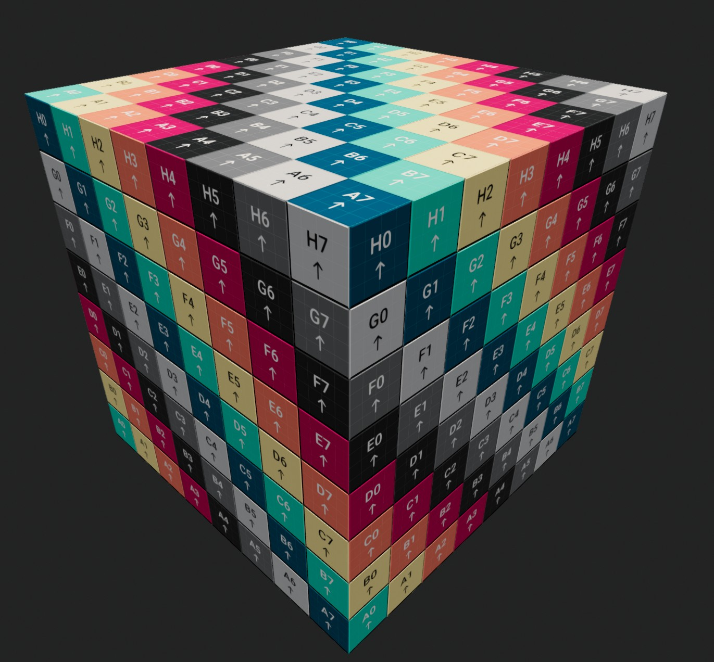

<div class="grid cards" markdown>

-   :chestnut:{ : style="margin-right:0.3em" } __In a nutshell...__

    * `assetLoader.BuiltInTexturePaths` provides virtual "file paths" to textures built in to TinyFFR, which can be passed to any texture-loading function in place of a real file. :material-arrow-right: [Built-in Texture Paths](#built-in-texture-paths)
    * Their most common use is filling in data required for a texture map, e.g. a reflectance channel for an ORMR map. :material-arrow-right: [Default Map Textures](#default-map-textures)
    * A UV-testing texture is also provided. :material-arrow-right: [UV Testing Texture](#uv-testing-texture)

</div>

## Built-in Texture Paths

```csharp
var builtInTexLibrary = factory.AssetLoader.BuiltInTexturePaths;

using var ormr = factory.AssetLoader.LoadOcclusionRoughnessMetallicReflectanceMap(
	@"Assets/metal_orm.png",
	builtInTexLibrary.DefaultReflectanceMap // (1)!
);

using var orm = factory.AssetLoader.LoadOcclusionRoughnessMetallicMap(
	@"Assets/occlusion.png",
	builtInTexLibrary.Rgba30Percent, // (2)!
	@"Assets/metallic.png"
);
```

1.	`metal_orm.png` only contains occlusion, roughness, and metallic data. This overload of `LoadOcclusionRoughnessMetallicReflectanceMap()` combines an ORM file with a separate reflectance file in to a single ORMR map.

	Instead of a real reflectance file, we pass the built-in default reflectance texture (50% reflectance, the typical reflectance of most common materials).

2.	This instead uses an RGBA file to pass in a missing roughness texture, setting our ORM map's *roughness* value to 30%.

Materials often require more texture data than a downloaded or authored asset actually provides. A material might come with a roughness texture but no metallic data, or an ORM map but no reflectance data, etc. When TinyFFR requires a value for a map's channel that you don't have (or you simply want to provide an alternative), using the `assetLoader.BuiltInTexturePaths` can be helpful.

`AssetLoader.BuiltInTexturePaths` provides a library of texture "file paths" that refer to textures built in to TinyFFR. Every path can be passed to any texture-loading function exactly as though it were a real file on disk (including every `Load[...]Map()` function (including the overloads that combine multiple files), `LoadTexture()`, their `Async` counterparts, and even `ReadTextureMetadata()` / `ReadTexture()`).

These textures are generated on the fly rather than read from disk; so nothing needs to be shipped alongside your application, and loading one is effectively free.

Apart from the [UV testing texture](#uv-testing-texture), every built-in texture is a single texel (i.e. a 1x1 image). When combined with other files (as in the example above) the resultant texture takes the largest width and height of all the given files, so the single built-in texel is simply stretched to fill the entire map.

??? question "Why File Paths Rather Than Textures?"
	Providing the built-in textures as paths means they slot directly in to every existing loading function, including all the overloads that combine data from multiple files. If they were provided as pre-loaded `Texture`s instead, every one of those functions would need a duplicate overload accepting a `Texture` in place of each file path.

??? danger "Returned Paths are not Stable Across Versions"
	The paths are returned as `ReadOnlySpan<char>`, which can not be stored in a field or captured in a lambda. If you *need* to keep one around, convert it to a `string` first with `.ToString()`.

	However: Don't rely on or attempt to parse the exact contents of the path strings; they are only meaningful to TinyFFR's asset loader and may change between versions.

## Default Map Textures

The `Default[...]Map`/`Default[...]Value` properties provide a sensible default for every map type (and every individual value channel within those maps) described on the [previous page](texture_map_types.md). They come in two forms:

#### Complete Maps

Properties such as `DefaultOcclusionRoughnessMetallicReflectanceMap`, `DefaultAbsorptionTransmissionMap`, or `DefaultClearCoatMap` provide an entire map with every channel already filled in with its default value.

These are useful when you have no data at all for a map type that a material requires (or as a placeholder while prototyping).

#### Individual Components

Properties such as `DefaultRoughnessValue`, `DefaultTransmissionValue`, or `DefaultClearCoatThicknessValue` provide a monochromatic texture representing just one piece of data.

These are intended to be passed to the `Load[...]Map()` overloads that combine multiple files, standing in for whichever 'value' file you are missing. Each one stores its value in every colour channel, so it works regardless of which channel the combining function reads.

The values used are the same as those exposed as `ITextureBuilder.DefaultOcclusion`, `ITextureBuilder.DefaultRoughness`, etc (`ITextureBuilder` is described in more detail in [Creating Textures](creating_textures.md)).

??? abstract "Default Values"
	| Map Type                | Data Channel        | Default Value                                                     |
	| ----------------------: | :------------------ | :---------------------------------------------------------------- |
	| Color                   | Color               | Opaque white                                                      |
	| Normal                  | Normal              | Perfectly flat surface                                            |
	| ORM(R)                  | Occlusion           | 100% (no occlusion)                                               |
	|                         | Roughness           | 40%                                                               |
	|                         | Metallic            | 0% (dielectric)                                                   |
	|                         | Reflectance         | 50%                                                               |
	| Absorption-Transmission | Absorption          | Black (no light absorbed)                                         |
	|                         | Transmission        | 50%                                                               |
	| Emissive                | Color               | Incandescent light-bulb yellow-white                              |
	|                         | Intensity           | 100%                                                              |
	| Anisotropy              | Angle               | 0°                                                                |
	|                         | Strength            | 100%                                                              |
	| Clearcoat               | Thickness           | 100% (maximally thick)                                            |
	|                         | Roughness           | 0% (fully glossy)                                                 |

## Uniform Values

The `Rgba[N]Percent` properties (`Rgba0Percent`, `Rgba10Percent`, `Rgba20Percent`, ... `Rgba100Percent`) provide four-channel textures where every channel is set to the same value, in 10% steps from 0% to 100%.

These are the way to supply a value *other* than the default for any single piece of data: For example, 70% reflectance (as in the example above), 20% roughness, or 30% transmission. As every channel (including alpha) holds the same value, they can stand in for any data component in any of the combining `Load[...]Map()` overloads.

If you need a precise value that isn't one of the 10% steps you will need to supply a real image file instead (or build the map entirely in code via the [`ITextureBuilder`](creating_textures.md)).

## Solid Colors

The solid colour properties provide the three primary colours (`Red`, `Green`, `Blue`), the three secondary colours (`RedGreen`, `GreenBlue`, `RedBlue`), and `White`/`Black`. Each colour comes in three variants:

<span class="def-icon">:material-card-bulleted-outline:</span> `White`, `Red`, etc.

:   Three-channel (RGB) textures with no alpha channel.

<span class="def-icon">:material-card-bulleted-outline:</span> `WhiteOpaque`, `RedOpaque`, etc.

:   Four-channel (RGBA) textures with a fully opaque (maximum) alpha value.

<span class="def-icon">:material-card-bulleted-outline:</span> `WhiteTransparent`, `RedTransparent`, etc.

:   Four-channel (RGBA) textures with a fully transparent (zero) alpha value.

The secondary colours are named after the channels they fill rather than the colour they produce: `RedGreen` (yellow), `GreenBlue` (cyan), and `RedBlue` (magenta). This is because these textures are just as often used to set particular channels of a *data* map to their minimum or maximum as they are to supply an actual colour.

Common uses include placeholder colour maps while prototyping, or supplying an all-or-nothing value for one input of a combining `Load[...]Map()` overload (e.g. `Black` for zero emissive intensity).

???+ tip "Transparent Colors and Premultiplied Alpha"
	A fully transparent texel with [premultiplied alpha](texture_map_types.md#alpha-premultiplication) is always `(0, 0, 0, 0)`. If you're using a transparent built-in texture as the colour map for a material that blends with the scene, use `BlackTransparent`; the other transparent colours are not premultiplied.

## UV Testing Texture

[{ : style="max-height:384px;" }](built-in_textures_uvtest.jpg)
/// caption
Image showing a cube textured using the `UvTestingTexture`.
///

`UvTestingTexture` is a 2048x2048 colour map designed for checking how a mesh's texture coordinates (UVs) are laid out. Applying it to a mesh makes it immediately obvious where a texture will end up stretched, mirrored, rotated, or wrapped unexpectedly. Unlike every other built-in texture it is a real image (embedded within TinyFFR) rather than a single texel.

Note: This is the same texture used by the [test material](the_test_material.md); most of the time you can just create a test-material to use where you want to see this UV test pattern.
