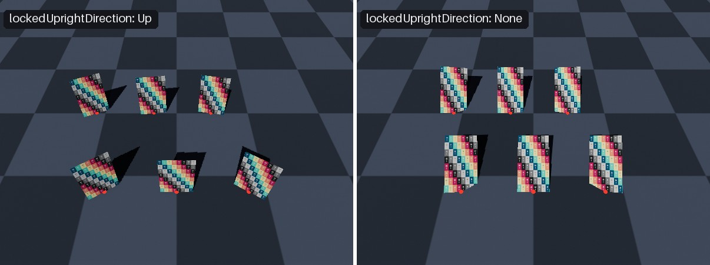
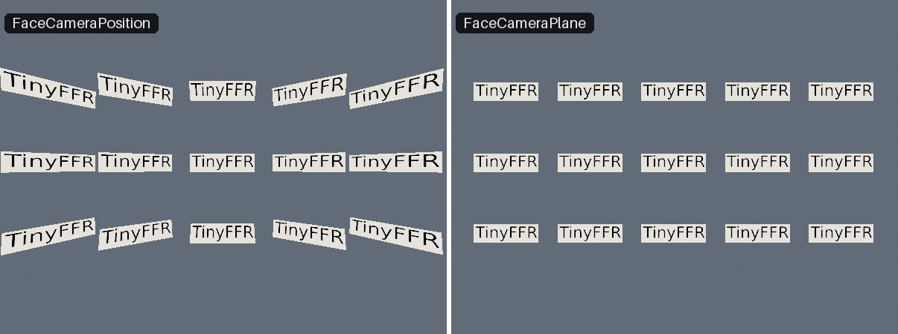
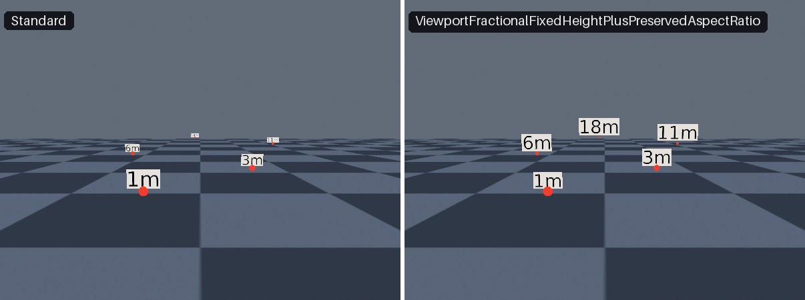

<div class="grid cards" markdown>

-   :chestnut:{ : style="margin-right:0.3em" } __In a nutshell...__

    * Camera-locked quads and text have their orientation 'locked' to always face the camera. :material-arrow-right: [Camera-Locked Objects](#camera-locked-objects)
    * They can additionally be sized in world units, or keep a constant size on screen. :material-arrow-right: [Scaling Mode](#scaling-mode)

</div>

## Camera-Locked Objects

```csharp
using var marker = factory.ObjectBuilder.CreateCameraLockedQuadInstance( // (1)!
	quadMesh, 
	markerMaterial, 
	position: new Location(0f, 2f, 5f), 
	size: new XYPair<float>(0.5f, 0.5f)
);

using var nameplate = factory.ObjectBuilder.CreateCameraLockedTextInstance( // (2)!
	pen, 
	nameString, 
	position: new Location(0f, 2.5f, 5f),
	lockedUprightDirection: Direction.Up,
	layout: new TextLayout(0.04f, Orientation2D.Down),
	scalingMode: CameraLockedScalingMode.ViewportFractionalFixedHeightPlusPreservedAspectRatio,
	lockStyle: CameraLockStyle.FaceCameraPlane
);

scene.Add(marker); // (3)!
scene.Add(nameplate);
```

1.	Creates a 0.5m × 0.5m quad that is always seen face-on.

2.	Creates a text label that stays upright, sits square-on to the screen, and is always 4% of the screen's height tall; with the bottom-centre of the text at the given position.

3.	Camera-locked objects are added to a scene like any other object.

A *camera-locked* object is a [quad](quads.md) or [piece of text](text_instances.md) that is rendered such that it always faces the camera (a technique often called *billboarding*). They're commonly used for:

* Labels, nameplates, and markers that must always be legible.
* Icons and other user-interface-like elements placed in the world.
* Flat images that stand in for 3D objects (e.g. distant trees, or particles such as smoke and sparks), which would otherwise vanish when seen from the side.

#### Implementation

There are two kinds of camera-locked object: `CameraLockedQuadInstance` and `CameraLockedTextInstance`. Each is a specialized view of an ordinary `QuadInstance` or `TextInstance` (available via its `UnderlyingQuadInstance` or `UnderlyingTextInstance` property), and disposing one disposes its underlying instance.

Because they turn themselves to face the camera, camera-locked objects can be positioned and scaled, but not rotated.

???+ info "Add The Camera-Locked Object Itself"
	Only the camera-locked object turns to face the camera. If you add its *underlying* quad or text instance to a scene instead (e.g. `scene.Add(nameplate.UnderlyingTextInstance)`), it's treated as an ordinary quad or text instance, and won't follow the camera.

## Creating Camera-Locked Objects

Camera-locked quads are created with `factory.ObjectBuilder.CreateCameraLockedQuadInstance()`; and camera-locked text instances are created with `factory.ObjectBuilder.CreateCameraLockedTextInstance()`. Both accept the following parameters:

<span class="def-icon">:material-code-json:</span> `position`

:   Where to place the object's anchor point. Defaults to the origin. See [Position & Anchor](#position-anchor).

<span class="def-icon">:material-code-json:</span> `lockedUprightDirection`

:   Which direction the object keeps as its "up" as it turns. Defaults to `Direction.None` (meaning it can turn freely). See [Upright Direction](#upright-direction).

<span class="def-icon">:material-code-json:</span> `positionAnchor`

:   Which point of the object is placed at `position`. Defaults to `Orientation2D.None` (the object's centre). See [Position & Anchor](#position-anchor).

<span class="def-icon">:material-code-json:</span> `scalingMode`

:   How the object is sized. Defaults to `CameraLockedScalingMode.Standard`. See [Scaling Mode](#scaling-mode).

<span class="def-icon">:material-code-json:</span> `lockStyle`

:   How the object decides which way to face. Defaults to `CameraLockStyle.FaceCameraPlane`. See [Lock Style](#lock-style).

<span class="def-icon">:material-code-json:</span> `name`

:   An optional name for the object.

Quads can also specify a `size`; text instances specify their `layout` (which includes the sizing information).

The four camera-lock settings (`LockedUprightDirection`, `PositionAnchor`, `ScalingMode`, and `LockStyle`) are fixed when the object is created, and can be read back via the properties of the same names. (See [Changing Settings Later](#changing-settings-later) if you need to change them.)

## Upright Direction

The `lockedUprightDirection` controls which axes a camera-locked object may turn around to face the camera:

* __`Direction.None`__ (the default): The object turns freely on every axis, so it always faces the camera squarely, even when the camera looks down on it from above. This suits icons, in-world diagnostic information, and 'HUD' markers.
* __Any other direction__ (e.g. `Direction.Up`): The object only turns around that axis, so it stays upright like a tree or a signpost. When the camera looks down on it, it's seen at an angle (just as a real signpost would be). This suits objects that stand on the ground or out from a wall, and also labels that should stay upright.

[{ : style="width:77%;" }](camera-locked_objects_upright.jpg)
/// caption
Camera-locked quads anchored at the red markers, seen from above. On the left, locked to stay upright (`Direction.Up`): they stand vertically like signposts. On the right, free to turn on every axis (`Direction.None`): they tilt back to face the camera squarely.
///

## Lock Style

The `lockStyle` (a `CameraLockStyle`) controls what "facing the camera" means:

<span class="def-icon">:material-card-bulleted-outline:</span> `CameraLockStyle.FaceCameraPlane`

:   The object turns to sit square-on to the screen, sharing the camera's orientation rather than aiming at its position.

	Flat content such as text stays perfectly undistorted wherever it appears on screen, which makes this the better choice for labels and other user-interface-like elements. 
	
	This is the default, is usually what you actually want, and is also considerably cheaper on performance than `FaceCameraPosition`.
	
<span class="def-icon">:material-card-bulleted-outline:</span> `CameraLockStyle.FaceCameraPosition`

:   The object turns to point directly at the camera's position.

	This is much more expensive to render than `FaceCameraPlane` and should be used sparingly.

[{ : style="width:77%;" }](camera-locked_objects_lock_styles.jpg)
/// caption
A grid of camera-locked text seen through a wide field of view. On the left, `FaceCameraPosition` turns each label towards the camera, skewing those towards the edges; on the right, `FaceCameraPlane` keeps every label square-on to the screen.
///

## Scaling Mode

The `scalingMode` (a `CameraLockedScalingMode`) controls how a camera-locked object is sized:

| `CameraLockedScalingMode` | Width | Height |
| :------------------------ | :---- | :----- |
| `Standard` (default) | World units | World units |
| `ViewportFractionalFixedWidth` | Fraction of the screen width | World units |
| `ViewportFractionalFixedHeight` | World units | Fraction of the screen height |
| `ViewportFractionalFixedWidthAndHeight` | Fraction of the screen width | Fraction of the screen height |
| `ViewportFractionalFixedWidthPlusPreservedAspectRatio` | Fraction of the screen width | Matches the width (keeps the object's shape) |
| `ViewportFractionalFixedHeightPlusPreservedAspectRatio` | Matches the height (keeps the object's shape) | Fraction of the screen height |

In `Standard` mode, a camera-locked object is sized in world units exactly like any other object, so it appears smaller the further it is from the camera.

The `ViewportFractional` modes instead size the object as a fraction of the rendered image, so it keeps the same size on screen however far away it is (and whatever resolution the image is rendered at). A value of `1f` means the full width or height of the screen, so `0.05f` means 5% of the screen. For camera-locked text, it's the height (or width) given in its `TextLayout` that is the fraction.

[{ : style="width:77%;" }](camera-locked_objects_scaling.jpg)
/// caption
Camera-locked labels at increasing distances. On the left, `Standard` scaling- they shrink with distance like any other object. On the right, `ViewportFractionalFixedHeightPlusPreservedAspectRatio`- they stay the same size on screen regardless of distance from the camera.
///

* `ViewportFractionalFixedHeightPlusPreservedAspectRatio` (fixed __height__) is usually the best choice for labels, icons, and other in-world user-interface elements because it keeps the object's shape regardless of the window's aspect ratio. Because text is variable in length but not height, this option is preferable over `ViewportFractionalFixedWidthPlusPreservedAspectRatio` (fixed __width__).
* `ViewportFractionalFixedWidthAndHeight` ties each axis to a different dimension of the screen, so the object stretches or squashes as the window's aspect ratio changes.
* The object's `Scaling` reads back the fraction (e.g. `(0.1, 0.05)`), not its size in the world (unless you're using `Standard` scaling mode).
* The fractional modes also work with orthographic cameras (where every object is already the same size at any distance), sizing objects relative to the camera's `OrthographicHeight` and aspect ratio.

## Position & Anchor

```csharp
using var nameplate = factory.ObjectBuilder.CreateCameraLockedTextInstance(
	pen, 
	nameString, 
	position: character.Position + Direction.Up * 2f, 
	lockedUprightDirection: Direction.Up,
	layout: new TextLayout(0.04f, Orientation2D.Down), // (1)!
	scalingMode: CameraLockedScalingMode.ViewportFractionalFixedHeightPlusPreservedAspectRatio,
	lockStyle: CameraLockStyle.FaceCameraPlane
);

// Per-frame:
nameplate.Position = character.Position + Direction.Up * 2f; // (2)!
```

1.	`Orientation2D.Down` anchors the text by the middle of its bottom edge.

2.	Keeps the bottom of the nameplate 2m above the character's position, no matter how the nameplate turns or how big it is on screen.

A camera-locked object's `PositionAnchor` sets which point of the object sits at its `Position` (e.g. `Orientation2D.Down` for the middle of its bottom edge, or `Orientation2D.None` for its centre). As the object turns to face the camera, and as its size changes (either because you change its `Scaling`, or because a fractional scaling mode resizes it), the object pivots and grows around that point, so the anchor point always stays exactly at `Position`.

This makes anchors useful for attaching camera-locked objects to other things, e.g. a nameplate anchored at `Down` sits just above a character's head without overlapping it, however large it is.

Ordinary [quads](quads.md) and [text](text_instances.md) are anchored in the same way, but while an object is camera-locked, it's the camera-locked object's own `PositionAnchor` that applies.

## Multiple Cameras & Scenes

A camera-locked object is turned to face the camera every time a renderer renders a scene containing it, just before that scene is drawn. This means:

* A camera-locked object in several scenes, or in a scene rendered by several renderers with different cameras, correctly faces each camera as it's drawn.
* The object's orientation (and, in `Standard` mode, its underlying instance's `Transform`) reflects whichever render happened most recently. There's no need to set it yourself; anything you set will be overwritten by the next render.

## Performance

Turning objects to face the camera costs a small amount of CPU time per object per render. This is negligible for a handful of objects, but worth considering if you have thousands. From cheapest to most expensive:

1. `CameraLockStyle.FaceCameraPlane` with no `lockedUprightDirection` (`Direction.None`), no `positionAnchor` (`Orientation2D.None`), and `Standard` scaling. Every such object shares the same orientation, which is calculated once per render.
2. As above, but with a fractional scaling mode, which requires the object's size to be recalculated individually.
3. Any other combination (a locked upright direction, a position anchor, or `FaceCameraPosition`), which requires the object's orientation to be calculated individually.

`FaceCameraPosition` is the most expensive of all, as each object must aim at the camera from its own position.

## Other Details

* Camera-locked objects can be wrapped in a [`SceneObject`](scene_objects.md#sceneobject), which supports their position and scaling (and, for quads, material) members.
* A [`ResourceGroup`](resource_groups.md) lists them under `CameraLockedQuadInstances` and `CameraLockedTextInstances`.
* [Scene queries](scenes.md#scene-queries) return the object's underlying `ModelInstance`. `CameraLockedQuadInstance.FromPreviouslyAllocatedUnderlyingQuadInstance()` or `CameraLockedTextInstance.FromPreviouslyAllocatedUnderlyingTextInstance()` can be used to reconstruct from this model instance.
* `CameraLockedQuadInstance` implements `IQuadInstance` alongside the plain `QuadInstance`.
