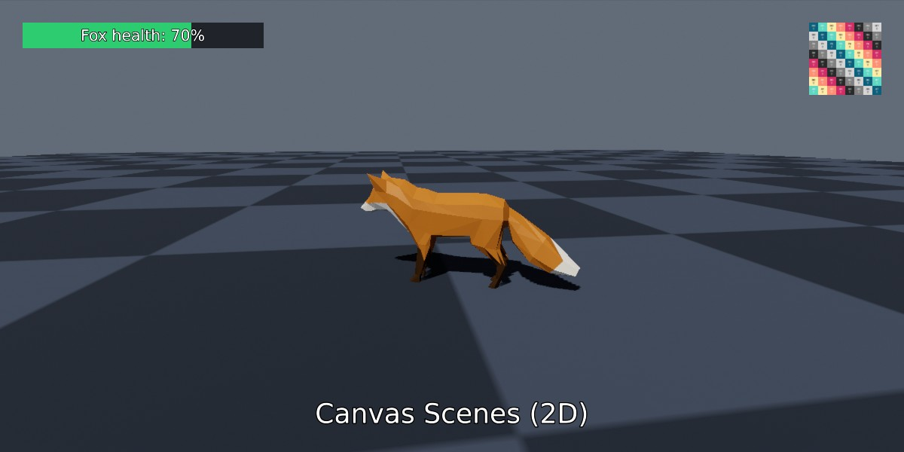
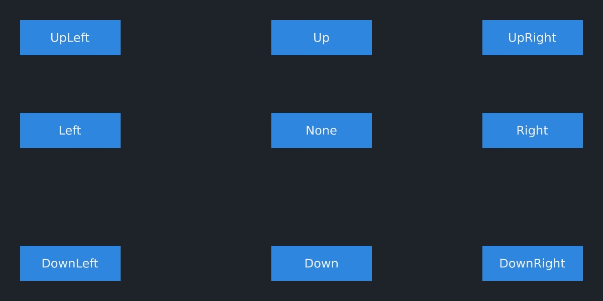
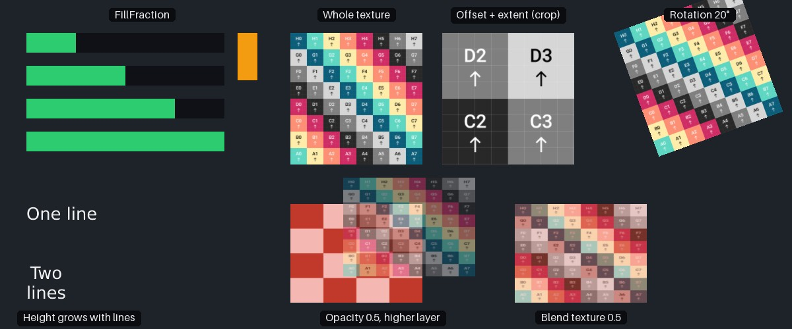

<div class="grid cards" markdown>

-   :chestnut:{ : style="margin-right:0.3em" } __In a nutshell...__

    * A `CanvasScene` is a scene for flat, 2D content (images and text), such as a user interface or HUD. It's usually drawn over the top of a 3D scene. :material-arrow-right: [Canvas Scenes](#canvas-scenes)
    * Canvas images can show part of their texture, be partially filled (e.g. for progress bars), faded, and blended with a second texture. :material-arrow-right: [Canvas Image Features](#canvas-image-features)
    * Canvas objects under the mouse cursor can be found with `Contains()` or the canvas's `QueryProvider`. :material-arrow-right: [Hit-Testing](#hit-testing)

</div>

{ : style="width:77%;" }
/// caption
A canvas scene drawn over a 3D scene: A health bar (with a docked text label) in the top-left, an image in the top-right, and a title at the bottom.
///

## Canvas Scenes

```csharp
using var canvas = factory.SceneBuilder.CreateCanvasScene(); // (1)!

using var logoTexture = factory.AssetLoader.LoadCanvasTexture(@"Assets/logo.png"); // (2)!
using var logo = canvas.Add(logoTexture); // (3)!
logo.SetPlacementPixels(Orientation2D.UpRight, (30, 30), (96, 96)); // (4)!

using var font = factory.AssetLoader.LoadFont();
using var pen = font.CreatePen(BuiltInFontPenStyle.WhiteWithOutline);
using var title = canvas.Add("Hello, canvas!", pen); // (5)!
title.SetPlacementFraction(Orientation2D.Down, (0f, 0.05f), 0.07f); // (6)!

using var canvasRenderer = factory.RendererBuilder.CreateRenderer(canvas, window); // (7)!
using var compositor = factory.RendererBuilder.CreateCompositor(window); // (8)!
compositor.Add(sceneRenderer, RenderCompositionType.Standard);
compositor.Add(canvasRenderer, RenderCompositionType.RetainPreviousScenes); // (9)!

while (!loop.Input.UserQuitRequested) {
	_ = loop.IterateOnce();
	compositor.RenderAll(); // (10)!
}
```

1.	Creates a canvas with a transparent background.

2.	Loads an image as a *canvas texture* (see [Canvas Textures](#canvas-textures)).

3.	Adds the image to the canvas, returning a `CanvasImage`.

4.	Places the image 30 pixels in from the top-right corner of the canvas, 96x96 pixels in size.

5.	Adds a line of text to the canvas, returning a `CanvasText`.

6.	Places the text at the bottom-centre of the canvas, 5% of the canvas height up from the bottom edge, with a font height of 7% of the canvas height.

7.	Creates a renderer for the canvas. Unlike a 3D scene, a canvas doesn't need a camera.

8.	Creates a compositor, which combines several renderers' output in to one image. `sceneRenderer` is assumed to be the renderer for your 3D scene.

9.	Adds the canvas renderer last (so it's drawn on top), with `RetainPreviousScenes` so that it's drawn *over* the 3D scene rather than replacing it.

10.	Renders the 3D scene and then the canvas over it.

A *canvas scene* (`CanvasScene`) is a scene for drawing flat, 2D content, such as user interfaces, HUDs, menus, overlays, and debug readouts. Instead of meshes, lights, and cameras, a canvas holds images and text, placed in terms of the canvas's edges and corners and sized in pixels or as fractions of the canvas.

Canvas scenes are created with `factory.SceneBuilder.CreateCanvasScene()`. A `CanvasSceneCreationConfig` can also be passed to give the canvas a name or an `InitialBackgroundColor` (by default the background is transparent, so whatever is drawn beneath the canvas shows through). The background colour can be changed later with `canvas.SetBackgroundColor()`.

### Rendering Canvases

A canvas is rendered by a normal `Renderer`, created with `factory.RendererBuilder.CreateRenderer(canvas, renderTarget)` (no camera is needed). Rendered on its own, a canvas fills its render target; but most often a canvas is drawn on top of a 3D scene, by adding both renderers to a *compositor* as in the example above (see [Compositing](compositing.md)). The canvas renderer must be added after the 3D scene's renderer, with `RenderCompositionType.RetainPreviousScenes`.

A canvas always takes the size of whatever it's being rendered in to. It's possible to render to a sub-area of the render target (explained on [Compositing](compositing.md)). `canvas.SizePixels` gives its current size, which changes when (for example) the window is resized. This is why canvas objects can be placed in terms of fractions of the canvas, and in terms of its edges and corners (see [Placement](#placement)).

## Canvas Objects

Two kinds of object can be added to a canvas:

<span class="def-icon">:material-code-block-parentheses:</span> `canvas.Add(texture)` / `canvas.Add(material)`

:   Adds an image to the canvas, returning a `CanvasImage`. The image can be given as a texture (see below) or as a [material](creating_materials.md) (niche).

<span class="def-icon">:material-code-block-parentheses:</span> `canvas.Add(text, pen)` / `canvas.Add(fontString, pen)`

:   Adds text to the canvas, drawn with the given font pen, returning a `CanvasText`. The text can be given as a `ReadOnlySpan<char>` (with an optional `TextJustification` for multi-line text), or as a pre-built `FontString`. Fonts, pens, and strings are explained in [Loading Fonts](loading_fonts.md) and [Text Instances](text_instances.md).

Canvas objects are resources: Dispose them to remove them from the canvas. A canvas *owns* the objects on it, so disposing the canvas also disposes every object still on it.

### Canvas Textures

Images drawn on a canvas should be *canvas textures*: Load them with `factory.AssetLoader.LoadCanvasTexture()`, or create them with `factory.TextureBuilder.CreateCanvasTexture()`. Canvases are drawn without the colour processing applied to 3D scenes, so canvas textures are loaded slightly differently to ordinary color maps (this is explained in [Texture Data Types](loading_textures.md#texture-data-types)). Images with transparency (an alpha channel) are drawn with their transparency intact.

## Placement

```csharp
healthBar.SetPlacementPixels(
	Orientation2D.UpLeft, // (1)!
	(30, 30), // (2)!
	(320, 34) // (3)!
);

healthBar.CanvasAnchor = Orientation2D.DownLeft; // (4)!
healthBar.PositionFraction = (0.05f, 0.05f); // (5)!
healthBar.WidthFraction = 0.25f; // (6)!
```

1.	Positions the object relative to the top-left corner of the canvas.

2.	30 pixels in from both the left and top edges.

3.	320 pixels wide and 34 pixels tall.

4.	Moves the object to be positioned relative to the bottom-left corner of the canvas instead.

5.	5% of the canvas width in from the left edge, and 5% of the canvas height up from the bottom edge.

6.	Makes the object a quarter of the canvas's width (leaving its height as it was).

{ : style="width:77%;" }
/// caption
Nine canvas images, each placed at a position of `(40, 40)` pixels from a different `CanvasAnchor` (with a docked text label showing which). The layout is slightly askew (non-uniform) due to the interpretation rules of offset values for certain corner/edge anchor values; see below.
///

Every canvas object (`CanvasImage` or `CanvasText`) is placed by:

<span class="def-icon">:material-card-bulleted-outline:</span> `CanvasAnchor`

:   Which corner or edge of the canvas (or the centre, `Orientation2D.None`) the object's position is measured from.

<span class="def-icon">:material-card-bulleted-outline:</span> `ObjectAnchor`

:   Which corner or edge of the *object* (or its centre) is placed at its position. If `null` (the default), it's the same as `CanvasAnchor`; so an object anchored to the canvas's top-right corner is positioned by its own top-right corner, and therefore always stays fully inside the canvas.

<span class="def-icon">:material-card-bulleted-outline:</span> `PositionPixels` / `PositionFraction`

:   How far the object is from its `CanvasAnchor`, in pixels or as a fraction of the canvas's size.

	When the anchor is at an edge of the canvas, a positive position moves the object *inwards* from that edge (e.g. a position of `(30, 30)` from the top-right corner is 30 pixels left of the right edge and 30 pixels below the top edge). Along an axis where the anchor is in the centre, a positive position moves the object right (for X) or up (for Y).

<span class="def-icon">:material-card-bulleted-outline:</span> `WidthPixels` / `HeightPixels` / `WidthFraction` / `HeightFraction`

:   The object's size, in pixels or as a fraction of the canvas's width or height. These can be `null`, in which case that dimension is sized to fit the object's content (e.g. an image keeps its texture's aspect ratio when only its width is given, and is drawn at its texture's size in pixels when neither is given). `ActualSizePixels` and `ActualSizeFraction` return the size the object actually ends up.

<span class="def-icon">:material-card-bulleted-outline:</span> `Rotation`

:   How far the object is rotated, as an `Angle`. Positive angles rotate it anticlockwise.

`SetPlacementPixels()` and `SetPlacementFraction()` set the anchor, position, and size all at once (for `CanvasText`s, the size is given as a font height). Objects can also be moved and resized relative to their current placement with `MoveByPixels()`/`MoveByFraction()`, `ScaleBy()`, and `AdjustScaleByPixels()`/`AdjustScaleByFraction()`; and rotated with `RotateBy()` (optionally around a pivot point).

???+ question "Pixels or Fractions?"
	Fractions of the canvas keep a layout in proportion when the canvas changes size (e.g. when a window is resized, or on displays of different resolutions), so they're usually the better choice for overall layout. Pixels keep an element at an exact size regardless of the canvas, which suits images that should be drawn at their natural size (scaling an image by a fractional amount can make it slightly blurry). Many interfaces mix the two. `canvas.ConvertPixelsToFraction()` and `canvas.ConvertFractionToPixels()` convert between them.

### Layers & Visibility

Each canvas object has a `Layer`, from `CanvasScene.LayerMin` (`-100`) to `CanvasScene.LayerMax` (`100`), defaulting to `0`. Objects on higher layers are drawn in front of those on lower layers. The drawing order of objects on the *same* layer isn't defined, so give any objects that overlap different layers.

Setting an object's `IsVisible` to `false` hides it while keeping it on the canvas with its placement intact. This is cheaper (and simpler) than removing and re-adding it.

### Docking

```csharp
var label = canvas.Add("Health: 70%", pen);
label.SetDockParent<CanvasImage>(healthBar); // (1)!
label.SetPlacementFraction(Orientation2D.None, (0f, 0f), 0.7f); // (2)!
label.Layer = healthBar.Layer + 1; // (3)!
```

1.	Docks the label inside the health bar.

2.	Centres the label within the health bar, with a font height of 70% of the bar's height.

3.	Draws the label in front of the bar.

Docking one canvas object inside another (with `SetDockParent()`) makes its anchor, position, and size relative to its *dock parent* rather than to the whole canvas. Docked objects therefore move and resize along with their parent, which makes it easy to build composite elements such as labelled buttons and bars. Pass `null` to undock an object.

## Canvas Image Features

```csharp
healthBar.FillFraction = (0.7f, 1f); // (1)!

icon.TextureOffsetPixels = (64, 0); // (2)!
icon.TextureExtentPixels = (64, 64); // (3)!

overlay.Opacity = 0.5f; // (4)!

portrait.SetBlendTexture(damagedPortraitTexture); // (5)!
portrait.SetBlendTextureDistance(0.3f);
```

1.	Fills only the left 70% of the health bar (assuming its anchor is on the left).

2.	Draws the part of the image starting 64 pixels from its left edge and 0 pixels from its bottom edge...

3.	...that's 64x64 pixels in size; e.g. the second icon along the bottom row of a "sprite sheet" of 64x64-pixel icons.

4.	Draws the object at 50% opacity.

5.	Blends a second image 30% of the way over the object's own image.

{ : style="width:77%;" }
/// caption
Canvas image features: Fill fractions of 25%, 50%, 75%, and 100% (and a vertical fill of 40%); a texture shown whole, cropped with an offset and extent, and rotated; a 50%-opaque texture on a higher layer; a texture blended halfway with a second texture; and text whose height grows with its line count.
///

`CanvasImage`s have the following additional properties and methods:

<span class="def-icon">:material-card-bulleted-outline:</span> `FillFraction`

:   How much of the object is actually filled with its image, from `0f` to `1f` on each axis (default `(1f, 1f)`). The filled part is anchored to the object's `ObjectAnchor` (or `CanvasAnchor`, if `ObjectAnchor` is `null`), so a left-anchored bar fills from the left; and the image is cropped (not squashed) to match. This is the usual way to make progress and health bars.

<span class="def-icon">:material-card-bulleted-outline:</span> `TextureOffsetPixels` / `TextureOffsetFraction`, `TextureExtentPixels` / `TextureExtentFraction`

:   Select a rectangular region of the image to draw (by default, the whole image). The offset is the region's bottom-left corner, measured from the bottom-left corner of the image (with positive Y upwards); and the extent is the region's size, extending right and up from the offset. This lets you draw one part of an image containing several smaller images (such as a "sprite sheet" of icons). `TextureDimensions` gives the image's size in pixels.

<span class="def-icon">:material-card-bulleted-outline:</span> `Opacity`

:   How opaque the object is, from `0f` (invisible) to `1f` (fully opaque; the default).

<span class="def-icon">:material-code-block-parentheses:</span> `SetBlendTexture(texture)` / `SetBlendTextureDistance(distance)`

:   Sets a second image to blend over the object's own image, and how far to blend towards it (from `0f`, the object's own image only, to `1f`, the blend image only). This can be used for highlight, damage, or transition effects without swapping images.

<span class="def-icon">:material-code-block-parentheses:</span> `SetTexture(texture)`

:   Replaces the object's image.

## Canvas Text

```csharp
scoreText.SetText("Score: 1500"); // (1)!
scoreText.Pen = highlightPen; // (2)!
```

1.	Replaces the text.

2.	Changes the pen (colours and outline) the text is drawn with.

`CanvasText`s draw a string with a font pen (see [Text Instances](text_instances.md) for more on pens and strings). As well as the common placement properties, they have:

<span class="def-icon">:material-code-block-parentheses:</span> `SetText(text)`

:   Replaces the text (given as a `ReadOnlySpan<char>`, optionally with a `TextJustification` for multi-line text; or as a `FontString`).

<span class="def-icon">:material-card-bulleted-outline:</span> `Pen`

:   The pen the text is drawn with.

<span class="def-icon">:material-card-bulleted-outline:</span> `DisableAutomaticLineCountBasedHeightScaling`

:   By default, a text object's height is multiplied by its number of lines, so that its font height stays the same however many lines the text has (e.g. two lines of text are twice as tall as one). Set this to `true` to keep the object's height fixed instead; multi-line text is then squashed to fit.

<span class="def-icon">:material-card-bulleted-outline:</span> `Layout`

:   The `TextLayout` describing how the text is laid out (see [Text Instances](text_instances.md)).

Text is positioned and sized by its *line box*, which spans from the top of the font's tallest letters to the bottom of the letters that hang below the line (e.g. "g" or "y"), whichever letters the text actually contains. Centring a text object (vertically) centres this box.

## Tracking 3D Objects

To draw something on a canvas over an object in the 3D world (such as a name tag or target marker), find where the object appears on screen with the 3D scene's renderer each frame, and move the canvas object there:

```csharp
marker.CanvasAnchor = Orientation2D.UpLeft; // (1)!
marker.ObjectAnchor = Orientation2D.None; // (2)!

// Per-frame:
var screenFraction = sceneRenderer.ProjectOnToRenderSurfaceFractionClamped(trackedObject.Position, out var isOffScreen); // (3)!
marker.PositionFraction = screenFraction;
marker.Opacity = isOffScreen ? 0.5f : 1f; // (4)!
```

1.	Measures the marker's position from the top-left corner of the canvas, matching the coordinates returned by `ProjectOnToRenderSurfaceFractionClamped()`.

2.	Centres the marker on its position.

3.	Finds where the object appears, as a fraction of the renderer's output. If the object is off-screen (or behind the camera), the result is clamped to the edge of the screen on the side facing the object.

4.	Fades the marker while it's acting as an off-screen indicator.

Fractions (rather than pixels) are the simplest choice here, as they're unaffected by the size or display scaling of the window. If you only want to show the marker while the object is on screen, use `ProjectOnToRenderSurfaceFraction()` instead, which returns `null` when the object is out of view. See [Camera Settings: Projecting Locations](camera_settings.md#projecting-locations) for details.

When the canvas is rendered in to a [render sub-area](compositing.md#render-sub-areas), use the 3D renderer's `ProjectOnToRenderSubAreaSurfaceFraction...()` methods instead, so that the result is relative to the same area as the canvas.

## Hit-Testing

```csharp
var kbm = loop.Input.KeyboardAndMouse;
if (kbm.KeyWasPressedThisIteration(KeyboardOrMouseKey.MouseLeft)) {
	var cursor = canvas.ConvertRenderTargetCoordToLocal(kbm.MouseCursorPosition); // (1)!
	if (playButton.Contains(cursor)) StartGame(); // (2)!

	var clicked = canvas.QueryProvider.GetTopmostObjectUnderRenderTargetCoord<CanvasImage>(kbm.MouseCursorPosition); // (3)!
}
```

1.	Converts the mouse cursor's position in the window to a position on the canvas.

2.	Tests whether the click was on the play button. (`StartGame()` is a hypothetical method of your own.)

3.	Alternatively, finds the topmost canvas image under the cursor, if any.

To find out whether the user has clicked (or is hovering over) a canvas object:

* `canvas.ConvertRenderTargetCoordToLocal()` converts a position in the render target (e.g. the mouse cursor's position in the window) in to a position on the canvas. It accounts for display scaling (DPI) and for renderers drawing to only part of their render target. By default, positions are measured from the top-left corner (as mouse cursor positions are); pass a different `coordOrigin` if your position is measured from elsewhere. The returned position is measured from the same corner.
* `canvasObject.Contains(canvasPosition)` returns whether a position on the canvas falls within the object.
* `canvas.QueryProvider` finds the canvas objects under a position (in render-target or canvas coordinates): `GetTopmostObjectUnderRenderTargetCoord<T>()` returns the topmost object of type `T` (`CanvasImage` or `CanvasText`) under the position, and `FindObjectsUnderRenderTargetCoord<T>()` writes all of them in to a span (topmost first), returning how many were written. `...LocalCoord` variants take canvas positions instead. Hidden objects are never returned.

## Underlying Objects

Canvas objects are built on TinyFFR's 3D objects: A `CanvasImage` is drawn by a [quad](quads.md) and a `CanvasText` by a [text instance](text_instances.md), both accessible via the `UnderlyingModelInstance` property (and `UnderlyingQuadInstance` / `UnderlyingTextInstance` respectively). Likewise, a canvas's `UnderlyingScene` and `Camera` are an ordinary scene and camera. You shouldn't normally need these; and note that the underlying objects' transforms are managed by the canvas, so changing them directly will be overwritten.

Canvas scenes, canvas images, and canvas texts can be added to [resource groups](resource_groups.md), where they're listed under `CanvasScenes`, `CanvasImages`, and `CanvasTexts` respectively.
