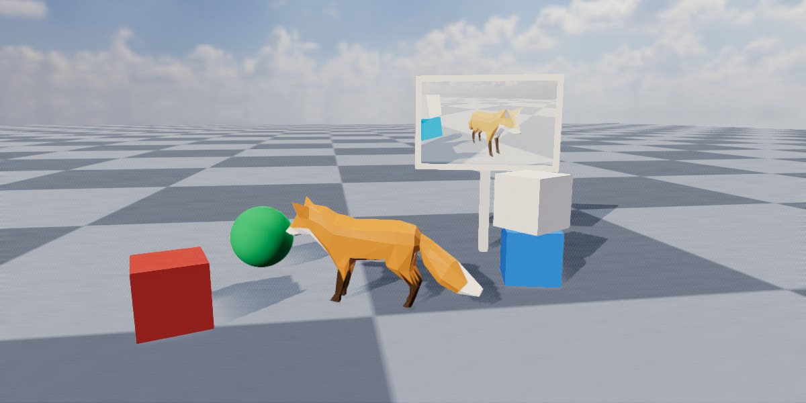

<div class="grid cards" markdown>

-   :chestnut:{ : style="margin-right:0.3em" } __In a nutshell...__

    * A `RenderOutputBuffer` is an off-screen render target. Renderers and compositors can draw in to it instead of a window. :material-arrow-right: [Render Output Buffers](#render-output-buffers)
    * The pixels of each frame rendered to a buffer can be read back on the CPU. It's also possible to just capture screenshots from any renderer. :material-arrow-right: [Reading Frames](#reading-frames), [Screenshots](#screenshots)
    * A buffer can also be used directly as a texture, e.g. for an in-world screen showing a second camera's view. :material-arrow-right: [Using a Buffer as a Texture](#using-a-buffer-as-a-texture)

</div>

## Render Output Buffers

```csharp
using var buffer = factory.RendererBuilder.CreateRenderOutputBuffer((1920, 1080)); // (1)!
using var renderer = factory.RendererBuilder.CreateRenderer(scene, camera, buffer); // (2)!

buffer.ReadNextFrame((dimensions, texels) => { // (3)!
	ImageUtils.SaveBitmap("frame.bmp", dimensions, texels); // (4)!
});
renderer.RenderAndWaitForGpu(); // (5)!
```

1.	Creates a 1920x1080 off-screen buffer.

2.	Creates a renderer that draws `scene` (as seen by `camera`) in to the buffer, rather than in to a window.

3.	Asks to be handed the pixels of the next frame rendered in to the buffer.

4.	Saves those pixels to a bitmap file (see [Saving Bitmaps](#saving-bitmaps)).

5.	Renders the frame, and waits until it's finished (and the pixels have been handed to the function above).

A *render output buffer* (`RenderOutputBuffer`) is an image that TinyFFR can render in to instead of a window. Renderers, [compositors](compositing.md), and everything else that renders to a window can render to a buffer in exactly the same way. The result can then be read back on the CPU (e.g. to save it to a file, send it over a network, or show it in another UI framework), or used directly as a texture.

<span class="def-icon">:material-code-block-parentheses:</span> `factory.RendererBuilder.CreateRenderOutputBuffer(textureDimensions)`

:   Creates a buffer of the given size in pixels. Each dimension must be between `1` and `32,768`; if omitted, the size defaults to 2560x1440. A `RenderOutputBufferCreationConfig` can be passed instead to also give the buffer a name or [choose its row order](#choosing-a-row-order).

<span class="def-icon">:material-card-bulleted-outline:</span> `TextureDimensions`

:   The buffer's size in pixels. A buffer can't be resized; create a new buffer if you need a different size.

Buffers don't need a window, a display, or even a desktop: In [headless mode](creating_and_managing_windows.md#the-windowbuilder), buffers are the only way to render. Rendering to a buffer is never paced by a display's refresh rate ([vsync](render_throughput_and_latency.md#vsync) only applies to windows).

The [WPF](wpf_integration.md), [Avalonia](avalonia_integration.md), and [WinForms](winforms_integration.md) integrations render in to buffers behind the scenes, and copy each frame in to their controls for you.

## Reading Frames

<span class="def-icon">:material-code-block-parentheses:</span> `ReadNextFrame(handler, presentFrameTopToBottom)`

:   Hands the pixels of the *next* frame rendered in to the buffer to `handler`, once. The handler receives the frame's dimensions and a `ReadOnlySpan<TexelRgba32>` of its pixels.

<span class="def-icon">:material-code-block-parentheses:</span> `StartReadingFrames(handler, presentFramesTopToBottom)`

:   Hands the pixels of *every* subsequent frame rendered in to the buffer to `handler`, until `StopReadingFrames()` is called.

<span class="def-icon">:material-code-block-parentheses:</span> `StopReadingFrames(cancelQueuedFrames)`

:   Stops handing frames to the handler. Frames that are already being rendered are still handed over unless `cancelQueuedFrames` is `true`.

All three methods also accept a function pointer (`delegate*`) in place of a delegate, which avoids allocating a delegate object (see the [GC note](#avoiding-allocations) below). A buffer has only one handler at a time: Calling `ReadNextFrame()` or `StartReadingFrames()` replaces any handler set previously.

```csharp
buffer.StartReadingFrames((dimensions, texels) => { // (1)!
	var topLeftPixel = texels[0]; // (2)!
	var bottomRightPixel = texels[dimensions.Area - 1];
}, presentFramesTopToBottom: true);

// Per-frame:
renderer.Render(); // (3)!
```

1.	Starts handing every frame rendered in to `buffer` to this function.

2.	The pixels are laid out row by row. With `presentFramesTopToBottom: true` the first row is the top of the image, so the first pixel is the top-left one.

3.	Each render eventually results in one call to the handler.

The span is only valid while the handler runs. Copy anything you want to keep (e.g. with `texels.CopyTo(...)`) before returning.

### When Handlers Are Called

Reading a frame back requires the GPU to have finished rendering it, so handlers aren't called during the `Render()` that produced the frame. Instead each handler call happens on the thread that's rendering, during a *later* call to `Render()` (or `WaitForGpu()`), once that frame has finished. With the default [GPU synchronization](render_throughput_and_latency.md#gpu-synchronization) settings, a frame's pixels typically arrive a few frames after it was rendered.

* `RenderAndWaitForGpu()` (or `WaitForGpu()`) delivers every pending frame before returning; that's the simplest way to render one frame and get its pixels straight away.
* `StopReadingFrames(cancelQueuedFrames: false)` still delivers the frames that were already being rendered (usually one to five), so the handler may be called a few more times after you stop.

### Row Order

<span class="def-icon">:material-code-json:</span> `presentFrameTopToBottom`

:   Whether the first row of pixels handed to the handler is the *top* of the image (`true`), or the *bottom* (`false`, the default).

	Bottom-to-top matches TinyFFR's texture convention, and is what [`ImageUtils.SaveBitmap()`](#saving-bitmaps) expects by default. Top-to-bottom matches what most UI frameworks and image libraries expect.

### Choosing a Row Order

Frames can always be read in either order, but a buffer stores its rows in one particular order internally. Reading in that order hands the pixels over as they are; reading in the other order requires TinyFFR to reverse every row first, which costs CPU time each frame.

<span class="def-icon">:material-card-bulleted-outline:</span> `RenderOutputBufferCreationConfig.OptimizeForTopToBottomReadback`

:   If `true`, the buffer stores its rows top-to-bottom, so that reading frames with `presentFrameTopToBottom: true` is free. Defaults to `false` (bottom-to-top reading is free).

```csharp
using var buffer = factory.RendererBuilder.CreateRenderOutputBuffer(new RenderOutputBufferCreationConfig {
	TextureDimensions = (1920, 1080),
	OptimizeForTopToBottomReadback = true // (1)!
});
buffer.StartReadingFrames(CopyFrameToMyUiBitmap, presentFramesTopToBottom: true); // (2)!
```

1.	This buffer will mostly be read top-to-bottom, so store it that way.

2.	`CopyFrameToMyUiBitmap` is a hypothetical method of your own. Frames are handed to it without any extra copying.

Set this to `true` if you'll mostly read the buffer top-to-bottom (the UI framework integrations do this). Two things to be aware of:

* A [dynamic texture](#using-a-buffer-as-a-texture) created from such a buffer appears upside-down when used in a material or on a canvas (though not in an [ImGui](imgui_integration.md) image). Leave this setting `false` for buffers you'll use as textures.

??? warning "TopToBottom Optimisation Quirk on OpenGL"
	On the OpenGL rendering backend, top-to-bottom reads from such a buffer still require the rows to be reversed (and bottom-to-top reads require it for buffers *without* this setting). 
	
	Every other backend, including the default backend on every platform, works as described above.

### Avoiding Allocations

A lambda that captures variables (like the ones above) allocates a delegate object each time it's created, which can contribute to garbage-collection stutter if done every frame. To read frames without allocating, register a handler once with `StartReadingFrames()` rather than calling `ReadNextFrame()` every frame, or pass a function pointer to a `static` method:

```csharp
static void HandleFrame(XYPair<int> dimensions, ReadOnlySpan<TexelRgba32> texels) {
	// Process the frame here
}

unsafe {
	buffer.ReadNextFrame(&HandleFrame); // (1)!
}
```

1.	Passes a pointer to the static `HandleFrame` method. No delegate object is allocated.

## Using a Buffer as a Texture

[](capturing_render_output_dynamic_texture.jpg)
/// caption
A second camera renders in to a buffer, whose dynamic texture is shown on a quad in the scene (as a "security monitor").
///

```csharp
using var monitorBuffer = factory.RendererBuilder.CreateRenderOutputBuffer((640, 400));
using var monitorRenderer = factory.RendererBuilder.CreateRenderer(scene, monitorCamera, monitorBuffer); // (1)!
using var monitorTexture = monitorBuffer.CreateDynamicTexture(); // (2)!
using var monitorMaterial = factory.MaterialBuilder.CreateLightingIgnoringMaterial(monitorTexture); // (3)!
using var monitorScreen = factory.ObjectBuilder.CreateQuadInstance(quadMesh, monitorMaterial, position: monitorPosition, size: (1.28f, 0.8f)); // (4)!
scene.Add(monitorScreen);

// Per-frame:
monitorRenderer.Render(); // (5)!
renderer.Render();
```

1.	A second renderer draws the scene from `monitorCamera` in to `monitorBuffer`.

2.	Creates a texture that always shows the latest frame rendered in to `monitorBuffer`.

3.	Uses the texture in a [lighting-ignoring material](lighting_ignoring_materials.md), so the "screen" glows regardless of the scene's lighting.

4.	Shows the material on a [quad](quads.md) in the scene.

5.	Renders the monitor's view first, then the main view (which shows the monitor's latest frame).

<span class="def-icon">:material-code-block-parentheses:</span> `CreateDynamicTexture()`

:   Returns a `Texture` showing the buffer's contents. It doesn't need to be recreated or refreshed ever; it always shows the latest frame rendered in to its parent buffer.

A dynamic texture can be used anywhere a normal texture can: In [materials](creating_materials.md), on [canvas images](canvas_scenes.md), and in [ImGui images](imgui_integration.md#rendering-to-an-imgui-image). This is useful for in-world screens, mirrors and portals, picture frames, minimaps, and previews in editor UIs.

* The buffer owns its texture: Disposing the buffer disposes the texture too (see [Resource Dependencies](resource_dependencies.md)), so the buffer can't be disposed while something is still using the texture.
* Dynamic textures can't be written to (e.g. with `OverwriteTexels()`); render something different in to the buffer instead.

## Screenshots

```csharp
renderer.CaptureScreenshot("screenshot.bmp"); // (1)!
renderer.CaptureScreenshot("screenshot_4k.bmp", captureResolution: (3840, 2160)); // (2)!
renderer.CaptureScreenshot((dimensions, texels) => { // (3)!
	// Process texels here
});
```

1.	Saves a screenshot of what `renderer` would draw right now, as a 24-bit bitmap file.

2.	Captures the screenshot at a different resolution than the renderer normally draws at.

3.	Hands the screenshot's pixels to a function instead of saving them (in the same format as [reading frames](#reading-frames)).

<span class="def-icon">:material-code-block-parentheses:</span> `renderer.CaptureScreenshot(bitmapFilePath, saveConfig, captureResolution)`

:   Saves a screenshot to a bitmap file. `saveConfig` controls how it's saved (see [Saving Bitmaps](#saving-bitmaps)); by default it's saved without an alpha channel. If a file already exists at the path, it's overwritten.

<span class="def-icon">:material-code-block-parentheses:</span> `renderer.CaptureScreenshot(handler, captureResolution, presentFrameTopToBottom)`

:   Hands the screenshot's pixels to `handler` (a delegate or function pointer) instead of saving them.

`captureResolution` sets the screenshot's size; by default it's the size the renderer draws at (its [render sub-area](compositing.md#render-sub-areas), or the whole window or buffer if it doesn't have one).

A screenshot isn't a copy of the last frame shown; rather the scene is rendered again (in to a temporary buffer) at the moment you capture it, and the method waits for that render to finish before returning. This means a screenshot always shows the scene's *current* state, works for renderers drawing to windows as well as buffers, and can be taken at any resolution; but it costs a full render plus a [wait for the GPU](render_throughput_and_latency.md#waiting-for-the-gpu), so it's not suited to capturing every frame. To capture a continuous stream of frames, render in to a buffer and [read the frames](#reading-frames) instead.

Screenshots capture a single renderer. To capture the combined output of a [compositor](compositing.md), create the compositor for a buffer and read its frames.

## Saving Bitmaps

It's possible to save a bitmap of texels using `ImageUtils` (the texel data doesn't have to come from a buffer callback).

<span class="def-icon">:material-code-block-parentheses:</span> `ImageUtils.SaveBitmap(filePath, dimensions, texels)`

:   Saves pixel data (a span of `TexelRgb24` or `TexelRgba32`) as a bitmap (`.bmp`) file. The alpha channel is saved if the texels have one. The texels must be bottom-row-first (the default row order when [reading frames](#row-order)).

<span class="def-icon">:material-code-block-parentheses:</span> `ImageUtils.SaveBitmap(filePath, dimensions, texels, config)`

:   As above, with a `BitmapSaveConfig` controlling how the image is saved:

	* `IncludeAlphaChannel`: Whether to save a 32-bit image with an alpha channel (`true`), or a 24-bit image without one (`false`).
	* `FlipVertical`: Flips the image vertically. Set this when saving top-row-first pixel data (e.g. frames read with `presentFrameTopToBottom: true`).
	* `FlipHorizontal`: Flips the image horizontally.

If a file already exists at the path, it's overwritten. An `IOException` is thrown if the file can't be written (e.g. the folder doesn't exist), and the path (including the file name) can be no more than 1,024 characters long.

```csharp
buffer.ReadNextFrame((dimensions, texels) => {
	ImageUtils.SaveBitmap("frame.bmp", dimensions, texels, new BitmapSaveConfig { IncludeAlphaChannel = false, FlipVertical = true }); // (1)!
}, presentFrameTopToBottom: true);
```

1.	Saves the frame without its alpha channel. `FlipVertical` is set because the frame was read top-row-first.

??? tip "Passing Arrays"
	`SaveBitmap()` takes a span of texels. If your texels are in an array (e.g. a `TexelRgba32[]`), C# can't work out the texel type from it automatically; pass `myArray.AsSpan()` instead, or name the type explicitly (`ImageUtils.SaveBitmap<TexelRgba32>(...)`).
