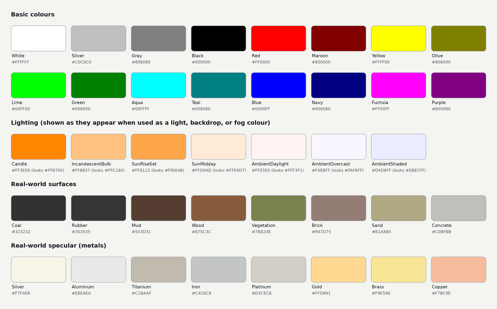

<div class="grid cards" markdown>

-   :chestnut:{ : style="margin-right:0.3em" } __In a nutshell...__

    * A `ColorVect` is a colour made of four channels (red, green, blue, and alpha/opacity), each usually between 0 and 1. :material-arrow-right: [ColorVect](#colorvect)
    * `StandardColor` is a list of named colours, including real-world material and lighting colours, that convert automatically to a `ColorVect`. :material-arrow-right: [StandardColor](#standardcolor)
    * Colours used in textures are treated as sRGB, but light, backdrop, and fog colours are treated as linear. :material-arrow-right: [Colour Spaces](#colour-spaces)

</div>

## ColorVect

A `ColorVect` is a colour made of four channels: `Red`, `Green`, `Blue`, and `Alpha` (opacity). Each is a `float`, normally between 0 (none) and 1 (full intensity, or fully opaque for `Alpha`).

```csharp
var orange = new ColorVect(1f, 0.5f, 0f); // (1)!
var translucentOrange = new ColorVect(1f, 0.5f, 0f, 0.3f); // (2)!
var fromHex = ColorVect.FromRgb24(0xFF8000); // (3)!
var fromHexWithAlpha = ColorVect.FromRgba32(0xFF80004C); // (4)!
var fromBytes = ColorVect.FromRgb24(255, 128, 0); // (5)!
var fromHsl = ColorVect.FromHueSaturationLightness(30f, 1f, 0.5f); // (6)!
ColorVect fromStandard = StandardColor.Teal; // (7)!
ColorVect fromTuple = (1f, 0.5f, 0f); // (8)!
```

1.	A fully opaque orange (100% red, 50% green, no blue). The alpha defaults to 1 (fully opaque).

2.	The same orange at 30% opacity.

3.	A colour from a `0xRRGGBB` hex code, as used in image editors and on the web (e.g. `#FF8000`). Always fully opaque.

4.	A colour from a `0xRRGGBBAA` hex code, including alpha.

5.	A colour from separate 0-255 values for each channel. `FromRgba32(r, g, b, a)` also takes an alpha.

6.	A colour from its hue (an [`Angle`](angle_rotation_orientation.md#angle) around the colour wheel), saturation, and lightness. See [Hue, Saturation, & Lightness](#hue-saturation-lightness).

7.	A [`StandardColor`](#standardcolor) converts automatically to a `ColorVect`.

8.	A tuple of three (or four) `float`s also converts automatically.

There are also built-in constants for the basic colours, both opaque and fully transparent, e.g. `ColorVect.WhiteOpaque`, `ColorVect.RedOpaque`, and `ColorVect.BlackTransparent`.

<span class="def-icon">:material-card-bulleted-outline:</span> `Red` / `Green` / `Blue` / `Alpha`

:   The individual channels. They can also be read with an indexer (e.g. `color[ColorChannel.G]`), and rearranged by indexing with several channels (e.g. `color[ColorChannel.B, ColorChannel.G, ColorChannel.R]` swaps red and blue). Colours can also be deconstructed: `var (r, g, b, a) = color;`.

<span class="def-icon">:material-code-block-parentheses:</span> `ToRgb24()` / `ToRgba32()`

:   The colour as a hex code (`0xRRGGBB` or `0xRRGGBBAA`), e.g. for saving or displaying it. Overloads with `out byte` parameters give each channel as a 0-255 value instead.

<span class="def-icon">:material-code-block-parentheses:</span> `ColorVect.Interpolate(start, end, distance)`

:   The colour `distance` of the way between `start` and `end` (e.g. halfway between red and blue is a dark purple). See [Interpolation Algorithms](interpolation_algorithms.md) for easing between colours.

<span class="def-icon">:material-code-block-parentheses:</span> `ColorVect.RandomOpaque()`

:   A random, fully opaque colour. `ColorVect.Random()` randomizes the alpha too.

### Arithmetic

```csharp
var brighter = color * 1.5f; // (1)!
var mixed = color1 + color2; // (2)!
var darker = color - new ColorVect(0.2f, 0.2f, 0.2f, 0f); // (3)!
var overbright = color.ScaledWithoutNormalizationBy(4f); // (4)!
```

1.	Multiplies the red, green, and blue channels by 1.5 (leaving alpha unchanged). Equivalent to `color.ScaledBy(1.5f)`; `ScaledBy(scalar, includeAlpha: true)` scales alpha too.

2.	Adds the two colours together, channel by channel.

3.	Subtracts 0.2 from the red, green, and blue channels.

4.	Multiplies the red, green, and blue channels by 4, without limiting the result to 1.

The `+`, `-`, and `*` operators (and `ScaledBy()`, `Plus()`, and `Minus()`) keep every channel between 0 and 1, so for example a bright orange multiplied by 2 becomes yellow, as its red channel can't go any higher. The `WithoutNormalization` versions (`ScaledWithoutNormalizationBy()`, `PlusWithoutNormalization()`, and `MinusWithoutNormalization()`) don't, which is occasionally useful for values that are meant to go above 1 (e.g. when you intend to ultimately tone map to SDR). `ClampToNormalizedRange()` brings every channel back to between 0 and 1.

### Hue, Saturation, & Lightness

As well as red, green, and blue, a colour can be described by its *hue* (where it sits around the colour wheel, as an `Angle`), *saturation* (how vivid it is, from 0 for grey to 1 for fully vivid), and *lightness* (from 0 for black, through the pure colour at 0.5, to 1 for white). This is often a more convenient way to adjust a colour:

```csharp
var hue = color.Hue; // (1)!
var saturation = color.Saturation; // (6)!
var lightness = color.Lightness; // (7)!
var complementary = color.WithHueAdjustedBy(180f); // (2)!
var greyer = color.WithSaturationAdjustedBy(-0.3f); // (3)!
var darker = color.WithLightness(0.25f); // (4)!
color.ToHueSaturationLightness(out var h, out var s, out var l); // (5)!
```

1.	The colour's hue. 0° is red, 120° is green, and 240° is blue (`ColorVect.RedHueAngle`, `GreenHueAngle`, and `BlueHueAngle`); for example, orange is 30°. `Saturation` and `Lightness` read the other two values.

2.	The colour on the opposite side of the colour wheel (e.g. orange becomes blue).

3.	The same colour, but less vivid.

4.	A darker version of the same colour.

5.	All three values at once. This is faster than reading `Hue`, `Saturation`, and `Lightness` separately, as each has to convert the colour from red, green, and blue.

6.	How saturated the colour is, from `0f` to `1f`.

7.	How light the colour is, from `0f` to `1f`.

### Premultiplied Alpha

`WithPremultipliedAlpha()` multiplies a colour's red, green, and blue channels by its alpha (so a 50%-opaque white becomes `(0.5, 0.5, 0.5, 0.5)`). Some parts of TinyFFR expect translucent colours in this form; see [Alpha Premultiplication](texture_map_types.md#alpha-premultiplication). Passing `multiplyAlpha: true` to the constructor does the same: `new ColorVect(1f, 1f, 1f, 0.5f, multiplyAlpha: true)`.

## StandardColor

`StandardColor` is a list of named colours. Any `StandardColor` can be used wherever a `ColorVect` is expected (or converted explicitly with `ToColorVect()`):

```csharp
using var colorMap = factory.TextureBuilder.CreateColorMap(StandardColor.RealWorldBrick, includeAlpha: false); // (1)!
pointLight.Color = StandardColor.LightingIncandescentBulb; // (2)!
```

1.	A color map with the typical colour of a brick wall.

2.	Gives a light the warm colour of an incandescent bulb.


/// caption
Every `StandardColor`. In the code, the lighting colours are prefixed with `Lighting` (e.g. `StandardColor.LightingCandle`), the surface colours with `RealWorld` (e.g. `StandardColor.RealWorldBrick`), and the metal colours with `RealWorldSpecular` (e.g. `StandardColor.RealWorldSpecularGold`).
///

* The basic colours are the 16 standard web colours.
* The `Lighting` colours are the typical colours of common light sources, for use as light, backdrop, or fog colours. They're stored as [linear](#colour-spaces) values so that they appear correctly when used in those places (which means they look darker and more vivid if used in a texture).
* The `RealWorld` colours are the typical colours of common surfaces, for use in materials. Real-world surfaces are rarely as bright or vivid as the basic colours, so using these as a starting point helps materials look natural under realistic lighting.
* The `RealWorldSpecular` colours are the typical colours of polished metals, for use as the colour of [metallic materials](standard_materials.md).

## Colour Spaces

The same `ColorVect` can look different depending on where it's used, because TinyFFR uses two *colour spaces*:

* __sRGB__: Colours in textures, including color maps created from a `ColorVect` (e.g. `factory.TextureBuilder.CreateColorMap(color, includeAlpha: false)`), are treated as sRGB. This is the colour space used by images, image editors, and the web, so a colour picked in an image editor appears as you'd expect.
* __Linear__: Colours given directly to lights, backdrops, and fog are treated as linear values. In linear space, values are proportional to the actual amount of light, so the same value appears brighter than it would in sRGB (e.g. a linear 0.5 grey looks roughly like an sRGB 0.73 grey).

`ColorVect.SrgbToLinear()` and `ColorVect.LinearToSrgb()` convert between the two:

```csharp
var pickedColor = ColorVect.FromRgb24(0x808080); // (1)!
scene.SetBackdrop(ColorVect.SrgbToLinear(pickedColor)); // (2)!
```

1.	A mid-grey, as picked in an image editor (i.e. sRGB).

2.	Converts the colour to linear before using it as the scene's backdrop, so the backdrop looks like the picked grey (and matches a material made with a color map of the same colour).

??? info "Tone Mapping"
	The final colours on screen are also adjusted by the renderer's post-processing (e.g. *tone mapping*, which fits the scene's full range of brightness in to what a display can show, and the camera's exposure). So even a colour in the correct colour space won't necessarily appear on screen with exactly the same values.
