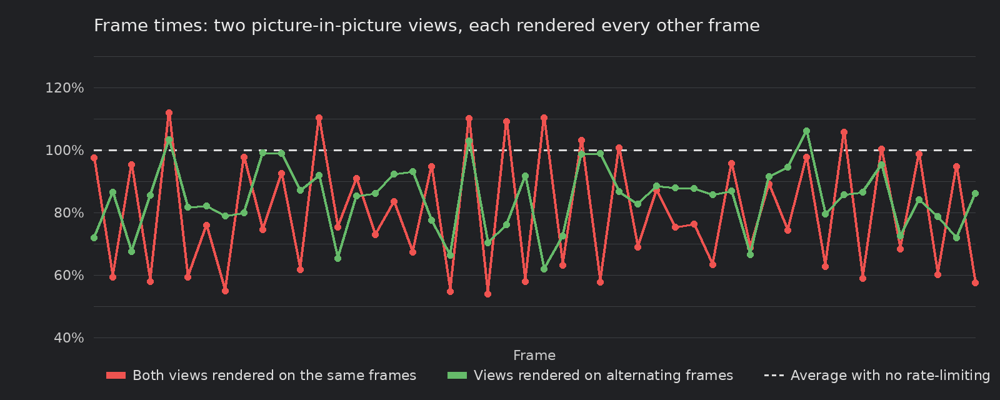

<div class="grid cards" markdown>

-   :chestnut:{ : style="margin-right:0.3em" } __In a nutshell...__

    * Individual `Renderer`s in a `RendererCompositor` can be rendered less often than every frame. :material-arrow-right: [Limiting a Layer](#limiting-a-layer)
    * Limiting saves time on average, but not on the frames where the layer renders, and it isn't free. :material-arrow-right: [What It Saves (and Costs)](#what-it-saves-and-costs)

</div>

## Limiting a Layer

By default, [compositors](compositing.md) render every one of their constituent `Renderer` layers on every call to `RenderAll()`. Some layers don't need that; a reduced framerate is not always noticable (e.g. a security camera feed, a minimap, or a debug readout can be updated a few times per second without anyone noticing), and every render that's skipped is time saved. 

Rate-limiting a layer tells the compositor to render it less often. On the frames in between, the layer's most recent output is shown again in its place, so it never disappears from the combined result.

```csharp
using var compositor = factory.RendererBuilder.CreateCompositor(window);
compositor.Add(mainRenderer, RenderCompositionType.Standard);
compositor.Add(securityCameraRenderer, RenderCompositionType.Standard); // (1)!
compositor.Add(debugHudRenderer, RenderCompositionType.RetainPreviousScenes);

compositor.SetRendererFrameRateCap(securityCameraRenderer, 10); // (2)!
compositor.SetRendererFrameRateRatio(debugHudRenderer, 4); // (3)!

while (!loop.Input.UserQuitRequested) {
	_ = loop.IterateOnce();
	compositor.RenderAll(); // (4)!
}
```

1.	A picture-in-picture view of the same scene from a second camera (see [Picture-in-Picture](compositing.md#picture-in-picture)).

2.	Renders the security camera feed at most 10 times per second.

3.	Renders the debug HUD on every fourth frame.

4.	The main view is rendered every frame. The two limited layers are rendered only when they're due, and their previous output is shown on all other frames.

## Caps & Ratios

<span class="def-icon">:material-code-block-parentheses:</span> `SetRendererFrameRateCap(renderer, maxFramesPerSecond)`

:   Renders the given renderer at most `maxFramesPerSecond` times per second, however often `RenderAll()` is called. `null` removes the cap. `GetRendererFrameRateCap(renderer)` returns the current cap (or `null` if there isn't one).

<span class="def-icon">:material-code-block-parentheses:</span> `SetRendererFrameRateRatio(renderer, ratioDenominator)`

:   Renders the given renderer once every `ratioDenominator` calls to `RenderAll()`. `1` (the default) renders it every frame. `GetRendererFrameRateRatio(renderer)` returns the current ratio.

Both methods throw an `ArgumentException` if the renderer hasn't been added to the compositor, and an `ArgumentOutOfRangeException` for a cap below `1` or a ratio below `1`.

The two work differently:

* **A cap is measured in real time.** The compositor keeps track of how much time has passed since the layer last rendered, and renders it again once enough has built up. The cap is kept *on average* (i.e. if one frame takes a little too long, the next render comes a little sooner to make up for it); and after a long pause (e.g. while loading) the layer renders once and then carries on at its normal rate, rather than rendering several times in a row to "catch up".
* **A ratio counts frames.** The layer is rendered on every *Nth* call to `RenderAll()`, regardless of how long those calls take.

So a cap holds the layer to the same number of updates per second whatever your application's framerate, whereas a ratio's update rate rises and falls along with your framerate. Use a cap when the layer has a natural update rate of its own (e.g. a security camera feed or a stats readout), and a ratio when the layer should stay in step with everything else (e.g. a minimap that should update at half the game's framerate).

A few more details:

* A cap that is equal to or higher than the rate your application calls `RenderAll()` has no effect (the layer is rendered every frame).
* When a layer has both a cap and a ratio, it's only rendered when *both* are due.
* Setting a new cap or ratio always renders the layer on the very next `RenderAll()`; counting starts again from there.
* A disabled layer (see `SetEnabledState()`) isn't rendered or shown at all, and its cap and ratio are paused until it's enabled again.
* Rate-limiting doesn't affect [GPU synchronization](compositing.md#synchronization); the compositor still synchronizes with the GPU on every `RenderAll()`.

## What It Saves (and Costs)

* **Limiting has a fixed cost.** A rate-limited layer is rendered off-screen to its own buffer (the size of the whole window or buffer, even if the layer only covers a small area), which is then drawn over the frame on *every* `RenderAll()`, whether the layer was re-rendered or not. This means for cheap scenes, sometimes rate-limiting can actually *degrade* performance. Be sure to measure/profile. Each limited layer also adds the memory cost of that extra buffer as a flat cost.
* **The saving is an average.** On the frames where a limited layer *is* rendered, the frame takes just as long as before (plus the fixed cost above). Rate-limiting therefore lowers the average frame time, but actually slightly worsens the longest frames (due to the fixed cost).

## Choosing Layers to Limit

Good candidates are layers that are **expensive** to render but **change slowly** or **don't need to be smooth**:

* Secondary views of a 3D scene (e.g. security camera feeds, rear-view mirrors, portals, previews).
* Minimaps and overview maps.
* Expensive debug and statistics readouts.

Poor candidates are:

* **Cheap layers**, such as most canvas HUDs. The fixed cost of limiting a layer can be more than the cost of simply rendering it.
* **Layers that use the same moving camera as an unlimited layer**, such as an [always-on-top](compositing.md#always-on-top) overlay of gizmos or markers. On skipped frames the limited layer shows what the camera saw when it was last rendered, so its contents will visibly lag behind and slide around relative to the layers beneath it. This may be acceptable for expensive debug/diagnostic overlays.
* **Fast-moving or animated content**, which will look choppy.

## Spreading the Cost

When several layers are limited with the same ratio, they're rendered on the same frames, so every expensive frame contains all of them at once. Rendering them on different frames instead spreads the work out more evenly:

[](composited_render_framerate_limiting_frame_times.png)
/// caption
Two picture-in-picture views, each rendered every other frame. When both are rendered on the same frames (red), frame times swing between very cheap and very expensive. Rendered on alternating frames (green), the average is the same, but the frames are much more consistent.
///

Because setting a ratio always renders the layer on the next frame and starts counting from there, you can choose which frames each layer is rendered on by setting their ratios on different frames:

```csharp
compositor.SetRendererFrameRateRatio(rearViewRenderer, 2);
compositor.RenderAll(); // (1)!
compositor.SetRendererFrameRateRatio(securityCameraRenderer, 2); // (2)!
```

1.	Renders the rear-view mirror on this frame (and every other frame after it).

2.	Starts the security camera feed on the following frame, so the two views are rendered on alternating frames.

??? info "Improved API Planned"
	An API for explicitly setting staggered rendering like the example above is planned.
