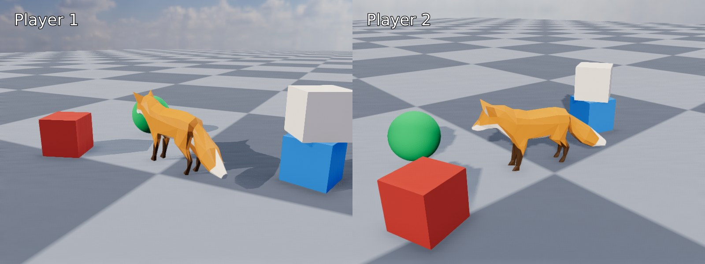
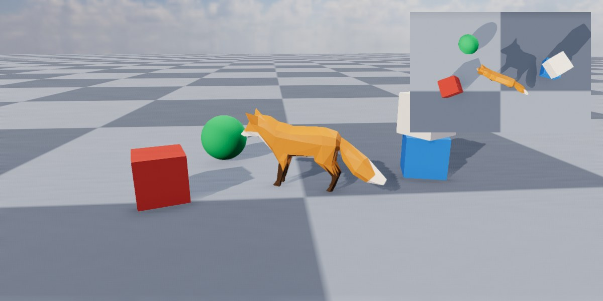
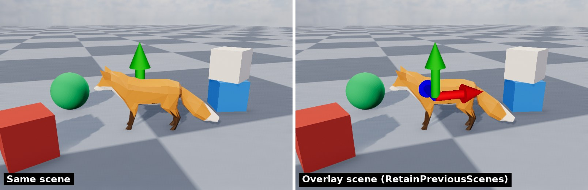

<div class="grid cards" markdown>

-   :chestnut:{ : style="margin-right:0.3em" } __In a nutshell...__

    * It's possible to *composite* (combine) multiple renderers' outputs on to a single render target (e.g. window). :material-arrow-right: [Compositors](#compositors)
    * Renderers can be confined to a *sub-area* of their target, for splitscreen and picture-in-picture views. :material-arrow-right: [Render Sub-Areas](#render-sub-areas)
    * Individual layers can be rendered at a lower frame rate than the rest. :material-arrow-right: [Rate-Limiting Layers](#rate-limiting-layers)

</div>

## Compositors

```csharp
using var sceneRenderer = factory.RendererBuilder.CreateRenderer(scene3d, sceneCamera, window); // (5)!
using var hudRenderer = factory.RendererBuilder.CreateRenderer(canvasScene, window); // (6)!

using var compositor = factory.RendererBuilder.CreateCompositor(window); // (1)!
compositor.Add(sceneRenderer, RenderCompositionType.Standard); // (2)!
compositor.Add(hudRenderer, RenderCompositionType.RetainPreviousScenes); // (3)!

while (!loop.Input.UserQuitRequested) {
	_ = loop.IterateOnce();
	compositor.RenderAll(); // (4)!
}
```

1.	Creates a compositor that renders in to `window`. Compositors can also render in to a `RenderOutputBuffer`.

2.	Adds the renderer for the 3D scene first, so it's drawn first. `Standard` means it replaces whatever was in the window before.

3.	Adds the renderer for a [canvas](canvas_scenes.md) HUD second, so it's drawn second. `RetainPreviousScenes` means it's drawn *over* the 3D scene rather than replacing it.

4.	Renders every added renderer in order, combining their output in to one frame. This replaces calling `Render()` on each renderer.

5.	Creates a standard `Renderer` for a standard (3D) scene.

6.	Creates a `Renderer` for a [CanvasScene](canvas_scenes.md).

A *compositor* (`RendererCompositor`) combines the output of several `Renderer`s in to a single image on one window or buffer. This is how you draw a HUD or user interface over a 3D scene, show two views of a scene side-by-side, or draw one scene over the top of another.

<span class="def-icon">:material-code-block-parentheses:</span> `factory.RendererBuilder.CreateCompositor(renderTarget)`

:   Creates a compositor that renders in to the given window or `RenderOutputBuffer`.

<span class="def-icon">:material-code-block-parentheses:</span> `Add(renderer, compositionType)`

:   Adds a renderer to the compositor. Renderers are drawn in the order they were added, so each renderer is drawn over the top of all the renderers added before it. The `compositionType` controls how it combines with them (see [Composition Types](#composition-types)).

	Every added renderer must render in to the same window or buffer as the compositor, and each renderer can only be added once; otherwise an `ArgumentException` is thrown.

<span class="def-icon">:material-code-block-parentheses:</span> `RenderAll()`

:   Renders every enabled renderer in order, and shows the combined result on the target window or buffer. Like a renderer's `Render()`, this queues the frame for the GPU and usually returns before it's drawn (see [Render Throughput & Latency](render_throughput_and_latency.md)).

<span class="def-icon">:material-code-block-parentheses:</span> `SetEnabledState(renderer, enabled)`

:   Disables (or re-enables) one of the added renderers. A disabled renderer isn't rendered, and isn't shown in the combined result. This is a quick way to toggle a layer such as a debug overlay or pause menu.

<span class="def-icon">:material-card-bulleted-outline:</span> `AddedRenderers`

:   Enumerates every renderer added to the compositor, in the order they were added.

A compositor depends on all of its renderers and its target, so they can't be disposed while the compositor still exists (see [Resource Dependencies](resource_dependencies.md)). `compositor.Dispose(disposeContainedRenderers: true)` disposes the compositor and all of its renderers together.

If you're using the [WPF](wpf_integration.md), [Avalonia](avalonia_integration.md), or [WinForms](winforms_integration.md) integrations, create the compositor with `CreateBindableCompositor()` instead and bind it to the control; see those pages for details.

## Composition Types

Each renderer added to a compositor has a `RenderCompositionType`:

<span class="def-icon">:material-card-bulleted-outline:</span> `RenderCompositionType.Standard`

:   The renderer's output replaces whatever was already drawn in its area of the target, as if it were the only thing being rendered. The first renderer added to a compositor is usually `Standard`.

<span class="def-icon">:material-card-bulleted-outline:</span> `RenderCompositionType.RetainPreviousScenes`

:   The renderer's output is drawn *over* whatever was already drawn, which shows through wherever this renderer doesn't draw anything.

	Everything this renderer draws appears in front of everything already drawn, regardless of how far from the camera each object is: Each scene's objects are only hidden by other objects in the *same* scene.

A scene rendered with `RetainPreviousScenes` must have no backdrop, otherwise the backdrop covers everything drawn before it. Create the scene with `BuiltInSceneBackdrop.None` (e.g. `factory.SceneBuilder.CreateScene(BuiltInSceneBackdrop.None)`), or call `scene.RemoveBackdrop()`. Canvas scenes have no background by default.

???+ info "Anti-Aliasing"
	Temporal anti-aliasing (the `Taa...` anti-aliasing modes) can't be used on a renderer that's drawn over other renderers. When a renderer is added with `RetainPreviousScenes`, any TAA mode in its quality configuration is automatically replaced with FXAA.

## Render Sub-Areas

By default a renderer draws over its entire window or buffer. A renderer can instead be confined to a rectangular *sub-area* of its target. Inside a compositor, this lets you show several views side-by-side or one inside another.

<span class="def-icon">:material-code-block-parentheses:</span> `SetRenderSubAreaFraction(anchor, fractionalOffset, fractionalDimensions)`

:   Sets the sub-area as fractions of the target's size, measured from the given `anchor` edge or corner (or the centre, with `Orientation2D.None`). For example, `SetRenderSubAreaFraction(Orientation2D.Left, (0f, 0f), (0.5f, 1f))` confines the renderer to the left half of the target.

	Because it's given in fractions, the sub-area keeps the same proportions when the window is resized.

<span class="def-icon">:material-code-block-parentheses:</span> `SetRenderSubAreaPixels(anchor, pixelOffset, pixelDimensions)`

:   Sets the sub-area as an exact offset and size in pixels. The sub-area stays the same size when the window is resized.

<span class="def-icon">:material-code-block-parentheses:</span> `GetRenderSubAreaPixelDimensions()` / `GetRenderSubAreaPixelOffset()`

:   Return the sub-area's current size and offset in pixels.

Offsets follow the same rules as [canvas placement](canvas_scenes.md#placement): Along an axis where the anchor is at an edge, a positive offset moves inwards from that edge; along an axis where the anchor is centred, a positive offset moves right or up.

A renderer with a sub-area behaves as if its sub-area were the whole target:

* The camera's aspect ratio is kept in step with the sub-area's size (unless the renderer was created with `AutoUpdateCameraAspectRatio = false`).
* A canvas scene takes the size of the sub-area, so canvas objects are placed relative to the sub-area's edges and corners.
* `CreateRayFromRenderSubAreaSurface()` and `PickModelInstanceFromRenderSubAreaSurface()` take pixel coordinates relative to the sub-area (whereas `CreateRayFromRenderSurface()` and `PickModelInstanceFromRenderSurface()` take coordinates relative to the whole target).

### Splitscreen


/// caption
Splitscreen: One scene viewed by two cameras, each rendered in to one half of the target, with a canvas HUD on each half.
///

```csharp
using var player1Renderer = factory.RendererBuilder.CreateRenderer(scene, player1Camera, window); // (1)!
using var player2Renderer = factory.RendererBuilder.CreateRenderer(scene, player2Camera, window);
player1Renderer.SetRenderSubAreaFraction(Orientation2D.Left, (0f, 0f), (0.5f, 1f)); // (2)!
player2Renderer.SetRenderSubAreaFraction(Orientation2D.Right, (0f, 0f), (0.5f, 1f));

using var player1HudRenderer = factory.RendererBuilder.CreateRenderer(player1Hud, window); // (3)!
using var player2HudRenderer = factory.RendererBuilder.CreateRenderer(player2Hud, window);
player1HudRenderer.SetRenderSubAreaFraction(Orientation2D.Left, (0f, 0f), (0.5f, 1f));
player2HudRenderer.SetRenderSubAreaFraction(Orientation2D.Right, (0f, 0f), (0.5f, 1f));

using var compositor = factory.RendererBuilder.CreateCompositor(window);
compositor.Add(player1Renderer, RenderCompositionType.Standard);
compositor.Add(player2Renderer, RenderCompositionType.Standard); // (4)!
compositor.Add(player1HudRenderer, RenderCompositionType.RetainPreviousScenes);
compositor.Add(player2HudRenderer, RenderCompositionType.RetainPreviousScenes);
```

1.	Both renderers render the same scene, each with its own camera.

2.	Confines each renderer to one half of the window. Each camera's aspect ratio is automatically set to match its half.

3.	`player1Hud` and `player2Hud` are canvas scenes. Each one is confined to the same half as its player's view, so it takes the size of that half.

4.	Both views are `Standard`, as they don't overlap.

Splitscreen views can share one scene (with a camera per player), or show entirely different scenes. For a top/bottom split, use `Orientation2D.Up`/`Orientation2D.Down` with dimensions of `(1f, 0.5f)`.

### Picture-in-Picture


/// caption
Picture-in-picture: An overhead "minimap" camera rendered in to the top-right corner, over the main view.
///

```csharp
using var mainRenderer = factory.RendererBuilder.CreateRenderer(scene, camera, window);
using var mapRenderer = factory.RendererBuilder.CreateRenderer(scene, mapCamera, window);
mapRenderer.SetRenderSubAreaPixels(Orientation2D.UpRight, (24, 24), (360, 240)); // (1)!

using var compositor = factory.RendererBuilder.CreateCompositor(window);
compositor.Add(mainRenderer, RenderCompositionType.Standard);
compositor.Add(mapRenderer, RenderCompositionType.Standard); // (2)!
```

1.	Confines the minimap to a 360x240 pixel area, 24 pixels in from the top-right corner of the window.

2.	The minimap is added second so it's drawn over the main view. It's `Standard` because it should completely replace the main view in its corner (including the main view's backdrop).

Picture-in-picture views are useful for minimaps, rear-view mirrors, security camera feeds, previews of a selected object, and so on. The inset view can show the same scene as the main view (as above) or a different one.

## Always-on-Top


/// caption
Left: Arrow primitives added to the same scene as the fox are hidden inside it. Right: The same arrows added to an overlay scene, rendered with the same camera, are drawn on top.
///

Objects in a scene are hidden by anything in front of them. To make something always visible (e.g. a selection gizmo, waypoint markers, or a highlighted object), put it in a second scene and render that scene over the first with `RetainPreviousScenes`, using the same camera:

```csharp
using var overlayScene = factory.SceneBuilder.CreateScene(BuiltInSceneBackdrop.None); // (1)!
using var overlayRenderer = factory.RendererBuilder.CreateRenderer(overlayScene, camera, window); // (2)!
using var gizmo = overlayScene.AddPrimitiveArrow(myObject.Position, Direction.Up); // (3)!

using var compositor = factory.RendererBuilder.CreateCompositor(window);
compositor.Add(sceneRenderer, RenderCompositionType.Standard);
compositor.Add(overlayRenderer, RenderCompositionType.RetainPreviousScenes); // (4)!
```

1.	The overlay scene has no backdrop, so the main scene shows through it.

2.	The overlay is rendered with the same camera as the main scene, so its objects line up with the main scene's objects.

3.	Adds an arrow to the overlay scene. Anything can be added to the overlay scene, including models and lights.

4.	The overlay is drawn after (and over) the main scene, so everything in it is visible regardless of what's in front of it in the main scene.

Objects in the overlay scene still hide each other as normal; they're only drawn over the *main* scene's objects.

## Layering Multiple Scenes

A compositor can combine any number of renderers. For example, a game might use:

1.	A **background** scene (e.g. distant scenery, with a backdrop), rendered with `Standard` using its own camera.
2.	The **world** scene, with no backdrop, rendered with `RetainPreviousScenes`.
3.	An **overlay** scene for markers and gizmos, rendered with `RetainPreviousScenes` with the same camera as the world.
4.	A **HUD** [canvas scene](canvas_scenes.md), rendered with `RetainPreviousScenes`.
5.	An [ImGui](imgui_integration.md) debug interface, rendered with `RetainPreviousScenes`.

Each layer is drawn over all the layers added before it. When deciding the order, add renderers from the back (furthest from the viewer) to the front.

Every layer is a full render, so each one adds to the time a frame takes. Layers that don't need updating every frame can be rate-limited:

## Rate-Limiting Layers

<span class="def-icon">:material-code-block-parentheses:</span> `SetRendererFrameRateCap(renderer, maxFramesPerSecond)`

:   Renders the given renderer at most `maxFramesPerSecond` times per second, no matter how often `RenderAll()` is called. `null` removes the cap.

<span class="def-icon">:material-code-block-parentheses:</span> `SetRendererFrameRateRatio(renderer, ratioDenominator)`

:   Renders the given renderer only once every `ratioDenominator` calls to `RenderAll()`. For example, `4` renders it every fourth frame. `1` (the default) renders it every frame.

When a rate-limited renderer is skipped, the last frame it rendered is shown again in its place, so it never disappears from the combined result. A cap and a ratio can both be set at once, in which case both apply.

```csharp
compositor.SetRendererFrameRateCap(debugHudRenderer, 10); // (1)!
compositor.SetRendererFrameRateRatio(mapRenderer, 2); // (2)!
```

1.	Redraws a debug readout ten times per second; plenty for numbers that are only read by a person.

2.	Redraws a minimap every other frame.

The matching `GetRendererFrameRateCap()` and `GetRendererFrameRateRatio()` methods return the current settings.

## Synchronization

Like a renderer's `Render()`, a compositor's `RenderAll()` waits when too many frames are already queued on the GPU (see [GPU Synchronization](render_throughput_and_latency.md#gpu-synchronization)). The compositor uses the lowest `GpuSynchronizationFrameBufferCount` of 0 or more among its enabled renderers. So to use a particular value, set it on your main renderer (or on every renderer, to be sure). Rate-limiting doesn't affect this: The compositor still synchronizes on every `RenderAll()`, even when the renderer it chose is skipped.

<span class="def-icon">:material-code-block-parentheses:</span> `WaitForGpu()` / `RenderAllAndWaitForGpu()`

:   The compositor equivalents of a renderer's `WaitForGpu()` and `RenderAndWaitForGpu()` (see [Waiting for the GPU](render_throughput_and_latency.md#waiting-for-the-gpu)).

???+ tip "Multiple Windows"
	Compositors combine renderers that share one window or buffer. To render to several windows, create a renderer (or compositor) for each window and render each one every frame. In that case, set `GpuSynchronizationFrameBufferCount` to `-1` on all but one of them, as described in [GPU Synchronization](render_throughput_and_latency.md#gpu-synchronization).
