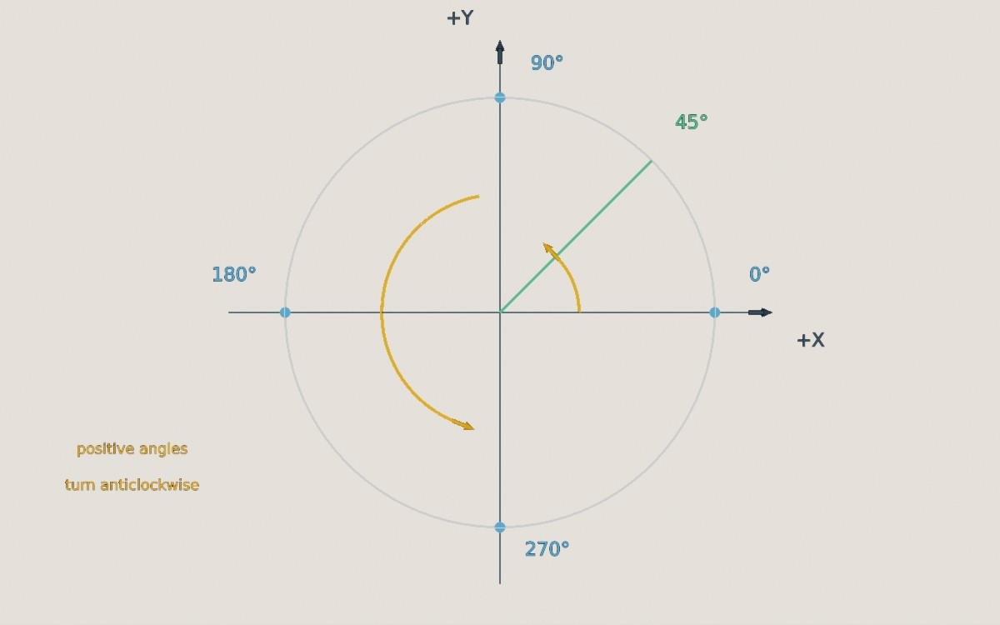

This page lists the conventions TinyFFR follows throughout its API.

## 3D Axes & Units

/// caption
TinyFFR's 3D axes. See [Vector Types](vector_types.md) for more on locations, directions, and vects.
///

* The world (and every model's own local space) uses a *right-handed* coordinate system:
	* `+X` points **left**;
	* `+Y` points **up**;
	* `+Z` points **forward**.
* Distances are in **metres**. This is only a convention (nothing stops you treating 1 unit as something else), but TinyFFR's lighting is calibrated assuming it: Lights fade with distance in metres, and the built-in brightness presets assume real-world-sized scenes.
* Durations are in **seconds**: Typically a `float` (e.g. "`deltaTime`").
* `Direction.FromDualOrthogonalization(a, b)` (and `Vector3.Cross`) follow the right-hand rule: Point your index finger along `a` and your middle finger along `b`, and your thumb points along the result (e.g. `Left` and `Up` give `Forward`).

## Angles & Rotations

* Angles are in **degrees** (an `Angle` can be created from radians with `Angle.FromRadians()`, and read back in radians with `angle.Radians`). See [Angle](angle_rotation_orientation.md#angle).
* A 3D `Rotation` is an angle around an axis. Positive angles turn **anticlockwise** when the axis points towards you (or equivalently, clockwise when looking along the axis). For example, 90° around `Up` turns `Forward` in to `Left`. See [Rotation](angle_rotation_orientation.md#rotation).
* 2D rotations (e.g. in a `Transform2D`, or a canvas object's `Rotation`) also turn **anticlockwise** for positive angles.
* 2D angles that describe a direction (e.g. `XYPair<T>.PolarAngle`, `Angle.From2DPolarAngle()`) are *polar*: 0° points right, 90° up, 180° left, and 270° down.

/// caption
2D polar angles: 0° points along `+X` (right), and angles increase anticlockwise.
///

## 2D Coordinates

Different 2D coordinate systems are used in different places:

* **2D math** (e.g. [`XYPair<T>`](2d_types.md#xypair) as a vector, `Transform2D`, and `DimensionConverter`) follows the usual mathematical convention: `+X` is right and `+Y` is up.
* **Pixel coordinates** on windows and displays, including the mouse cursor's position (`MouseCursorPosition`) and its movement (`MouseCursorDelta`), start from the **top-left** corner, so `+X` is right and `+Y` is **down**. The renderer's [ray casting, pixel-picking, and projecting](ray_casting_pixel_picking_projecting.md#coordinate-spaces) methods use the same top-left origin by default (and let you choose a different corner).
* **Canvas objects** are positioned relative to a chosen corner or edge of the canvas (see [Placement](canvas_scenes.md#placement)).
* **Normalized near-plane coordinates** (used by `Camera` methods such as `CreateRayFromNearPlane()`) have `(0, 0)` at the centre of the camera's image, `(-1, -1)` at the bottom-left, and `(1, 1)` at the top-right.

## Textures

* Texture coordinates (*UVs*) start at the **bottom-left** corner of the texture: `(0, 0)` is the bottom-left and `(1, 1)` the top-right.
* Texel data is laid out row by row, starting from the **bottom** row (see [Creating Textures From Texel Data](creating_textures.md#creating-textures-from-texel-data)). The same applies to frames read back from a [render output buffer](capturing_render_output.md), unless you ask for them top-to-bottom.
* Colours in textures are **sRGB**, whereas colours given directly to lights, backdrops, and fog are **linear** (see [Colour Spaces](colour.md#colour-spaces)).
* [Normal maps](texture_map_types.md#normal-maps) are expected in **OpenGL** format (pass `isDirectXFormat: true` when loading DirectX-format maps):
	* `+X` (red) points along the mesh's tangent direction;
	* `+Y` (green) points along the mesh's bitangent direction;
	* `+Z` (blue) points out of the surface. TinyFFR ignores the blue channel and reconstructs `Z` from the red and green channels.
* In [ORM maps](texture_map_types.md#ormr-maps), the occlusion channel's maximum value means **no** occlusion (fully lit by ambient light), and its minimum value means fully occluded.

## Meshes

* Front-facing triangles and polygons have their vertices in **anticlockwise** order (as seen from the front). Back faces aren't drawn, so a triangle wound the wrong way is invisible from the side you expect to see. [Polygons](creating_meshes.md#polygon-struct) can be marked as clockwise with `IsWoundClockwise` if necessary.

## Matrices

TinyFFR follows `System.Numerics`' matrix conventions:

* Matrices are **row-major** and transform **row vectors** (i.e. a location is transformed with `Vector3.Transform(location, matrix)`, and matrices combine left-to-right in the order they're applied).
* A `Transform`'s matrix is its scaling, then rotation, then translation: `Matrix4x4.CreateScale(scaling) * Matrix4x4.CreateFromQuaternion(rotation) * Matrix4x4.CreateTranslation(translation)`.
* A camera's own local axes have `+X` pointing to the camera's right, `+Y` along its up direction, and `+Z` *backwards* (the camera looks along its local `-Z`). `CameraUtils.CalculateModelMatrix()`, `CalculateViewMatrix()`, `CalculatePerspectiveProjectionMatrix()`, and `CalculateOrthographicProjectionMatrix()` calculate the same matrices TinyFFR uses for its cameras; `camera.GetModelMatrix()` and `camera.GetProjectionMatrix()` return a camera's current ones.

## API Naming

TinyFFR's math API follows a few naming patterns, which can help you guess what a method does:

* Types are **immutable**: Methods return a new value rather than changing the one they're called on. Methods that return a modified copy are named in the past tense, e.g. `RotatedBy()`, `ScaledBy()`, `ProjectedOnTo()`, `ReflectedBy()`.
* `ToXyz()` methods *convert* a value to something else (possibly losing information, e.g. `ray.ToLine()`), whereas `AsXyz()` methods *reinterpret* the same data as something else (e.g. `direction.AsVect()`).
* `Equals()` and `==` compare values exactly (or within a `tolerance`, for `Equals()`), whereas `IsEquivalent...To()` methods check whether two values mean the same thing even if they're stored differently (e.g. `rotation.IsEquivalentForAllDirectionsTo()`).
* When an input might not have a meaningful answer (e.g. the intersection of two lines that never meet), the method returns `null` rather than throwing an exception. Many such methods have a `Fast...()` version (e.g. `FastIntersectionWith()`) that skips the check for extra speed, and gives an undefined result if there's no answer.
* Static factory methods are named after how they create the value, e.g. `Rotation.FromStartAndEndDirection()` and `ColorVect.FromRgb24()`.
* TinyFFR uses US English spellings in its API (e.g. `Color`, `Normalized`), and avoids the word "entity", so as not to clash with your own entity-component system.
