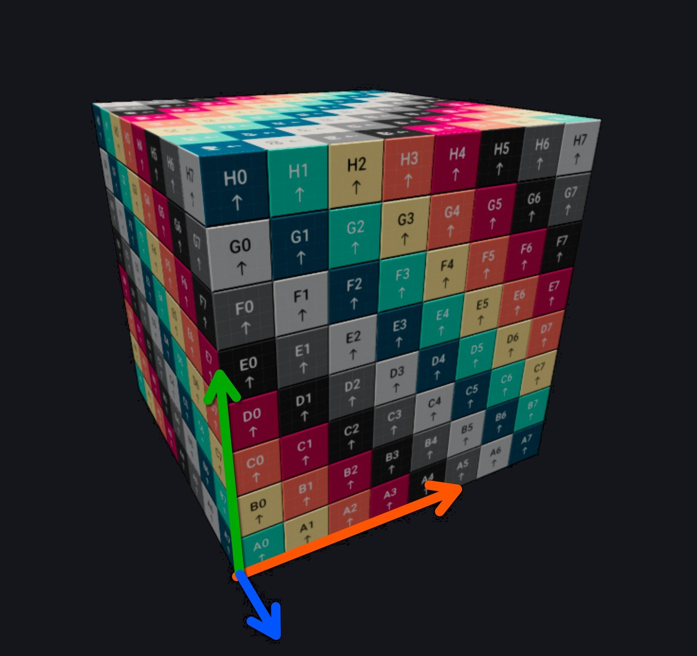

<div class="grid cards" markdown>

-   :chestnut:{ : style="margin-right:0.3em" } __In a nutshell...__

    * You can create meshes from rudimentary shapes. :material-arrow-right: [Shape-Based Generation](#shape-based-generation)
    * You can also create meshes from arbitrary polygon definitions. :material-arrow-right: [Polygon-Based Generation](#polygon-based-generation)
    * You can also create meshes from raw vertex lists. :material-arrow-right: [Vertex-Based Generation](#vertex-based-generation)

</div>

## Mesh Generation

```csharp
using var cubeMesh = factory.MeshBuilder.CreateCuboid(Cuboid.UnitCube);
using var sphereMesh = factory.MeshBuilder.CreateSphere(Sphere.OneMeterCubedVolumeSphere);
using var arrowMesh = factory.MeshBuilder.CreateArrow(0.65f, 0.2f, 0.35f, 0.45f);

using var polygons = factory.MeshBuilder.AllocateNewPolygonGroup();
AssemblePolygons(polygons);
using var polyMesh = factory.MeshBuilder.CreateFromPolygonGroup(polygons);

var vertices = AssembleVertices(out var triangles);
using var vertMesh = factory.MeshBuilder.CreateFromVertices(vertices, triangles);
```

It's possible to create meshes programmatically using the `factory.MeshBuilder`. The mesh builder supports building meshes from basic shape definitions, lists of polygons, or raw vertices.

Every `Create[...]()` method has an overload that takes a `MeshCreationConfig` ([`MeshCreationConfig` is explained on the previous page](loading_meshes.md#customizing-the-load-operation)). Most methods also have an overload that takes a `MeshGenerationConfig`:

### MeshGenerationConfig

<span class="def-icon">:material-card-bulleted-outline:</span> `TextureTransform`

:   A `Transform2D` specifying how to modify the `UV`s (i.e. `TextureCoords`) globally across the mesh.

	The `Translation` of the transform is added to every `TextureCoords` value. For example, for a given vertex if a `TextureCoords` pair would have been `(0.3f, 0.6f)` and the `Translation` property is `(-0.2f, 0.1f)`, the resultant value will be `(0.1f, 0.7f)`.

	The `Rotation` of the transform rotates every `TextureCoords` value around the 2D origin (`(0, 0)`) anti-clockwise. For example, for a given vertex if a `TextureCoords` pair would have been `(0.3f, 0.6f)` and the `Rotation` property is `90°`, the resultant value will be `(-0.6f, 0.3f)`.

	The `Scaling` of the transform has its reciprocal(1) multiplied with every `TextureCoords` value. For example, for a given vertex if a `TextureCoords` pair would have been `(0.3f, 0.6f)` and the `Scaling` property is `(2f, 0.1f)`, the resultant value will be `(0.15f, 6f)`.
	{ .annotate }

	1. 	The __reciprocal__ is applied as this is usually what a user *actually* wants when thinking about scaling UV coords.

		For example, scaling a surface dimension by `2f` *feels* like it should blow the texture up (i.e. "zoom in") to 200% along that axis. To achieve that, we actually have to *halve* the coords along that axis, hence why we apply the reciprocal.

		If you don't want this behaviour, specify the reciprocal of your scaling factor in the transform; easily done with the `XYPair<float>.Reciprocal` property.

## Shape-Based Generation

### Cuboid

Perhaps the easiest way to create a mesh programmatically is to use a `Cuboid` to define the overall mesh shape:

```csharp
_ = meshBuilder.CreateCuboid( // (1)!
	new Cuboid(1f, 2f, 3f)
);

_ = meshBuilder.CreateCuboid( // (2)!
	new Cuboid(1f, 2f, 3f),
	new Transform2D((0.1f, 0.2f), 90f, (0.5f, 0.75f)),
	centreTextureOrigin: true
);

_ = meshBuilder.CreateCuboid( // (3)!
	new Cuboid(1f, 2f, 3f),
	centreTextureOrigin: false,
	new MeshGenerationConfig { TextureTransform = Transform2D.None },
	new MeshCreationConfig { OriginTranslation = new Vect(0.5f) }
);
```

1. 	This simple invocation creates a new `Mesh` in the shape of a 1m x 2m x 3m cuboid.

	All of the vertices in the resultant mesh will have their texture coords and tangent rotations set to sensible values.

2. 	This invocation creates a 1m x 2m x 3m cuboid but also specifies a texture transform.

	The texture transform defines how the UV-coordinates should be transformed on the surface of the mesh (see above). In this example we:

	* Specify a *translation* (movement) of `0.1f` for surface textures in the X/U direction and `0.2f` in the Y/V direction;
	* Specify a *rotation* of `90°`, meaning surface textures will be rotated by 90° anti-clockwise;
	* Specify a *scaling* of all surface textures by `0.5f` (50%) in the X/U direction and `0.75f` in the Y/V direction.

	We also specify `centreTextureOrigin` as `true`. When `true`, all textures will have their `(0, 0)` origin point (e.g. their bottom-left corner) be placed on the centre of each cuboid face. When `false`, all textures will have bottom-left corner placed on the bottom-left vertex of each cuboid face. By default this value is `false`.

3. 	This invocation creates a 1m x 2m x 3m cuboid but specifies the `MeshGenerationConfig` and `MeshCreationConfig` objects directly.

	See above for more information on these objects.

A `Cuboid` is defined by its width, height, and depth (along the X, Y, and Z axes respectively). `Cuboid.UnitCube` is provided as a convenience, and `Cuboid.FromHalfDimensions()` lets you specify half-extents instead. All three dimensions must be positive, otherwise an exception will be thrown.

The resultant mesh is centred on its origin, i.e. a 1m x 2m x 3m cuboid extends 0.5m, 1m, and 1.5m in each direction along the X, Y, and Z axes respectively.

??? info "Cuboid Texture Mapping"
	The texture coordinates on a cuboid mesh are laid out as follows:

	* Each of the six faces is textured individually; the texture coordinates on one face have no relation to those on its neighbours.
	* Texture coordinates are measured in metres across each face; so without any texture transform, a texture repeats once every metre. For example, the 3m-long sides of a 1m x 2m x 3m cuboid will show the texture three times along their length.
	* On the four side faces, the V (vertical) axis always points `Up`, so textures appear upright all the way around the cuboid. On the top face V points `Forward`, and on the bottom face it points `Backward`.

	You can use the texture transform to adjust this; e.g. a scaling of `(3f, 2f)` stretches the texture so that it covers a 3m x 2m face exactly once.
	
### Sphere

```csharp
_ = meshBuilder.CreateSphere( // (1)!
	new Sphere(0.5f)
);

_ = meshBuilder.CreateSphere( // (2)!
	Sphere.FromDiameter(2f),
	textureTransform: new Transform2D((0f, 0f), 0f, (1f, 2f)),
	subdivisionLevel: 6
);

_ = meshBuilder.CreateSphere( // (3)!
	Sphere.OneMeterCubedVolumeSphere,
	subdivisionLevel: 3,
	new MeshGenerationConfig { TextureTransform = Transform2D.None },
	new MeshCreationConfig { LinearRescalingFactor = 2f }
);
```

1.	This simple invocation creates a sphere mesh with a radius of 0.5m.

	All of the vertices in the resultant mesh will have their texture coords and tangent rotations set to sensible values.

2.	This invocation creates a sphere with a diameter of 2m (i.e. a radius of 1m), specifies a texture transform, and increases the subdivision level to `6` (see below).

	`Sphere` also offers `FromVolume()`, `FromSurfaceArea()`, and `FromCircumference()` factory methods.

3.	This invocation creates a sphere with a volume of 1m³ at subdivision level `3`, and specifies the `MeshGenerationConfig` and `MeshCreationConfig` objects directly.

The sphere mesh is built by starting with a twenty-sided solid (an icosahedron) and repeatedly subdividing each of its triangles, pushing the new vertices out to the sphere's surface each time. The `subdivisionLevel` parameter controls how many times this is done:

* Each additional level roughly quadruples the number of triangles in the mesh; making it look rounder but costing more to render.
* The default level of `4` looks round at ordinary viewing distances. Higher levels are rarely worth their cost unless the sphere will be very large on-screen.
* The maximum level is `7`: specifying a higher level will simply create a level-`7` sphere. Negative levels will throw an exception.
* The first time a given subdivision level is requested, it takes a little longer to create as the base geometry must be calculated; subsequent spheres at the same level re-use that geometry.

The sphere's radius must be positive, or an exception will be thrown.

??? info "Sphere Texture Mapping"
	The texture coordinates on a sphere mesh are laid out as follows:

	* The V (vertical) coordinate runs from `0` at the very bottom of the sphere to `1` at the very top.
	* The U (horizontal) coordinate wraps around the sphere's circumference __three times__. This keeps the proportions of a texture roughly intact (a sphere's circumference is π times its height) without creating a visible seam.

	You can use the texture transform to adjust this; e.g. a scaling of `(3f, 1f)` stretches the texture so that it wraps around the sphere only once.

### Arrow

```csharp
_ = meshBuilder.CreateArrow( // (1)!
	stemLength: 0.65f, 
	stemRadius: 0.2f, 
	headLength: 0.35f, 
	headRadius: 0.45f
);

_ = meshBuilder.CreateArrow( // (2)!
	stemLength: 0.65f, 
	stemRadius: 0.2f, 
	headLength: 0.35f, 
	headRadius: 0.45f,
	origin: ArrowMeshOrigin.Centre,
	segmentCount: 8
);

_ = meshBuilder.CreateArrow( // (3)!
	0.65f, 0.2f, 0.35f, 0.45f,
	ArrowMeshOrigin.HeadTip,
	IMeshBuilder.DefaultArrowSegmentCount,
	new MeshGenerationConfig { TextureTransform = Transform2D.None },
	new MeshCreationConfig { LinearRescalingFactor = 0.5f }
);
```

1.	This invocation creates an arrow whose stem is 0.65m long with a 0.2m radius, topped with a cone-shaped head that is 0.35m long with a 0.45m radius at its base; making an arrow that is 1m long in total.

2.	This invocation creates the same arrow, but places the mesh's origin halfway between the tail and the tip (see below), and reduces the `segmentCount` to `8` for a more faceted, lower-polygon look.

3.	This invocation places the mesh's origin at the tip of the head, and specifies the `MeshGenerationConfig` and `MeshCreationConfig` objects directly.

An arrow mesh is a round stem capped at its tail, topped with a cone-shaped head. The arrow always points along `Direction.Forward` (you can of course rotate any `ModelInstance` using the mesh however you like).

* All lengths and radii must be positive, and the `headRadius` must be at least as large as the `stemRadius`; otherwise an exception will be thrown.
* The `origin` parameter (an `ArrowMeshOrigin`) specifies which point along the arrow becomes the mesh's origin: `Tail` (the centre of the flat end of the stem; this is the default), `HeadTip` (the pointed tip of the head), or `Centre` (halfway between the tail and the tip). Any `OriginTranslation` specified in the `MeshCreationConfig` is applied on top of this.
* The `segmentCount` parameter specifies how many segments the arrow is divided in to around its tail-to-head axis, and therefore how round it looks. The default is `32`, and the minimum is `3`.

??? info "Arrow Texture Mapping"
	The texture coordinates on an arrow mesh are laid out as follows:

	* The U (horizontal) coordinate wraps once around the arrow's circumference.
	* The V (vertical) coordinate runs from `0` at the tail to `1` at the tip of the head, in proportion to the distance along the arrow.

	This makes arrow meshes well-suited to textures that vary from tail to head, such as gradients. Note that the flat end of the stem and the flat back of the head each sample only a single row of the texture.

## Polygon-Based Generation

It is possible to create a mesh using one or more `Polygon`s.

??? warning "Triangulation"
	When creating a `Mesh` using one or more `Polygon`s, the mesh builder will *triangulate* your polygons for you automatically (triangulation is the process of breaking down the polygon in to `VertexTriangle`s).

	Note however that if you specify your vertices in the wrong winding order, or supply degenerate polygons (i.e. polygons with holes, crossing edges, non-coplanar vertices, or fewer than 3 vertices) the call to `CreateFrom[...]()` will throw an exception.

### Polygon Struct

The `Polygon` struct has the following properties/arguments: 

__Vertices__ :material-arrow-right: A `ReadOnlySpan<Location>` which defines the polygon's points in 3D space.

* All vertices must be coplanar (defined on the same plane through space).
* The vertices are expected to form a complete enclosed polygon. They define the polygon's edges implicitly by their ordering: Each vertex is assumed to form an edge with the next one in the span, and the final vertex is assumed to connect back to the first.
* The polygon is expected to be "simple"; i.e. it does not need to be convex but it is expected that there are no holes and no edges intersect.

__Normal__ :material-arrow-right: The `Direction` facing "out" or "away from" the front-face of the polygon.

* For example, if the polygon is meant to be viewed by a camera looking forward, the normal should be `Direction.Backward`.
* The normal should be orthogonal to the plane the vertices are defined on.

__IsWoundClockwise__ :material-arrow-right: A `bool` indicating whether or not the vertices are specified in a clockwise winding order.

* This order is as-seen when looking at the polygon in the direction opposite to its normal; i.e. when looking directly at its front face.
* By default this is `false`. You should specify anti-clockwise polygons when possible as this is the default TinyFFR works with.

It is possible to construct a `Polygon` without specifying its `Normal`. The constructor will then use the static method `Polygon.CalculateNormalForAnticlockwiseCoplanarVertices()` to 'detect' the normal. In some cases using this method may be unavoidable (e.g. if generating polygons dynamically) but this method does have a non-negligible performance cost.

`CalculateNormalForAnticlockwiseCoplanarVertices()` assumes:

* There are at least three vertices;
* The vertices are coplanar;
* The vertices are specified in an anti-clockwise winding order.

If there are fewer than three vertices, an exception will be thrown. However, the other two assumptions are *not* validated: if your vertices are not coplanar or are wound clockwise, the method will silently return its best guess, which may be incorrect (e.g. pointing in the opposite direction to what you intended). If your vertices do not meet these criteria you must specify the `Normal` yourself.

### Using a Single Polygon

It's possible to specify a "mesh" using a single polygon. The following example creates a flat hexagon:

```csharp
using var pointsLease = factory.ResourceAllocator.BorrowSpan<Location>(6);
var points = pointsLease.Span; // (1)!
points[0] = new Location(-0.5f, 0f, 0f); // (2)!
points[1] = new Location(-0.25f, 0.433f, 0f);
points[2] = new Location(0.25f, 0.433f, 0f);
points[3] = new Location(0.5f, 0f, 0f);
points[4] = new Location(0.25f, -0.433f, 0f);
points[5] = new Location(-0.25f, -0.433f, 0f);
var polygon = new Polygon(points, normal: Direction.Backward); // (3)!
using var mesh = meshBuilder.CreateFromPolygon( // (4)!
	polygon,
	textureUDirection: Direction.Right,
	textureVDirection: Direction.Up,
	textureOrigin: Location.Origin
);
factory.ResourceAllocator.ReturnPooledMemoryBuffer(pointsMemory); // (5)!
```

1.	We want to create a mesh that is six vertices defining a hexagon, so firstly we rent a 6-length `Location` span using the factory's [Resource Allocator](resources.md#pooled-memory-buffers).

2.	Next we define six points in a regular hexagon formation (with a radius of 0.5m) centred on the origin. We want the hexagon to face a camera that is looking in the forward direction (i.e. its front face should point *backward*, towards that camera), so we define all the points in the XY plane (Z remains constant).

	Note that their ordering is important: We specify them in an anti-clockwise order as seen from the front face. Remember that in TinyFFR's [coordinate system](conventions.md), when looking forward, `+X` is to the left; so the first point (`X = -0.5f`) is on the right-hand side of the hexagon from the viewer's perspective, and each subsequent point moves anti-clockwise around it.

3.	Here we create our `Polygon` struct, passing in the `points` span as our vertices and `Direction.Backward` as the normal.

4.	Here we pass the `polygon` to `CreateFromPolygon()`, which returns us a triangulated `Mesh` resource that has all its vertices' `TextureCoords`, `Location`, and `TangentRotation` properties set correctly.

	We also specify how textures should be laid out on the polygon: Positive U points to the right, positive V points up, and the texture origin sits at the centre of the hexagon. These arguments are optional and are explained below.

5.	Finally we return the rented `pointsMemory` back to the factory.

The mesh builder picks sensible defaults for you regarding each vertex's `TextureCoords`. However, if you want more control of how textures/materials are laid out on your polygon surface, you can supply additional arguments to `CreateFromPolygon()`:

```csharp
using var mesh = meshBuilder.CreateFromPolygon(
	polygon,
	textureUDirection: Direction.Up, // (1)!
	textureVDirection: Direction.Left, // (2)!
	textureOrigin: points[0], // (3)!
	new MeshGenerationConfig { /* generation options here, e.g. texture transform */ },
	new MeshCreationConfig { /* creation options here */ }
);
```

1.	This sets the direction of the positive U axis across the plane of the polygon.

	Ideally this value should be orthogonal to the normal (i.e. the direction should be parallel to the polygon plane).

2.	This sets the direction of the positive V axis across the plane of the polygon.

	Ideally this value should be orthogonal to the normal (i.e. the direction should be parallel to the polygon plane).

3.	This sets where on the mesh the texture origin (i.e. the bottom-left corner of any applied texture) should sit.

### Using Multiple Polygons

Of course for most meshes you'll want to specify multiple polygons. For this purpose, the mesh builder provides a specialized collection; `IMeshPolygonGroup`. You simply add `Polygon`s to the group and then pass the group to a `CreateFromPolygonGroup()` overload when ready. 

??? warning "IMeshPolygonGroup Memory"
	It is safe / valid to dispose of any memory in use by `Polygon`s after they're added to the group (the group makes a copy of their data). 
	
	This does mean however the memory footprint of a group can get quite large with complex meshes consisting of many vertices.

	In order to eliminate GC pressure, the memory internal to a polygon group is pooled; however this means the group must be disposed when no longer needed. Neglecting to dispose the group will cause your application to leak memory.

	It is safe to dispose the group after it has been passed to `CreateFromPolygonGroup()` and you no longer need the data it contains. You should not pass a disposed group to `CreateFromPolygonGroup()`.

	If you want to build several meshes one after another, you can re-use a single group rather than allocating a new one each time: call `Clear()` on the group to remove all its polygons, then add the next mesh's polygons to it.

	Note that after disposal the buffers used by the group may be re-used by another group. Holding on to the reference of a group or continuing to use it in any way after it is disposed is not permitted.

The following example shows how to make a square-based pyramid (one square base and four triangular sides):

```csharp
var polyGroup = meshBuilder.AllocateNewPolygonGroup(); // (1)!

using var pointsLease = factory.ResourceAllocator.BorrowSpan<Location>(6);
var points = pointsLease.Span;

var baseA = new Location(0.5f, 0f, 0.5f);
var baseB = new Location(-0.5f, 0f, 0.5f);
var baseC = new Location(-0.5f, 0f, -0.5f);
var baseD = new Location(0.5f, 0f, -0.5f);
var apex = new Location(0f, 1f, 0f);

points[0] = baseA;
points[1] = baseB;
points[2] = baseC;
points[3] = baseD;
polyGroup.Add( // (2)!
	new Polygon(points, normal: Direction.Down),
	textureUDirection: Direction.Left, 
	textureVDirection: Direction.Forward, 
	textureOrigin: baseC
);

points[0] = baseC; points[1] = apex; points[2] = baseD;
polyGroup.Add(new Polygon(points[..3])); // (3)!
points[0] = baseD; points[1] = apex; points[2] = baseA;
polyGroup.Add(new Polygon(points[..3]));
points[0] = baseA; points[1] = apex; points[2] = baseB;
polyGroup.Add(new Polygon(points[..3]));
points[0] = baseB; points[1] = apex; points[2] = baseC;
polyGroup.Add(new Polygon(points[..3]));

using var mesh = meshBuilder.CreateFromPolygonGroup( // (4)!
	polyGroup,
	new MeshGenerationConfig { /* specify generation options here */ },
	new MeshCreationConfig { /* specify creation options here */ }
);

polyGroup.Dispose();  // (5)!
factory.ResourceAllocator.ReturnPooledMemoryBuffer(pointsMemory);
```

1.	Here we allocate a new polygon group using the mesh builder.

	We must remember to dispose the group after creating the mesh.

2.	Here, we add the square base of the pyramid to the polygon group. Its front face points `Down` (out of the bottom of the pyramid), so its four points are specified in anti-clockwise order as seen from below.

	The `Add()` method also allows us to specify the texture U/V directions and the texture origin. You may recall these are the same as the optional parameters for defining a single polygon; these arguments set the directions of positive U and positive V for the texture map, and where on the polygon the texture origin should be. In this case we specify them so that a texture's bottom-left corner sits on one corner of the base.
	
	Once the polygon is added we can re-use its memory (the polygon group takes a copy).

3.	Here we add the four triangular sides of the pyramid, re-using the same `points` buffer for each one. Each side's points are specified anti-clockwise as seen from *outside* the pyramid.

	For the sides we use the `Polygon` constructor that calculates the normal for us (as described above), because each side's normal is a diagonal direction that would otherwise be tedious to calculate by hand. We also don't specify any texture directions or origin; the group picks sensible defaults for us.

4.	Here we pass the polygon group to `CreateFromPolygonGroup()`, which will triangulate the whole group and give us back a new `Mesh` resource.

5.	Finally we must remember to dispose the polygon group as well as returning any rented memory buffers.

## Vertex-Based Generation

It's also possible to generate meshes directly from lists of vertices.

### MeshVertex & VertexTriangle

In TinyFFR, every mesh is comprised of a list of `MeshVertex` values and a list of `VertexTriangle` values together.

The `MeshVertex` list simply specifies every vertex in the mesh. It does not make any connection between them.

The `VertexTriangle` list details how to connect those vertices in to triangular polygons.

#### MeshVertex

Each `MeshVertex` has the following properties:

* __Location__ :material-arrow-right: This is the position of the vertex relative to all others and relative the implied mesh centre-point at `(0, 0, 0)`.
* __TextureCoords__ :material-arrow-right: This is the [UV map co-ordinates](https://en.wikipedia.org/wiki/UV_mapping) for the surface at this point, i.e. it specifies where on any texture applied to the surface of the mesh this vertex maps to. A value of `(0f, 0f)` indicates that this vertex maps to the bottom-left corner of a given texture; a value of `(1f, 1f)` maps to the top-right corner, etc. Does not need to be in the range `(0f, 0f)` to `(1f, 1f)`; texture wrapping is applied automatically.
* __TangentRotation__ :material-arrow-right: In a nutshell, this quaternion is used in tangent-space to rotate the positive-U axis to the tangent vector; from which the bitangent and normals are calculated.

The __TangentRotation__ is a `Quaternion` and is not intuitive to understand; so a static method on `MeshVertex` is provided to help create it(1):
{ .annotate }

1. Additionally, an overloaded constructor for `MeshVertex` can take the three arguments to this static method and invoke it for you at construction time.

<span class="def-icon">:material-code-block-parentheses:</span> `CalculateTangentRotation(Direction tangent, Direction bitangent, Direction normal)`

:   Pass the `tangent`, `bitangent`, and `normal` for your vertex to this method and it will generate the correct `TangentRotation` for you.

	* The __tangent__ is the direction that points along the *positive-U axis*; that is the direction where the texture co-ordinates `U` value increases.
	* The __bitangent__ is the direction that points along the *positive-V axis*; that is the direction where the texture co-ordinates `V` value increases.
	* The __normal__ is the direction facing exactly perpendicularly away from the surface being described at this vertex, away from the front face of the surface.

	A diagram of these three values is shown for the highlighted vertex below:

{ : style="width:300px;" }
/// caption
In this crude diagram, imagine we are looking directly at the front face of a cube.

For the highlighted vertex at the bottom left, we show the three directions required for calculating the tangent-frame rotation:

* The __tangent__ (orange arrow) points along the positive-U axis (this is the direction pointing from left-to-right along any textures mapped to this surface).

* The __bitangent__ (green arrow) points along the positive-V axis (this is the direction pointing from bottom-to-top along any textures mapped to this surface).

* The __normal__ (blue arrow) points out of the screen, towards you (this is the direction pointing directly "out", away from the front-face of the surface).
///

#### VertexTriangle

With an ordered list (or span) of `MeshVertex` instances, you can specify the way those vertices combine to form triangles using their indices in that list.

Accordingly, a `VertexTriangle` has only three properties: __IndexA__, __IndexB__, __IndexC__. Each index is an integer that indexes in to a `MeshVertex` list/span; together forming one triangle.

The order the vertices are specified in within the triangle is important and define the triangle's *winding order*. When looking at the visible (front) face of the triangle, the vertices should be specified in an anti-clockwise order (it doesn't matter which one comes first, just the respective order). This is a [convention](conventions.md) in TinyFFR. If your vertices are specified with a *clockwise* winding order, the triangle will not be rendered except when looking from the inside out or behind the mesh.

### Using MeshVertex Spans

Finally, it's possible to create a mesh directly using a `Span<MeshVertex>` and `Span<VertexTriangle>` if you want absolute control of vertex data and triangulation methods.

The following example recreates the single-polygon example from above with "raw" vertices/triangles:

```csharp
using var vertexLease = factory.ResourceAllocator.BorrowSpan<MeshVertex>(6);
using var triangleLease = factory.ResourceAllocator.BorrowSpan<VertexTriangle>(4);
var vertices = vertexLease.Span;
var triangles = triangleLease.Span;

vertices[0] = new MeshVertex(
	location: (-0.5f, 0f, 0f),
	textureCoords: (0.5f, 0f),
	tangent: Direction.Right,
	bitangent: Direction.Up,
	normal: Direction.Backward
);
vertices[1] = new MeshVertex(
	location: (-0.25f, 0.433f, 0f),
	textureCoords: (0.25f, 0.433f),
	tangent: Direction.Right,
	bitangent: Direction.Up,
	normal: Direction.Backward
);
vertices[2] = new MeshVertex(
	location: (0.25f, 0.433f, 0f),
	textureCoords: (-0.25f, 0.433f),
	tangent: Direction.Right,
	bitangent: Direction.Up,
	normal: Direction.Backward
);
vertices[3] = new MeshVertex(
	location: (0.5f, 0f, 0f),
	textureCoords: (-0.5f, 0f),
	tangent: Direction.Right,
	bitangent: Direction.Up,
	normal: Direction.Backward
);
vertices[4] = new MeshVertex(
	location: (0.25f, -0.433f, 0f),
	textureCoords: (-0.25f, -0.433f),
	tangent: Direction.Right,
	bitangent: Direction.Up,
	normal: Direction.Backward
);
vertices[5] = new MeshVertex(
	location: (-0.25f, -0.433f, 0f),
	textureCoords: (0.25f, -0.433f),
	tangent: Direction.Right,
	bitangent: Direction.Up,
	normal: Direction.Backward
);

triangles[0] = new(0, 1, 2);
triangles[1] = new(0, 2, 3);
triangles[2] = new(0, 3, 4);
triangles[3] = new(0, 4, 5);

using var mesh = meshBuilder.CreateFromVertices(
	vertices,
	triangles,
	new MeshCreationConfig { /* specify creation options here */ }
);
```

Each vertex's `Location` is the same as the corresponding point in the single-polygon example. Because that example put the texture origin at the centre of the hexagon with positive U pointing `Right` and positive V pointing `Up`, each vertex's `TextureCoords` are simply its distance from the centre along those two directions (remembering that `Right` is `-X`, so the U value is the negation of the X coordinate). Every vertex shares the same tangent (`Right`), bitangent (`Up`), and normal (`Backward`) as the hexagon is flat.

The four triangles "fan out" from the first vertex, and each one lists its vertices in the same anti-clockwise order as the polygon's points.

## Quads & Mutable Grids

It's possible to create billboard quad meshes and dynamic vertex grids on the `MeshBuilder`: These are explained in detail in [Quads](quads.md) and [Dynamic Meshes & Mutable Grids](dynamic_meshes_and_mutable_grids.md).

## Skeletal Meshes

It is also possible to manually create skeletal meshes (e.g. meshes with nodes/bones and vertex skinning data + animations); see the next page: [Skeletal Meshes](skeletal_meshes.md).
