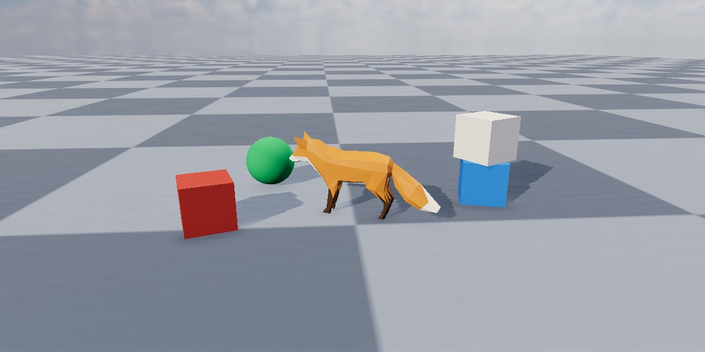

<div class="grid cards" markdown>

-   :chestnut:{ : style="margin-right:0.3em" } __In a nutshell...__

    * A directional light lights the whole scene from one direction, like the sun. :material-arrow-right: [Directional Lights](#directional-lights)
    * It can also draw a visible sun disc in the sky. :material-arrow-right: [Sun Disc](#sun-disc)
    * A scene can only contain one directional light. :material-arrow-right: [One Per Scene](#one-per-scene)

</div>

[{ : style="width:77%;" }](directional_lights_example.jpg)
/// caption
A directional light with the colour and brightness of midday sunlight, lighting a fox and several objects, with shadows enabled.
///

## Directional Lights

```csharp
using var sun = factory.LightBuilder.CreateDirectionalLight( // (1)!
	direction: new Direction(0f, -1f, 0.5f),
	color: StandardColor.LightingSunMidday,
	castsShadows: true,
	showSunDisc: true
);
scene.Add(sun); // (2)!
```

1.	Creates a directional light shining down and forward, with the colour of midday sunlight, casting shadows, and drawing a sun disc in the sky.

2.	Adds the light to a [scene](scenes.md). A light only illuminates the scenes it has been added to.

A `DirectionalLight` lights the entire scene from a single direction. It has no position and no falloff; instead it's treated as being infinitely far away and uniform, so every object in the scene is lit from the same angle with the same intensity. This makes it the right way to model the sun or the moon.

### Creating Directional Lights

Directional lights are created with `factory.LightBuilder.CreateDirectionalLight()`, which accepts the following optional parameters (or alternatively a `DirectionalLightCreationConfig` with equivalent properties):

<span class="def-icon">:material-card-bulleted-outline:</span> `direction`

:   The direction the light travels in. Defaults to mostly downward and slightly forward, approximating afternoon sunlight. See [Direction](#direction).

<span class="def-icon">:material-card-bulleted-outline:</span> `color`, `castsShadows`

:   The light's colour (default white) and whether it casts shadows (default `false`). See [Point Lights](point_lights.md#colour).

<span class="def-icon">:material-card-bulleted-outline:</span> `brightnessPreset`

:   How much light the light casts, as a time of day or weather (e.g. `DirectionalLightBrightnessPreset.Midday`). Ignored if `brightness` is also specified. See [Brightness](#brightness).

<span class="def-icon">:material-card-bulleted-outline:</span> `brightness`

:   How much light the light casts. Defaults to `1f` (the light of a well-lit interior). See [Brightness](#brightness).

<span class="def-icon">:material-card-bulleted-outline:</span> `showSunDisc`

:   Whether the light draws a visible disc in the sky. Defaults to `false`. Can only be set at creation. See [Sun Disc](#sun-disc).

<span class="def-icon">:material-card-bulleted-outline:</span> `name`

:   An optional name for the light.

## Direction

A directional light's `Direction` is the direction its light *travels*; i.e. the direction its rays move, not the direction pointing towards the light source. So for a sun directly overhead, the direction should be downward.

Because a directional light has no position, its direction is the only thing that determines how objects are lit by it, and which way their shadows fall. A directional light's `RotateBy()` methods rotate its direction.

## Brightness

Every light's `Brightness` is a *relative* value, where `1f` is the default strength for that kind of light. This makes it easy to adjust lights of different kinds in the same terms ("half as bright", "twice as bright").

```csharp
light.Brightness = 2f;
light.ScaleBrightnessBy(1.5f); // (1)!
light.AdjustBrightnessBy(-1f); // (2)!
```

1.	*Multiplies* the brightness by 1.5 (so `2f` becomes `3f`).

2.	*Adds* -1 to the brightness (so `3f` becomes `2f`). The result never goes below `0f`.

The default values for brightness are set up to co-ordinate with the default value of the camera's exposure. For more information, see [Exposure & Brightness](exposure_and_brightness.md).

## Sun Disc

A directional light created with `showSunDisc: true` draws a visible disc in the sky where its light comes from. The disc is drawn against the scene's [backdrop](scenes.md#backdrops), so it's only visible where the backdrop is.

The disc's appearance can be adjusted with `SetSunDiscParameters()`:

```csharp
sun.SetSunDiscParameters(new SunDiscConfig {
	Scaling = 2f, // (1)!
	FringingScaling = 0.5f, // (2)!
	FringingOuterRadiusScaling = 1.5f // (3)!
});
```

1.	Doubles the size of the disc itself.

2.	Halves the brightness of the halo of light around the disc (the bloom that surrounds a bright light seen through an atmosphere). `0f` leaves a hard-edged disc with no glow.

3.	Widens how far the halo spreads outward.

Each property defaults to `1f` (the disc's natural appearance).

## One Per Scene

A scene can contain at most one directional light. If a scene already contains a directional light, adding another has no effect (the second light is not added). Remove the first directional light before adding a different one.

A single directional light can still be added to several different scenes.	

## Colour

A light's `Color` tints the light itself, not the objects it falls on. A red light leaves a white surface looking red; but a surface that reflects no red at all stays dark no matter how bright the light is.

[`StandardColor`](colour.md#standardcolor) has a number of presets for common real-world light sources (`StandardColor.LightingCandle`, `LightingIncandescentBulb`, `LightingSunRiseSet`, `LightingSunMidday`, `LightingAmbientDaylight`, `LightingAmbientOvercast`, and `LightingAmbientShaded`).

A light's colour can also be adjusted in terms of hue, saturation, and lightness via its `ColorHue`, `ColorSaturation`, and `ColorLightness` properties (and the corresponding `AdjustColor[...]By()` methods).

## Shadows

Setting a light's `CastsShadows` to `true` makes the objects it lights cast shadows from it:

```csharp
light.CastsShadows = true;
```

Shadows are calculated separately for each light that casts them, and are one of the more expensive things a scene can ask for. It's therefore common to enable shadows only for the one or two lights that most define a scene's look, and leave the rest without shadows.

The quality of shadows (and whether they're rendered at all) is set per renderer, via the `ShadowQuality` and `ShadowsEnabled` properties of its `RenderQualityConfig`; see [Render Quality](render_quality.md).
