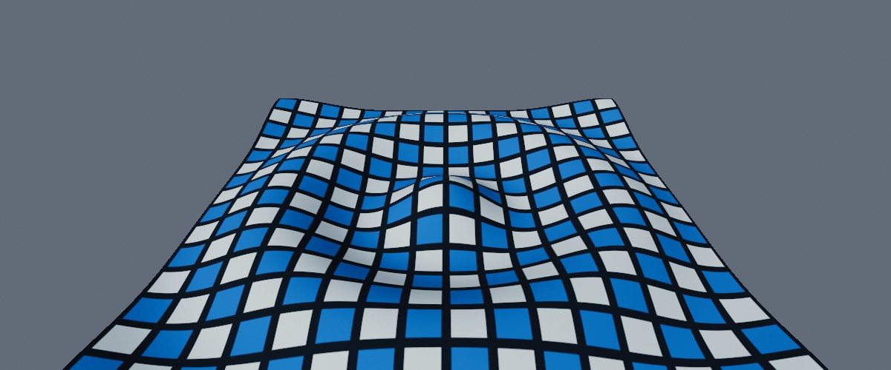
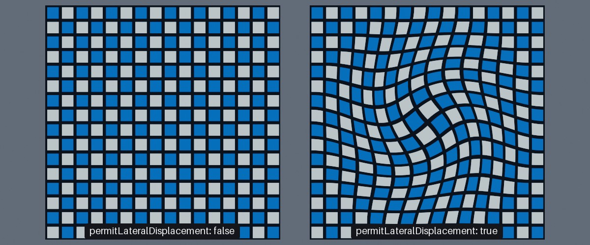
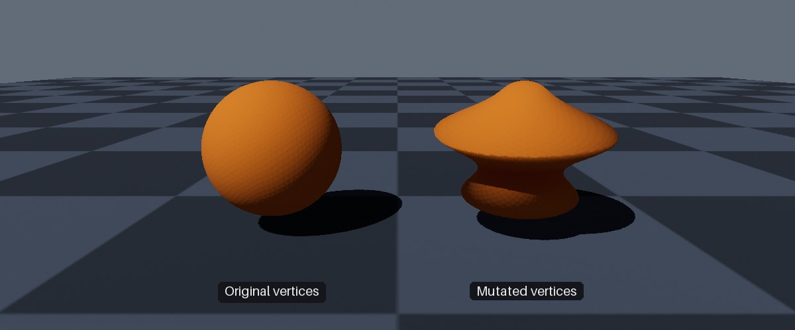
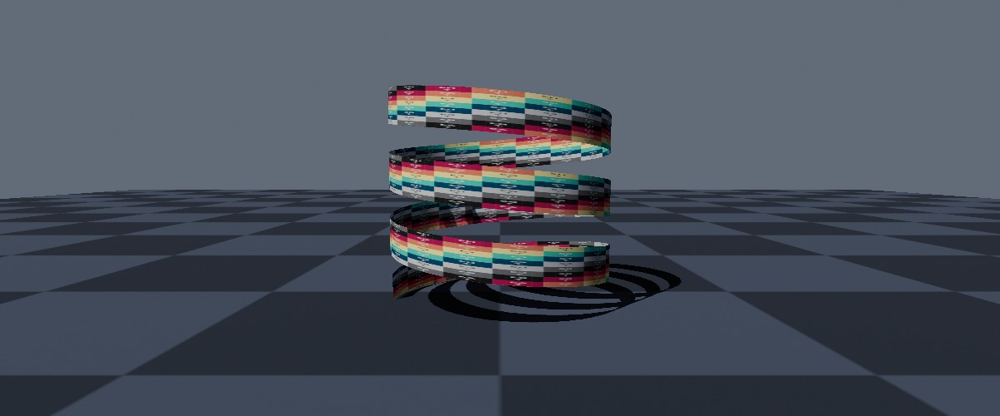

<div class="grid cards" markdown>

-   :chestnut:{ : style="margin-right:0.3em" } __In a nutshell...__

    * Mutable grids are flat sheets of vertices that can be raised, lowered, and shifted; ideal for water, terrain, cloth, and graphs. :material-arrow-right: [Mutable Grids](#mutable-grids)
    * Meshes created with `AllowsPerInstanceVertexMutation` let each object reshape its own copy of the mesh's vertices. :material-arrow-right: [Per-Instance Vertex Mutation](#per-instance-vertex-mutation)
    * A `DynamicVertexBuffer` holds vertices and triangles that can be rewritten from scratch at any time, for geometry generated as your application runs. :material-arrow-right: [Dynamic Vertex Buffers](#dynamic-vertex-buffers)

</div>

{ : style="width:77%;" }
/// caption
A 128x128 mutable grid, displaced in to a ripple (with `recalculateNormals: true`, so that it's lit according to its shape).
///

## Dynamic Meshes

Ordinarily, a mesh's geometry is fixed once it's been created/loaded. Objects can be moved, rotated, and scaled, but the shape of the mesh itself never changes. When you need geometry that changes as your application runs, TinyFFR offers three options:

| If you want to... | Use |
| :---------------- | :-- |
| Raise, lower, or shift points on a surface (e.g. water, terrain, cloth, or a graph of a function) | [Mutable Grids](#mutable-grids) |
| Reshape individual objects that are otherwise copies of an existing mesh (e.g. denting, squashing, or wobbling them) | [Per-Instance Vertex Mutation](#per-instance-vertex-mutation) |
| Generate geometry yourself from scratch, and regenerate it whenever it changes (e.g. procedural shapes, trails, or visualisations whose size varies) | [Dynamic Vertex Buffers](#dynamic-vertex-buffers) |

All three work the same basic way: You *borrow* a span of the geometry's data, write to it, and then dispose the lease. Nothing reaches the GPU until the lease is disposed, so all the changes you make with one lease are uploaded together (see [Leases & Bounding Boxes](#leases-bounding-boxes)).

## Mutable Grids

```csharp
using var gridMesh = factory.MeshBuilder.CreateMutableGrid(
	new XYPair<int>(128, 128), // (1)!
	maxHeightDisplacement: 0.3f // (2)!
);
using var grid = factory.ObjectBuilder.CreateMutableGridInstance(
	gridMesh, 
	material, 
	position: Location.Origin, 
	size: new XYPair<float>(6f, 6f) // (3)!
);
scene.Add(grid);

var elapsedTime = 0f;

// In your application loop:
elapsedTime += deltaTime;
using (var lease = grid.BorrowVerticesSpan(permitLateralDisplacement: false)) { // (4)!
	for (var i = 0; i < lease.Span.Length; ++i) {
		var coord = grid.GetVertexCoordinateNormalized(i); // (5)!
		lease.Span[i] = new MutableGridVertex(0.25f * MathF.Sin(coord.X * 20f + elapsedTime * 3f)); // (6)!
	}
}
```

1.	A grid of 128x128 vertices.

2.	The furthest any vertex will be raised or lowered, in metres. This isn't enforced, but is used to size the grid's bounding box (see below).

3.	Places the grid at the origin, 6m across in both directions.

4.	Borrows the grid's displacements. The new shape is applied when the lease is disposed (i.e. at the end of the `using` block).

5.	Gets the vertex's position across the grid, from `-0.5` to `0.5` in each direction for a centred grid.

6.	Raises or lowers each vertex in to a wave that moves across the grid over time.

A *mutable grid* is a flat, square sheet of vertices that can each be displaced at runtime. Mutable grids are ideal for surfaces such as water, rolling terrain, or cloth, and for visualising mathematical functions or data over a plane. They are often paired with a [writable texture](writable_textures.md) when the surface's appearance needs to change too.

A grid comes in two parts:

* A `MutableGridMesh`, created with `factory.MeshBuilder.CreateMutableGrid()`, is the flat, undisplaced grid. It can be used anywhere a `Mesh` can (and its `UnderlyingMesh` property gives the `Mesh` it wraps).
* A `MutableGridInstance`, created with `factory.ObjectBuilder.CreateMutableGridInstance()`, is a grid placed in the scene. Each instance has its own displacements, so many differently-shaped surfaces can share one grid mesh.

### Creating Grid Meshes

`CreateMutableGrid()` has two main overloads:

* `CreateMutableGrid(meshDensity)` takes a `Quality` value from `VeryLow` (32x32 vertices) to `VeryHigh` (512x512 vertices), with `Standard` being 128x128.
* `CreateMutableGrid(gridDimensions, ...)` takes an exact number of vertices across and down (each at least `2`), plus the following optional arguments:

<span class="def-icon">:material-code-json:</span> `maxHeightDisplacement`

:   The furthest (in metres) you intend to raise or lower any vertex. Defaults to `1f`. 

	A grid's [bounding box](bounding_boxes.md) is sized to fit this displacement when the grid is created, and is **not** recalculated as the grid's vertices move (doing so for every displacement would be slow). If you displace vertices further than this, parts of the grid may disappear when they should be on screen, or be missed by [scene queries](scenes.md#scene-queries). Setting it far larger than necessary, on the other hand, makes the renderer draw the grid when it's actually off screen.

<span class="def-icon">:material-code-json:</span> `twoSided`

:   Whether the grid can be seen from underneath as well as from above. Defaults to `true`.

<span class="def-icon">:material-code-json:</span> `xDir` / `yDir` / `upDir`

:   The directions of the grid's two axes and of its "up" (the direction vertices are raised in). Default to `Direction.Right`, `Direction.Forward`, and `Direction.Up` respectively, i.e. a grid lying flat on the ground.

<span class="def-icon">:material-code-json:</span> `textureTransform`

:   A `Transform2D` applied to the grid's texture coordinates (see [Texture Pattern Transforms](texture_patterns.md#transforms)). By default a texture is stretched exactly once across the whole grid.

<span class="def-icon">:material-code-json:</span> `gridOrigin`

:   Which corner of the grid (or its centre, the default) sits at the grid's position.

Denser grids deform more smoothly, but cost more to draw and to update.

### Displacing Vertices

`grid.BorrowVerticesSpan()` returns a lease over one `MutableGridVertex` per grid vertex. Each `MutableGridVertex` has two values:

<span class="def-icon">:material-card-bulleted-outline:</span> `Height`

:   How far the vertex is raised (or lowered, if negative) along the grid's up direction.

<span class="def-icon">:material-card-bulleted-outline:</span> `NormalizedLateralOffset`

:   How far the vertex is shifted across the grid, along its two axes. An offset of `1f` shifts the vertex halfway to its neighbour. 

	This is ignored unless `permitLateralDisplacement` is `true` when borrowing the span. Leave it `false` when you only need heights, as that's cheaper.

The values are *absolute* displacements from the flat grid (not additions to the grid's current shape), and they persist between leases: Any vertex you don't write to keeps the displacement you last gave it.

{ : style="width:77%;" }
/// caption
Two grids given the same swirling lateral offsets. The left grid's span was borrowed with `permitLateralDisplacement: false`, so its offsets were ignored.
///

The vertices are laid out row by row, starting at the grid's first corner (the bottom-left, looking down from above on a default grid). To find where each vertex is on the grid:

* `GetVertexCoordinate(index)` returns the vertex's integer grid coordinate (e.g. `(0, 0)` to `(127, 127)` on a 128x128 grid); and `GetVertexIndex(coordinate)` does the opposite.
* `GetVertexCoordinateNormalized(index)` returns the vertex's position across the grid as a fraction, relative to the grid's origin (so from `-0.5` to `0.5` for a centred grid, or `0` to `1` for a grid whose origin is a corner). This is usually the most convenient input for a wave, slope, or other function of position. These values are precalculated when the instance is created, so they're cheap to read every frame.

### Lighting Displaced Grids

```csharp
using (var lease = grid.BorrowVerticesSpan(permitLateralDisplacement: false, recalculateNormals: true)) { // (1)!
	// ...
}
```

1.	Recalculates the direction the grid's surface faces at every vertex when the lease is disposed.

By default, when changing a grid's vertices TinyFFR does *not* recalculate its lighting properties (i.e. its normals, tangents, etc). The grid will therefore be lit as though it were still flat. Its shape still shows through its outline, its texture, and the shadows it casts, but slopes facing towards or away from the light are not shaded any differently.

In some cases this is fine (especially if you're using a non-lit material anyway); and it's the default because it's more performant.

However, passing `recalculateNormals: true` when borrowing the span recalculates the direction the surface faces at every vertex from the grid's displaced shape so that the grid remains lit correctly. This costs extra time each time the lease is disposed (proportional to the number of vertices in the grid), so leave it `false` for grids whose displacement is gentle, or that use a [lighting-ignoring material](lighting_ignoring_materials.md).

### Placing Grids

A grid mesh is built at a fixed size, and scaled in to place by its instance's transform. Use `grid.SetTransform(position, size)` (or the `position` and `size` arguments when creating the instance) to place and size a grid in metres along its own two axes. This doesn't scale the grid's up direction, so heights stay in metres however large the grid is (`gridMesh.CalculateTransform(position, size)` returns the equivalent `Transform`).

A grid instance is otherwise a normal scene object. It can be moved, rotated, and scaled like any other object, and its `UnderlyingModelInstance` property gives the `ModelInstance` it wraps.

## Per-Instance Vertex Mutation

```csharp
using var mesh = factory.MeshBuilder.CreateSphere(
	new Sphere(0.6f),
	subdivisionLevel: 4,
	new MeshGenerationConfig(),
	new MeshCreationConfig { AllowsPerInstanceVertexMutation = true } // (1)!
);
using var instance = factory.ObjectBuilder.CreateModelInstance(mesh, material);

using (var originalVertices = mesh.BorrowDefaultVerticesSpan()) // (2)!
using (var lease = instance.BorrowVerticesSpan(recalculateBoundingBoxOnLeaseDispose: true)) { // (3)!
	for (var i = 0; i < lease.Span.Length; ++i) {
		var original = originalVertices.Span[i];
		var location = original.Location;
		var squash = 1f + 0.35f * MathF.Sin(location.Y * 9f);
		lease.Span[i] = original with { Location = new Location(location.X * squash, location.Y, location.Z * squash) }; // (4)!
	}
}
```

1.	Allows each instance of this mesh to alter its own vertices.

2.	Borrows the mesh's original, unaltered vertices (read-only).

3.	Borrows this instance's own vertices for writing. When the lease is disposed, the changes are uploaded and the instance's bounding box is recalculated.

4.	Squashes and stretches the sphere in to rings. Every other property of the vertex is kept as it was.

{ : style="width:77%;" }
/// caption
Two instances of the same sphere mesh. The right-hand instance's vertices have been mutated as in the example above.
///

A mesh created with `AllowsPerInstanceVertexMutation` set to `true` in its [`MeshCreationConfig`](loading_meshes.md#customizing-the-load-operation) lets every object using it reshape its *own* copy of the mesh's vertices, without affecting other objects using the mesh. This can only be set when the mesh is created; you can check it with `mesh.AllowsPerInstanceVertexMutation` (or `instance.AllowsVertexMutation`).

The mesh's vertices can then be accessed as follows:

<span class="def-icon">:material-code-block-parentheses:</span> `instance.BorrowVerticesSpan(recalculateBoundingBoxOnLeaseDispose)`

:   Borrows the instance's vertices for writing. The changes are uploaded when the lease is disposed. See [Leases & Bounding Boxes](#leases-bounding-boxes) for more info on `recalculateBoundingBoxOnLeaseDispose`.

	Another overload takes a `Range` to borrow only some of the vertices (e.g. `instance.BorrowVerticesSpan(true, 100..200)`). Only the borrowed range is uploaded, which is much cheaper when only a few vertices change.

<span class="def-icon">:material-code-block-parentheses:</span> `instance.BorrowVerticesSpanReadOnly()`

:   Borrows the instance's current vertices for reading only.

<span class="def-icon">:material-code-block-parentheses:</span> `mesh.BorrowDefaultVerticesSpan()`

:   Borrows the mesh's original vertices for reading only. Starting from these each time (rather than from the instance's current vertices) avoids errors building up over many changes.

All three throw an `InvalidOperationException` if the mesh wasn't created with `AllowsPerInstanceVertexMutation` set to `true`.

The vertices are `MeshVertex` values (explained in [Creating Meshes](creating_meshes.md#meshvertex)). Each holds a location, texture coordinates, and a tangent rotation, which describes the direction the surface faces at that vertex and is used for lighting. If you move vertices far enough to change the direction the surface faces, also update their tangent rotation (e.g. by creating new `MeshVertex` values with the `MeshVertex(location, textureCoords, tangent, bitangent, normal)` constructor), or the surface will be lit as though it had its original shape.

Things to note about per-instance vertex mutation:

* Meshes allowing per-instance vertex mutation keep a copy of their vertices in ordinary memory as well as on the GPU. Each instance then gets its own copy of the vertices (in memory and on the GPU) the first time it borrows them; instances that never borrow their vertices cost nothing extra.
* Changing an instance's `Mesh` discards its altered vertices.
* Wireframe data is never generated for meshes allowing per-instance vertex mutation (see [The Default Material](the_default_material.md)).
* Only vertices can be altered, not the triangles joining them. To change which vertices are joined together, use a [dynamic vertex buffer](#dynamic-vertex-buffers) instead.

## Dynamic Vertex Buffers

```csharp
using var buffer = factory.MeshBuilder.CreateDynamicVertexBuffer(
	initialVertexCapacity: 1000, 
	initialTriangleCapacity: 1000
);

using (var vertices = buffer.BorrowVerticesSpan(recalculateBoundingBoxOnLeaseDispose: true, overwriteChildMeshBoundingBoxes: true)) // (1)!
using (var triangles = buffer.BorrowTrianglesSpan(recalculateBoundingBoxOnLeaseDispose: false, overwriteChildMeshBoundingBoxes: false)) {
	WriteMyGeometry(vertices.Span, triangles.Span); // (2)!
}

using var mesh = buffer.CreateMesh(); // (3)!
using var instance = factory.ObjectBuilder.CreateModelInstance(mesh, material);
```

1.	Borrows the buffer's vertices. When the lease is disposed, the new vertices are uploaded, and the bounding box of the buffer (and every mesh created from it) is recalculated.

2.	Writes vertices in to the first span, and the triangles joining them in to the second, via some hypothetical method of your own.

3.	Creates a mesh that draws the buffer's contents.

{ : style="width:77%;" }
/// caption
A spiral ribbon generated in to a dynamic vertex buffer.
///

A `DynamicVertexBuffer` holds vertices and triangles that you write yourself, and that can be rewritten at any time. It's the right choice for geometry that you generate from scratch as your application runs (rather than altering an existing mesh), especially when the amount of geometry varies.

Dynamic vertex buffers are created with `factory.MeshBuilder.CreateDynamicVertexBuffer()`, with an initial capacity of vertices and triangles. Both start out filled with zeros.

You can create multiple meshes as "views" from a single dynamic buffer.

### Writing Geometry

`buffer.BorrowVerticesSpan()` borrows the buffer's vertices (as `MeshVertex` values; see [Creating Meshes](creating_meshes.md#meshvertex)), and `buffer.BorrowTrianglesSpan()` borrows its triangles (as `VertexTriangle` values; see [Creating Meshes](creating_meshes.md#vertextriangle)). Both have an overload that takes a `Range` to borrow only part of the buffer, which is cheaper to upload; and `BorrowVerticesSpanReadOnly()` / `BorrowTrianglesSpanReadOnly()` read the buffer without altering it.

Each triangle's three indices refer to vertices in the buffer, so must each be less than the buffer's vertex capacity; and, as for every `VertexTriangle`, must be in anticlockwise order as seen from the triangle's front face. Triangles left at their default value (all three indices zero) have no area, and so draw nothing.

### Creating Meshes

A buffer is drawn by creating meshes from it:

<span class="def-icon">:material-code-block-parentheses:</span> `buffer.CreateMesh()`

:   Creates a mesh that draws every triangle in the buffer.

<span class="def-icon">:material-code-block-parentheses:</span> `buffer.CreateMesh(trianglesRange)`

:   Creates a mesh that draws only the given range of the buffer's triangles (e.g. `buffer.CreateMesh(0..100)` draws the first 100 triangles). One buffer can therefore hold several separate pieces of geometry, each drawn with its own mesh.

<span class="def-icon">:material-code-block-parentheses:</span> `buffer.CreateMesh(trianglesRange, boundingBoxOverride)`

:   As above, but with a bounding box of your own (see below).

A mesh created from a buffer is a *view* on to the buffer, __not__ a copy of it. Rewriting the buffer changes what the mesh draws, without needing to create a new mesh (this is specifically a supported workflow). A mesh's triangle range is fixed when the mesh is created.

### Bounding Boxes

Like every mesh, meshes created from a buffer have a bounding box, which is used to skip drawing objects that are off screen (see [Leases & Bounding Boxes](#leases-bounding-boxes)). A buffer keeps a bounding box of its own, which is given to every mesh created from it:

* A new buffer's bounding box encloses its zero-filled vertices; i.e. it's a tiny box at the origin. **If you create a mesh before writing to the buffer, the mesh keeps this tiny box unless you update it, and objects using the mesh will disappear whenever the origin is off screen.**
* Passing `overwriteChildMeshBoundingBoxes: true` when borrowing the buffer's spans updates the bounding box of every mesh created from the buffer (and every object using those meshes) whenever the buffer's bounding box changes. Passing `false` updates only the buffer's own bounding box, which is then given to meshes created afterwards.
* `buffer.TriggerManualBoundingBoxRecalculation(overwriteChildMeshBoundingBoxes)` recalculates the buffer's bounding box from its current vertices.
* `buffer.SetBoundingBox(boundingBox, overwriteChildMeshBoundingBoxes)` sets the buffer's bounding box explicitly; and `buffer.SetBoundingBox(mesh, boundingBox)` sets the bounding box of one mesh created from the buffer. Setting a box you already know is much cheaper than recalculating one.

The buffer's bounding box encloses *all* of its vertices. When one buffer holds several separate pieces of geometry, give each mesh its own bounding box (via `CreateMesh(trianglesRange, boundingBoxOverride)` or `SetBoundingBox(mesh, boundingBox)`) so that each piece is only drawn when it's actually on screen.

### Resizing & Disposal

`buffer.ResizeVertexBuffer(newSize)` and `buffer.ResizeTriangleBuffer(newSize)` change the buffer's capacity, keeping as much of its existing contents as fits. A buffer is never resized automatically; and resizing is relatively slow, so choose initial capacities close to what you'll actually need.

A buffer can not be resized or disposed while any mesh created from it still exists (both throw a `ResourceDependencyException`), or while any of its spans are borrowed. Dispose every mesh created from a buffer (and every object using those meshes) first. `buffer.VertexBufferSize` and `buffer.TriangleBufferSize` give the buffer's current capacities.

## Leases & Bounding Boxes

For general information on what bounding boxes are and how they're used in TinyFFR, see [Bounding Boxes](bounding_boxes.md).

All three forms of dynamic mesh share the following rules:

* Changes are only uploaded to the GPU when the lease is disposed, so make all of a frame's changes with as few leases as possible. Several leases can be held at once.
* Dispose every lease as soon as you're done with it: A model instance or grid instance can not be disposed (nor can an instance's `Mesh` be changed) while any of its vertex spans are borrowed, and a dynamic vertex buffer can not be resized or disposed while any of its spans are borrowed.
* Every object has a *bounding box*: A box enclosing its geometry, which the renderer uses to skip drawing objects that are entirely off screen, and which [scene queries](scenes.md#scene-queries) use to find objects. Moving vertices does not automatically update an object's bounding box, and a bounding box that no longer encloses the object can make it disappear when it should still be on screen, or be missed by scene queries.

For per-instance vertex mutation and dynamic vertex buffers, `recalculateBoundingBoxOnLeaseDispose: true` recalculates the bounding box from the new vertices when the lease is disposed. Recalculating takes time proportional to the number of vertices, so if you know the extents of your geometry in advance, it's cheaper to pass `false` and set the bounding box yourself (`instance.SetModelSpaceBoundingBox()` for instances; `buffer.SetBoundingBox()` for buffers), or to recalculate it later with `TriggerManualBoundingBoxRecalculation()`.

Mutable grids never recalculate their bounding box; they rely on the `maxHeightDisplacement` given when the grid mesh was created (see [Creating Grid Meshes](#creating-grid-meshes)).
