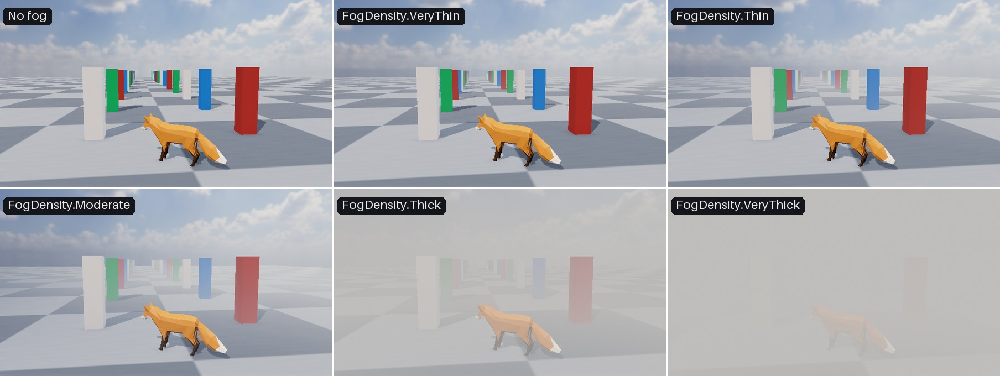

<div class="grid cards" markdown>

-   :chestnut:{ : style="margin-right:0.3em" } __In a nutshell...__

    * Fog makes distant objects fade to a colour, adding depth and atmosphere to a scene. :material-arrow-right: [Fog](#fog)
    * Five presets cover common densities, from a faint haze to a thick fog. :material-arrow-right: [Fog Presets](#fog-presets)
    * `FogDescriptor` configures fog in full, including fog that pools near the ground. :material-arrow-right: [Custom Fog](#custom-fog)

</div>

{ : style="width:100%;" }
/// caption
The same scene with no fog, and with each `FogDensity` preset (using the default fog colour).
///

## Fog

```csharp
scene.AddFog(FogDensity.Thin); // (1)!
scene.AddFog(FogDensity.Thick, new ColorVect(0.8f, 0.85f, 0.9f)); // (2)!
scene.RemoveFog(); // (3)!
```

1.	Adds a light haze to the scene.

2.	Replaces the haze with a thick, slightly blue fog.

3.	Removes the fog from the scene.

Fog makes objects fade in to a colour as they get further from the camera, adding a sense of depth and atmosphere to a scene (or hiding distant parts of a scene altogether).

Scenes can only have one fog configuration active at any one time.

## Fog Presets

`scene.AddFog()` accepts a `FogDensity` preset and optionally a colour. Each preset sets the fog colour's alpha itself, so only the red, green, and blue components of a colour passed to `AddFog()` are used.

???+ abstract "Preset Values"
	Each preset maps to a complete `FogDescriptor` (see [Custom Fog](#custom-fog) below) with the following values (all other properties are left at their defaults):

	| Preset      | Color Alpha | `DensityMultiplier` | `StartDistance` | `DirectionalLightScatteringStrengthMultiplier` | `SkywardDensityFalloffMultiplier` | `OccludesBackdrop` |
	| :---------- | :---------: | :-----------------: | :-------------: | :--------------------------------------------: | :-------------------------------: | :----------------: |
	| `VeryThin`  | 0.55        | 0.5                 | 7.5             | 0.333                                          | 1                                 | `false`            |
	| `Thin`      | 0.65        | 0.75                | 5               | 0.666                                          | 1                                 | `false`            |
	| `Moderate`  | 0.75        | 1                   | 3               | 1                                              | 1                                 | `false`            |
	| `Thick`     | 0.85        | 1.25                | 1.25            | 1.5                                            | 0.5                               | `true`             |
	| `VeryThick` | 1           | 1.5                 | 0.5             | 2                                              | 0.2                               | `true`             |

## Custom Fog

For full control, pass a `FogDescriptor` to `scene.AddFog()`. You can start from a preset with `new FogDescriptor(density)` and adjust it with a `with` expression, or create one from scratch:

```csharp
scene.AddFog(new FogDescriptor(FogDensity.Thin) with { OccludesBackdrop = true }); // (1)!

scene.AddFog(new FogDescriptor { // (2)!
	Color = new ColorVect(0.9f, 0.9f, 0.9f, 0.9f),
	GroundLayerHeight = 0f,
	SkywardDensityFalloffMultiplier = 3f,
	StartDistance = 1f
});
```

1.	Uses the thin preset, but with the fog also covering the backdrop.

2.	A low-lying mist (dense at ground level, and thinning out quickly above it like morning mist in a valley).

A `FogDescriptor` has the following properties:

<span class="def-icon">:material-card-bulleted-outline:</span> `Color`

:   The colour of the fog. Defaults to `FogDescriptor.DefaultColor` (a translucent grey: `(0.75, 0.75, 0.75, 0.75)`).

	The colour's __alpha__ sets how completely the fog can obscure what's behind it. A fully opaque colour eventually hides distant objects altogether, whereas a translucent one only ever tints them. 

<span class="def-icon">:material-card-bulleted-outline:</span> `DensityMultiplier`

:   How quickly the fog thickens with distance, where `1f` is the standard rate. Larger values make objects disappear in to the fog over a shorter distance; smaller values stretch that transition out. Defaults to `1f`.

<span class="def-icon">:material-card-bulleted-outline:</span> `StartDistance`

:   How far from the camera the fog begins, in metres. Nothing closer to the camera than this is affected at all, which keeps nearby objects looking crisp no matter how thick the fog is further out. Defaults to `3f`.

<span class="def-icon">:material-card-bulleted-outline:</span> `GroundLayerHeight`

:   The height at which the fog is thickest, measured along `SkywardDirection`. Defaults to `0f`.

<span class="def-icon">:material-card-bulleted-outline:</span> `SkywardDensityFalloffMultiplier`

:   How quickly the fog thins out above `GroundLayerHeight`, where `1f` is the standard rate. Larger values confine the fog to a shallower layer near the ground; smaller values let it extend further upwards. `0f` gives fog of the same thickness at every altitude. Defaults to `1f`.

<span class="def-icon">:material-card-bulleted-outline:</span> `SkywardDirection`

:   Which way is "up" for the purposes of `GroundLayerHeight` and `SkywardDensityFalloffMultiplier`. Defaults to `Direction.Up`.

<span class="def-icon">:material-card-bulleted-outline:</span> `DirectionalLightScatteringStrengthMultiplier`

:   How strongly a [directional light](directional_lights.md) appears to scatter through the fog, where `1f` is the standard amount. Scattering is what makes fog glow when you look towards the sun, and look flat and grey when you look away from it. Larger values exaggerate the effect; `0f` makes the fog look the same in every direction. Defaults to `1f`.

<span class="def-icon">:material-card-bulleted-outline:</span> `OccludesBackdrop`

:   Whether the fog is also drawn over the scene's [backdrop](scenes.md#backdrops). The backdrop is effectively infinitely distant, so when this is `true` the fog covers it completely, replacing the sky with a wall of fog. Leave it `false` for fog that objects fade in to whilst the sky remains visible. Defaults to `false`.
