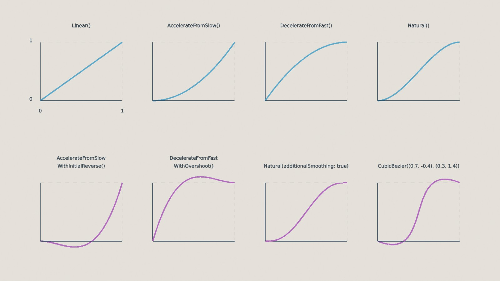
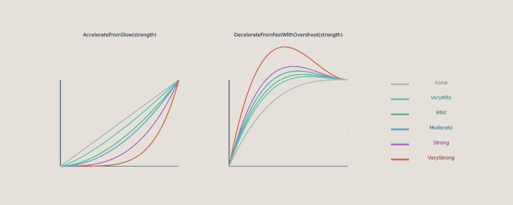

<div class="grid cards" markdown>

-   :chestnut:{ : style="margin-right:0.3em" } __In a nutshell...__

    * Almost every TinyFFR math/geometry type has a static `Interpolate(start, end, distance)` method that finds a value part-way between two others. :material-arrow-right: [Interpolation](#interpolation)
    * An `InterpolationAlgorithm<T>` chooses *how* a value travels from start to end, e.g. starting slowly and speeding up, or overshooting and settling back. :material-arrow-right: [Interpolation Algorithms](#interpolation-algorithms)

</div>

## Interpolation

*Interpolating* means finding a value part-way between a start and an end value. Most TinyFFR math types (including `Location`, `Direction`, `Vect`, `Angle`, `Rotation`, `Transform`, `XYPair<T>`, `ColorVect`, and the [line](lines.md) and [shape](shapes.md) types) have a static `Interpolate()` method for this:

```csharp
var halfway = Location.Interpolate(start, end, 0.5f); // (1)!
var halfTurn = Rotation.Interpolate(Rotation.None, 90f % Direction.Up, 0.5f); // (2)!
var beyond = Location.Interpolate(start, end, 1.5f); // (3)!
```

1.	The location exactly halfway between `start` and `end`. A `distance` of `0f` gives `start`, and `1f` gives `end`.

2.	45° around `Up`: halfway between no rotation and 90° around `Up`.

3.	Most types also accept distances outside the range 0 to 1, continuing past the start or end (here, half as far again beyond `end`).

`Interpolate()` always moves at a constant, linear rate (i.e. a `distance` of `0.25f` is always a quarter of the way from `start` to `end`).

??? tip "Interpolation Precomputation"
	`Direction`, `Rotation`, `Line`, `Ray`, and `Plane` can do some of the work up front if you're going to interpolate between the same two values many times (e.g. every frame of an animation): `CreateInterpolationPrecomputation(start, end)` returns a value you can pass to `InterpolateUsingPrecomputation(start, end, precomputation, distance)`.

## Interpolation Algorithms

An `InterpolationAlgorithm<T>` changes how a value travels from its start to its end (often called *easing*). For example, a door that starts opening slowly and then speeds up, or a menu that slides in quickly and then slows to a stop, look far more natural than ones that move at a constant speed.

```csharp
var algorithm = InterpolationAlgorithm<Location>.DecelerateFromFast(); // (1)!
var position = algorithm.GetValue(start, end, 0.5f); // (2)!
var timed = algorithm.GetValue(start, end, MathF.Min(elapsedSeconds, 2f), 2f); // (3)!
```

1.	An algorithm for `Location`s that starts quickly and slows down as it reaches the end ("ease-out").

2.	The location at the halfway point *in time*, which (because this algorithm starts quickly) is 75% of the way from `start` to `end`.

3.	The same, but working out the distance as `elapsedSeconds / 2f`, i.e. for a movement that takes 2 seconds. The `MathF.Min()` stops the value continuing past `end` once the 2 seconds are up.

The `<T>` type argument must be anything that implements `IInterpolatable<T>` (which many, many types in TinyFFR do implement).


/// caption
Each built-in algorithm's output (from `start` at the bottom to `end` at the top) as its input distance goes from 0 to 1 (left to right). The algorithms in the bottom row overshoot `start` or `end` on the way.
///

The static factory methods on `InterpolationAlgorithm<T>` can be used to select an algorithm (e.g. `InterpolationAlgorithm<Location>.Linear()`):

<span class="def-icon">:material-code-block-parentheses:</span> `Linear()`

:   No easing. The value moves at a constant rate, exactly as with the static `T.Interpolate()`.

<span class="def-icon">:material-code-block-parentheses:</span> `AccelerateFromSlow(strength)` / `DecelerateFromFast(strength)`

:   Starts slowly and speeds up towards the end ("ease-in"), or starts quickly and slows down towards the end ("ease-out").

<span class="def-icon">:material-code-block-parentheses:</span> `Natural(additionalSmoothing)`

:   Starts slowly, speeds up through the middle, and slows down again at the end ("ease-in-out", sometimes called "smoothstep"). Passing `additionalSmoothing: true` softens the very start and end even further (also known as "smootherstep").

<span class="def-icon">:material-code-block-parentheses:</span> `AccelerateFromSlowWithInitialReverse(strength)`

:   Moves briefly backwards (past `start`) before speeding up towards `end`, like winding up before a throw.

<span class="def-icon">:material-code-block-parentheses:</span> `DecelerateFromFastWithOvershoot(strength)`

:   Moves quickly, overshoots past `end`, and then settles back to it.

<span class="def-icon">:material-code-block-parentheses:</span> `CubicBezier(firstCoord, secondCoord)`

:   A curve shaped by two control points, in the same way as CSS's `cubic-bezier()` timing function. The curve always runs from `(0, 0)` to `(1, 1)`; the two control points pull it into shape, and their Y values can go outside 0 to 1 to overshoot. [cubic-bezier.com](https://cubic-bezier.com) is a handy way to design a curve and find its control points.

<span class="def-icon">:material-code-block-parentheses:</span> `Custom(...)`

:   Used to supply your own algorithm. See below.

### Strength

The algorithms that take a `strength` (an `InterpolationStrength`, defaulting to `Moderate`) can be made more or less pronounced:


/// caption
Each `InterpolationStrength` value, applied to `AccelerateFromSlow()` and `DecelerateFromFastWithOvershoot()`.
///

For finer control, each also has an overload taking a `float` instead of an `InterpolationStrength`. This is an `exponent` for `AccelerateFromSlow()` and `DecelerateFromFast()` (where `1f` is linear and `2f` is `Moderate`), or a `coefficient` for the reverse/overshoot algorithms (where `0f` means no reverse or overshoot and `1.70158f` is `Moderate`, overshooting by about 10%).

## Custom Algorithms

You can supply your own algorithm with `Custom()`. It takes a pointer to a `static` method (rather than a delegate, so that algorithms never allocate memory), plus up to four `float` parameters that are passed to the method each time it runs:

```csharp
static unsafe InterpolationAlgorithm<T> CreateSteppedAlgorithm<T>(int stepCount) where T : IInterpolatable<T> { // (1)!
	return InterpolationAlgorithm<T>.Custom(&Stepped, new(stepCount)); // (2)!

	static T Stepped(T start, T end, InterpolationAlgorithm<T>.StaticParameterGroup parameters, float linearDistance) {
		var steppedDistance = MathF.Floor(linearDistance * parameters.A) / parameters.A; // (3)!
		return T.Interpolate(start, end, steppedDistance); // (4)!
	}
}

var steppedPositions = CreateSteppedAlgorithm<Location>(4); // (5)!
var steppedColors = CreateSteppedAlgorithm<ColorVect>(10);
```

1.	`T` can be any type that can be interpolated: the `where T : IInterpolatable<T>` constraint is what allows `Stepped()` to call `T.Interpolate()` below. Every TinyFFR type with a static `Interpolate()` method implements `IInterpolatable<T>`, so this one method creates a stepped algorithm for all of them.

2.	`&Stepped` is a pointer to the method below (which requires an `unsafe` context). `new(stepCount)` creates a `StaticParameterGroup` with `A` set to `stepCount` (its `B`, `C`, and `D` are left as `0f`).

3.	Rounds the distance down to the nearest step, so the value jumps from one position to the next rather than moving smoothly (e.g. with 4 steps, any distance from `0.5f` up to `0.75f` becomes `0.5f`).

4.	Uses the type's own `Interpolate()` to find the actual value at that distance (e.g. `Location.Interpolate()` when `T` is `Location`).

5.	A stepped algorithm for `Location`s, moving in 4 steps; and one for `ColorVect`s, changing colour in 10 steps.
