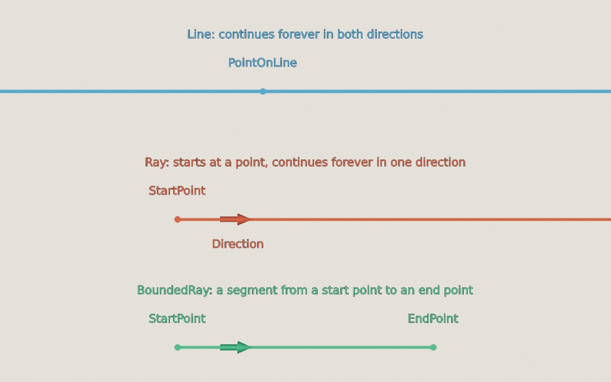

<div class="grid cards" markdown>

-   :chestnut:{ : style="margin-right:0.3em" } __In a nutshell...__

    * TinyFFR has three "line-like" types: `Line` (infinite in both directions), `Ray` (starts at a point, infinite in one direction), and `BoundedRay` (a segment from a start point to an end point). :material-arrow-right: [Line Types](#line-types)
    * All three share most of their API; finding closest points and distances, intersecting with each other and with shapes, and measuring angles. :material-arrow-right: [Measuring & Intersecting](#measuring-intersecting)
    * They can be moved, rotated, and (for `BoundedRay`) scaled and resized. :material-arrow-right: [Moving & Modifying](#moving-modifying)

</div>

## Line Types

[](lines_types.jpg)
/// caption
A `Line`, a `Ray`, and a `BoundedRay`.
///

### Line

A `Line` is an infinitely-long straight line. It's defined by any point on the line (`PointOnLine`) and a `Direction`; it has no start or end. It's considered the same line whichever point on it you pick and whichever way along it the direction points.

```csharp
var line = new Line(new Location(0f, 1f, 0f), Direction.Forward); // (1)!
var throughTwoPoints = Line.FromTwoPoints(location1, location2); // (2)!
```

1.	A line passing through (0, 1, 0), running forward (and backward).

2.	The line passing through both locations.

### Ray

A `Ray` starts at a point (`StartPoint`) and continues forever in one `Direction`.

```csharp
var ray = new Ray(new Location(0f, 1f, 0f), Direction.Forward); // (1)!
var cameraRay = camera.CreateRayFromNearPlane(); // (2)!
```

1.	A ray starting at (0, 1, 0) and travelling forward.

2.	A ray from the centre of the camera's view straight in to the scene. See [Ray Casting](ray_casting_pixel_picking_projecting.md#ray-casting).

### BoundedRay

A `BoundedRay` is like a ray but has both a `StartPoint` to an `EndPoint`. It has a `Length` and a `MiddlePoint` as well as a `Direction` (pointing from its start towards its end). Also known as a "line segment".

```csharp
var ray = new BoundedRay(location1, location2); // (1)!
var alsoRay = new BoundedRay(location1, Direction.Up * 3f); // (2)!
```

1.	A bounded ray from `location1` to `location2`.

2.	A bounded ray from `location1` to the point 3m above it (i.e. created from a start point and a [Vect](vector_types.md#vect)).

### Converting Between Types

```csharp
var lineFromRay = ray.ToLine(); // (1)!
var boundedRayFromRay = ray.ToBoundedRay(5f); // (2)!
var rayFromBoundedRay = boundedRay.ToRayFromStart(); // (3)!
var rayFromLine = line.ToRay(0f, flipDirection: false); // (4)!
```

1.	The infinite line that the ray lies along.

2.	The first 5m of the ray.

3.	A ray starting at the bounded ray's start point and continuing past its end. `ToRayFromEnd()` gives a ray from the end point back past the start.

4.	A ray starting at `PointOnLine` (or some distance along the line from it), pointing along the line's `Direction` (or the opposite way, if `flipDirection` is `true`).

???+ tip "Drawing Lines"
	All three types can be drawn in a scene as [scene primitives](scene_primitives.md#bounded-rays) (e.g. `scene.AddPrimitiveShape(ray)`), which is handy for checking that your math is doing what you expect.

## Measuring & Intersecting

Most operations work the same way on all three types, and accept any of the three types as an argument. For a `Ray` or `BoundedRay`, results only ever lie within the ray (e.g. the point on a ray closest to a location can be its start point, but never a point "behind" it).

```csharp
var closest = ray.PointClosestTo(location); // (1)!
var distance = ray.DistanceFrom(location); // (2)!
var onRay = ray.Contains(location); // (3)!

var intersection = ray.IntersectionWith(otherLine); // (4)!
var closestOnOther = ray.ClosestPointOn(otherLine); // (5)!
var gap = ray.DistanceFrom(otherLine); // (6)!
var angle = ray.AngleTo(otherLine); // (7)!
```

1.	The point on the ray closest to `location`.

2.	How far `location` is from the ray (at its closest point).

3.	Whether `location` lies on the ray.

4.	The point where the ray meets `otherLine`, or `null` if they don't meet. (`otherLine` can be a `Line`, `Ray`, or `BoundedRay`.)

5.	The point on `otherLine` closest to the ray. `ray.PointClosestTo(otherLine)` gives the point on the ray closest to `otherLine`.

6.	The shortest distance between the ray and `otherLine` (0 if they intersect).

7.	The angle between the ray's direction and `otherLine`'s direction.

???+ tip "Line Thickness"
	Two lines in 3D space almost never pass *exactly* through the same point, because floating-point values can't represent every location precisely. So `Contains()`, `IntersectionWith()`, and `IsIntersectedBy()` treat lines as having a small thickness (`ILineLike.DefaultLineThickness`, 1cm). 
	
	You can pass a different `lineThickness` to any of these methods; and doing so lets you simulate spherical shape casting (i.e. you can do intersection tests against a cylindrical space).

<span class="def-icon">:material-code-block-parentheses:</span> `IsIntersectedBy(other)`

:   Whether this line meets `other` (another line-like or a `Plane`). Cheaper than `IntersectionWith()` when you don't need to know where. To test against a shape, ask the shape instead: `sphere.IsIntersectedBy(ray)`.

<span class="def-icon">:material-code-block-parentheses:</span> `SignedAngleTo(other, clockwiseAxis)`

:   The angle between this line and `other`, positive or negative depending on which way round `clockwiseAxis` it turns.

<span class="def-icon">:material-code-block-parentheses:</span> `IsParallelTo(other)` / `IsOrthogonalTo(other)` / `IsApproximatelyParallelTo(other)` / `IsApproximatelyOrthogonalTo(other)`

:   Whether this line points in the same (or opposite) direction as `other`, or at right-angles to it. `other` can be a line-like, a `Direction`, or a `Plane`. The `Approximately` versions allow for a small angular error, optionally passed as a `tolerance`.

<span class="def-icon">:material-code-block-parentheses:</span> `IsApproximatelyColinearWith(other)`

:   Whether this line and `other` lie along the same infinite line.

<span class="def-icon">:material-code-block-parentheses:</span> `UnboundedLocationAtDistance(distance)` / `BoundedLocationAtDistance(distance)` / `LocationAtDistanceOrNull(distance)`

:   The location `distance` metres along the ray from its start point (negative values go backwards). The unbounded version can return a location beyond the ray's ends, the bounded version clamps it to the nearest end, and the `OrNull` version returns `null` if it's beyond the ends. On a `Line`, `LocationAtDistance(distance)` measures from `PointOnLine`.

### Planes & Shapes

Line-likes can also be measured against and intersected with a `Plane`, and with shapes such as a `Sphere` or `Cuboid`.

```csharp
var hitPoint = ray.IntersectionWith(plane); // (1)!
var hitAngle = ray.IncidentAngleWith(plane); // (2)!
var bounced = ray.ReflectedBy(plane); // (3)!
var pieces = boundedRay.SplitBy(plane); // (4)!
var shapeHits = ray.IntersectionWith(sphere); // (5)!
```

1.	Where the ray hits the plane, or `null` if it doesn't.

2.	The angle between the ray and the plane's normal (so 0° is a head-on hit), or `null` if the ray doesn't hit the plane.

3.	The ray that bounces off the plane, starting where the ray hits it (or `null` if it doesn't).

4.	The bounded ray split in two where it crosses the plane, as a pair (`pieces.Value.First` and `pieces.Value.Second`), or `null` if it doesn't cross the plane. Splitting a `Ray` gives a `BoundedRay` and a `Ray`; splitting a `Line` gives two `Ray`s.

5.	Where the ray enters and leaves the shape (`shapeHits.Value.First` and `shapeHits.Value.Second`), or `null` if it misses. `Second` is `null` if there's only one point, e.g. when the ray starts inside the shape.

Other plane operations include `DistanceFrom(plane)`, `SignedDistanceFrom(plane)`, `RelationshipTo(plane)`, and `ProjectedOnTo(plane)` (moving the line on to the plane's surface).

## Moving & Modifying

Like every TinyFFR math type, line-likes are immutable; every method returns a new value, leaving the original unchanged.

```csharp
var moved = ray + new Vect(0f, 1f, 0f); // (1)!
var rotated = ray * (90f % Direction.Up); // (2)!
var rotatedAroundPivot = ray * (90f % Direction.Up, pivot); // (3)!
var reversed = -boundedRay; // (4)!
var parallel = boundedRay.ParallelizedWith(Direction.Up); // (5)!
```

1.	The ray moved up 1m. Equivalent to `ray.MovedBy(new Vect(0f, 1f, 0f))`.

2.	The ray rotated 90° around `Up`, pivoting around its start point (around `PointOnLine` for a `Line`). See [Rotation](angle_rotation_orientation.md#rotation).

3.	The ray rotated 90° around `Up`, pivoting around `pivot`.

4.	The bounded ray with its start and end swapped. Equivalent to `bounded ray.Flipped`.

5.	The bounded ray rotated (around its start point) so that it points directly up, or `null` if there's no single answer (if the bounded ray is exactly at right-angles to `Up`). `OrthogonalizedAgainst()` does the same but rotates it to lie at right-angles instead. The `Fast` versions (e.g. `FastParallelizedWith()`) skip the check and never return `null`, but their result is undefined when there's no single answer.

`BoundedRay` has a few more options, as it has a length and a middle:

<span class="def-icon">:material-code-block-parentheses:</span> `RotatedAroundStartBy(rotation)` / `RotatedAroundMiddleBy(rotation)` / `RotatedAroundEndBy(rotation)`

:   The bounded ray rotated around one of its own points, which stays fixed.

<span class="def-icon">:material-code-block-parentheses:</span> `ScaledFromStartBy(scalar)` / `ScaledFromMiddleBy(scalar)` / `ScaledFromEndBy(scalar)`

:   The bounded ray's length multiplied by `scalar`, keeping the named point fixed. A negative `scalar` also flips its direction.

<span class="def-icon">:material-code-block-parentheses:</span> `WithLength(length)` / `WithLengthIncreasedBy(amount)` / `WithLengthDecreasedBy(amount)` / `WithMinLength(min)` / `WithMaxLength(max)`

:   The bounded ray with a new length, keeping its start point and direction fixed (so only its end point moves).

<span class="def-icon">:material-code-block-parentheses:</span> `ParallelizedAroundMiddleWith(direction)` / `OrthogonalizedAroundEndAgainst(direction)` / ...

:   Like `ParallelizedWith()` and `OrthogonalizedAgainst()`, but pivoting around a different point of the bounded ray.

<span class="def-icon">:material-code-block-parentheses:</span> `TransformedAroundStartBy(transform)` / `TransformedAroundMiddleBy(transform)` / `TransformedAroundEndBy(transform)`

:   The bounded ray with a `Transform` (scaling, rotation, and translation) applied to it, around one of its own points. `bounded ray * transform` is equivalent to `TransformedAroundStartBy(transform)`.

??? info "Comparing Lines"
	Because a `Line` has no start or end, `==` returns `true` for two lines that lie along the same infinite line, even if they were created with different points or opposite directions.

	`Ray` and `BoundedRay` are compared exactly by their start point and direction (and end point). Use `Equals(other, tolerance)` to allow for small floating-point errors. See [Equality](equality.md) for more on comparing values.
