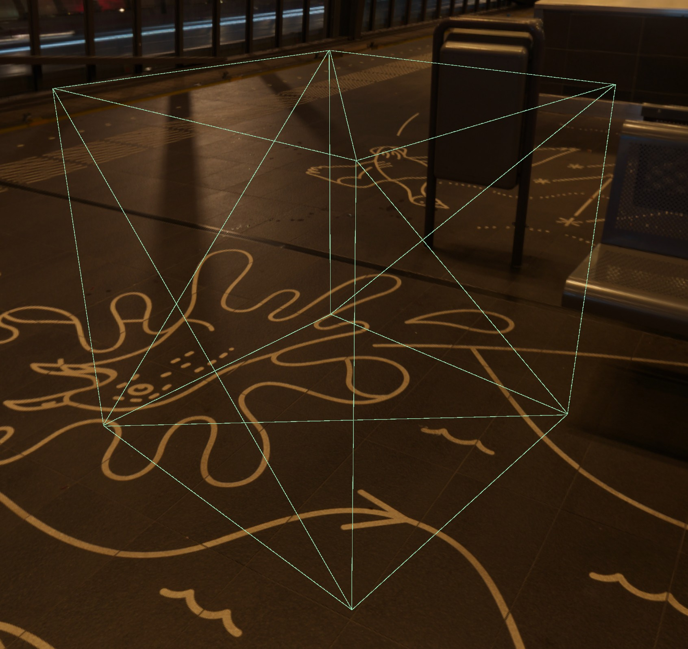
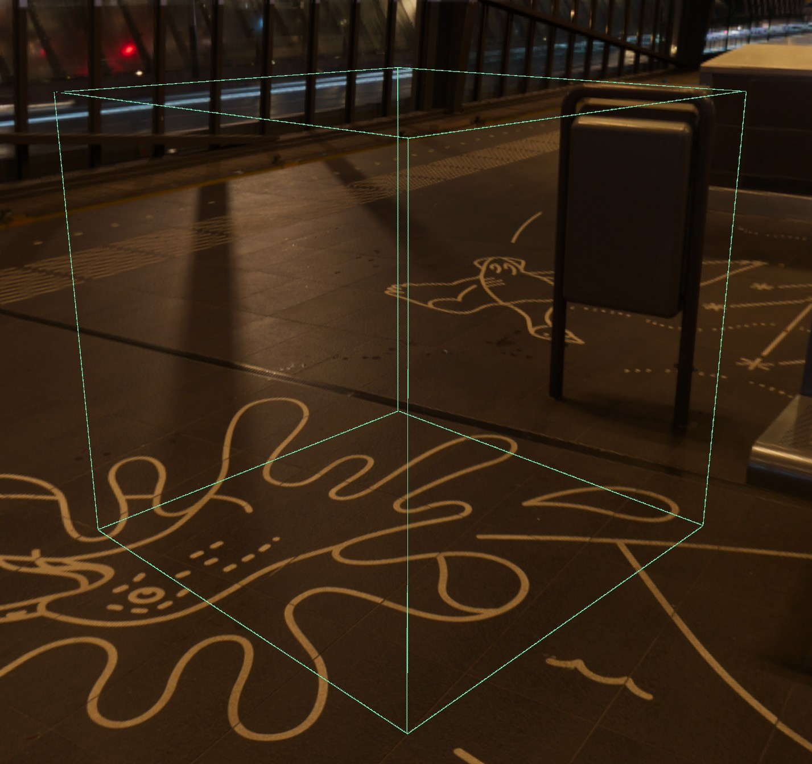
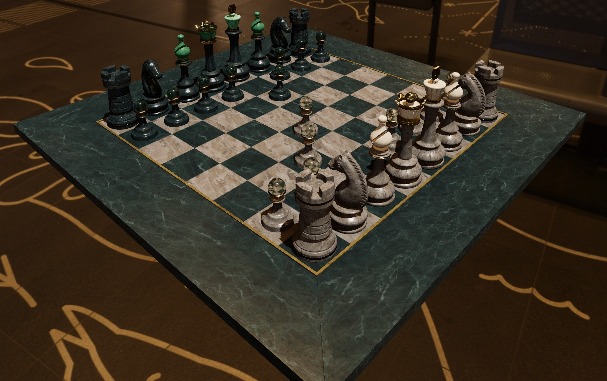
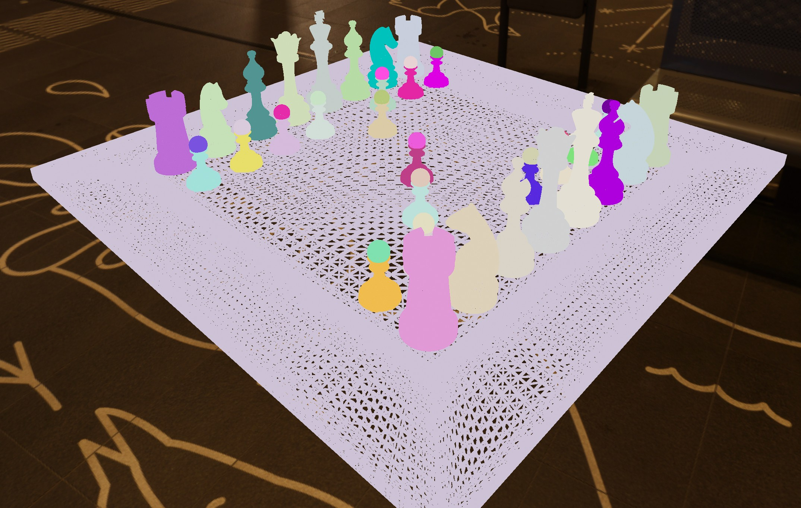
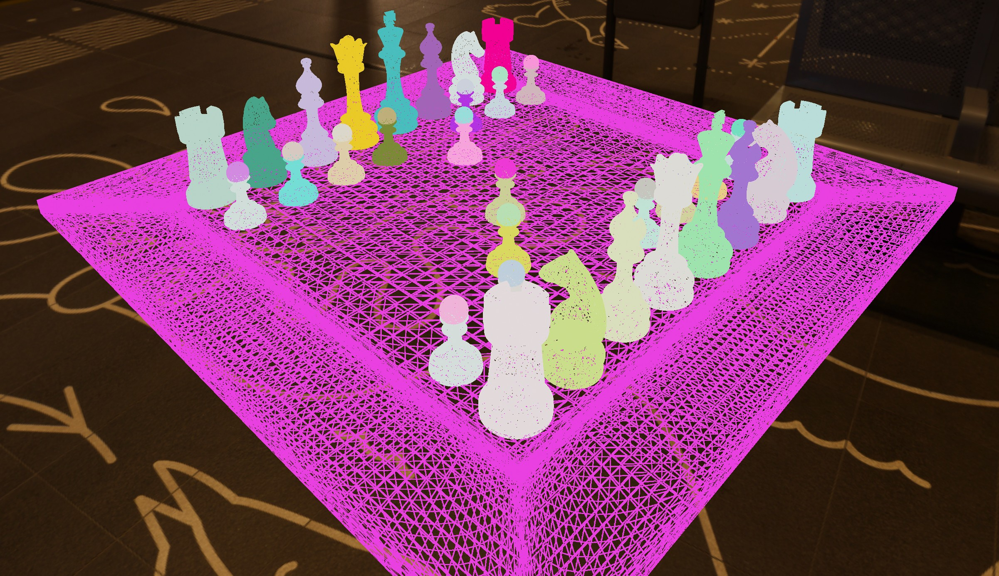
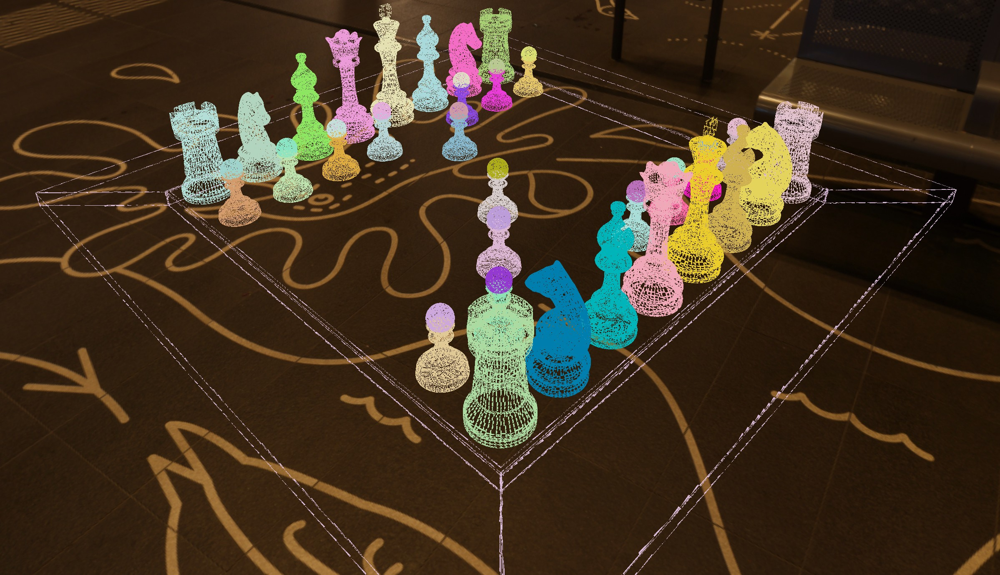
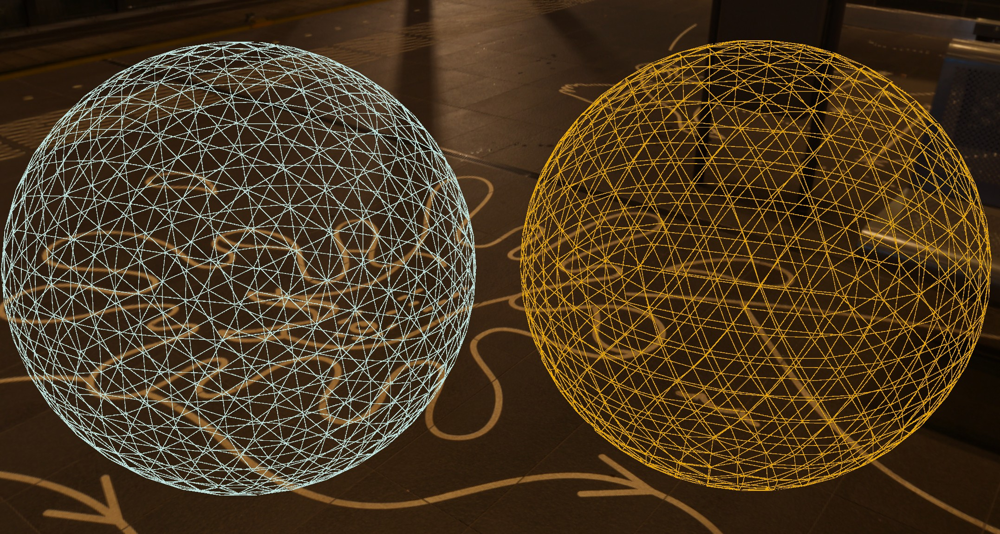
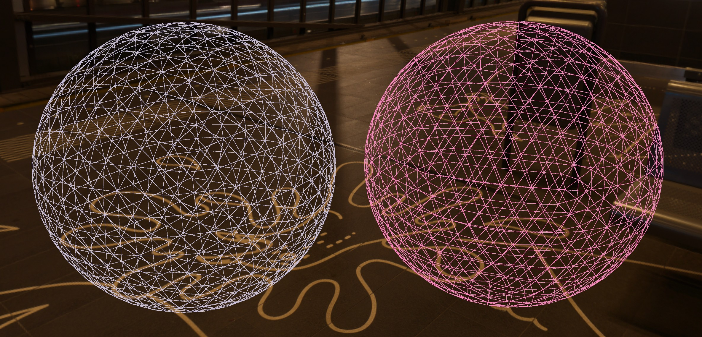
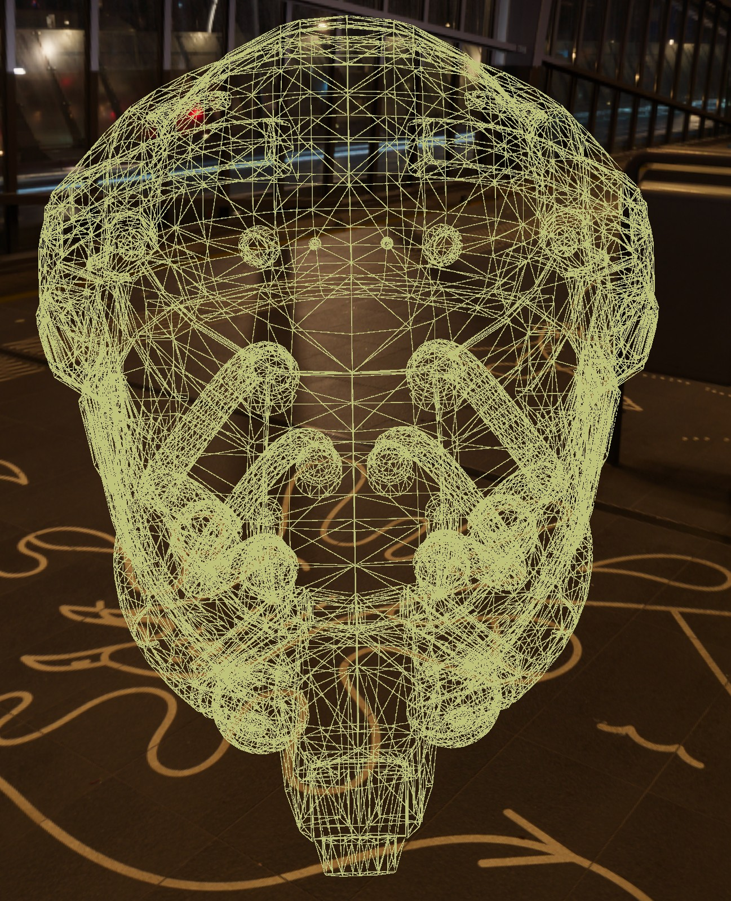
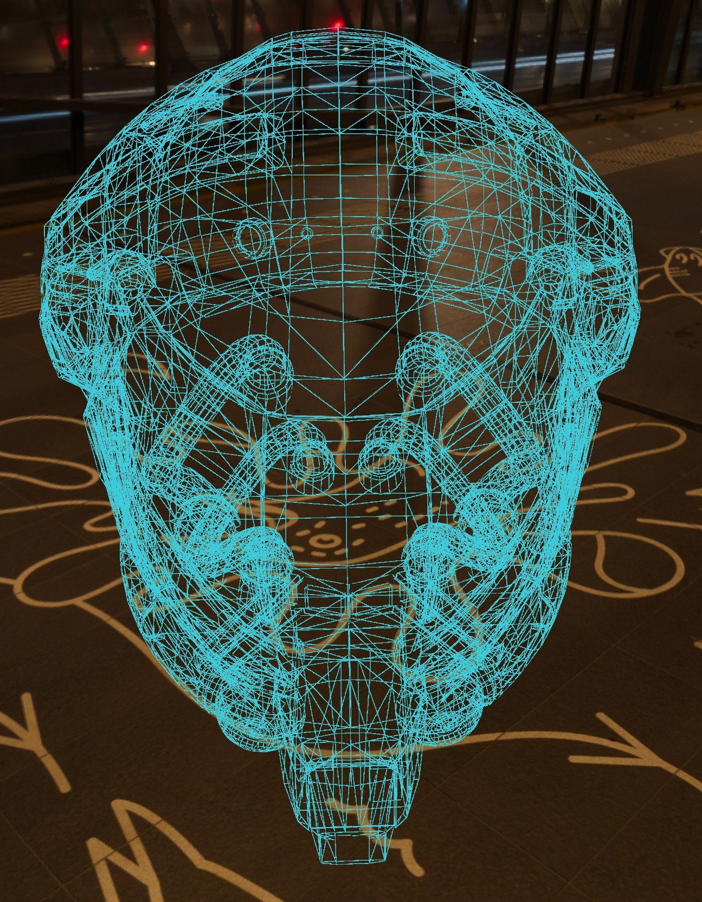

<div class="grid cards" markdown>

-   :chestnut:{ : style="margin-right:0.3em" } __In a nutshell...__

    * TODO :material-arrow-right: [Reading Input Event Data](#reading-input-event-data)

</div>

## Mesh Files

```csharp
using var crateMesh = factory.AssetLoader.LoadMesh(@"Assets/crate.obj"); // (1)!
using var crateColorTex = factory.AssetLoader.LoadColorMap(@"Assets/crate_albedo.bmp");
using var crateMat = factory.MaterialBuilder.CreateStandardMaterial(crateColorTex);
using var crateInstance = factory.ObjectBuilder.CreateModelInstance(crateMesh, crateMat); // (2)!
scene.Add(crateInstance); // (3)!
```

1.	This line instructs TinyFFR to load the "crate.obj" mesh file from "Assets/crate.obj".

	The returned `crateMesh` is a `Mesh` (explained below).
	
2.	This line creates a single [ModelInstance](model_instances.md) using the `createMesh` and a [Material](creating_materials.md).
	
3.	This line adds all the newly-instantiated model instance to a pre-existing [Scene](scenes); ready to be rendered.

It's possible to load mesh (vertex) data from common mesh file formats such as `.obj`, as well as from transmission formats such as `.gltf` etc.

`LoadMesh()` returns a `Mesh` object. A `Mesh` instance represents vertex/polygon data uploaded on to your GPU's VRAM, and should be disposed when no longer required.

You can combine a `Mesh` with a `Material` to create a `ModelInstance` which is then placeable in a `Scene`.

??? abstract "Supported Formats"
	TinyFFR can load mesh data (where specified) from the following asset formats.

	- 3D
	- [3DS](https://en.wikipedia.org/wiki/.3ds)
	- [3MF](https://en.wikipedia.org/wiki/3D_Manufacturing_Format)
	- AC
	- [AC3D](https://en.wikipedia.org/wiki/AC3D)
	- ACC
	- AMF
	- ASE
	- ASK
	- ASSBIN
	- B3D
	- [BLEND](https://en.wikipedia.org/wiki/.blend_(file_format))
	- BSP / PK3
	- [BVH](https://en.wikipedia.org/wiki/Biovision_Hierarchy)
	- CSM
	- COB
	- [DAE/ZAE/Collada](https://en.wikipedia.org/wiki/COLLADA)
	- [DXF](https://en.wikipedia.org/wiki/AutoCAD_DXF)
	- ENFF
	- [FBX](https://en.wikipedia.org/wiki/FBX)
	- [glTF 1.0](https://en.wikipedia.org/wiki/GlTF#glTF_1.0) + GLB
	- [glTF 2.0](https://en.wikipedia.org/wiki/GlTF#glTF_2.0)
	- HMP
	- IFC-STEP / IFCZIP
	- IQM
	- IRR / IRRMESH
	- [LWO](https://en.wikipedia.org/wiki/LightWave_3D)
	- LWS
	- LXO
	- MD2
	- MD3
	- MD5
	- MDC
	- MDL
	- MESH / MESH.XML
	- MOT
	- MS3D
	- NDO
	- NFF
	- [OBJ](https://en.wikipedia.org/wiki/Wavefront_.obj_file)
	- [OFF](https://en.wikipedia.org/wiki/OFF_(file_format))
	- [OGEX](https://en.wikipedia.org/wiki/Open_Game_Engine_Exchange)
	- [PLY](https://en.wikipedia.org/wiki/PLY_(file_format))
	- PMX
	- PRJ
	- Q3O
	- Q3S
	- RAW
	- SCN
	- SIB
	- SMD
	- [STP](https://en.wikipedia.org/wiki/ISO_10303-21)
	- [STL](https://en.wikipedia.org/wiki/STL_(file_format))
	- TER
	- UC
	- VRM
	- VTA
	- X
	- [X3D / X3DB](https://en.wikipedia.org/wiki/X3D)
	- XGL
	- ZGL

## Customizing the Load Operation

You can pass a `MeshCreationConfig` and `MeshReadConfig` to `LoadMesh(...)` to customize how the mesh data should be loaded:

### Rescaling

Claude please explain `meshCreationConfig.LinearRescalingFactor` here

### Adjusting the Local Origin

Claude please explain `meshCreationConfig.OriginTranslation` here

### Correcting Inside-Out Meshes

Claude please explain `meshCreationConfig.FlipTriangles` and `meshReadConfig.CorrectFlippedOrientation` here

### Optimisation & Error-Correction

Claude please explain `meshReadConfig.FixCommonExportErrors` and `meshReadConfig.OptimizeForGpu` here

### Wireframe Data

In order to [render wireframe data](the_default_material.md) for any given mesh, you should set the `meshCreationConfig.WireframeGenerationMode` to anything other than `Disabled`:

* `WireframeGenerationMode.Disabled` means no wireframe data will be loaded alongside the mesh (this is the default).
* `WireframeGenerationMode.Enabled` generates unmodified wireframe data for the mesh. This option does no additional pre-processing which means the wireframe data is a fully accurate representation of the actual underlying vertex mesh.
* `WireframeGenerationMode.EnabledWithEdgeDeduplication` removes edges in the wireframe that are doubled-up along adjacent polygons, which can help the appearance of some lines seeming thicker than others. Although this mode technically generates a not-fully-accurate representation of the mesh, it does not radically alter the wireframe data and is recommended for most use-cases.
* `WireframeGenerationMode.EnabledWithEdgeDeduplicationAndFaceClearing` does the same as `EnabledWithEdgeDeduplication` but also attempts to remove "noisy" triangulated faces/planes. In other words, this generates a wireframe that leaves most flat surfaces as "see-through" even if they are in reality comprised of multiple triangles. This mode most-drastically alters the wireframe and should be used when you want to preserve the clearest "shape" of the underlying mesh without necessarily needing to see its specific triangle make-up.

??? example "Visual Comparison"
	The images below show the difference in wireframe generation modes visually(1):
	{ .annotate }

	1.	Note the wireframe colour is randomized in each image and has no meaning here.
	
	---

	<div class="grid cards" markdown style="margin-top: 3em;">

	-	__Cube__

		---

		
		
	-	`Enabled`

		---

		
		
	-	`EnabledWithEdgeDeduplication`

		---

		
		
	-	`EnabledWithEdgeDeduplicationAndFaceClearing`

		---

		

	</div>
	
	---

	<div class="grid cards" markdown style="margin-top: 3em;">

	-	__Chess__

		---

		
		
	-	`Enabled`

		---

		
		
	-	`EnabledWithEdgeDeduplication`

		---

		
		
	-	`EnabledWithEdgeDeduplicationAndFaceClearing`

		---

		

	</div>
	
	---

	<div class="grid cards" markdown style="margin-top: 3em;">

	-	__Spheres__

		---

		
		
	-	`Enabled`

		---

		
		
	-	`EnabledWithEdgeDeduplication`

		---

		
		
	-	`EnabledWithEdgeDeduplicationAndFaceClearing`

		---

		

	</div>
	
	---

	<div class="grid cards" markdown style="margin-top: 3em;">

	-	__Helmet__

		---

		
		
	-	`Enabled`

		---

		
		
	-	`EnabledWithEdgeDeduplication`

		---

		
		
	-	`EnabledWithEdgeDeduplicationAndFaceClearing`

		---

		

	</div>

### Sub-Meshes

Claude please explain `meshReadConfig.SubMeshIndex` here
