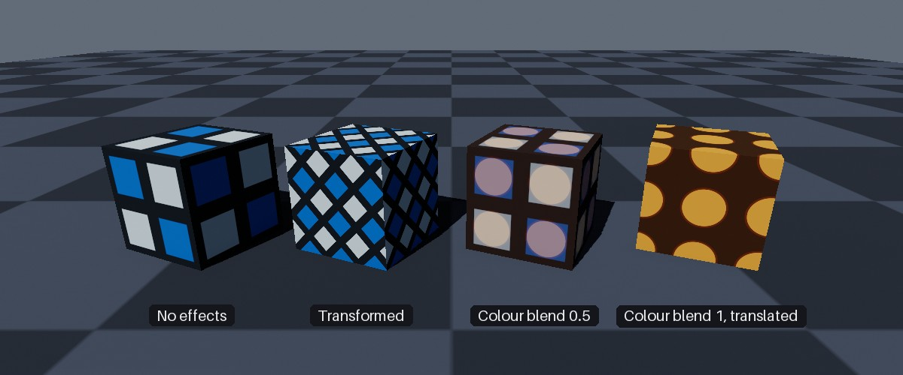
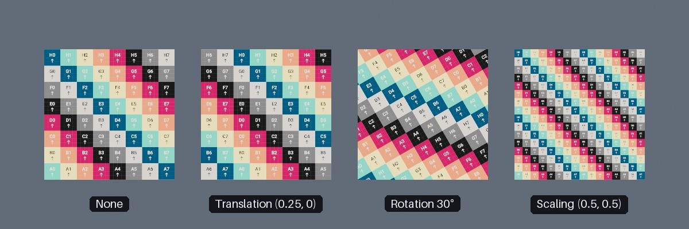
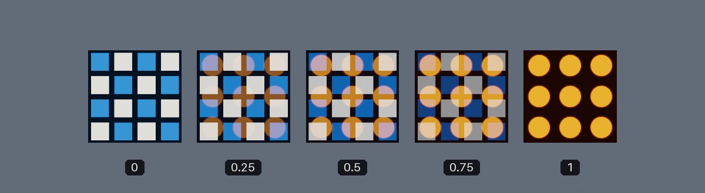

<div class="grid cards" markdown>

-   :chestnut:{ : style="margin-right:0.3em" } __In a nutshell...__

    * Material effects let each object alter the appearance of its material individually at runtime, without affecting any other object sharing the same material. :material-arrow-right: [Material Effects](#material-effects)
    * Effects must be enabled when the material is created (with `enablePerInstanceEffects: true`), and are accessed via each object's `MaterialEffects` property. :material-arrow-right: [Enabling Effects](#enabling-effects)
    * You can scale, rotate, and move the texture on the object's surface; or blend to a different texture for various map types. :material-arrow-right: [Texture Transforms](#texture-transforms), [Texture Blending](#texture-blending)

</div>

[{ : style="width:77%;" }](material_effects_hero.jpg)
/// caption
Four cubes all using the same material, each with different material effects applied.
///

## Material Effects

```csharp
using var material = factory.MaterialBuilder.CreateStandardMaterial(
	colorMap,
	enablePerInstanceEffects: true // (1)!
);
using var instance = factory.ObjectBuilder.CreateModelInstance(mesh, material);

instance.MaterialEffects?.SetTransform(new Transform2D(rotation: 45f)); // (2)!
```

1.	Effects must be enabled when the material is created.

2.	Rotates the material's textures by 45° on this instance only. Any other object using `material` is unaffected.

*Material effects* let individual objects alter their material's appearance at runtime, for example scrolling a texture across a surface (e.g. flowing water or a conveyor belt), or gradually changing a surface from one texture to another (e.g. something rusting, burning, or being painted over).

Only the object you apply an effect to is altered. Every other object sharing the material keeps its original appearance.

### Enabling Effects

Material effects are only available on materials created with `enablePerInstanceEffects: true` (or the `EnablePerInstanceEffects` [creation config](creating_materials.md#creation-configs) property set to `true`). This can only be set when the material is created; you can check whether an existing material supports effects with its `SupportsPerInstanceEffects` property.

!!! warning "Per-Instance Effects Are Costly"
	Enabling per-instance effects makes a material markedly more expensive to render, *whether or not any object actually uses them*. Only enable this option for materials that need it.

The following material types support effects:

| Material Type | Texture Transforms | Blendable Maps |
| :------------ | :----------------- | :------------- |
| [Standard](standard_materials.md#per-instance-effects) | Yes | Color; ORM(R) (if the material has an ORM(R) map); Emissive (if the material has an emissive map) |
| [Transmissive](transmissive_materials.md#per-instance-effects) | Yes | Color; Absorption-Transmission; ORMR (if the material has an ORMR map); Emissive (if the material has an emissive map) |
| [Lighting-Ignoring](lighting_ignoring_materials.md#per-instance-effects) | Yes | Color |

### Accessing Effects

```csharp
if (instance.MaterialEffects is { } effects) { // (1)!
	effects.SetTransform(new Transform2D(scaling: (2f, 2f)));
}
```

1.	`MaterialEffects` is `null` when the object's current material doesn't support effects.

Every object that uses a material (i.e. [model instances](scene_objects.md#model-instances), [quads](quads.md) (including camera-locked quads), and [mutable grids](scene_objects.md#mutable-grids)) has a `MaterialEffects` property. It returns a `MaterialEffectController` for altering that object's effects, or `null` if the object's current material doesn't support effects.

Whether `MaterialEffects` is `null` depends on the material the object is *currently* using, so read the property again after changing an object's `Material` rather than storing the controller.

## Texture Transforms

```csharp
instance.MaterialEffects?.SetTransform(new Transform2D(
	translation: (0.25f, 0f), // (1)!
	rotation: 30f, // (2)!
	scaling: (0.5f, 0.5f) // (3)!
));
```

1.	Shifts the textures a quarter of their width to the right.

2.	Rotates the textures 30° anticlockwise.

3.	Squashes the textures to half their width and height (meaning they repeat twice as often across the surface).

`SetTransform()` takes a `Transform2D` that moves, rotates, and/or scales the material's textures across the object's surface. A `Transform2D` here means exactly the same as it does for [texture pattern transforms](texture_patterns.md#transforms): Translation is a fraction of the texture's width/height, positive rotations are anticlockwise, and scaling factors below `1f` squash the texture (making it repeat more often) while factors above `1f` stretch it.

[{ : style="width:77%;" }](material_effects_transforms.jpg)
/// caption
Four quads using the same lighting-ignoring material (displaying the [UV testing texture](built-in_textures.md#uv-testing-texture)), each with a different texture transform.
///

Things to note about texture transforms:

* The transform applies to *all* of the material's textures together (its color map, normal map, ORM(R) map, etc., and any blend textures), so every aspect of the surface moves as one.
* Rotation and scaling happen around the texture's origin (texture coordinate `(0, 0)`). On a [quad](quads.md) this is its bottom-left corner.
* Textures repeat beyond their edges, so a translated, rotated, or squashed texture always fills the whole surface.
* Each call to `SetTransform()` replaces the previous transform; it does not add to it. Use `Transform2D.None` to remove the transform.

To make a texture move continuously (e.g. flowing water or a conveyor belt), set a new transform each frame:

```csharp
var scrollOffset = 0f;

// In your application loop:
scrollOffset = (scrollOffset + deltaTime * 0.1f) % 1f; // (1)!
instance.MaterialEffects?.SetTransform(new Transform2D(translation: (0f, scrollOffset)));
```

1.	Scrolls the textures upward by one tenth of their height per second. Wrapping the offset with `% 1f` keeps it small without visibly changing anything, as the texture repeats every `1f`.

## Texture Blending

```csharp
using var rustColorMap = factory.AssetLoader.LoadColorMap(@"Assets/rust_color.png");

instance.MaterialEffects?.SetBlendTexture(MaterialEffectMapType.Color, rustColorMap); // (1)!
instance.MaterialEffects?.SetBlendDistance(MaterialEffectMapType.Color, 0.5f); // (2)!
```

1.	Sets the texture to blend the material's color map towards on this instance.

2.	Blends this instance's color map halfway towards `rustColorMap`.

Texture blending gradually replaces one of the material's maps with a second texture (the *blend texture*):

* `SetBlendTexture()` sets the blend texture for one of the material's maps.
* `SetBlendDistance()` sets how far the map is blended towards that blend texture: `0f` shows only the material's own map, `1f` shows only the blend texture, and values in between mix the two linearly.

[{ : style="width:77%;" }](material_effects_blending.jpg)
/// caption
A color map blended towards a second color map at distances of `0`, `0.25`, `0.5`, `0.75`, and `1`.
///

Each map is blended independently, with its own blend texture and distance. The first argument to both methods is a `MaterialEffectMapType`, which selects the map to blend:

<span class="def-icon">:material-card-bulleted-outline:</span> `MaterialEffectMapType.Color`

:   The material's [color map](texture_map_types.md#color-maps). Supported by every material type that supports effects.

<span class="def-icon">:material-card-bulleted-outline:</span> `MaterialEffectMapType.OcclusionRoughnessMetallic` / `OcclusionRoughnessMetallicReflectance`

:   The material's [ORM(R) map](texture_map_types.md#ormr-maps). Supported by standard and transmissive materials, but only if the material was created with an ORM(R) map. The two values are interchangeable.

<span class="def-icon">:material-card-bulleted-outline:</span> `MaterialEffectMapType.Emissive`

:   The material's [emissive map](texture_map_types.md#emissive-maps). Supported by standard and transmissive materials, but only if the material was created with an emissive map.

<span class="def-icon">:material-card-bulleted-outline:</span> `MaterialEffectMapType.AbsorptionTransmission`

:   The material's [absorption-transmission map](texture_map_types.md#absorption-transmission-maps). Supported by transmissive materials only.

Things to note about texture blending:

* Blending a map the material doesn't support (e.g. `Emissive` on a material created without an emissive map) silently does nothing.
* The blend texture should be the same kind of map as the one it's blended with (e.g. a color map for `MaterialEffectMapType.Color`, an emissive map for `MaterialEffectMapType.Emissive`, etc.).
* Always set a blend texture before setting a blend distance. Setting a distance with no blend texture set does not leave the map untouched; it blends the map towards black.
* The distance is not limited to the range `0f` to `1f`. Values outside that range push the map's values past either texture. Usually you'll want to stay in the range `0f` to `1f`.
* The blend texture becomes a [dependency](resource_dependencies.md) of the object, so it can't be disposed while the object is still using it. Setting a different blend texture for the same map releases the previous one.

The blend texture only needs to be set once; after that, set the distance each frame to animate the blend:

```csharp
var rustProgress = 0f;

// In your application loop:
rustProgress = MathF.Min(rustProgress + deltaTime * 0.05f, 1f); // (1)!
instance.MaterialEffects?.SetBlendDistance(MaterialEffectMapType.Color, rustProgress);
```

1.	Increases the blend distance by 0.05 per second (i.e. fully rusted after 20 seconds), never going beyond `1f`.
