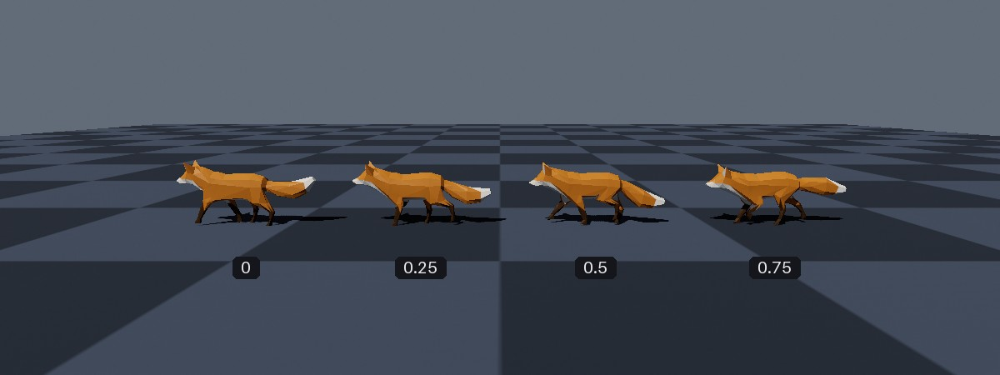
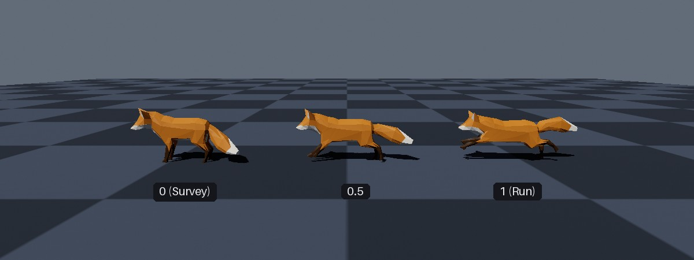
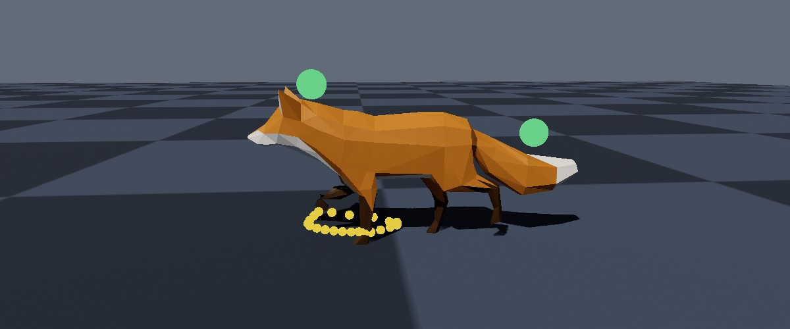

<div class="grid cards" markdown>

-   :chestnut:{ : style="margin-right:0.3em" } __In a nutshell...__

    * An animation is played on an object via an *animation player*, obtained from `instance.GetAnimationPlayer()` (or `group.GetAnimationPlayer()`). :material-arrow-right: [Playing Skeletal Animations](#playing-skeletal-animations)
    * Two animations can be blended together, e.g. to transition smoothly from walking to running. :material-arrow-right: [Blending Animations](#blending-animations)
    * The position of any node (e.g. a hand) can be read back after posing, to attach other objects to it. :material-arrow-right: [Node Transforms](#node-transforms)

</div>

{ : style="width:77%;" }
/// caption
Four instances of the same fox model, each posed at a different fraction of the way through its "Walk" animation.
///

## Playing Skeletal Animations

```csharp
using var foxAsset = factory.AssetLoader.LoadBundledAsset(@"Assets/Models/Fox.glb");
using var fox = factory.ObjectBuilder.CreateModelInstances(foxAsset);
scene.Add(fox);

var walkAnim = fox.Animations["Walk"]; // (1)!

while (!loop.Input.UserQuitRequested) {
	_ = loop.IterateOnce();
	var elapsedSeconds = (float) loop.TotalIteratedTime.TotalSeconds;

	fox.GetAnimationPlayer(walkAnim).SetTimePoint(elapsedSeconds, AnimationWrapStyle.Loop); // (2)!

	renderer.Render();
}
```

1.	Looks up the bundle's "Walk" animation. Listing and looking up a mesh's (or bundle's) animations is explained in [Skeletal Meshes](skeletal_meshes.md#animations).

2.	Poses the fox in its walk animation at `elapsedSeconds`, looping the animation back to its start each time it ends.

Skeletal animations are played on objects using an *animation player*. Every [model instance](scene_objects.md#model-instances) and model instance group has a `GetAnimationPlayer()` method that returns a player for the given animation; you then set the moment of the animation that the object should be posed at.

The player does *not* advance through the animation by itself; you tell it which moment to pose the object at, usually once per frame. This keeps the animation's timeline entirely under your control; uou can pause an animation (by not changing the time), play it backwards, scrub through it, or drive it from something other than elapsed time altogether (e.g. a character's walking speed or a door's open/closed fraction).

## Animation Players

```csharp
var player = instance.GetAnimationPlayer(walk); // (1)!
var fastPlayer = instance.GetAnimationPlayerWithSpeedMultiplier(walk, 2f); // (2)!
var slowPlayer = instance.GetAnimationPlayerWithTargetDuration(walk, 3f); // (3)!

player.SetTimePoint(0.5f); // (4)!
player.SetCompletionFraction(0.5f); // (5)!
```

1.	A player that plays the animation at its authored speed.

2.	A player that plays the animation twice as fast as its authored speed.

3.	A player that plays the animation at whatever speed makes it last exactly 3 seconds from start to finish.

4.	Poses the instance as the animation has it half a second in.

5.	Poses the instance as the animation has it halfway through.

Animation players are created with the following methods (available on both `ModelInstance` and `ModelInstanceGroup`):

<span class="def-icon">:material-code-block-parentheses:</span> `GetAnimationPlayer(animation)`

:   Returns a `MeshAnimationPlayer` that plays the given animation at its authored speed.

<span class="def-icon">:material-code-block-parentheses:</span> `GetAnimationPlayerWithSpeedMultiplier(animation, speedMultiplier)`

:   Returns a `MeshAnimationPlayer` that plays the animation at a multiple of its authored speed (e.g. `2f` plays it twice as fast, `0.5f` half as fast, etc).

<span class="def-icon">:material-code-block-parentheses:</span> `GetAnimationPlayerWithTargetDuration(animation, durationSeconds)`

:   Returns a `MeshAnimationPlayer` that plays the animation at whatever speed makes it take the given number of seconds from start to finish.

Each method also has an overload that takes two animations, which returns a blended player instead (see [Blending Animations](#blending-animations)).

Players can also be constructed directly (e.g. `new MeshAnimationPlayer(instance, animation)` or `MeshAnimationPlayer.CreateWithSpeedMultiplier(...)`), and their `SpeedMultiplier` or `DurationSeconds` can be changed with a `with` expression (e.g. `player with { SpeedMultiplier = 1.5f }`).

!!! tip "Animation Players are Cheap"
	Animation players are lightweight structs, not resources. They don't need disposing, cost nothing to create, and can be recreated every frame (as in the example above).

### Setting the Pose

A `MeshAnimationPlayer` poses its object with the following methods:

<span class="def-icon">:material-code-block-parentheses:</span> `SetTimePoint(timePointSeconds)`

:   Poses the object as the animation has it at the given moment, in seconds since the animation's start (as adjusted by the player's speed; so at double speed, a time point of `1f` poses the object as the animation has it two seconds in).

<span class="def-icon">:material-code-block-parentheses:</span> `SetCompletionFraction(fraction)`

:   Poses the object as the animation has it at the given fraction of the way through (i.e. `0f` is its start and `1f` its end), regardless of the player's speed.

Both methods have an overload taking an `AnimationWrapStyle` (see [Wrap Styles](#wrap-styles)), and `...AndGetNodeTransforms()` variants that also report where nodes ended up (see [Node Transforms](#node-transforms)).

Time points before an animation's start or after its end (without a wrap style) simply hold the animation's first or last pose respectively.

## Wrap Styles

```csharp
player.SetTimePoint(elapsedSeconds, AnimationWrapStyle.LoopPingPonged);
```

A wrap style determines what happens when the time point you give goes beyond the end of the animation (i.e. when more time has passed than the animation lasts)(1):
{ .annotate }

1.	The wrap style also applies to time points earlier than 0.

<span class="def-icon">:material-card-bulleted-outline:</span> `AnimationWrapStyle.Once`

:   The animation plays once, then holds its final pose.

<span class="def-icon">:material-card-bulleted-outline:</span> `AnimationWrapStyle.OncePingPonged`

:   The animation plays once forwards, then once in reverse back to the start, then holds its first pose.

<span class="def-icon">:material-card-bulleted-outline:</span> `AnimationWrapStyle.Loop`

:   The animation snaps back to its start every time it reaches its end, repeating indefinitely. This suits animations made to loop seamlessly, such as walk cycles.

<span class="def-icon">:material-card-bulleted-outline:</span> `AnimationWrapStyle.LoopPingPonged`

:   The animation plays forwards, then in reverse back to the start, then forwards again, repeating indefinitely.

If you need to know which moment of the animation a wrap style will pick (e.g. to drive something else in sync), `wrapStyle.ApplyToTimePoint(timePointSeconds, animation.DefaultDurationSeconds)` returns it.

## Blending Animations

```csharp
var survey = fox.Animations["Survey"];
var run = fox.Animations["Run"];
var runBlend = 0f;

// In your application loop:
runBlend = isRunning // (1)!
	? MathF.Min(runBlend + deltaTime / 0.3f, 1f)
	: MathF.Max(runBlend - deltaTime / 0.3f, 0f);

foxInstances.GetAnimationPlayer(survey, run).SetTimePoint( // (2)!
	elapsedSeconds, AnimationWrapStyle.Loop, // (3)!
	elapsedSeconds, AnimationWrapStyle.Loop,
	runBlend // (4)!
);
```

1.	Moves `runBlend` towards `1f` over 0.3 seconds while the fox is running, and back towards `0f` while it isn't. (`isRunning` is a hypothetical value from your own code.)

2.	Gets a player that blends between the survey (start) and run (end) animations.

3.	Each animation has its own time point and wrap style.

4.	How far to blend from the survey animation (`0f`) to the run animation (`1f`).

{ : style="width:77%;" }
/// caption
The fox's "Survey" and "Run" animations, blended at interpolation distances of `0`, `0.5`, and `1`.
///

Switching an object directly from one animation to another makes it snap from one pose to the next. A *blended* player plays two animations at once and mixes their poses together, so that you can move smoothly from one animation to the other over a short time (or hold a mix of the two, e.g. a lean or limp layered over a walk).

Blended players (`MeshBlendedAnimationPlayer`) are created by passing two animations to `GetAnimationPlayer()`, `GetAnimationPlayerWithSpeedMultiplier()`, or `GetAnimationPlayerWithTargetDuration()` (each with a speed or duration per animation). Their `SetTimePoint()` and `SetCompletionFraction()` methods take a time point (or fraction) for *each* animation, optionally a wrap style for each, and finally the *interpolation distance*: `0f` poses the object entirely as the first ("start") animation, `1f` entirely as the second ("end") animation, and values between mix the two.

Things to note about blending:

* Each animation keeps its own time point, speed, and wrap style; so animations of different lengths can be blended (as in the example, where the walk and run cycles last different lengths of time).
* A node that is moved by only one of the two animations is blended between that animation's pose and its default (bind pose) position.
* Both animations must come from the same mesh (or the same shared animation table; see [Animating Groups](#animating-groups)); blending animations from different meshes or tables throws an `ArgumentException`. Note that a bundle's shared animations (e.g. `bundle.Animations`) and each of its meshes' own animations (e.g. `bundle.Meshes[0].Animations`) are separate, and can not be blended with each other.

## Node Transforms

```csharp
var head = fox.Skeleton.Nodes["b_Head_05"];

// In your application loop:
foxInstances.GetAnimationPlayer(walk).SetTimePointAndGetNodeTransforms(
	elapsedSeconds, 
	AnimationWrapStyle.Loop, 
	head, 
	out var headTransform // (1)!
);

var worldTransform = headTransform * foxInstances.Transform.ToMatrix(); // (2)!
hat.Position = Location.FromVector3(worldTransform.Translation); // (3)!
```

1.	Poses the instances and outputs the head node's resulting transform, relative to the model's own origin.

2.	Combines the head's transform with the instances' own transform, giving the head's transform in the world.

3.	Moves a separate object (`hat`) to the head's position.

{ : style="width:77%;" }
/// caption
Green markers following the fox's head and tail nodes (raised slightly above each node so that they're not hidden inside the fox); and the yellow path of its front paw over one walk cycle.
///

Every `SetTimePoint()` and `SetCompletionFraction()` method has a `...AndGetNodeTransforms()` variant, which poses the object and then reports where one or more of the skeleton's nodes ended up. This lets you attach other objects to parts of an animated model (e.g. a sword to a hand, or a hat to a head), or react to where they are (e.g. footstep sounds or effects).

The nodes can be given as:

* A single `MeshNode`, with the result written to an `out Matrix4x4`;
* A `ReadOnlySpan<MeshNode>`, with the results written to a `Span<Matrix4x4>` of at least the same length, in the same order;
* A `ReadOnlySpan<int>` of node indices, with the results written to a `Span<Matrix4x4>`. Unlike `MeshNode`s, indices can be `stackalloc`ed.

Looking up nodes by name or index is explained in [Skeletal Meshes](skeletal_meshes.md#nodes).

The reported transforms are relative to the model's own origin (*model space*). To find where a node is in the world, multiply its transform by the object's own transform, as in the example above (`nodeTransform * objectTransform.ToMatrix()`, in that order). Note also that nodes are the "joints" of the skeleton, and so usually lie *inside* the model.

### Without Posing

```csharp
walk.GetNodeTransforms(1.2f, head, out var headTransformAtOnePointTwoSeconds);
```

To find out where nodes *would* be at any moment of an animation without posing anything, use the animation's own `GetNodeTransforms()` method (or `GetBlendedNodeTransforms()` for a blend of two animations). The time point is in seconds at the animation's authored speed. This is how the paw's path in the image above was found.
