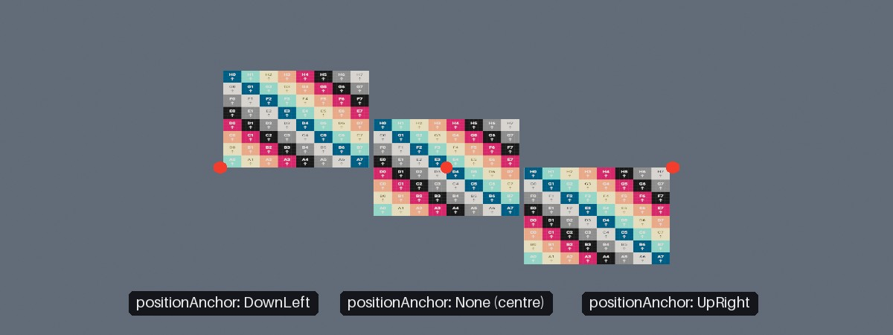
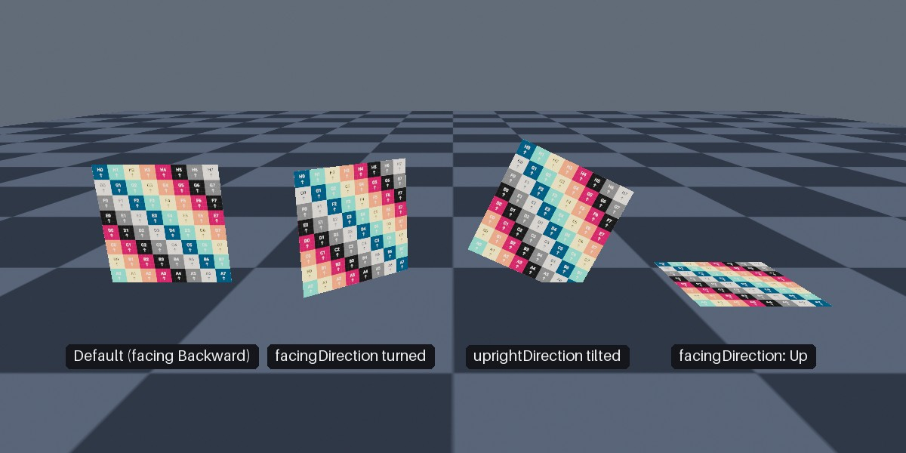

<div class="grid cards" markdown>

-   :chestnut:{ : style="margin-right:0.3em" } __In a nutshell...__

    * A quad is a single flat rectangle placed in the world. :material-arrow-right: [Quads](#quads)
    * Quads are easier to work with than standard `ModelInstance`s for placing + sizing in-world. :material-arrow-right: [Placing & Sizing](#placing-sizing)

</div>

## Quads

```csharp
using var quadMesh = factory.MeshBuilder.CreateQuad(); // (1)!
using var poster = factory.ObjectBuilder.CreateQuadInstance( // (2)!
	quadMesh, 
	posterMaterial, 
	position: new Location(0f, 1.5f, 3f), 
	size: new XYPair<float>(1f, 1.4f)
);
scene.Add(poster); // (3)!

poster.Scaling = new XYPair<float>(2f, 2.8f); // (4)!
```

1.	Creates the underlying mesh: A flat 1m × 1m square. One quad mesh can be used by any number of quad instances.

2.	Creates in instance of the mesh: A 1m × 1.4m rectangle placed at `(0, 1.5, 3)`, facing backward (i.e. towards a camera looking forward).

3.	Like any other object, a quad must be added to a scene to be rendered.

4.	Doubles the quad's size to 2m × 2.8m.

A *quad* is a single flat rectangle placed in the world. Quads are the natural fit for anything that is flat by nature, such as signs, posters, sprites, decals, and screens. They're also commonly used for performance tricks, such as drawing a distant tree as a flat image rather than a detailed model.

A `QuadInstance` is a specialized view of a `ModelInstance` (available via its `UnderlyingModelInstance` property). You can achieve everything using quads that you could achieve using just a `Mesh` and a `ModelInstance`; but quads provide utility members that make it much easier to work with for a flat object (such as a two-dimensional size, a facing direction, custom anchor points, etc). Disposing a quad instance disposes its underlying model instance.

Other details:

* A quad can be wrapped in a [`SceneObject`](scene_objects.md#sceneobject).
* [Scene queries](scenes.md#scene-queries) return the quad's underlying `ModelInstance`. `QuadInstance.FromPreviouslyAllocatedUnderlyingModelInstance()` and `QuadMesh.FromPreviouslyAllocatedUnderlyingMesh()` wrap an existing model instance or mesh as a quad, without creating anything new. Only use these with an instance or mesh that really was created as a quad.
* A [`ResourceGroup`](resource_groups.md) lists quads and quad meshes under `QuadInstances` and `QuadMeshes` (rather than `ModelInstances` and `Meshes`).

## Quad Meshes

Quad meshes are created with `factory.MeshBuilder.CreateQuad()`, which accepts the following optional parameters:

<span class="def-icon">:material-code-json:</span> `twoSided`

:   Whether the quad is visible from behind as well as from in front. Defaults to `true`.

<span class="def-icon">:material-code-json:</span> `backSideInvertsTextures`

:   Whether the back face of a two-sided quad mirrors its texture. Defaults to `false`.

	By default, a quad seen from behind shows its texture back-to-front (like looking at a window decal from outside). Set this to `true` to make the quad read the right way round from either side, which is usually what you want for text or images that should be legible from both sides.

<span class="def-icon">:material-code-json:</span> `textureTransform`

:   An optional `Transform2D` to scale, rotate, or shift the quad's texture coordinates; e.g. to repeat a texture several times across the quad. See [Creating Meshes](creating_meshes.md#meshgenerationconfig) for more on texture transforms.

<span class="def-icon">:material-code-json:</span> `name`

:   An optional name for the mesh.

A quad mesh is always a 1m × 1m square centred on its own origin; it's the quad *instance* that gives it its size, position, and orientation. This means you only ever need one quad mesh per combination of the options above, no matter how many quads you draw or what size they are.

A `QuadMesh` converts implicitly to a `Mesh`, so it can be used anywhere a mesh is expected (e.g. to create an ordinary `ModelInstance`).

## Creating Quad Instances

Quad instances are created with `factory.ObjectBuilder.CreateQuadInstance()`, which accepts the following parameters:

<span class="def-icon">:material-code-json:</span> `mesh`

:   The `QuadMesh` to use.

<span class="def-icon">:material-code-json:</span> `material`

:   The material to draw the quad with. Quads can use any material.

<span class="def-icon">:material-code-json:</span> `position`

:   Where to place the quad. Defaults to the origin.

<span class="def-icon">:material-code-json:</span> `size`

:   The width and height of the quad, in metres. Defaults to `(1, 1)`.

<span class="def-icon">:material-code-json:</span> `facingDirection`

:   Which way the quad's front face points. Defaults to `Direction.Backward`, which faces a camera looking in the default (forward) direction.

<span class="def-icon">:material-code-json:</span> `uprightDirection`

:   Which way is "up" across the quad's face. Defaults to `Direction.Up`. Must not be parallel to `facingDirection`.

<span class="def-icon">:material-code-json:</span> `positionAnchor`

:   Which point of the quad is placed at `position`. Defaults to `Orientation2D.None`, meaning the quad's centre. For example, `Orientation2D.Down` places the middle of the quad's bottom edge at `position`, which is handy for standing a quad on the ground.

	The quad remembers its anchor: from then on, its `Position` refers to this point (see [Placing & Sizing](#placing-sizing)).

<span class="def-icon">:material-code-json:</span> `name`

:   An optional name for the quad.

{ : style="width:77%;" }
/// caption
Three quads, each placed at one of the red markers with a different `positionAnchor`.
///

Alternatively, `CreateQuadInstance(mesh, material, config, positionAnchor)` takes a `ModelInstanceCreationConfig`, in which case the quad's initial transform must be specified directly (see [Placing & Sizing](#placing-sizing) for how to calculate one). The config's transform always places the quad's centre; the optional `positionAnchor` only sets which point of the quad its `Position` refers to.

## Placing & Sizing

```csharp
quad.Scaling = new XYPair<float>(3f, 2f); // (1)!

quad.SetTransform( // (2)!
	position: new Location(0f, 0.01f, 0f),
	size: new XYPair<float>(2f, 2f),
	facingDirection: Direction.Up,
	uprightDirection: Direction.Forward
);

quad.MoveBy(new Vect(0f, 0f, 1f)); // (3)!
quad.RotateBy(90f % Direction.Up); // (4)!
```

1.	Resizes the quad to 3m × 2m.

2.	Lays the quad flat on the ground (facing upward), like a decal or a rug.

3.	Moves the quad 1m forward; same API as with `ModelInstance`s.

4.	Turns the quad 90° around the up axis, pivoting around its `Position`; same API as with `ModelInstance`s.

A quad's `Scaling` is two-dimensional (an `XYPair<float>`) because a quad has no depth. As a quad mesh is a 1m × 1m square, a quad's scaling is also its size in metres.

`SetTransform(position, size, facingDirection, uprightDirection, positionAnchor)` places, orients, and sizes a quad in one call, in the same terms as the creation parameters described above. Quads also have all the usual transform members of an object (`Position`, `Rotation`, `MoveBy()`, `RotateBy()`, `ScaleBy()`, etc.; see [Scene Objects](scene_objects.md)).

{ : style="width:77%;" }
/// caption
Quads with their default orientation, a turned `facingDirection`, a tilted `uprightDirection`, and facing upward.
///

???+ info "Position Anchors"
	A quad remembers the `positionAnchor` it was created with (or last placed with via `SetTransform()`), which can be read back via its `PositionAnchor` property. A quad's `Position` refers to that anchor point, and moving, turning, or rescaling the quad keeps the anchor point where it is. For example, a sign anchored at `Orientation2D.Down` grows upward from its base when scaled up, rather than sinking in to the ground.

	(The quad's `Transform.Translation`, on the other hand, is always its centre.)

If you need the transform for a quad without creating or moving one (e.g. to pass to a `ModelInstanceCreationConfig`), `QuadMesh.CalculateTransformForStandardQuadMesh(position, size, facingDirection, uprightDirection, positionAnchor)` performs the same calculation as `SetTransform()` and returns the resulting `Transform`. `QuadMesh.CalculateAnchorOffsetForStandardQuadMesh(size, positionAnchor)` returns just the offset between a quad's centre and a given anchor point (before rotation).

## Camera-Locked Quads

```csharp
using var icon = factory.ObjectBuilder.CreateCameraLockedQuadInstance(
	quadMesh, 
	iconMaterial, 
	position: new Location(0f, 2f, 0f)
);
```

A *camera-locked* quad (`CameraLockedQuadInstance`) has its facing direction 'locked' to always face the camera, so it always appears face-on. Camera-locked quads are useful for markers, icons, and particle-like effects, and can optionally keep a constant size on screen however far away they are.

They're explained in full on their own page: [Camera-Locked Objects](camera-locked_objects.md).
