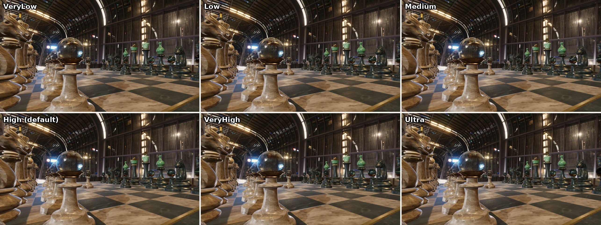
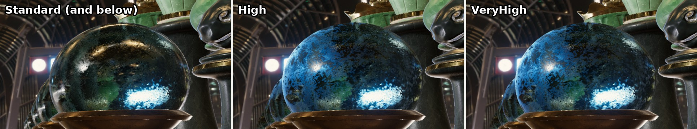
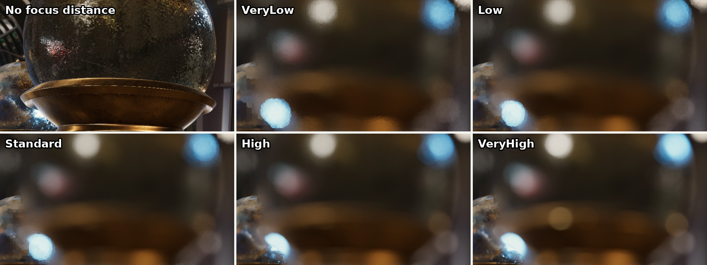
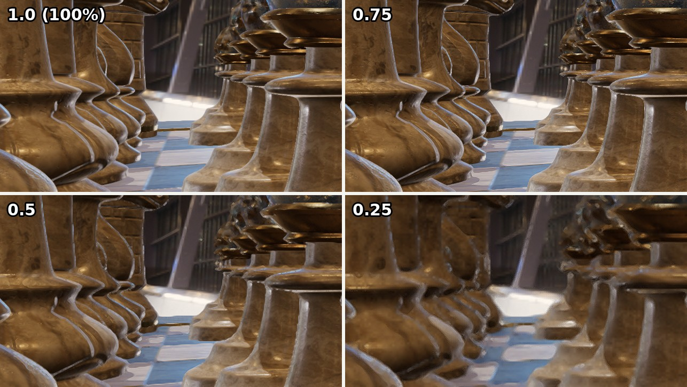
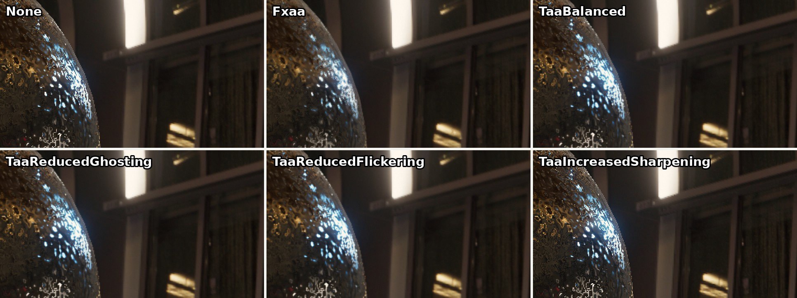
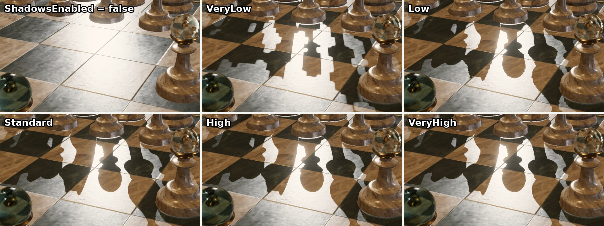
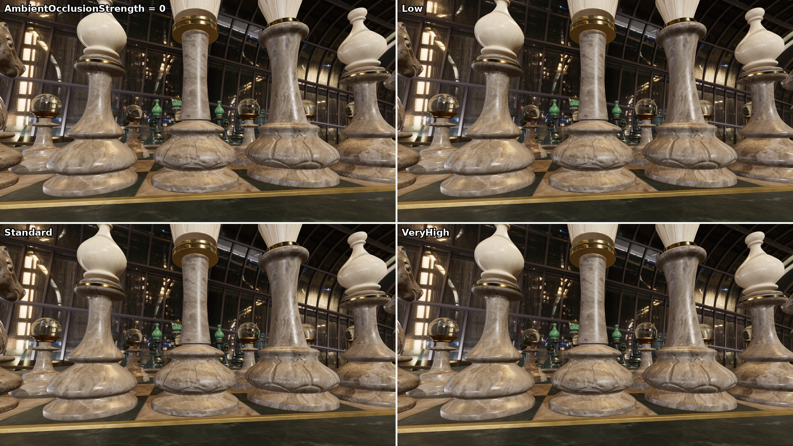
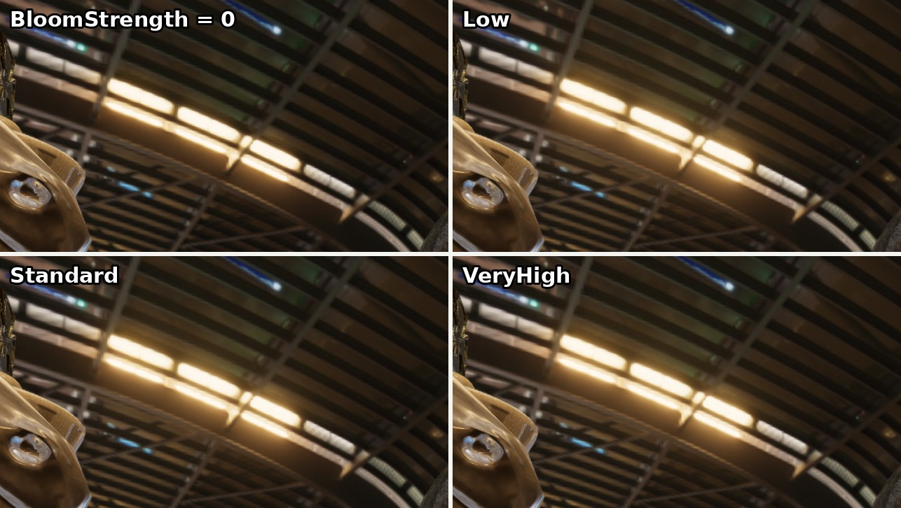

<div class="grid cards" markdown>

-   :chestnut:{ : style="margin-right:0.3em" } __In a nutshell...__

    * Each renderer has a `RenderQualityConfig` that can be used to balance visual fidelity vs performance. :material-arrow-right: [Setting Quality](#setting-quality)

</div>

## Setting Quality

```csharp
var renderer = factory.RendererBuilder.CreateRenderer(
	scene, 
	camera, 
	window, 
	new RendererCreationConfig { Quality = new RenderQualityConfig(BuiltInQualityConfiguration.VeryHigh) } // (1)!
);

renderer.SetQuality(BuiltInQualityConfiguration.Medium); // (2)!
renderer.SetQuality(new RenderQualityConfig(BuiltInQualityConfiguration.High) { // (3)!
	AntiAliasingMode = AntiAliasingMode.TaaBalanced,
	DepthOfFieldQuality = Quality.Standard
});
```

1.	Creates a renderer using the `VeryHigh` preset. If no quality is given, renderers use `RenderQualityConfig.SceneDefault` (the `High` preset), or `RenderQualityConfig.CanvasSceneDefault` (the `Canvas` preset) for [canvas scenes](canvas_scenes.md).

2.	Changes an existing renderer's quality to the `Medium` preset. Quality can be changed at any time.

3.	Starts from a preset and adjusts individual options. This is usually easier than setting every option yourself.

### Presets

[](render_quality_presets.jpg)
/// caption
The six general-purpose presets. Most of the differences are in fine detail (see the comparisons for each option below).
///

| Option | `VeryLow` | `Low` | `Medium` | `High` (default) | `VeryHigh` | `Ultra` |
| :-- | :-: | :-: | :-: | :-: | :-: | :-: |
| `ScreenSpaceEffectsQuality` | VeryLow | Low | Standard | High | High | VeryHigh |
| `AntiAliasingMode` | None | None | Fxaa | Fxaa | TaaBalanced | TaaIncreasedSharpening |
| `InternalResolutionScalar` | 0.667 | 0.75 | 1 | 1 | 1 | 1 |
| `ShadowQuality` | VeryLow | Low | Standard | High | High | VeryHigh |
| `AmbientOcclusionQuality` | VeryLow | Low | Standard | Standard | High | VeryHigh |
| `BloomQuality` | VeryLow | Low | Standard | High | VeryHigh | VeryHigh |
| `DepthOfFieldQuality` | VeryLow | Low | Standard | High | High | VeryHigh |
| `HdrColorPrecision` | VeryLow | Low | Standard | High | High | VeryHigh |
| `DitheringEnabled` | No | No | Yes | Yes | Yes | Yes |

There are also two special-purpose presets:

* `Canvas` disables post-processing, shadows, anti-aliasing, and dithering, and sets the strength of ambient occlusion, bloom, and depth of field to zero. It's the default for [canvas scenes](canvas_scenes.md), which need none of these effects.
* `DebugAndDiagnostic` is intended for debugging, where the raw, unprocessed output is often more useful and you don't need high visual fidelity. (It leaves `InternalResolutionScalar` at 100%; lower it as well if you need maximum speed.)

## Quality Options

The following table shows the relative cost of each option at each preset's setting. Exact costs vary with hardware, resolution, and scene, so treat the following table as a guide, and measure your own application where it matters (see [Measuring Framerate](measuring_framerate.md)).

| Option | `VeryLow` | `Low` | `Medium` | `High` (default) | `VeryHigh` | `Ultra` |
| :-- | :-: | :-: | :-: | :-: | :-: | :-: |
| `ScreenSpaceEffectsQuality` | :material-circle:{ style="color:#9e9e9e" } None | :material-circle:{ style="color:#9e9e9e" } None | :material-circle:{ style="color:#9e9e9e" } None | :material-circle:{ style="color:#f4511e" } Heavy | :material-circle:{ style="color:#f4511e" } Heavy | :material-circle:{ style="color:#f4511e" } Heavy |
| `DepthOfFieldQuality` | :material-circle:{ style="color:#ffb300" } Moderate ¹ | :material-circle:{ style="color:#ffb300" } Moderate ¹ | :material-circle:{ style="color:#ffb300" } Moderate ¹ | :material-circle:{ style="color:#f4511e" } Heavy ¹ | :material-circle:{ style="color:#f4511e" } Heavy ¹ | :material-circle:{ style="color:#b71c1c" } Very heavy ¹ |
| `InternalResolutionScalar` | :material-arrow-down-bold-circle:{ style="color:#1e88e5" } Saves | :material-arrow-down-bold-circle:{ style="color:#1e88e5" } Saves | Full | Full | Full | Full |
| `AntiAliasingMode` | :material-circle:{ style="color:#9e9e9e" } None | :material-circle:{ style="color:#9e9e9e" } None | :material-circle:{ style="color:#4caf50" } Slight | :material-circle:{ style="color:#4caf50" } Slight | :material-circle:{ style="color:#ffb300" } Moderate | :material-circle:{ style="color:#ffb300" } Moderate |
| `ShadowQuality` | :material-circle:{ style="color:#ffb300" } Moderate ² | :material-circle:{ style="color:#ffb300" } Moderate ² | :material-circle:{ style="color:#ffb300" } Moderate ² | :material-circle:{ style="color:#ffb300" } Moderate ² | :material-circle:{ style="color:#ffb300" } Moderate ² | :material-circle:{ style="color:#ffb300" } Moderate ² |
| `AmbientOcclusionQuality` | :material-circle:{ style="color:#4caf50" } Slight | :material-circle:{ style="color:#4caf50" } Slight | :material-circle:{ style="color:#4caf50" } Slight | :material-circle:{ style="color:#4caf50" } Slight | :material-circle:{ style="color:#4caf50" } Slight | :material-circle:{ style="color:#4caf50" } Slight |
| `BloomQuality` | :material-circle:{ style="color:#4caf50" } Slight | :material-circle:{ style="color:#4caf50" } Slight | :material-circle:{ style="color:#4caf50" } Slight | :material-circle:{ style="color:#4caf50" } Slight | :material-circle:{ style="color:#4caf50" } Slight | :material-circle:{ style="color:#4caf50" } Slight |
| `HdrColorPrecision` | :material-circle:{ style="color:#4caf50" } Slight | :material-circle:{ style="color:#4caf50" } Slight | :material-circle:{ style="color:#4caf50" } Slight | :material-circle:{ style="color:#4caf50" } Slight | :material-circle:{ style="color:#4caf50" } Slight | :material-circle:{ style="color:#4caf50" } Slight |
| `DitheringEnabled` | :material-circle:{ style="color:#9e9e9e" } None | :material-circle:{ style="color:#9e9e9e" } None | :material-circle:{ style="color:#4caf50" } Slight | :material-circle:{ style="color:#4caf50" } Slight | :material-circle:{ style="color:#4caf50" } Slight | :material-circle:{ style="color:#4caf50" } Slight |

:material-circle:{ style="color:#9e9e9e" } None (disabled) · :material-circle:{ style="color:#4caf50" } Slight (under ~5% of a frame) · :material-circle:{ style="color:#ffb300" } Moderate (~5-40%) · :material-circle:{ style="color:#f4511e" } Heavy (~40-100%) · :material-circle:{ style="color:#b71c1c" } Very heavy (more than a whole frame) · :material-arrow-down-bold-circle:{ style="color:#1e88e5" } Saves (reduces the cost of almost everything else)

¹ Only when the camera has a `FocusDistance` set; otherwise depth of field costs nothing.<br/>
² With a single shadow-casting light. The cost grows with every light that casts shadows, and can become heavy (see [Shadows](#shadows)).

### Screen-Space Effects

`ScreenSpaceEffectsQuality` controls effects calculated from what's already visible on screen (i.e. reflections + refractions). At `High` and `VeryHigh` it enables *screen-space reflections*, which add reflections of nearby objects to shiny surfaces and improve the look of refractive materials such as glass (`VeryHigh` traces reflections further and more accurately). At `Standard` and below, screen-space reflections are disabled.

[](render_quality_screen_space_effects.jpg)
/// caption
A glass-topped pawn with screen-space reflections disabled (`Standard`), enabled (`High`), and at their highest quality (`VeryHigh`). With reflections enabled, the blue light reflected in the glass spreads across its whole surface.
///

This is the most expensive option at the default settings: Lowering it from `High` to `Standard` roughly **halves** the frame time, and raising it to `VeryHigh` adds around a further tenth. Its cost is the main difference between the `Medium` and `High` presets, and it applies to the whole screen regardless of how few reflective surfaces are visible.

It's enabled by default as some scenes/applications may rely on screen-space reflections to achieve their intended effect; but if you don't *need* them lowering this setting to `Standard` or lower can recover a large proportion of your frame budget for practically no perceived drop in quality.

### Depth of Field

`DepthOfFieldQuality` controls the depth-of-field effect: blurring parts of the image that are outside the camera's focus. It only has an effect when the camera's `FocusDistance` is set (see [Depth of Field](camera_settings.md)); otherwise it costs nothing. `DepthOfFieldStrength` scales the amount of blur (`0f` disables it).

[](render_quality_depth_of_field.jpg)
/// caption
Out-of-focus highlights at each depth-of-field quality level, with the camera's `FocusDistance` set to 10cm (so almost everything in view is out of focus).
///

With a focus distance set, depth of field is by far the most expensive option at its highest setting:

| `DepthOfFieldQuality` | Added cost |
| :-- | :-- |
| `VeryLow` / `Low` | :material-circle:{ style="color:#ffb300" } Moderate (around a tenth of a frame) |
| `Standard` | :material-circle:{ style="color:#ffb300" } Moderate (around a seventh of a frame) |
| `High` (default) | :material-circle:{ style="color:#f4511e" } Heavy (over half a frame) |
| `VeryHigh` | :material-circle:{ style="color:#b71c1c" } Very heavy (around **three whole frames**) |

`VeryHigh` calculates the effect at full resolution, which looks the best but costs several times as much as the rest of the frame put together; reserve it for offline rendering or screenshots. `Standard` gives most of the visual benefit of `High` at a quarter of its cost.

### Internal Resolution

`InternalResolutionScalar` renders each frame at a fraction of the output's resolution, then scales it up to full size (using AMD FidelityFX Super Resolution). `1f` (the default) renders at full resolution, and the minimum is `0.1f`.

[](render_quality_internal_resolution.jpg)
/// caption
The scene rendered at 100%, 75%, 50%, and 25% of the output resolution.
///

| `InternalResolutionScalar` | Frame time (relative to `1.0`) |
| :-- | :-: |
| `1.0` | 100% |
| `0.75` | ~75% |
| `0.5` | ~55% |
| `0.25` | ~40% |

This reduces the cost of almost everything else (most effects are calculated per pixel), so it's one of the most effective options for recovering framerate, especially at high resolutions. Values down to around `0.75` give an exceptionally good performance-vs-quality tradeoff, particularly on high-resolution displays. The `VeryLow` quality preset selects `0.667` which is realistically the lowest most users would want to go before the scene becomes too degraded; anything lower than this is extremely noticable and offers diminishing returns on frame budget.

### Anti-Aliasing

`AntiAliasingMode` smooths the jagged edges and flickering highlights caused by drawing a smooth scene on to a grid of pixels:

* `None` disables anti-aliasing.
* `Fxaa` is a fast filter that smooths edges in each frame. Its cost is very slight, but it slightly softens the image and can't fix every kind of aliasing.
* The four TAA (temporal anti-aliasing) modes blend information from several frames, giving smoother results than FXAA, especially for fine detail and small, bright highlights. `TaaBalanced` is a good default; `TaaReducedGhosting` reduces faint trails behind moving objects, `TaaReducedFlickering` reduces flickering in fine detail, and `TaaIncreasedSharpening` gives a sharper image at a greater risk of both.

[](render_quality_anti_aliasing.jpg)
/// caption
The edge of a glass sphere with each anti-aliasing mode (enlarged 2x).
///

The TAA modes cost moderately more than `Fxaa` (around a tenth of a frame). `TaaIncreasedSharpening` costs slightly more than the other modes.

??? warning "TAA and Compositing"
	A renderer added to a [compositor](compositing.md) with `RenderCompositionType.RetainPreviousScenes` can't use TAA, as TAA relies on blending each frame with the previous one. TinyFFR automatically uses `Fxaa` instead for such renderers.

### Shadows

`ShadowsEnabled` turns shadows on or off for every light rendered by the renderer, and `ShadowQuality` sets the resolution of each light's shadow map: Lower levels give blockier, blurrier shadows.

[](render_quality_shadows.jpg)
/// caption
Shadows disabled, and at each quality level. Note the blocky shadow edges at `VeryLow` and `Low`.
///

The cost of shadows depends mostly on how many lights cast them, rather than on their quality. With a single shadow-casting light, shadows cost slightly under a tenth of a frame, at any quality level. With nine shadow-casting lights, they cost over half a frame (at the default quality), and lowering `ShadowQuality` all the way to `VeryLow` only recovers about a fifth of that.

So if shadows are expensive in your scene, first reduce the number of lights that cast them (see each light type's `CastsShadows`, e.g. [Point Lights](point_lights.md)), and only then consider lowering `ShadowQuality`.

### Ambient Occlusion

`AmbientOcclusionQuality` controls *screen-space ambient occlusion*, which is subtle shading in crevices and corners where surfaces meet (where less ambient light would reach in reality). `AmbientOcclusionStrength` scales the effect (`1f` is the default, `0f` disables it, and larger values exaggerate it).

[](render_quality_ambient_occlusion.jpg)
/// caption
The scene with ambient occlusion disabled, and at three quality levels (with `AmbientOcclusionStrength` set to `2f`, to make the effect easier to see). Note the darker shading in the carved grooves of the central pieces and where they meet the board.
///

Ambient occlusion costs only a few percent of a frame, and its quality level makes almost no difference to either its cost.

### Bloom

`BloomQuality` controls *bloom*: A soft glow around very bright areas, like the glow you'd see around bright lights through a real camera. `BloomStrength` scales it (`0f` disables it).

[](render_quality_bloom.jpg)
/// caption
Ceiling lights with bloom disabled, and at three quality levels.
///

Bloom costs only a few percent of a frame, regardless of its quality level.

### HDR Color Precision

`HdrColorPrecision` sets the precision of the high-dynamic-range color buffer the scene is rendered in to before being tone mapped to the output. There are effectively only two levels: `VeryLow` and `Low` use a compact 32-bit format (with reduced precision), and `Standard` and above use a 16-bit-per-channel floating-point format. Lowering it to `Low` can save around 5% of a frame by reducing memory bandwidth; but results vary depending on the target hardware. The difference in quality is minor (noticable as slight banding or color shifts in smooth, dark gradients).

### Dithering

`DitheringEnabled` adds a subtle, constantly changing noise pattern to the output, to hide *banding* (visible steps) in smooth color gradients. It costs nothing measurable, so there's no reason to disable it except where you need exact, unmodified pixel values.

### Post-Processing

`PostProcessingEnabled` turns off all post-processing at once (tone mapping and color space conversion, anti-aliasing, bloom, depth of field, dithering, and internal resolution scaling). This only saves a tiny amount of frame time (when those quality settings are all already calibrated down) and this setting is not really intended as a framerate recovery control; rather it's intended for [canvas scenes](canvas_scenes.md) and for diagnostics.

## Recovering Framerate

Measured from the default `High` preset, these are the changes to try first, roughly ordered by their cost-to-benefit ratio (i.e. how much framerate they recover for how little visual quality they cost):

1. **If you use depth of field, lower `DepthOfFieldQuality`.** `VeryHigh` costs around three whole frames, and `High` (the default) over half a frame; `Standard` costs about a quarter as much as `High` and looks similar.
2. **Lower `ScreenSpaceEffectsQuality` to `Standard`.** This roughly halves the frame time, at the cost of screen-space reflections, which many scenes barely show.
3. **Use the cheaper quality for transmissive materials.** Glass and other [transmissive materials](transmissive_materials.md#refraction) using `TransmissiveMaterialQuality.FullReflectionsAndRefraction` (the default) are very expensive while they're in view, especially with screen-space reflections enabled; in testing, a few small glass objects added around 75% to the frame time. `SkyboxOnlyReflectionsAndRefraction` removes almost all of that cost. (For models loaded from a file, set `ModelCreationConfig.TransmissiveMaterialQuality`.)
4. **Lower `InternalResolutionScalar`.** `0.75` saves about a quarter of the frame time and is hard to notice; `0.5` saves almost half. Alternatively reduce the `Window`/`RenderOutputBuffer` size.
5. **Reduce the number of shadow-casting lights.** Each one adds to the cost of every frame. Lowering `ShadowQuality` saves comparatively little.
6. **Use `Fxaa` rather than a TAA mode** (saving around a tenth of a frame), if the TAA modes are in use.
7. **The rest make little difference:** Disabling ambient occlusion or bloom, or lowering `HdrColorPrecision` to `Low`, each save only a few percent; the quality levels of shadows, ambient occlusion, bloom, and dithering save almost nothing.

Switching to the `Medium` preset applies most of the first two steps at once (roughly halving the frame time), while keeping anti-aliasing and every effect enabled. `Low` and `VeryLow` add a reduced internal resolution, and disable anti-aliasing and dithering.
