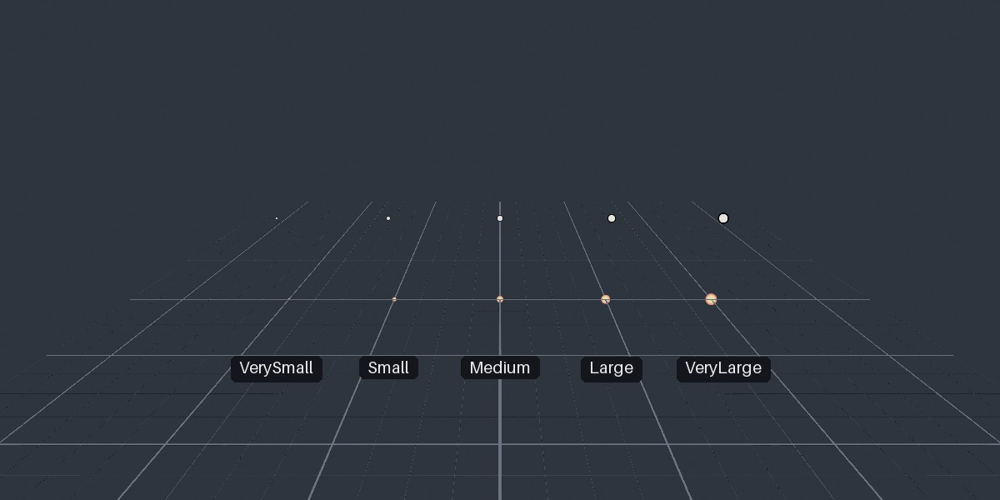
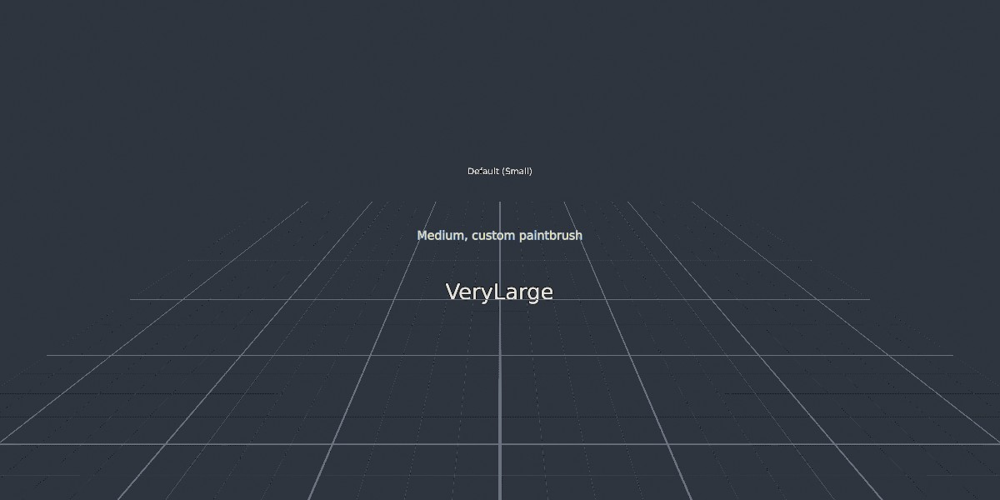
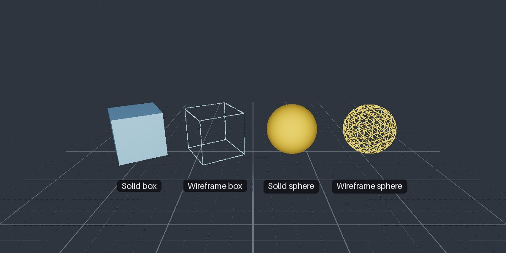
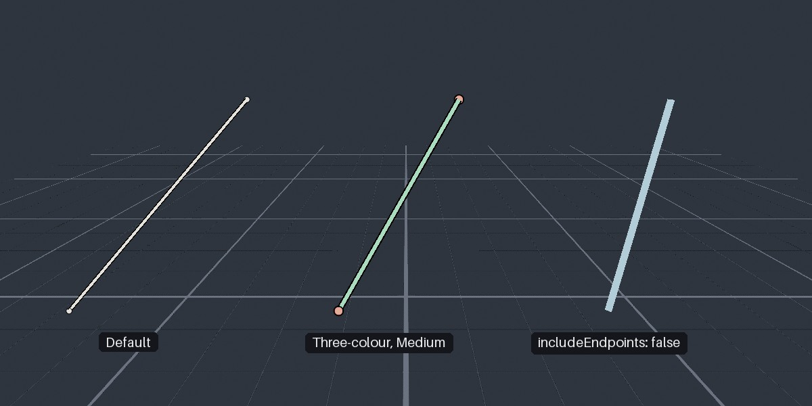
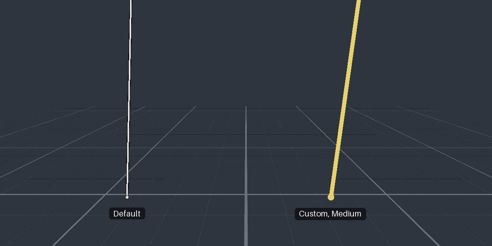
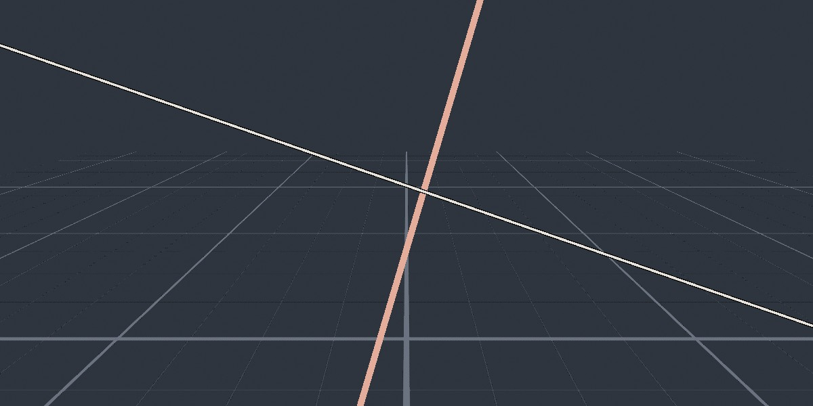
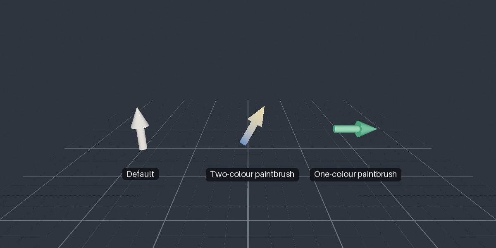
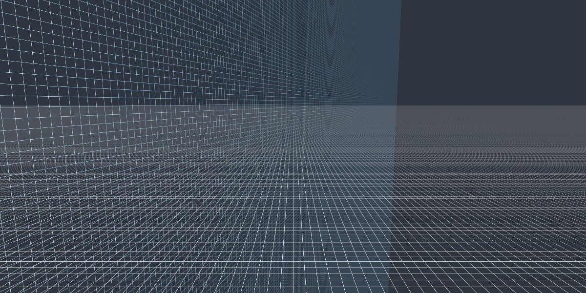
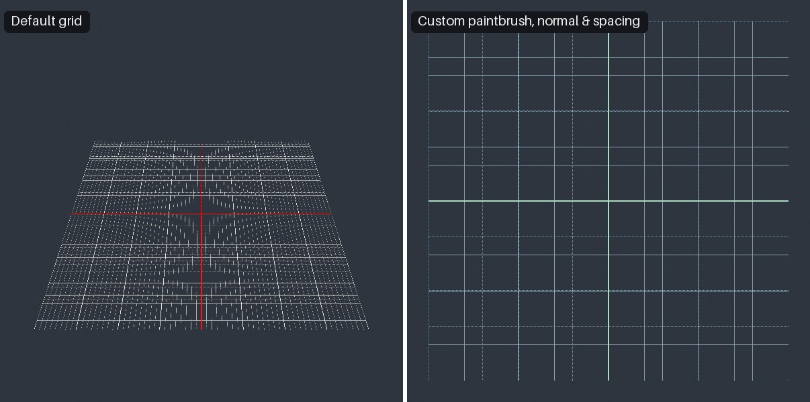

<div class="grid cards" markdown>

-   :chestnut:{ : style="margin-right:0.3em" } __In a nutshell...__

    * Scene primitives are simple shapes/text you can draw in a scene with a single line of code. :material-arrow-right: [Scene Primitives](#scene-primitives)
    * There are primitives for points, text, boxes, spheres, line segments, rays, lines, arrows, planes, and grids. :material-arrow-right: [Primitive Types](#primitive-types)
    * Each primitive has a size and a set of colours (a `PrimitivePaintbrush`). :material-arrow-right: [Size](#size), [Colours](#colours)

</div>

## Scene Primitives

```csharp
using var grid = scene.AddPrimitiveGrid(Location.Origin); // (1)!
using var target = scene.AddPrimitivePoint(new Location(0f, 1f, 2f)); // (2)!
using var label = scene.AddPrimitiveString(new Location(0f, 1.2f, 2f), "Target"); // (3)!
using var arrow = scene.AddPrimitiveArrow(Location.Origin, Direction.Up); // (4)!

var ray = camera.CreateRayFromNearPlane();
using var rayMarker = scene.AddPrimitiveShape(ray); // (5)!
```

1.	Draws a reference grid on the ground, centred on the origin.

2.	Draws a point marker at (0, 1, 2).

3.	Draws a text label just above the point.

4.	Draws an arrow at the origin, pointing upward.

5.	Draws the ray travelling forward from the camera, e.g. to visualise a [scene query](scenes.md#scene-queries).

*Scene primitives* are simple objects that can be drawn in a scene with a single method call. They're intended either for debugging or adding simple visualization data to a scene. Some examples might be marking positions, visualising directions and rays, outlining bounding boxes, labelling objects, or overlaying diagnostic information on a scene.

Each primitive is a `ScenePrimitive`, created via one of the `scene.AddPrimitive[...]()` methods. Disposing a primitive removes it from the scene.

??? tip "Low-Customization By Design"
	Scene primitives are deliberately simple. Each one offers only its shape and position, a [size](#size), a set of [colours](#colours), and maybe one or two flags. There are no materials, textures, transforms, or animations, and their appearance isn't affected by the scene's lighting. This keeps them quick to add and remove, and easy to see in any scene.

	If you need more control over how something looks or behaves, create a real object using the rest of the API instead; e.g. a [model instance](scene_objects.md#model-instances) with a [mesh](creating_meshes.md) and [material](creating_materials.md) of your choice, a [quad](quads.md), [text](text_instances.md), or a [camera-locked object](camera-locked_objects.md). 
	
	Primitives are built from these same pieces under the hood; they just choose sensible settings for you.
	
Primitives aren't considered scene content; they're excluded from every [scene query](scenes.md#scene-queries). 

## Creating & Removing Primitives

```csharp
using var point = scene.AddPrimitivePoint(new Location(1f, 0f, 0f));
using var box = scene.AddPrimitiveShape(new PositionedRotatedCuboid(1f, 1f, 1f, Location.Origin, Rotation.None), wireframe: true);
```

Invoking `AddPrimitive[...]()` with the type of object you want to add is the quickest way to add a primitive to your scene. You can also invoke the empty `scene.AddPrimitive()` to create an empty primitive. All primitives can have their shape changed at any time via `SetGeometry[...]()` methods, and can be recoloured via `SetPaintbrush()`:

```csharp
using var tracker = scene.AddPrimitive(); // (1)!
tracker.SetPaintbrush(new PrimitivePaintbrush(StandardColor.Red));

// Per-frame:
tracker.SetGeometryPoint(trackedObject.Position); // (2)!
```

1.	Creates an empty primitive. It isn't visible until it's given some geometry.

2.	Moves the point marker to the tracked object's current position each frame.

The `SetGeometry[...]()` methods mirror the `AddPrimitive[...]()` methods: `SetGeometryPoint()`, `SetGeometryString()`, `SetGeometryShape()`, `SetGeometryArrow()`, and `SetGeometryGrid()`.

To remove a primitive, dispose it. `scene.RemoveAll()` also removes every primitive in the scene, and disposing a scene disposes all of its primitives (you don't need to dispose the primitives separately first).

## Primitive Types

### Points

```csharp
using var marker = scene.AddPrimitivePoint(new Location(1f, 0.5f, 0f));
using var bigMarker = scene.AddPrimitivePoint(
	new Location(2f, 0.5f, 0f), 
	new PrimitivePaintbrush(StandardColor.Yellow, StandardColor.Red), 
	ScenePrimitiveSize.VeryLarge
);
```

A point is a round marker at a single location. Its paintbrush's primary colour is used for the body of the marker, and the secondary colour for its outline.

{ : style="width:77%;" }
/// caption
Point primitives at each `ScenePrimitiveSize`, with the default paintbrush (top) and a custom one (bottom).
///

### Text

```csharp
using var label = scene.AddPrimitiveString(
	new Location(0f, 1f, 0f), 
	"Input Here"
);
using var warning = scene.AddPrimitiveString(
	new Location(0f, 2f, 0f), 
	"Danger!", 
	new PrimitivePaintbrush(StandardColor.Yellow, StandardColor.Black), 
	ScenePrimitiveSize.Large
);
```

A text primitive is a label drawn with TinyFFR's default font. It always sits square-on to the screen, centred on its position. The paintbrush's primary colour is used for the text, and the secondary colour (if any) for an outline around it.

{ : style="width:77%;" }
/// caption
Text primitives at different sizes, with the default paintbrush and a custom one.
///

### Boxes & Spheres

```csharp
using var box = scene.AddPrimitiveShape(
	new PositionedRotatedCuboid(0.8f, 0.8f, 0.8f, new Location(1f, 0.4f, 0f), 30f % Direction.Up), 
	new PrimitivePaintbrush(StandardColor.Blue)
);
using var bounds = scene.AddPrimitiveShape(
	myMesh.BoundingBox.WithRotation(Rotation.None), 
	wireframe: true
);
using var sphere = scene.AddPrimitiveShape(
	new PositionedSphere(0.5f, new Location(-1f, 0.5f, 0f))
);
```

Boxes (`PositionedRotatedCuboid`) and spheres (`PositionedSphere`) are drawn solid by default, or as wireframes if `wireframe` is `true`, in the paintbrush's primary colour. Solid shapes are shaded so that their shape is visible regardless of the scene's lighting (see [`Plain3D`](the_default_material.md#shading-styles)). Wireframe boxes are particularly useful for visualising bounding boxes.

{ : style="width:77%;" }
/// caption
Box and sphere primitives, solid and as wireframes.
///

### Bounded Rays

```csharp
using var segment = scene.AddPrimitiveShape(
	new BoundedRay(new Location(0f, 0f, 0f), new Location(1f, 1f, 1f))
);
```

A `BoundedRay` (i.e. line segment) is drawn as a line between its two end points, with a marker at each end. Pass `includeEndpoints: false` to leave the end markers out. (See [Colours](#colours) for how each paintbrush colour is used.)

{ : style="width:77%;" }
/// caption
Line segment primitives: with the default paintbrush, with a three-colour paintbrush at `Medium` size, and without end markers.
///

### Rays

```csharp
using var ray = scene.AddPrimitiveShape(
	new Ray(Location.Origin, Direction.Forward)
);
```

A ray (`Ray`) starts at a point and continues forever in one direction. It's drawn with a marker at its start point (pass `includeStartPoint: false` to leave it out). Rays are particularly useful for visualising [ray queries](scenes.md#scene-queries) and [camera rays](camera_settings.md#rays); and as primitives are excluded from scene queries, drawing a ray never interferes with querying along it.

{ : style="width:77%;" }
/// caption
Ray primitives, each starting at the marker and continuing off-screen.
///

### Lines

```csharp
using var line = scene.AddPrimitiveShape(
	new Line(Location.Origin, Direction.Right)
);
```

A line (`Line`) passes through a point and continues forever in both directions.

{ : style="width:77%;" }
/// caption
Two line primitives, each continuing off-screen in both directions.
///

### Arrows

```csharp
using var up = scene.AddPrimitiveArrow(Location.Origin, Direction.Up);
using var velocity = scene.AddPrimitiveArrow(
	myObject.Position, 
	velocityDirection, 
	new PrimitivePaintbrush(StandardColor.Blue, StandardColor.Yellow), 
	ScenePrimitiveSize.Large
);
```

An arrow is drawn from a tail position, pointing in a given direction. Its stem and head are proportioned automatically according to its size. With a two-colour paintbrush, the arrow blends from the primary colour at its tail to the secondary colour at its tip; with a single colour, it's drawn solidly in that colour (and shaded like the [box and sphere](#boxes-spheres) primitives).

Arrows are useful for visualising directions, such as normals, velocities, or light directions.

{ : style="width:77%;" }
/// caption
Arrow primitives with the default paintbrush, a two-colour paintbrush, and a one-colour paintbrush.
///

### Planes

```csharp
using var ground = scene.AddPrimitiveShape(new Plane(Direction.Up, Location.Origin));
```

A plane (`Plane`) is drawn as a large, translucent, chequered surface, in the paintbrush's primary colour.

{ : style="width:77%;" }
/// caption
A horizontal plane primitive and a vertical, blue one.
///

### Grids

```csharp
using var floorGrid = scene.AddPrimitiveGrid(Location.Origin); // (1)!
using var wallGrid = scene.AddPrimitiveGrid( // (2)!
	new Location(0f, 1f, 2f),
	gridNormal: Direction.Backward,
	gridSize: 4f,
	majorGridLineSpacing: 1f,
	minorGridLineSpacing: 0.1f
);
```

1.	A 2m × 2m grid lying flat on the ground, centred on the origin.

2.	A 4m × 4m grid standing upright and facing backward, with heavier lines every metre and lighter lines every 10cm.

A grid is a square reference grid, useful for judging positions and distances in a scene. `AddPrimitiveGrid()` takes the following optional parameters:

<span class="def-icon">:material-code-json:</span> `gridNormal`

:   Which way the grid faces; the grid lies on the plane at right angles to this. Defaults to `Direction.Up` (i.e. lying flat).

<span class="def-icon">:material-code-json:</span> `gridX`

:   Which direction the grid's lines run along. Defaults to a direction perpendicular to `gridNormal`.

<span class="def-icon">:material-code-json:</span> `gridSize`

:   The width (and height) of the whole grid, in metres. Defaults to `2f`.

<span class="def-icon">:material-code-json:</span> `majorGridLineSpacing` / `minorGridLineSpacing`

:   How far apart the heavier and lighter grid lines are, in metres. Default to an eighth and a sixty-fourth of `gridSize` respectively.

A grid uses all three of its paintbrush's colours: the primary for its two centre lines (axes), the secondary for its major lines, and the tertiary for its minor lines. The default is red axes, white major lines, and grey minor lines.

{ : style="width:77%;" }
/// caption
On the left, a default grid lying flat. On the right, an upright grid with a custom paintbrush and line spacing.
///

## Size

Most primitives take a `size`, given either as a `ScenePrimitiveSize` or as an exact `float`. The `ScenePrimitiveSize` values are deliberately vague (`VerySmall`, `Small`, `Medium`, `Large`, and `VeryLarge`), as a primitive's job is to be visible rather than to be to scale. The default is `Small`.

Each kind of primitive converts a `ScenePrimitiveSize` to an exact value differently:

| `ScenePrimitiveSize` | Points (`ConvertPointPrimitiveSize`) | Text (`ConvertStringPrimitiveSize`) | Lines (`ConvertLinePrimitiveSize`) | Arrows (`ConvertArrowPrimitiveSize`) |
| :------------------- | -----: | -----: | -----: | -----: |
| `VerySmall` | 0.005 | 0.0125 | 0.001 | 0.025 |
| `Small` (default) | 0.0125 | 0.02 | 0.0025 | 0.0625 |
| `Medium` | 0.02 | 0.0275 | 0.004 | 0.1 |
| `Large` | 0.0275 | 0.035 | 0.0055 | 0.1375 |
| `VeryLarge` | 0.035 | 0.05 | 0.007 | 0.175 |

### Constant-Screen-Size

Points, text, lines (including line segments and rays), and arrows also take a `constantScreenSize` flag, which defaults to `true`:

* When `true`, the primitive keeps the same apparent size on screen however far away it is, so it stays visible at any distance. Its size is then a fraction of the height of the screen (e.g. a `Medium` point is 2% of the screen's height across).
* When `false`, the primitive is sized in metres like any other object, so it appears smaller the further away it is (e.g. a `Medium` point is 2cm across).

Boxes, spheres, planes, and grids are always sized by their geometry, in metres.

## Colours

```csharp
var paintbrush = new PrimitivePaintbrush(StandardColor.Yellow, StandardColor.Red); // (1)!
using var point = scene.AddPrimitivePoint(Location.Origin, paintbrush);
point.SetPaintbrush(new PrimitivePaintbrush(StandardColor.Green)); // (2)!
```

1.	A paintbrush with a primary (yellow) and secondary (red) colour.

2.	Recolours the existing primitive.

A primitive's colours are given by a `PrimitivePaintbrush`, which has a primary colour and optional secondary and tertiary colours. How many of the colours are used depends on the primitive:

| Primitive | Primary | Secondary | Tertiary |
| :-------- | :------ | :-------- | :------- |
| Points | Body | Outline | |
| Text | Text | Outline | |
| Boxes & spheres | Surface | | |
| Planes | Chequer lines | | |
| Line segments, rays & lines | Line | Outlines (of the line and its end markers) | End markers (defaults to the primary colour) |
| Arrows | Tail (or whole arrow) | Head | |
| Grids | Axes | Major lines | Minor lines |

Colours with transparency are supported, e.g. for faint guide lines.

## Always-on-Top

If you want primitives to appear "on top" of your scene, you should create a second scene and render it on top via render compositing. See [Compositing](compositing.md).
