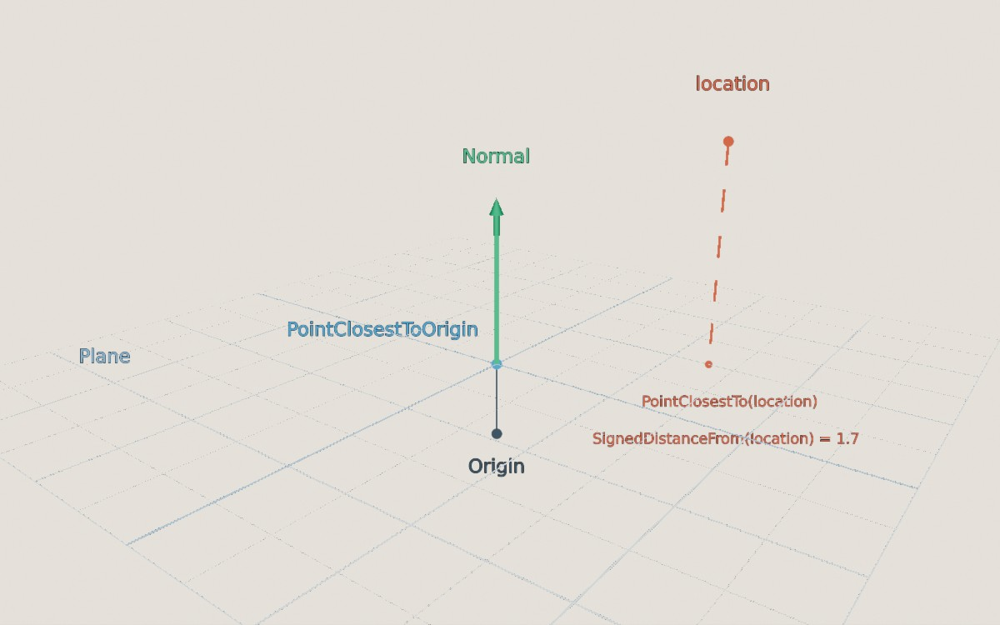
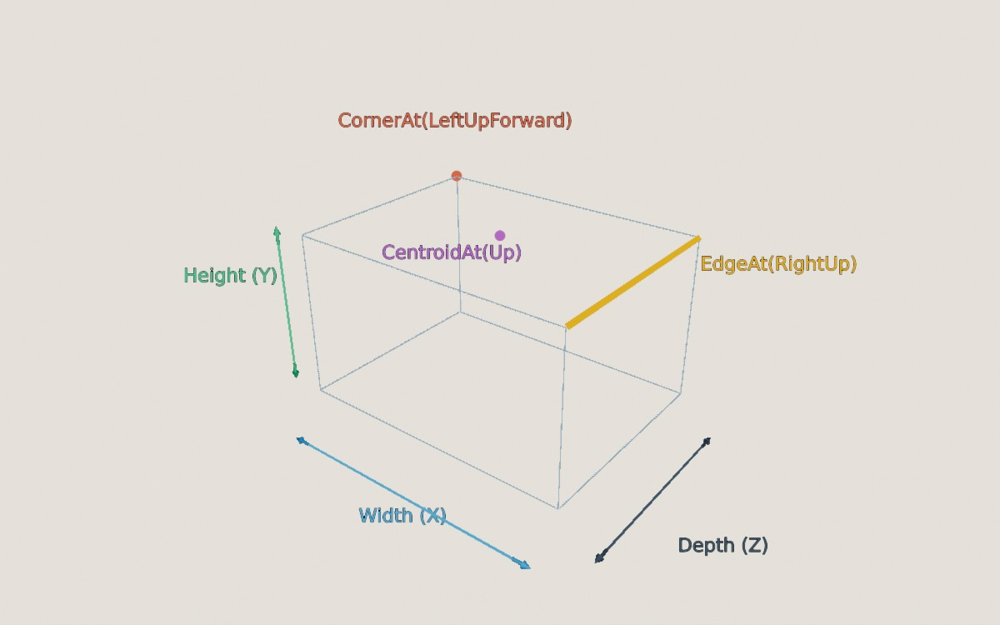

<div class="grid cards" markdown>

-   :chestnut:{ : style="margin-right:0.3em" } __In a nutshell...__

    * A `Plane` is an infinite flat surface, defined by the direction it faces (its `Normal`) and where it sits. :material-arrow-right: [Plane](#plane)
    * `Sphere` and `Cuboid` describe a shape's size only, centred on the origin. :material-arrow-right: [Sphere](#sphere), [Cuboid](#cuboid)
    * `PositionedSphere`, `PositionedCuboid`, and `PositionedRotatedCuboid` place a shape somewhere in the world. :material-arrow-right: [Positioned Shapes](#positioned-shapes)

</div>

## Plane

A `Plane` is a flat surface that extends forever in every direction along its surface, splitting the world in to two halves. It's defined by:

* Its `Normal`: The `Direction` pointing straight out of its surface;
* Its `PointClosestToOrigin`: The point on the plane closest to the world origin, (0, 0, 0).

[](shapes_plane.jpg)
/// caption
A plane facing `Up`, 0.6m above the origin. The red location above it is 1.7m away on the side the `Normal` points towards, so its signed distance is positive.
///

```csharp
var ground = new Plane(Direction.Up); // (1)!
var tabletop = new Plane(Direction.Up, new Location(0f, 1f, 0f)); // (2)!
var raised = new Plane(Direction.Up, 1f); // (3)!
var fromTriangle = Plane.FromTriangleOnSurface(location1, location2, location3); // (4)!
var fromPoint = Plane.FromPointClosestToOrigin(location, normalFacesOrigin: true); // (5)!
```

1.	A plane facing up, passing through the origin (i.e. the ground at height 0).

2.	A plane facing up, passing through the given location (any point on the plane will do).

3.	A plane facing up, 1m from the origin along its normal. A negative distance puts it on the other side of the origin.

4.	The plane that all three locations lie on, or `null` if they're in a straight line (or the same point). The normal faces towards whichever side the three points appear in anticlockwise order from.

5.	The plane whose closest point to the origin is `location`, facing either towards the origin or away from it. Returns `null` if `location` is the origin itself (as no single plane is defined).

### Using Planes

```csharp
var signedDistance = plane.SignedDistanceFrom(location); // (1)!
var inFront = plane.FacesTowards(location); // (2)!
var onSurface = plane.Contains(location); // (3)!
var closest = plane.PointClosestTo(location); // (4)!
var bounced = plane.ReflectionOf(direction); // (5)!
var alongSurface = plane.ParallelizationOf(direction); // (6)!
```

1.	How far `location` is from the plane. Returns a positive value on the side the `Normal` points towards, negative on the other side. `DistanceFrom()` gives the same value without the sign.

2.	Whether `location` is on the side of the plane the `Normal` points towards. `FacesAwayFrom()` checks the other side. (Locations on the plane itself return `false` from both.)

3.	Whether `location` lies on the plane (allowing for a small thickness, as with [lines](lines.md#measuring-intersecting); pass a different `planeThickness` if needed).

4.	The point on the plane directly "under" `location`.

5.	The direction "bounced" off the plane (e.g. a direction pointing down-and-right that hits a floor becomes up-and-right). Returns `null` if the direction is parallel to the plane. `ReflectionOf()` also accepts a `Vect`, `Ray`, or `BoundedRay`.

6.	The direction flattened on to the plane's surface (or `null` if it points straight in to or out of the plane). `OrthogonalizationOf()` turns it to point straight out of the plane instead, and `ProjectionOf(vect)` flattens a `Vect` (keeping only its part that runs along the surface).

<span class="def-icon">:material-card-bulleted-outline:</span> `Flipped`

:   The same plane facing the opposite way (so its two sides swap and `Normal` points the opposite way). The unary `-` operator does the same: `-plane`.

<span class="def-icon">:material-code-block-parentheses:</span> `IncidentAngleWith(direction)` / `AngleTo(direction)`

:   `IncidentAngleWith()` is the angle between a direction and the plane's `Normal` (so 0° means hitting the plane head-on), or `null` if the direction runs parallel to the plane. `AngleTo()` is the angle between the direction and the plane's surface (so 0° means running parallel to it). `AngleTo()` also accepts another plane (as does the `^` operator: `plane1 ^ plane2`).

<span class="def-icon">:material-code-block-parentheses:</span> `MovedBy(vect)` / `RotatedBy(rotation, pivot)` / `RotatedAroundOriginBy(rotation)`

:   Moves or rotates the plane. `plane + vect` and `plane * (rotation, pivot)` are equivalent shorthands.

<span class="def-icon">:material-code-block-parentheses:</span> `CreateDimensionConverter()`

:   Creates a `DimensionConverter` for converting between 3D locations on the plane and 2D coordinates on its surface.

## Sphere

A `Sphere` is a ball of a given `Radius`, centred on the origin. To put it somewhere in the world, see [Positioned Shapes](#positioned-shapes).

```csharp
var ball = new Sphere(0.5f); // (1)!
var oneLitre = Sphere.FromVolume(0.001f); // (2)!
var bigger = ball * 2f; // (3)!
var unit = Sphere.UnitSphere; // (4)!
```

1.	A sphere with a radius of 0.5m (i.e. 1m across).

2.	A sphere with a volume of 0.001m³ (1 litre). `FromDiameter()`, `FromCircumference()`, and `FromSurfaceArea()` work the same way.

3.	A sphere with double the radius. Equivalent to `ball.ScaledBy(2f)`.

4.	A sphere with a radius of 1m. `OneMeterDiameterSphere` and `OneMeterCubedVolumeSphere` are also available.

<span class="def-icon">:material-card-bulleted-outline:</span> `Radius` / `Diameter` / `Circumference` / `SurfaceArea` / `Volume`

:   The sphere's measurements, in metres (or square/cubic metres).

<span class="def-icon">:material-code-block-parentheses:</span> `TrySplit(plane, out circleCentre, out circleRadius)`

:   If `plane` cuts through the sphere, returns `true` and gives the circle where the two meet. `GetCircleRadiusAtDistanceFromCenter(distance)` gives the same circle's radius for a plane `distance` metres from the sphere's centre.

## Cuboid

A `Cuboid` is a box of a given `Width` (along the X axis), `Height` (along Y), and `Depth` (along Z), centred on the origin.

[](shapes_cuboid.jpg)
/// caption
A `Cuboid`'s dimensions, and some of its parts as returned by `CornerAt()`, `EdgeAt()`, and `CentroidAt()`.
///

```csharp
var crate = new Cuboid(1f); // (1)!
var shelf = new Cuboid(2f, 0.05f, 0.4f); // (2)!
var fromHalves = Cuboid.FromHalfDimensions(1f, 0.025f, 0.2f); // (3)!
var bigger = shelf * 2f; // (4)!
```

1.	A 1m cube.

2.	A box 2m wide, 5cm tall, and 40cm deep.

3.	The same box as `shelf`, created from half of each dimension (i.e. the distance from the centre to each side).

4.	A box with every dimension doubled. `ScaledBy(vect)` scales each axis separately.

Each corner, edge, and side of a cuboid can be found using the [orientation enums](angle_rotation_orientation.md#orientation):

<span class="def-icon">:material-code-block-parentheses:</span> `CornerAt(DiagonalOrientation)`

:   The location of one of the 8 corners (e.g. `CornerAt(DiagonalOrientation.LeftUpForward)`).

<span class="def-icon">:material-code-block-parentheses:</span> `EdgeAt(IntercardinalOrientation)`

:   One of the 12 edges, as a [`BoundedRay`](lines.md#boundedray) (e.g. `EdgeAt(IntercardinalOrientation.RightUp)` is the top edge on the right-hand side).

<span class="def-icon">:material-code-block-parentheses:</span> `SideAt(CardinalOrientation)` / `CentroidAt(CardinalOrientation)`

:   One of the 6 sides, as a `Plane` facing outwards; or the centre point of that side.

<span class="def-icon">:material-card-bulleted-outline:</span> `Corners` / `Edges` / `Sides` / `Centroids`

:   Every corner, edge, side, or side-centre, for looping over (e.g. `foreach (var corner in crate.Corners)`).

<span class="def-icon">:material-card-bulleted-outline:</span> `Extents` / `HalfExtents` / `Volume` / `SurfaceArea`

:   The width, height, and depth as a `Vect` (or half of each); and the box's volume and surface area. `GetExtent(Axis)` gives the size along a single axis.

<span class="def-icon">:material-code-block-parentheses:</span> `WithVolume(volume)` / `WithSurfaceArea(area)` / `WithAllExtentsAdjustedBy(amount)`

:   The box resized to have the given volume or surface area (keeping its proportions), or with `amount` added to every dimension.

## Positioned Shapes

`Sphere` and `Cuboid` only describe a shape's size. To place one in the world, use a positioned shape:

| Type | Describes |
| :-- | :-- |
| `PositionedSphere` | A `Sphere` at a `Position` |
| `PositionedCuboid` | A `Cuboid` at a `Position`, lined up with the world axes |
| `PositionedRotatedCuboid` | A `Cuboid` at a `Position`, turned by a `Rotation` |

```csharp
var ball = new PositionedSphere(0.5f, new Location(0f, 1f, 0f)); // (1)!
var crate = new Cuboid(1f).ToPositionedCuboid(new Location(2f, 0.5f, 0f)); // (2)!
var tiltedCrate = new PositionedRotatedCuboid(new Cuboid(1f), location, 45f % Direction.Up); // (3)!
var movedBall = ball + new Vect(0f, 1f, 0f); // (4)!
```

1.	A 0.5m-radius sphere centred at (0, 1, 0). (`new Sphere(0.5f).ToPositionedSphere(location)` is equivalent.)

2.	A 1m cube centred at (2, 0.5, 0).

3.	A 1m cube centred on `location` and turned 45° around `Up`.

4.	The sphere moved up by 1m. A `PositionedRotatedCuboid` can also be rotated (around its own centre) with `RotatedBy(rotation)` or `* rotation`.

Positioned shapes have the same properties and methods as the shape they're based on, measured in world space (e.g. `crate.CornerAt(DiagonalOrientation.LeftUpForward)` returns the corner's location in the world). For a `PositionedRotatedCuboid`, the orientation names refer to the box's own (unrotated) sides, so `CornerAt(DiagonalOrientation.LeftUpForward)` is the corner that *was* left-up-forward before the box was rotated.

Positioned shapes are used for [shape scene queries](scenes.md#shape-queries) (finding every object inside a region).

??? abstract "Translated Shape Wrappers"
	The positioned shapes are built on two general-purpose wrappers: `TranslatedConvexShape<T>` (any shape plus a position) and `TranslatedRotatedConvexShape<T>` (any shape plus a position and rotation). The positioned shapes convert implicitly to and from these wrappers, which are mostly useful when writing generic code that works with any shape type.

## Measuring & Intersecting

All shapes (positioned or not) share the same set of measuring and intersecting operations:

```csharp
var inside = ball.Contains(location); // (1)!
var distance = ball.DistanceFrom(location); // (2)!
var surfaceDistance = ball.SurfaceDistanceFrom(location); // (3)!
var closest = ball.PointClosestTo(location); // (4)!
var surfacePoint = ball.SurfacePointClosestTo(location); // (5)!

var hits = ball.IntersectionWith(ray); // (6)!
var isHit = ball.IsIntersectedBy(ray); // (7)!
var bounced = ball.ReflectionOf(ray); // (8)!
var side = ball.RelationshipTo(plane); // (9)!
```

1.	Whether `location` is inside the shape.

2.	How far `location` is from the shape (0 if it's inside).

3.	How far `location` is from the shape's *surface* (which isn't 0 for locations inside the shape).

4.	The point in the shape closest to `location` (`location` itself, if it's inside).

5.	The point on the shape's surface closest to `location`.

6.	Where a line, ray, or bounded ray enters and leaves the shape (`hits.Value.First` and `hits.Value.Second`), or `null` if it misses. `Second` is `null` when there's only one point (e.g. when the ray starts inside the shape). See also [Lines: Planes & Shapes](lines.md#planes-shapes).

7.	Whether a line, ray, or bounded ray touches the shape at all.

8.	The ray bounced off the shape's surface, starting where it first hits (or `null` if it misses). `IncidentAngleWith(ray)` gives the angle between the ray and the surface's normal where it hits.

9.	Which side of `plane` the shape is on: `PlaneIntersectsObject` (the plane cuts through it), `PlaneFacesTowardsObject` (the shape is on the side the plane's `Normal` points towards), or `PlaneFacesAwayFromObject`. `SignedDistanceFrom(plane)` gives the distance from the plane to the nearest part of the shape: 0 if the plane cuts through it, and negative if the shape is on the side the plane's `Normal` points away from.

!!! info "Related Pages"
	* Positioned shapes can be drawn in a scene as [scene primitives](scene_primitives.md#boxes-spheres) (e.g. `scene.AddPrimitiveShape(ball)`), as can [planes](scene_primitives.md#planes).
	* Meshes and model instances report their [bounding boxes](bounding_boxes.md) as positioned shapes (`PositionedCuboid`, `PositionedRotatedCuboid`, and `PositionedSphere`).
	* Meshes can be generated from a [`Cuboid` or `Sphere`](creating_meshes.md#shape-based-generation), or from arbitrary flat shapes using the [`Polygon`](creating_meshes.md#polygon-struct) type.
