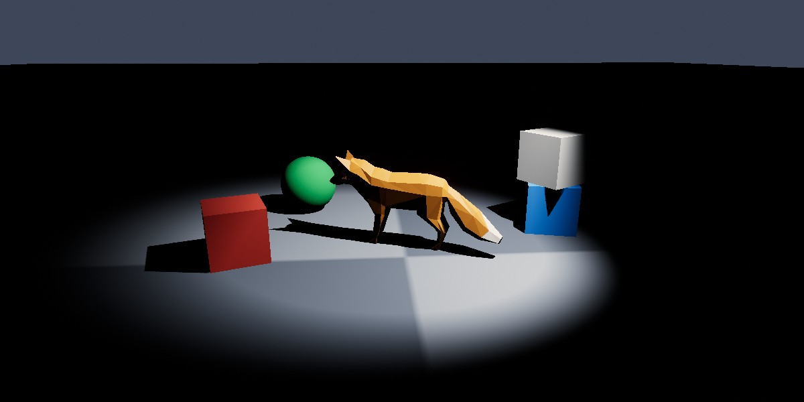

<div class="grid cards" markdown>

-   :chestnut:{ : style="margin-right:0.3em" } __In a nutshell...__

    * A spot light emits light from a position in a cone, like a torch or a theatre spotlight. :material-arrow-right: [Spot Lights](#spot-lights)
    * The cone has an outer angle, and an inner angle within which the light is at full strength. :material-arrow-right: [Cone](#cone)
    * Spot lights can be created to dim as their cone widens, as real spot lights do. :material-arrow-right: [High Quality Cones](#high-quality-cones)

</div>

[{ : style="width:77%;" }](spot_lights_example.jpg)
/// caption
A spot light shining down on a fox and several objects from above and to the side, in an otherwise dark scene, with shadows enabled.
///

## Spot Lights

```csharp
using var light = factory.LightBuilder.CreateSpotLight( // (1)!
	position: new Location(0f, 3f, 0f),
	coneDirection: Direction.Down,
	coneAngle: 40f,
	intenseBeamAngle: 30f
);
scene.Add(light); // (2)!

light.ConeDirection = new Direction(0f, -1f, 1f); // (3)!
```

1.	Creates a spot light 3 units above the origin, pointing down, with a 40° cone that's at full strength for the central 30°.

2.	Adds the light to a [scene](scenes.md). A light only illuminates the scenes it has been added to.

3.	Points the light down and forward.

A `SpotLight` emits light from a position in a cone, like a torch, a desk lamp, or a theatre spotlight. Objects outside the cone receive no light from it.

### Creating Spot Lights

Spot lights are created with `factory.LightBuilder.CreateSpotLight()`, which accepts the following optional parameters (or alternatively a `SpotLightCreationConfig` with equivalent properties):

<span class="def-icon">:material-card-bulleted-outline:</span> `position`

:   Where the light is. Defaults to the origin.

<span class="def-icon">:material-card-bulleted-outline:</span> `coneDirection`

:   Which way the light points. Defaults to `Direction.Down`.

<span class="def-icon">:material-card-bulleted-outline:</span> `coneAngle`, `intenseBeamAngle`

:   The shape of the cone. Default to 70° and 15° respectively. See [Cone](#cone).

<span class="def-icon">:material-card-bulleted-outline:</span> `color`, `brightnessPreset`, `brightness`, `castsShadows`

:   The light's colour (default white), brightness (default `1f`; a handheld flashlight, or given as a preset such as `SpotLightBrightnessPreset.CarHeadlight`), and whether it casts shadows (default `false`). If both `brightnessPreset` and `brightness` are specified, `brightness` is used. See [Brightness](#brightness).

<span class="def-icon">:material-card-bulleted-outline:</span> `maxDistance`

:   How far down its cone the light reaches, in metres. Defaults to `15f`. See [Range](#range).

<span class="def-icon">:material-card-bulleted-outline:</span> `highQuality`

:   Whether the light dims as its cone widens. Defaults to `false`. Can only be set at creation. See [High Quality Cones](#high-quality-cones).

<span class="def-icon">:material-card-bulleted-outline:</span> `name`

:   An optional name for the light.

## Cone

A spot light's cone is described by three properties:

<span class="def-icon">:material-card-bulleted-outline:</span> `ConeDirection`

:   Which way the light points; i.e. the direction its cone of light travels along. A spot light's `RotateBy()` methods rotate this direction.

<span class="def-icon">:material-card-bulleted-outline:</span> `ConeAngle`

:   How wide the cone is. Nothing outside the cone receives any light. Clamped to between `SpotLight.MinConeAngle` (1°) and `SpotLight.MaxConeAngle` (180°).

<span class="def-icon">:material-card-bulleted-outline:</span> `IntenseBeamAngle`

:   How wide the fully-lit centre of the cone is. Between this angle and `ConeAngle`, the light fades out to nothing.

Both angles are the cone's *full* width, not the angle from its centre to its edge; so a `ConeAngle` of 90° describes a cone spreading 45° in every direction from `ConeDirection`.

The relationship between the two angles controls how hard or soft the edge of the pool of light looks. Setting `IntenseBeamAngle` close to `ConeAngle` gives a sharply-defined circle of light, like a theatre spotlight; setting it much smaller gives a soft glow that fades gradually outward, like a desk lamp.

The intense beam can't be wider than the cone, so the two angles push each other (setting `IntenseBeamAngle` wider than `ConeAngle` widens the cone to match, and setting `ConeAngle` narrower than `IntenseBeamAngle` narrows the beam to match).

## Range

The `MaxIlluminationDistance` is the distance beyond which the `SpotLight` contributes no light at all. Setting it too small for the light's brightness produces a visible edge where the light abruptly cuts off.

## Brightness

Every light's `Brightness` is a *relative* value, where `1f` is the default strength for that kind of light. This makes it easy to adjust lights of different kinds in the same terms ("half as bright", "twice as bright").

```csharp
light.Brightness = 2f;
light.ScaleBrightnessBy(1.5f); // (1)!
light.AdjustBrightnessBy(-1f); // (2)!
```

1.	*Multiplies* the brightness by 1.5 (so `2f` becomes `3f`).

2.	*Adds* -1 to the brightness (so `3f` becomes `2f`). The result never goes below `0f`.

The default values for brightness are set up to co-ordinate with the default value of the camera's exposure. For more information, see [Exposure & Brightness](exposure_and_brightness.md).

### High Quality Cones

In the real world, a spot light concentrates a fixed amount of light in to its cone. Widening the cone spreads the same light over a larger area, so everything it lights becomes dimmer; narrowing the cone makes it brighter.

This is physically correct, but it can make spot lights awkward to work with, because adjusting the cone also changes how bright the light looks. By default, TinyFFR's spot lights therefore *don't* behave this way: a spot light's brightness is the same whatever its cone angle.

To create a spot light that does behave physically correctly (dimming as its cone widens), pass `highQuality: true` to `CreateSpotLight()` (or set `IsHighQuality` in a `SpotLightCreationConfig`). This can only be chosen when the light is created.

A high-quality spot light concentrates its whole output in to its cone, so the same brightness looks brighter, increasingly so the narrower its cone is; reduce its brightness to compensate. (The [brightness presets](exposure_and_brightness.md#spot-light-presets) are calibrated for standard spot lights.)

## Colour

A light's `Color` tints the light itself, not the objects it falls on. A red light leaves a white surface looking red; but a surface that reflects no red at all stays dark no matter how bright the light is.

[`StandardColor`](colour.md#standardcolor) has a number of presets for common real-world light sources (`StandardColor.LightingCandle`, `LightingIncandescentBulb`, `LightingSunRiseSet`, `LightingSunMidday`, `LightingAmbientDaylight`, `LightingAmbientOvercast`, and `LightingAmbientShaded`).

A light's colour can also be adjusted in terms of hue, saturation, and lightness via its `ColorHue`, `ColorSaturation`, and `ColorLightness` properties (and the corresponding `AdjustColor[...]By()` methods).

## Shadows

Setting a light's `CastsShadows` to `true` makes the objects it lights cast shadows from it:

```csharp
light.CastsShadows = true;
```

Shadows are calculated separately for each light that casts them, and are one of the more expensive things a scene can ask for. It's therefore common to enable shadows only for the one or two lights that most define a scene's look, and leave the rest without shadows.

The quality of shadows (and whether they're rendered at all) is set per renderer, via the `ShadowQuality` and `ShadowsEnabled` properties of its `RenderQualityConfig`; see [Render Quality](render_quality.md).
