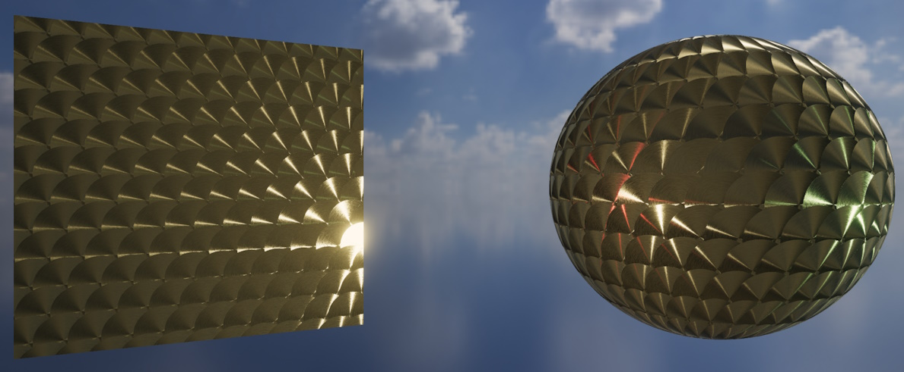
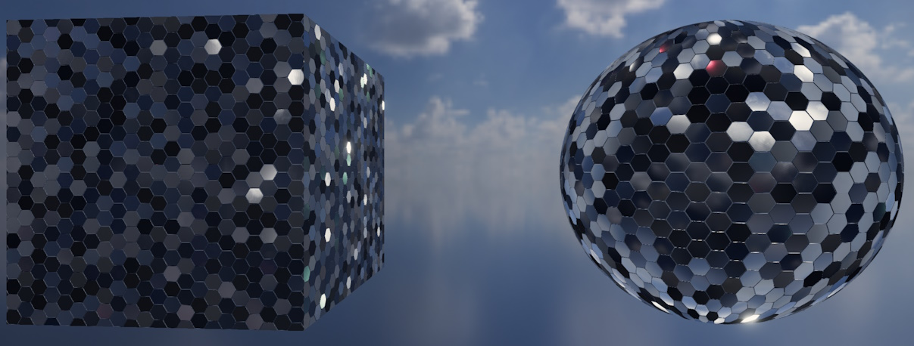
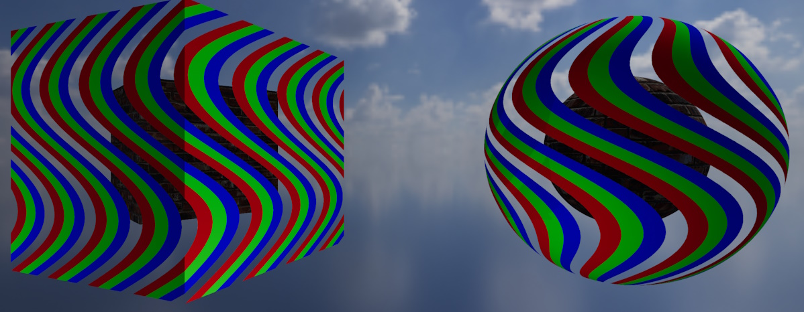

<div class="grid cards" markdown>

-   :chestnut:{ : style="margin-right:0.3em" } __In a nutshell...__

    * Standard materials are physically-based materials for opaque surfaces, and are what almost every object in a scene should use. :material-arrow-right: [Standard Materials](#standard-materials)
    * Only a color map is required; normal, ORM(R), emissive, anisotropy, and clearcoat maps can optionally be added to refine the surface. :material-arrow-right: [Supported Maps](#supported-maps)
    * A color map with an alpha channel can cut holes in the surface or make it partially transparent. :material-arrow-right: [Transparency](#transparency)

</div>

[{ : style="width:77%;" }](standard_materials_aniso.jpg)
/// caption
A standard material utilising an anisotropy map.
///

[{ : style="width:77%;" }](standard_materials_norm_metal.jpg)
/// caption
A standard material with high metallic and reflectance map values, also utilising normal mapping to skew each hexagonal panel.
///

[{ : style="width:77%;" }](standard_materials_color.jpg)
/// caption
A standard material using only a color map with alpha enabled in `MaskOnly` mode.
///

## Standard Materials

```csharp
using var colorMap = factory.AssetLoader.LoadColorMap(@"Assets/bricks_color.png");
using var normalMap = factory.AssetLoader.LoadNormalMap(@"Assets/bricks_normal.png");
using var ormMap = factory.AssetLoader.LoadOcclusionRoughnessMetallicMap(@"Assets/bricks_orm.png");

using var material = factory.MaterialBuilder.CreateStandardMaterial( // (1)!
	colorMap,
	normalMap: normalMap,
	ormOrOrmrMap: ormMap
);
```

1.	Creates a standard material from a color map, normal map, and ORM map. Naming the optional arguments (as here) makes it impossible to accidentally pass a map in the wrong position.

The *standard* material is TinyFFR's physically-based material for opaque surfaces, including real-world surfaces such as wood, stone, metal, plastic, fabric, skin, and so on; but also more abstract surfaces such as pure colours etc that still need to look '3D'. It responds to light in a physically plausible way (taking in to account how rough or smooth, metallic or non-metallic the surface is at every point), and it's the right choice for the vast majority of objects in a scene.

Standard materials are created with `factory.MaterialBuilder.CreateStandardMaterial()`. The basics of creating materials (including creation configs and lifetimes) are explained in [Creating Materials](creating_materials.md).

### Supported Maps

A standard material supports every type of texture map except absorption-transmission maps (which are only used by [transmissive materials](transmissive_materials.md)):

| Map                                                          | Argument / Config Property                    | Required | Effect                                                                     |
| :----------------------------------------------------------- | :-------------------------------------------- | :------- | :------------------------------------------------------------------------- |
| [Color](texture_map_types.md#color-maps)                     | `colorMap` / `ColorMap`                       | Yes      | The surface's base colour (and, optionally, its transparency).              |
| [Normal](texture_map_types.md#normal-maps)                   | `normalMap` / `NormalMap`                     | No       | Small-scale bumps and grooves that catch the light.                         |
| [ORM(R)](texture_map_types.md#ormr-maps)                     | `ormOrOrmrMap` / `OcclusionRoughnessMetallicMap` or `OcclusionRoughnessMetallicReflectanceMap` | No | Ambient occlusion, roughness, metallicness (and optionally reflectance). |
| [Emissive](texture_map_types.md#emissive-maps)               | `emissiveMap` / `EmissiveMap`                 | No       | Parts of the surface that glow with their own light.                        |
| [Anisotropy](texture_map_types.md#anisotropy-maps)           | `anisotropyMap` / `AnisotropyMap`             | No       | Directional highlights, such as those on brushed metal.                     |
| [Clearcoat](texture_map_types.md#clearcoat-maps)             | `clearCoatMap` / `ClearCoatMap`               | No       | A thin glossy layer over the surface, such as lacquer or varnish.           |

What each map type contains and how to load it is explained in [Texture Map Types](texture_map_types.md).

The ORM(R) slot accepts either a three-channel ORM map or a four-channel ORMR map; TinyFFR detects which from the texture itself. If you supply a three-channel ORM map, the surface uses the default reflectance (50%, typical of most common materials).

For most surfaces, a color map, normal map, and ORM map are all you need. Emissive, anisotropy, and clearcoat maps are for surfaces that specifically need those effects.

???+ warning "Every Map Has a Cost"
	Each optional map you supply makes the material more expensive to render (TinyFFR selects a version of the material's shader that does exactly the work your chosen maps require, and no more). Only supply the maps a surface actually needs.

### Omitting Maps

When you leave out an optional map, the surface behaves as though it has that property's "neutral" value everywhere:

* No normal map: The surface is perfectly smooth (i.e. it has no small-scale bumps beyond the shape of the mesh itself).
* No ORM(R) map: The surface is non-metallic and unoccluded, with 50% reflectance, but is **fully rough** (completely matte).
* No emissive map: The surface does not glow.
* No anisotropy or clearcoat map: The surface has no anisotropic highlights or clearcoat layer.

## Transparency

```csharp
using var tintedColorMap = factory.TextureBuilder.CreateColorMap( // (1)!
	new ColorVect(0.2f, 0.4f, 1f, 0.5f), 
	includeAlpha: true
);

using var material = factory.MaterialBuilder.CreateStandardMaterial(
	tintedColorMap, 
	alphaMode: StandardMaterialAlphaMode.FullBlending // (2)!
);
```

1.	Creates a 50%-transparent blue color map. Color maps created by the texture builder with `includeAlpha: true` have their alpha premultiplied automatically.

2.	Specifies that the color map's alpha should genuinely blend the surface with whatever's behind it. Blending modes are explained below.

If the material's color map has an alpha channel (i.e. it's a four-channel RGBA texture), the alpha can be used to make parts of the surface invisible or partially transparent. How the alpha is used is set by the `alphaMode` argument (or `AlphaMode` config property):

<span class="def-icon">:material-card-bulleted-outline:</span> `StandardMaterialAlphaMode.MaskOnly`

:   The alpha simply switches each texel on or off: Any texel with less than 40% alpha isn't drawn at all, and every other texel is drawn fully opaque. This is the default.

	This is the cheaper of the two modes, and is ideal for surfaces that are solid but have holes or cut-out shapes in them (such as leaves, grates, or chain-link fences). Because every drawn texel is fully opaque, it also avoids the sorting problems (e.g. "flickering") that partially-transparent surfaces can suffer from.

<span class="def-icon">:material-card-bulleted-outline:</span> `StandardMaterialAlphaMode.FullBlending`

:   The alpha genuinely blends the surface with whatever's behind it, so partially-transparent texels tint the scene behind them rather than simply disappearing.

	This is more expensive to render than `MaskOnly`, and requires the color map's alpha to be [premultiplied](texture_map_types.md#alpha-premultiplication).
	
	Note also that this invokes the transparency-sorting algorithm which is not 100% accurate (for the sake of performance) and can result in 'flickering' between translucent overlapping objects.

If the color map has no alpha channel, the surface is always fully opaque and the alpha mode has no effect.

??? question "Standard vs. Transmissive Materials for See-Through Surfaces"
	A fully-blended standard material is the right choice for surfaces that are simply *partially see-through*, such as a translucent sticker, ghostly effect, or diagnostic/non-tangible/non-realistic object.

	For surfaces that light physically passes *through* (such as glass, water, or ice), use a [transmissive material](transmissive_materials.md) instead. The transmissive shader set models how light is absorbed and refracted as it passes through the surface, which looks far more realistic for those materials.

## Per-Instance Effects

If a standard material is created with `enablePerInstanceEffects: true` (or the `EnablePerInstanceEffects` config property), each object using it can alter its appearance individually at runtime via the object's `MaterialEffects` property. See [Material Effects](material_effects.md) for more information on using material effects. 

A standard material supports the following effects:

* Transforming (moving, rotating, and scaling) its textures across the surface;
* Blending its color map towards a second color map;
* Blending its ORM(R) map towards a second ORM(R) map, if the material has an ORM(R) map;
* Blending its emissive map towards a second emissive map, if the material has an emissive map.

## StandardMaterialCreationConfig

```csharp
using var material = factory.MaterialBuilder.CreateStandardMaterial(new StandardMaterialCreationConfig {
	ColorMap = colorMap,
	NormalMap = normalMap,
	OcclusionRoughnessMetallicMap = ormMap,
	AlphaMode = StandardMaterialAlphaMode.MaskOnly,
	Name = "Bricks"
});
```

For reference, the following is every property on the `StandardMaterialCreationConfig`:

<span class="def-icon">:material-card-bulleted-outline:</span> `ColorMap`

:   The color map. This property is required.

<span class="def-icon">:material-card-bulleted-outline:</span> `NormalMap`

:   The normal map, or `null` for none. Defaults to `null`.

<span class="def-icon">:material-card-bulleted-outline:</span> `OcclusionRoughnessMetallicMap` / `OcclusionRoughnessMetallicReflectanceMap`

:   The ORM or ORMR map, or `null` for none. Defaults to `null`. These are two names for the same property; either accepts a three-channel ORM map or a four-channel ORMR map.

<span class="def-icon">:material-card-bulleted-outline:</span> `EmissiveMap`

:   The emissive map, or `null` for none. Defaults to `null`.

<span class="def-icon">:material-card-bulleted-outline:</span> `AnisotropyMap`

:   The anisotropy map, or `null` for none. Defaults to `null`.

<span class="def-icon">:material-card-bulleted-outline:</span> `ClearCoatMap`

:   The clearcoat map, or `null` for none. Defaults to `null`.

<span class="def-icon">:material-card-bulleted-outline:</span> `AlphaMode`

:   How the color map's alpha channel is used (see [Transparency](#transparency)). Defaults to `StandardMaterialAlphaMode.MaskOnly`.

<span class="def-icon">:material-card-bulleted-outline:</span> `Name` / `EnablePerInstanceEffects`

:   The options common to every material type; see [Creating Materials](creating_materials.md#creation-configs).
