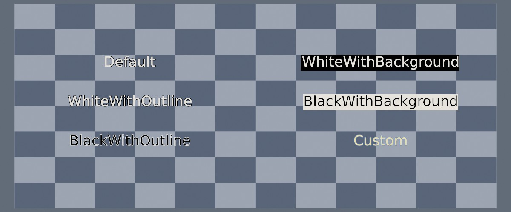
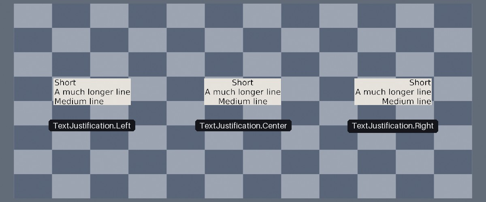

<div class="grid cards" markdown>

-   :chestnut:{ : style="margin-right:0.3em" } __In a nutshell...__

    * A `TextInstance` places a `FontString` in the world, drawn with a `FontPen`. :material-arrow-right: [Creating Text Instances](#creating-text-instances)
    * A `TextLayout` sets how big the text is and which point of it sits at the placed world position. :material-arrow-right: [Layout](#layout)

</div>

## Text Instances

```csharp
using var font = factory.AssetLoader.LoadFont(); // (1)!
using var pen = font.CreatePen(BuiltInFontPenStyle.Default); // (2)!
using var greeting = font.CreateString("Hello, world!"); // (3)!

using var text = factory.ObjectBuilder.CreateTextInstance( // (4)!
	pen, 
	greeting, 
	position: new Location(0f, 1.5f, 3f), 
	layout: new TextLayout(0.3f)
);
scene.Add(text); // (5)!

using var farewell = font.CreateString("Goodbye!");
text.String = farewell; // (6)!
```

1.	Loads TinyFFR's default built-in font. See [Loading Fonts](loading_fonts.md).

2.	Creates a pen (white text with a black outline).

3.	Prepares a string of text, ready to be drawn.

4.	Creates a text instance displaying the string, 0.3m tall, centred at (0, 1.5, 3), and facing backward (i.e. towards a camera looking forward).

5.	Like any other object, text must be added to a scene to be rendered.

6.	Changes what the text instance displays.

Drawing text in TinyFFR involves four types:

* A `Font` is a typeface, loaded from a font file or one of TinyFFR's built-in fonts; see [Loading Fonts](loading_fonts.md).
* A `FontPen` decides how text drawn with a font looks (its colours, outline, and background).
* A `FontString` is a piece of text prepared for drawing with a font.
* A `TextInstance` places a string in the world, drawn with a pen.

Pens and strings are both created from a font, and can each be used by any number of text instances.

A `TextInstance` is a specialized view of a `ModelInstance`, available via its `UnderlyingModelInstance` property. Disposing the text instance disposes its underlying model instance. [Scene queries](scenes.md#scene-queries) return the text's underlying `ModelInstance`; `TextInstance.FromPreviouslyAllocatedUnderlyingModelInstance()` can be used to reconstruct it from the `ModelInstance`. A [`ResourceGroup`](resource_groups.md) lists text instances under `TextInstances` (rather than `ModelInstances`).

## Pens

```csharp
using var plainPen = font.CreatePen(StandardColor.White); // (1)!
using var outlinedPen = font.CreatePen(StandardColor.Yellow, StandardColor.Black, 0.3f); // (2)!
using var labelPen = font.CreatePen(BuiltInFontPenStyle.BlackWithBackground); // (3)!
```

1.	White text, with no outline and no background.

2.	Yellow text with a black outline.

3.	Black text on a solid white background.

A `FontPen` determines how text looks when it's rendered. Pens are created with `font.CreatePen()`, which has the following overloads:

<span class="def-icon">:material-code-block-parentheses:</span> `CreatePen(foregroundColor)`

:   Text in the given colour, with no outline and no background.

<span class="def-icon">:material-code-block-parentheses:</span> `CreatePen(foregroundColor, outlineColor, outlineThicknessNormalized)`

:   Text with an outline drawn around each character. `outlineThicknessNormalized` sets the outline's thickness, from `0f` (no outline) to `1f` (the thickest outline possible).

<span class="def-icon">:material-code-block-parentheses:</span> `CreatePen(foregroundColor, backgroundColor)`

:   Text drawn on a solid rectangle of the background colour, rather than directly over the scene.

<span class="def-icon">:material-code-block-parentheses:</span> `CreatePen(foregroundColor, outlineColor, outlineThicknessNormalized, backgroundColor)`

:   Outlined text on a background. Pass a fully transparent colour (e.g. `ColorVect.BlackTransparent`) as the background for no background at all.

<span class="def-icon">:material-code-block-parentheses:</span> `CreatePen(builtInPenStyle)`

:   One of the ready-made combinations below, for when you simply need legible text without choosing colours yourself.

| `BuiltInFontPenStyle` | Text | Outline | Background |
| :-------------------- | :--- | :------ | :--------- |
| `Default` | Same as `WhiteWithOutline` (may change in future versions) | | |
| `WhiteWithOutline` | White | Black, thickness `0.5f` | None |
| `BlackWithOutline` | Black | White, thickness `0.2f` | None |
| `WhiteWithBackground` | White | None | Black |
| `BlackWithBackground` | Black | None | White |

{ : style="width:77%;" }
/// caption
Text drawn over a chequered wall with each `BuiltInFontPenStyle`, plus a custom pen (yellow text with a thin blue outline).
///

Text is not affected by the lights in a scene: it's always drawn in exactly the colours its pen specifies, and is blended over whatever is behind it (so text without a background shows the scene through the gaps between characters). Outlines are the easiest way to keep text legible against a busy or changing background; backgrounds suit labels and signs.

A text instance's pen can be changed at any time via its `Pen` property, e.g. to highlight a selected label.

## Strings

```csharp
using var fruit = font.CreateString("Apple"); // (1)!
using var shoppingList = font.CreateString("Pineapple\nBanana\nCherries", TextJustification.Left); // (2)!

var fruitSize = fruit.Size; // (3)!
var measuredSize = font.MeasureString("Hello, world!"); // (4)!
```

1.	Prepares a single line of text.

2.	Prepares three lines of text, aligned along their left edges.

3.	The string's natural size, in metres.

4.	Measures a piece of text without preparing it.

A `FontString` is a piece of text prepared for drawing with one or more `TextInstance`s. Preparing a string for rendering requires some math and arrangement of the underlying geometry; this data is calculated once when the `FontString` is created and then re-used for every `TextInstance`. A string can be shown by any number of text instances at once.

Characters the font wasn't loaded with are drawn as a replacement character; see [Missing Characters](loading_fonts.md#missing-characters).

`string.Size` returns the string's natural size, in metres (before any [layout](#layout) is applied). `font.MeasureString()` returns the same measurement for any text without preparing it, which is useful for sizing or placing something around text in advance.

??? tip "Cache FontStrings if Possible"
	A `FontString` can't be changed once it's created. To change what a text instance says, prepare a new `FontString` and assign it to the instance's `String` property; disposing the previous `FontString` if you no longer need it. 
	
	Preparing a string is not free. For text that changes often, if possible it's usually better to keep a small set of prepared strings and switch between them, rather than creating a new `FontString` every time.

Strings are created with `font.CreateString(text, multiLineJustification)`. Line breaks (`\n`) split the text over several lines, and `multiLineJustification` (a `TextJustification`) aligns those lines against one another:

| `TextJustification` | Effect |
| :------------------ | :----- |
| `Center` (default) | Every line is centred. |
| `Left` | Every line starts at the same left-hand edge. |
| `Right` | Every line ends at the same right-hand edge. |

{ : style="width:77%;" }
/// caption
The same three lines of text with each `TextJustification`.
///

## Creating Text Instances

Text instances are created with `factory.ObjectBuilder.CreateTextInstance()`, which accepts the following parameters:

<span class="def-icon">:material-code-json:</span> `pen`

:   The `FontPen` to draw the text with.

<span class="def-icon">:material-code-json:</span> `string`

:   The `FontString` to display.

<span class="def-icon">:material-code-json:</span> `position`

:   Where to place the text. Which point of the text is placed here is set by the layout's `PositionAnchor` (by default, its centre).

<span class="def-icon">:material-code-json:</span> `facingDirection`

:   Which way the text faces (i.e. the direction it can be read from). Defaults to `Direction.Backward`, which faces a camera looking in the forward direction.

<span class="def-icon">:material-code-json:</span> `uprightDirection`

:   Which way is "up" across the text. Defaults to `Direction.Up` (straightened against `facingDirection`, or an arbitrary perpendicular direction if the text faces straight up or down).

<span class="def-icon">:material-code-json:</span> `layout`

:   A `TextLayout` setting the text's size and anchor. Defaults to text 0.1m tall per line, centred on `position`. See [Layout](#layout).

<span class="def-icon">:material-code-json:</span> `name`

:   An optional name for the text instance. If omitted, the name is derived from the string.

Alternatively, `CreateTextInstance(pen, string, layout, config)` takes a `ModelInstanceCreationConfig`, in which case the text's initial transform must be specified directly (`font.GetTextInstanceTransform()` calculates one from a position, facing direction, and layout).

## Layout

```csharp
var simple = new TextLayout(0.25f); // (1)!
var anchored = new TextLayout(0.25f, Orientation2D.UpLeft); // (2)!
var fixedWidth = new TextLayout( // (3)!
	Height: null, 
	PositionAnchor: Orientation2D.None, 
	Width: 2f, 
	DisableAutomaticLineCountBasedHeightScaling: false
); 
```

1.	Text 0.25m tall per line, centred on its position.

2.	Text 0.25m tall per line, with its top-left corner at its position (so the text extends right and downward from it).

3.	Text exactly 2m wide, with its height following from that.

A `TextLayout` defines how a given `TextInstance` is laid out (i.e. its sizing and positioning in 3D):

<span class="def-icon">:material-card-bulleted-outline:</span> `Height`

:   How tall each line of text is. Can be `null` (see explanation below). See also `DisableAutomaticLineCountBasedHeightScaling`.

<span class="def-icon">:material-card-bulleted-outline:</span> `Width`

:   How wide the whole block of text is. Can be `null` (see explanation below).

<span class="def-icon">:material-card-bulleted-outline:</span> `PositionAnchor`

:   Which point of the text sits at its position: e.g. `Orientation2D.Down` for the middle of its bottom edge, `Orientation2D.UpLeft` for its top-left corner, or `Orientation2D.None` (the default) for its centre.

<span class="def-icon">:material-card-bulleted-outline:</span> `DisableAutomaticLineCountBasedHeightScaling`

:   A multi-line string's total height is this multiplied by its number of lines, so a three-line string with a `Height` of `0.1f` is 0.3m tall. Setting `DisableAutomaticLineCountBasedHeightScaling` to `true` instead makes `Height` the height of the whole block, squashing multi-line text to fit.

`Height` and `Width` can each be `null`:

* __Only `Height` set__ :material-arrow-right: The text is that tall per line, and as wide as it needs to be. This is the default.
* __Only `Width` set__ :material-arrow-right: The text is that wide, and as tall as it needs to be (keeping its shape).
* __Both set__ :material-arrow-right: The text is stretched or squashed to fit both constraints exactly.
* __Neither set__ :material-arrow-right: The text is 0.1m tall per line, and as wide as it needs to be.

A text instance's current layout can be read back via its `Layout` property.

## Placing & Changing Text

```csharp
text.Position = new Location(0f, 2f, 3f); // (1)!
text.RotateBy(20f % Direction.Up); // (2)!
text.ScaleBy(1.5f); // (3)!

text.SetTransform( // (4)!
	position: new Location(0f, 0.01f, 2f),
	facingDirection: Direction.Up,
	uprightDirection: Direction.Forward,
	layout: new TextLayout(0.5f, Orientation2D.Down)
);
```

1.	Moves the text's anchor point to (0, 2, 3).

2.	Turns the text 20° around the up axis, pivoting around its anchor point.

3.	Makes the text 1.5× bigger, growing around its anchor point.

4.	Lays the text flat on the ground (facing upward, like a painted marking), 0.5m tall per line, with the middle of its bottom edge at the given position.

Text instances have all the usual transform members of an object (`Position`, `Rotation`, `Scaling`, `MoveBy()`, `RotateBy()`, `ScaleBy()`, etc.; see [Scene Objects](scene_objects.md)). The following details apply:

* A text instance's `Position` is its *anchor* point (set by its layout's `PositionAnchor`), not necessarily its centre. Rotating or rescaling the text pivots around that point, and changing its string keeps that point where it is. (The text's `Transform.Translation`, on the other hand, is always its centre.)
* `SetTransform(position, facingDirection, uprightDirection, layout)` places, orients, and sizes the text in one call, in the same terms as the creation parameters. The given layout replaces the text's current layout.
* A text instance's `Scaling` is two-dimensional (an `XYPair<float>`), and is relative to the text's natural size. Changing the text's `String` re-applies its layout, so the text is resized to fit the layout again (replacing any scaling you've set yourself).
* Text is only visible from the front. For text that should be readable from anywhere, either turn it to face the viewer or use [camera-locked text](camera-locked_objects.md).

## Lifetimes

Pens and strings belong to the font they were created from:

* Anything still using a `FontPen` or `FontString` (e.g. any live `TextInstance`) must be disposed before the font or the pen/string; attempting to dispose a font whose pens or strings are still in use throws a `ResourceDependencyException`.
* Disposing a font also disposes every pen and string created from it. You don't need to dispose every string and pen first.
* Disposing a text instance does not dispose its pen or string, as they may still be in use elsewhere.

You can and should dispose pens and strings individually once nothing is using them (e.g. a string you've replaced and won't show again).

## Camera-Locked Text

```csharp
using var label = factory.ObjectBuilder.CreateCameraLockedTextInstance(pen, greeting, position: new Location(0f, 2f, 0f));
```

*Camera-locked* text (`CameraLockedTextInstance`) has its facing direction 'locked' to always face the camera, so it always appears face-on, and can optionally keep a constant size on screen however far away it is. This is the usual way to draw names, labels, and markers above objects in the world.

Camera-locked text is explained in full on its own page: [Camera-Locked Objects](camera-locked_objects.md).
