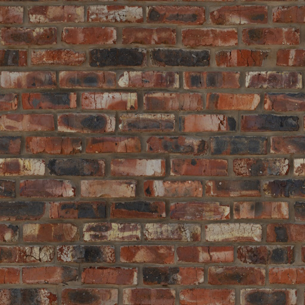
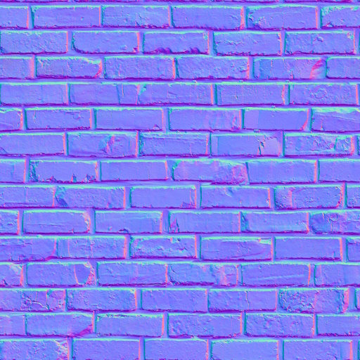
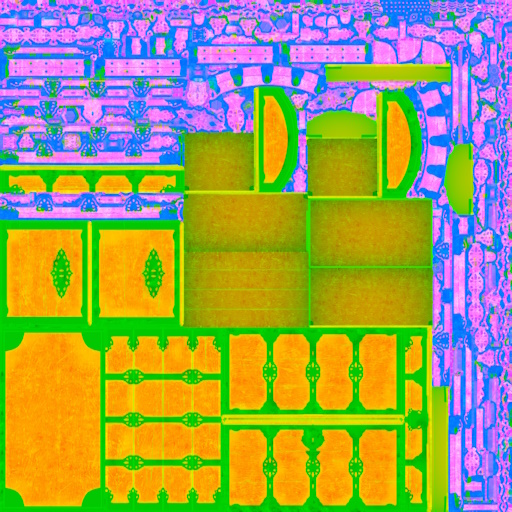
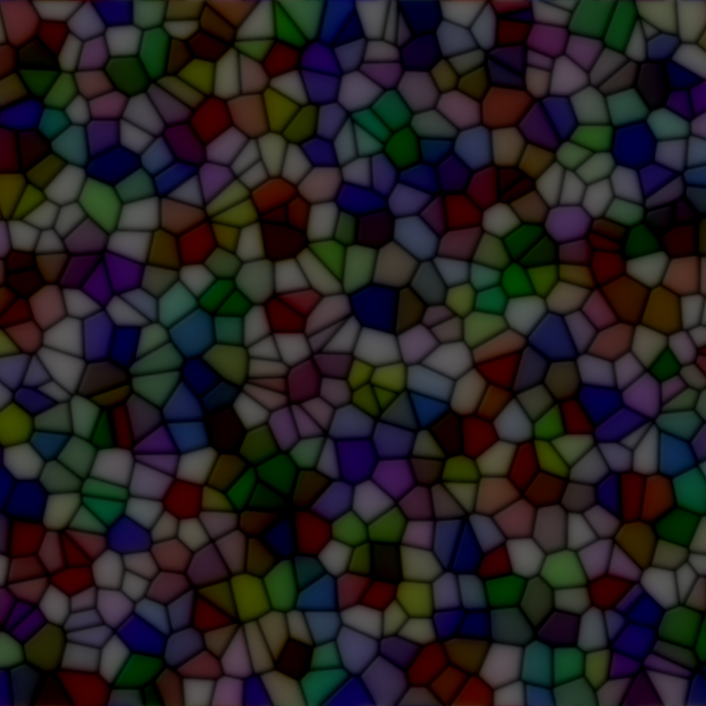
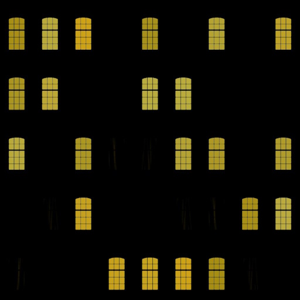
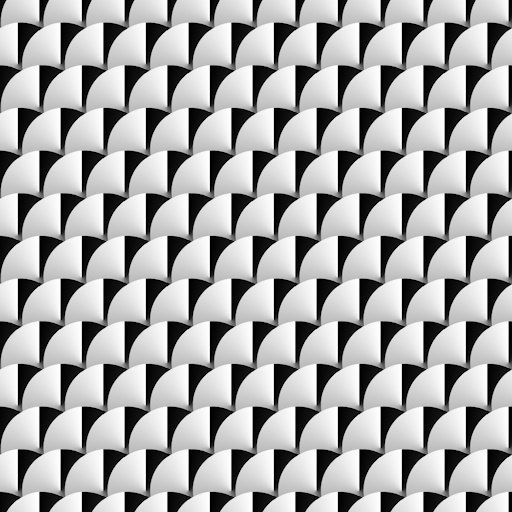
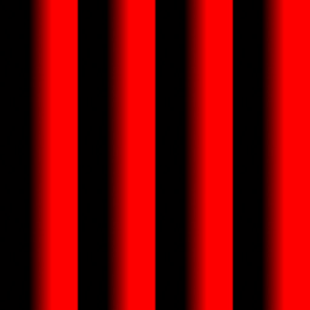

Almost every `Material` you create in TinyFFR will require at least one `Texture` map; each map type is used to implement a different aspect of the overall rendered surface effect. This page explains what each map type is and how it should be loaded/interpreted.

## Map Types

### Color Maps

{ align=left : style="max-height:128px;" }

| AssetLoader Method           | `LoadColorMap(...)`                                      |
| ---------------------------: | :------------------------------------------------------- |
| Expected Channel Count       | 3 (RGB) or 4 (RGBA)                                      |
| TextureDataType              | [`ColorSrgb`](loading_textures.md#texture-data-types)    |

Also known as albedo or diffuse maps. When a texture is interpreted as a color map its data will be used to set the albedo/diffuse (e.g. the "base") color of a material.

When alpha data is present, the RGB channels are expected to be premultiplied (unless alpha is just being used as an on/off mask); see [Alpha Premultiplication](#alpha-premultiplication) below. Additionally, the way the alpha data is used depends on the material type and configuration.

### Normal Maps

{ align=left : style="max-height:128px;" }

| AssetLoader Method           | `LoadNormalMap(...)`                                                |
| ---------------------------: | :------------------------------------------------------------------ |
| Expected Channel Count       | 3 (RGB); the blue channel is ignored                                |
| TextureDataType              | [`LinearDataUnitVector`](loading_textures.md#texture-data-types)    |

Normal maps define how light bounces off a surface by defining which way the surface is 'facing' at each texel (relative to the surface's underlying polygon normal).

Normal maps are expected in OpenGL format. If using DirectX-formatted texture files, you can supply an optional `isDirectXFormat: true` argument to `LoadNormalMap()`.

The normal map is interpreted as a unit-length 3D vector where R, G, and B channels map to X, Y, and Z components in a normalized range (e.g. \[0 to 255\] maps to \[-1, 1\]). +X points towards the positive mesh tangent direction; +Y points towards the positive mesh bitangent direction; +Z points out of the texture, up away from the surface.

TinyFFR only reads the red and green (X and Y) channels; the Z component is always reconstructed from them (as the vector is unit-length and its Z component can never point in to the surface). This means the blue channel's contents are ignored entirely, but the red and green channels must describe the X and Y of a genuinely unit-length vector. It is also why compressed normal maps only need to store two channels.

### ORM(R) Maps

{ align=left : style="max-height:128px;" }

| AssetLoader Method           | `LoadOcclusionRoughnessMetallicMap(...)` / `LoadOcclusionRoughnessMetallicReflectanceMap(...)` |
| ---------------------------: | :--------------------------------------------------------------------------------------------- |
| Expected Channel Count       | 3 (RGB) or 4 (RGBA)                                                                            |
| TextureDataType              | [`LinearData`](loading_textures.md#texture-data-types)                                         |

ORM maps (sometimes known as ARM maps) combine the Ambient-**O**cclusion, **R**oughness and **M**etallic information about a surface in to the red, green, and blue texture channels of a single texture.

ORMR maps are the same, but with the addition of **R**eflectance data in the alpha channel.

* The **Ambient Occlusion** data is used to determine how strongly ambient lighting (from the skybox/scene background) illuminates the material surface. Max value (255 or 1.0) indicates full ambient illumination, min value (0) indicates none whatsoever (e.g. fully occluded).
* The **Roughness** data is used to indicate how rough or smooth the material surface is; which in turn is used to determine how "glossy" or "shiny" it looks under lighting. Max value (255 or 1.0) indicates an extremely rough surface, min value (0) indicates a perfectly smooth one.
* The **Metallic** data is used to determine which parts of a material surface are comprised of metal (or metal-like substances). For realistic-looking materials every texel in a metallic map should either be max (255 or 1.0) to indicate metal or min (0) to indicate non-metal (also known as dielectric).
* The **Reflectance** data is optional (except for transmissive materials).
	* For opaque surfaces this data indicates how much of the surrounding specular light is reflected back off the material. Max value (255 or 1.0) indicates the surface reflects a high amount of specular highlights, min value (0) indicates the surface reflects none.
	* For transmissive surfaces this data indicates the index of refraction of the surface, with higher values translating to a higher IoR.
	* Real-world materials tend to be in the range \[35% - 100%\], so for realistic surfaces stay within that range. The 50% value will behave like most common materials.

If you pass a 3-channel (RGB) file to `LoadOcclusionRoughnessMetallicReflectanceMap()`, the reflectance channel is filled in automatically with the default reflectance (50%).

### Absorption-Transmission Maps

{ align=left : style="max-height:128px;" }

| AssetLoader Method           | `LoadAbsorptionTransmissionMap(...)`                     |
| ---------------------------: | :------------------------------------------------------- |
| Expected Channel Count       | 3 (RGB) or 4 (RGBA)                                      |
| TextureDataType              | [`ColorSrgb`](loading_textures.md#texture-data-types)    |

Absorption-transmission (AT) maps are only used for transmissive materials. They define how light passes through the surface of an object via two properties:

* The RGB channels define the absorption of the material: This indicates which light wavelengths (colours) are absorbed. The inverse of this value is therefore "seen" through the material; e.g. if the absorption map is pure yellow (255/255/0) only blue light will pass through the material surface.
* The alpha channel defines the transmission of the material: This indicates the intensity of light overall permitted through the material surface. A max value (255 or 1.0) indicates the surface is fully transparent and a min value (0) indicates the surface is fully opaque.

If you pass a 3-channel (RGB) file to `LoadAbsorptionTransmissionMap()`, the transmission channel is filled in automatically with the default transmission (50%).

Commonly, absorption and transmission data may be delivered as two separate texture files; an overload of `LoadAbsorptionTransmissionMap()` allows passing a separate file path for each.

Additionally, you may wish to use a traditional colour map as an "inverse" absorption map: `LoadAbsorptionTransmissionMap()` allows you to specify an optional `invertAbsorption: true` argument for this purpose.

### Emissive Maps

{ align=left : style="max-height:128px;" }

| AssetLoader Method           | `LoadEmissiveMap(...)`                                   |
| ---------------------------: | :------------------------------------------------------- |
| Expected Channel Count       | 3 (RGB) or 4 (RGBA)                                      |
| TextureDataType              | [`ColorSrgb`](loading_textures.md#texture-data-types)    |

Emissive maps are used to create materials whose surfaces appear to emit light. The colour of each texel determines the colour of the light emitted at the corresponding point on the material surface.

* If a 3-channel (RGB) texture is provided, all emissive parts of the material surface are shown with maximum intensity.
* If a 4-channel (RGBA) texture is provided, the alpha channel is used to control the emissive intensity; where a max value (255 or 1.0) indicates full intensity and a min value (0) indicates no emissive light at all.

If a separate intensity texture is desired, an overload of `LoadEmissiveMap()` allows provision of a separate colour and intensity map.

### Anisotropy Maps

{ align=left : style="max-height:128px;" }

| AssetLoader Method           | `LoadAnisotropyMapVectorFormatted(...)` / `LoadAnisotropyMapRadialAngleFormatted(...)` |
| ---------------------------: | :------------------------------------------------------------------------------------- |
| Expected Channel Count       | 3 (RGB) or 4 (RGBA)                                                                    |
| TextureDataType              | [`LinearData`](loading_textures.md#texture-data-types)                                 |

Anisotropy maps are used to indicate non-uniformity in the way a (typically metallic) surface reflects specular light highlights. A common example of this kind of effect in the real world can be seen in brushed metals.

TinyFFR internally stores anisotropy data as a 3-channel map where the red & green channels are the X and Y components of a unit vector pointing in the anisotropic direction of the surface in tangent-space and the blue channel indicates the strength of the anisotropy.

=== ":material-arrow-expand: Vector-formatted data"

	If your anisotropy data is stored in a texture already in the tangent-vector format, you can use `LoadAnisotropyMapVectorFormatted()`. The `strengthChannel` argument specifies whether the strength data is in the blue (`ColorChannel.B`) or alpha (`ColorChannel.A`) channel.

	If you have only the X/Y tangent-vector data in the red & green channels but **not** strength data in the blue or alpha channel, you can still use `LoadAnisotropyMapVectorFormatted()` and pass `null` for the `strengthChannel` argument: All the data will be interpreted as maximum strength.

	Alternatively, if you have separate strength and tangent-vector data files, an overload of `LoadAnisotropyMapVectorFormatted()` is provided that lets you supply both file paths separately to be combined.

=== ":material-radar: Angle-formatted data"

	Your anisotropy data may instead be stored as radial angle data (where the red channel's data indicates the 'angle' of the anisotropy). In this case, you should use `LoadAnisotropyMapRadialAngleFormatted()`.

	The arguments to `LoadAnisotropyMapRadialAngleFormatted()` are used to specify exactly how the data should be interpreted:

	<span class="def-icon">:material-code-json:</span> `zeroDirection`

	:   This argument specifies which direction on the 2D plane the lowest value (0) in the texel data represents.

	<span class="def-icon">:material-code-json:</span> `encodedRange`

	:   This argument specifies whether the \[0-255\] range in the texel data maps to \[0°-360°\] or \[0°-180°\].

	<span class="def-icon">:material-code-json:</span> `encodedAnticlockwise`

	:   This argument specifies whether the angle moves anticlockwise or clockwise from 0 to 255.

	<span class="def-icon">:material-code-json:</span> `strengthChannel`

	:   This argument specifies which channel in the texture file indicates anisotropic strength (green, blue, or alpha; the red channel always holds the angle). You may pass `null` if no such data is present (in which case all the data will be interpreted as maximum strength).

		Alternatively, if you have separate strength and angle data files, an overload of `LoadAnisotropyMapRadialAngleFormatted()` is provided that lets you supply both file paths separately to be combined.

	Note that preprocessing of angle-formatted data to the vector-format that TinyFFR uses internally can take some time. A static method `IAssetLoader.ConvertRadialAngleToVectorFormatAnisotropy()` is provided in case you wish to offline-process angle-formatted data for faster consumption; this method allows you to convert a span of texels from the former format to the latter.

### Clearcoat Maps

{ align=left : style="max-height:128px;" }

| AssetLoader Method           | `LoadClearCoatMap(...)`                                               |
| ---------------------------: | :-------------------------------------------------------------------- |
| Expected Channel Count       | 3 (RGB) or 4 (RGBA); only red & green are used                        |
| TextureDataType              | [`LinearDataTwoChannelMax`](loading_textures.md#texture-data-types)   |

Clearcoat maps are used to create an "overcoat" of plastic/wax over some types of materials.

TinyFFR uses a two-channel texture internally to support clearcoat maps.

* The first (red) channel represents the coat thickness; where a max value (255 or 1.0) indicates full thickness and a min value (0) indicates no clearcoat at all.
* The second (green) channel represents the coat roughness; where a max value (255 or 1.0) indicates a fully rough coat and a min value (0) indicates a fully glossy/smooth coat.

Any data in the blue and alpha channels is ignored.

???+ warning "Two-Channel Image Files"
	Image files are always read as either RGB or RGBA. A "two-channel" image file (such as a greyscale-with-alpha PNG) will therefore have its grey channel copied in to *both* the red and green channels (i.e. thickness and roughness will be identical), and its alpha channel will be ignored. Make sure the thickness and roughness data are in the red and green channels of an RGB/RGBA file.

In the case where you have a separate thickness and roughness texture, an overload of `LoadClearCoatMap()` is available that can combine two separate texture files.

## Alpha Premultiplication

A texture with *premultiplied* alpha stores each texel's colour channels already multiplied by its alpha value. For example, a pure red texel at 50% opacity would be stored as `(255, 0, 0, 128)` with "straight" (non-premultiplied) alpha, but as `(128, 0, 0, 128)` with premultiplied alpha. Fully transparent texels therefore always become fully black (`(0, 0, 0, 0)`).

??? question "Why does Premultiplication Matter?"
	When the GPU samples a texture it blends neighbouring texels together (and mipmaps are made by averaging texels together). With straight alpha, the colour of fully transparent texels (which is never meant to be seen, and is often black or just leftover data) is averaged in to the visible texels around it, producing dark or discoloured fringes around the edges of the visible parts of the image. With premultiplied alpha, transparent texels contribute nothing to the average, so edges blend cleanly.

	Additionally, the blending maths used to combine a semi-transparent surface with whatever is behind it expects premultiplied colour input.

**When to use it:** Premultiplied alpha is expected for colour maps used by materials that genuinely blend with the scene behind them:

* Standard materials using `StandardMaterialAlphaMode.FullBlending`;
* Transmissive materials using `TransmissiveMaterialAlphaMode.FullBlending` (the default for transmissive materials);
* Lighting-ignoring materials whose colour map has an alpha channel.

It makes no practical difference for materials whose alpha is only used as an on/off mask (i.e. `MaskOnly`, where any texel below 40% alpha is simply not drawn), or for textures without an alpha channel at all.

**When *not* to use it:** Never premultiply textures whose alpha channel holds data rather than opacity. Premultiplying these would corrupt their colour channels:

* Emissive maps (alpha is the emissive intensity);
* Absorption-transmission maps (alpha is the transmission);
* ORMR maps (alpha is the reflectance);
* Anisotropy maps with strength data in the alpha channel.

**How to apply it:** If your image file is already stored with premultiplied alpha, nothing needs to be done. Otherwise, note that `LoadColorMap()` does *not* premultiply the alpha for you; instead you can load the texture via `LoadTexture()` and ask TinyFFR to premultiply it as it loads (see [Processing](loading_textures.md#processing)):

```csharp
var leaves = factory.AssetLoader.LoadTexture(
	@"Assets/leaves.png",
	TextureCreationConfig.ForColorMap() with {
		ProcessingToApply = TextureProcessingConfig.PremultiplyAlpha()
	}
);
```

If you're generating texel data yourself, `TextureUtils.PremultiplyAlphaForTexture()`, `TexelRgba32.WithPremultipliedAlpha()`, and `ColorVect.WithPremultipliedAlpha()` can premultiply it for you. Color maps created via `TextureBuilder.CreateColorMap(..., includeAlpha: true)` are premultiplied automatically (unless you supply your own `TextureCreationConfig`).
