You can use the built-in texture pattern generators to create interesting color maps, normal maps, ORM maps, and more for your materials.

How to create textures from patterns (using the texture builder's `Create[...]Map()` functions) is explained on the previous page: [Creating Textures](creating_textures.md). This page demonstrates the different patterns themselves.

## Pattern Basics

Every pattern is created via one of the static methods on `TexturePattern` (e.g. `TexturePattern.Chequerboard()`), and is a `TexturePattern<T>`, where `T` is the type of value the pattern produces at each texel. The same pattern types can therefore be used to produce colours (`ColorVect`), normal-map directions (`SphericalTranslation`), angles (`Angle`), or plain numeric data (`Real`).

A pattern determines its own dimensions (in texels) from the arguments it's created with; these are available via its `Dimensions` property. Any size arguments you don't specify fall back to the defaults listed on `TexturePatternDefaultValues`.

Some pattern overloads (the circles with per-side values, and all of the gradients) blend smoothly between the values you give them. These overloads require a value type that can be interpolated; all of `ColorVect`, `Real`, `Angle`, and `SphericalTranslation` can be.

## Chequerboard Color Maps

=== "Bordered, 2 Colours"

	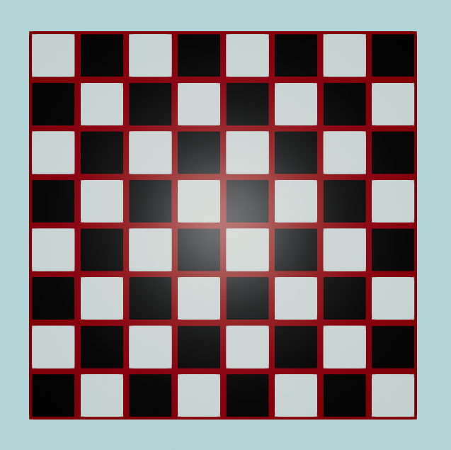{ style="max-height:200px;max-width:200px;border-radius:12px"}
	/// caption
	Chequerboard texture pattern
	///

	For this first example, we will create a color map using a `ChequerboardBordered` texture pattern:

	```csharp
	using var colorMap = textureBuilder.CreateColorMap(
		TexturePattern.ChequerboardBordered(
			borderValue: ColorVect.FromRgb24(0x880000), // (1)!
			borderWidth: 8, // (2)!
			firstValue: ColorVect.WhiteOpaque, // (3)!
			secondValue: ColorVect.BlackOpaque, // (4)!
			repetitionCount: (8, 8), // (5)!
			cellResolution: 120 // (6)!
		),
		includeAlpha: false // (7)!
	);
	```

	1. 	This line is setting the colour of the chequerboard borders.

		`ColorVect.FromRgb24()` allows you to specify colours as hex codes. You can also create a `ColorVect` from hue/saturation/lightness using `ColorVect.FromHueSaturationLightness()`, or specify the RGB components directly by using the constructor (i.e. `new ColorVect(r, g, b)`).

	2.	This line sets the width of the border around each cell (square), in pixels.

	3. 	This is setting the colour of the first cell (square) and every even-numbered cell after that.

	4. 	This is setting the colour of the second cell (square) and every odd-numbered cell after that.

	5.	This is setting the number of repetitions (i.e. the grid size of the texture). We want an 8x8 board so we specify repetition count as `(8, 8)`. 

		Note: In actuality, the type of the expression `(8, 8)` is [ValueTuple&lt;int, int&gt;](https://learn.microsoft.com/en-us/dotnet/api/system.valuetuple-2?view=net-9.0). The tuple is being implicitly converted to an `XYPair<int>`, which a TinyFFR type that `repetitionCount` is declared as.

	6.	This is setting the size, in pixels, of the width and depth of each cell (square).

	7.	Every color map created from a pattern must specify whether it should include an alpha channel. Our colours are all fully opaque, so we don't need one.

=== "Bordered, 4 Colours"

	There are some overloads of `ChequerboardBordered` that can take a `thirdValue` and/or `fourthValue` too if you prefer (and one that takes only a `firstValue`, for a single colour of cell separated by borders). Here's another example using four colours and an uneven repetition count:

	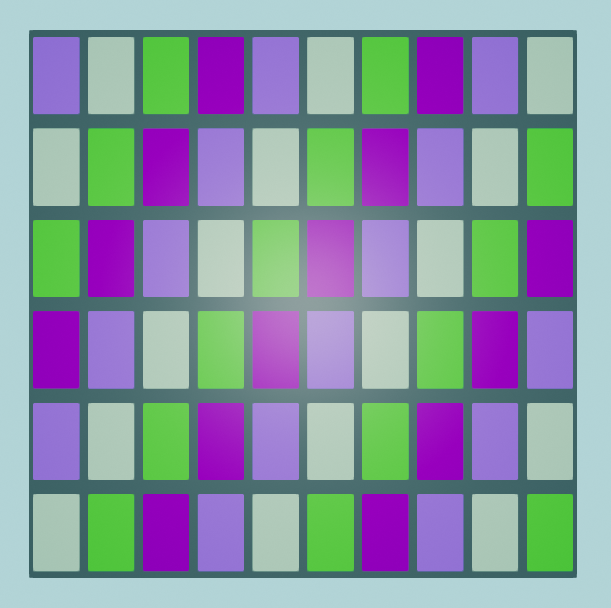{ style="max-height:200px;max-width:200px;border-radius:12px"}
	/// caption
	Four colours picked at random, uneven repetition count
	///

	```csharp
	using var colorMap = textureBuilder.CreateColorMap(
		TexturePattern.ChequerboardBordered(
			borderValue: ColorVect.RandomOpaque(),
			borderWidth: 16,
			firstValue: ColorVect.RandomOpaque(),
			secondValue: ColorVect.RandomOpaque(),
			thirdValue: ColorVect.RandomOpaque(),
			fourthValue: ColorVect.RandomOpaque(),
			repetitionCount: (10, 6),
			cellResolution: 200
		),
		includeAlpha: false
	);
	```

=== "Unbordered"

	There is also a variant pattern called `Chequerboard` (instead of `ChequerboardBordered`) that does not include a border:

	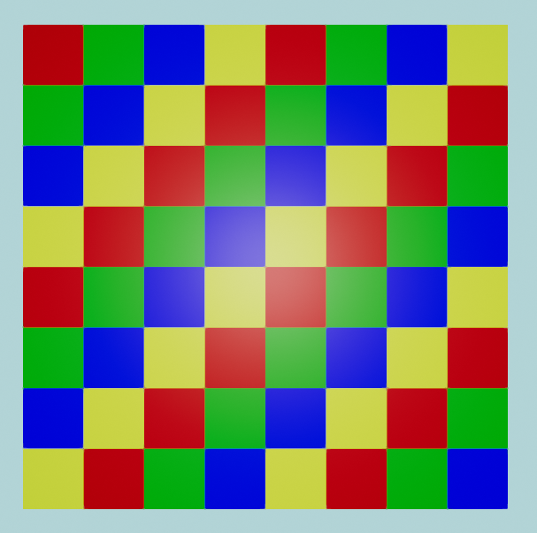{ style="max-height:200px;max-width:200px;border-radius:12px"}
	/// caption
	Red / yellow / green / blue, no border
	///

	```csharp
	using var colorMap = textureBuilder.CreateColorMap(
		TexturePattern.Chequerboard(
			firstValue: ColorVect.FromStandardColor(StandardColor.Red), // (1)!
			secondValue: ColorVect.FromStandardColor(StandardColor.Green),
			thirdValue: ColorVect.FromStandardColor(StandardColor.Blue),
			fourthValue: ColorVect.FromStandardColor(StandardColor.Yellow)
		),
		includeAlpha: false
	);
	```

	1. 	`ColorVect.FromStandardColor()` can also be replaced with just an implicit conversion from `StandardColor`, e.g. you can write this line simply as:

		`#!csharp firstValue: StandardColor.Red,`

## Circle or Rectangle Color Maps

=== "3x3 Circles"

	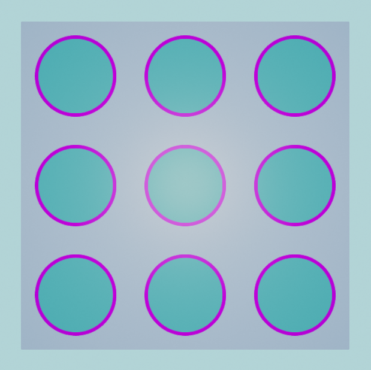{ style="max-height:200px;max-width:200px;border-radius:12px"}
	/// caption
	Nine bordered circles
	///

	In this example, we create a 3x3 'grid' of bordered circles. We specify each colour in [HSL](https://en.wikipedia.org/wiki/HSL_and_HSV) format with the static method `ColorVect.FromHueSaturationLightness()`. The first argument to `FromHueSaturationLightness()` is a hue angle in degrees, the second is a saturation (from 0.0 to 1.0), and the third is a lightness (also from 0.0 to 1.0):

	```csharp
	using var colorMap = textureBuilder.CreateColorMap(
		TexturePattern.Circles(
			interiorValue: ColorVect.FromHueSaturationLightness(180f, 0.6f, 0.33f), // (1)!
			borderValue: ColorVect.FromHueSaturationLightness(-70f, 1f, 0.5f), // (2)!
			paddingValue: ColorVect.FromHueSaturationLightness(240f, 0.3f, 0.7f), // (3)!
			repetitions: (3, 3) // (4)!
		),
		includeAlpha: false
	);
	```

	1. This is the colour of the interior of each circle.
	2. This is the colour of the border of each circle.
	3. This is the colour between the circles.
	4. Just like with the chequerboard patterns, this specifies the number of circles in each direction.

	The size of each circle can also be adjusted via the optional `interiorRadius`, `borderSize`, and `paddingSize` arguments (all in texels).

=== "Interpolated Circle"

	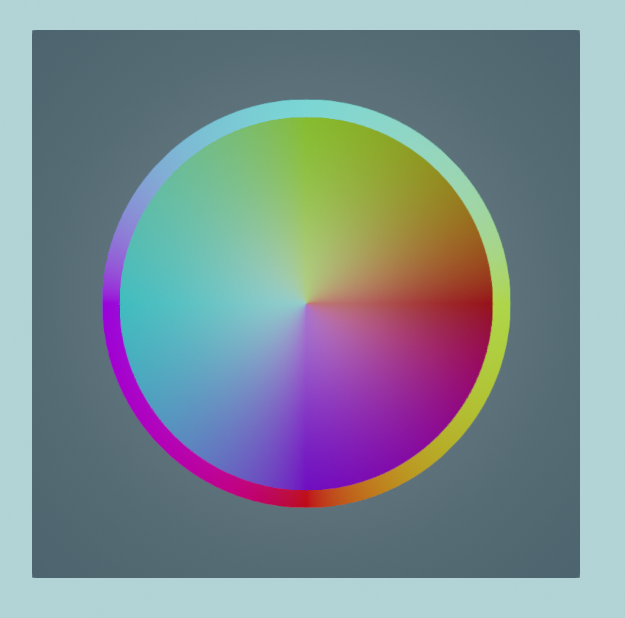{ style="max-height:200px;max-width:200px;border-radius:12px"}
	/// caption
	A single bordered circle with interpolated colouring
	///

	Some of the overloads for `TexturePattern.Circles()` work with interpolatable values (`ColorVect` is interpolatable). In the following example, we will set colour values for the top, left, right, and bottom of the border and interior of a circle, and the texture pattern will interpolate values around the circle between those four "stops".

	This example also uses some slightly more complicated constructions for `ColorVect`s:
	
	1. As we saw in the previous example, we can specify colours in HSL format. The first argument to `ColorVect.FromHueSaturationLightness()` is the hue angle.
	2. To make our interpolated colour wheel look nice, we set the right, top, left and bottom hue angles by converting them from corresponding `Orientation2D` values. `Orientation2D` is an enum that represents some base axes in 2D, and we can convert an `Orientation2D` to an `Angle` with the method `ToPolarAngle()`.
	3. `ToPolarAngle()` can return `null` if we invoke it on `Orientation2D.None`, but as we know we are not trying to convert a `None` orientation to an angle, we can use the [null-forgiving operator](https://learn.microsoft.com/en-us/dotnet/csharp/language-reference/operators/null-forgiving) and assume there's a `Value`.

	```csharp
	var rightAngle = Orientation2D.Right.ToPolarAngle()!.Value;
	var topAngle = Orientation2D.Up.ToPolarAngle()!.Value;
	var leftAngle = Orientation2D.Left.ToPolarAngle()!.Value;
	var bottomAngle = Orientation2D.Down.ToPolarAngle()!.Value;

	using var colorMap = textureBuilder.CreateColorMap(
		TexturePattern.Circles(
			interiorValueRight: ColorVect.FromHueSaturationLightness(rightAngle, 1f, 0.3f),
			interiorValueTop: ColorVect.FromHueSaturationLightness(topAngle, 1f, 0.3f),
			interiorValueLeft: ColorVect.FromHueSaturationLightness(leftAngle, 1f, 0.3f),
			interiorValueBottom: ColorVect.FromHueSaturationLightness(bottomAngle, 1f, 0.3f),

			borderValueRight: ColorVect.FromHueSaturationLightness(rightAngle + 90f, 1f, 0.5f), // (1)!
			borderValueTop: ColorVect.FromHueSaturationLightness(topAngle + 90f, 1f, 0.5f),
			borderValueLeft: ColorVect.FromHueSaturationLightness(leftAngle + 90f, 1f, 0.5f),
			borderValueBottom: ColorVect.FromHueSaturationLightness(bottomAngle + 90f, 1f, 0.5f),

			paddingValue: ColorVect.WhiteOpaque.WithLightness(0.2f), // (2)!

			repetitions: (1, 1)
		),
		includeAlpha: false
	);
	```

	1. Notice that we're shifting the hue colour angle for each border stop by 90°, mostly to help it stand out from the interior colour wheel.
	2. `WithLightness()` returns a new `ColorVect` with the HSL lightness adjusted to the given value (in this case we're returning white with a lightness of `0.2`).

=== "Simple Rectangles"

	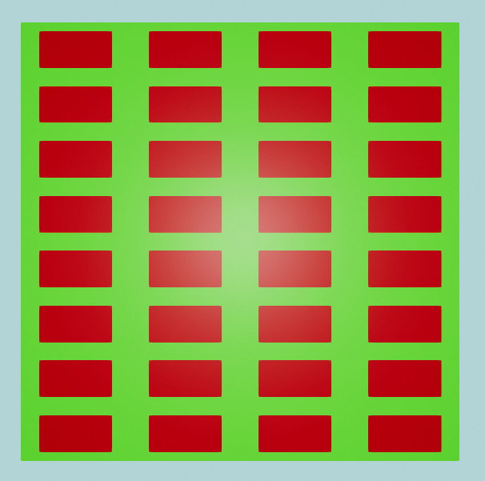{ style="max-height:200px;max-width:200px;border-radius:12px"}
	/// caption
	A very simple repetition of red rectangles on a green background
	///

	This example shows how to generate a rectangles pattern using only two arguments. If desired, it's also possible to specify a `borderValue`, but this is optional:

	```csharp
	using var colorMap = textureBuilder.CreateColorMap(
		TexturePattern.Rectangles(
			interiorValue: new ColorVect(1f, 0f, 0f),
			paddingValue: new ColorVect(0f, 1f, 0f)
		),
		includeAlpha: false
	);
	```

=== "Bordered Squares"

	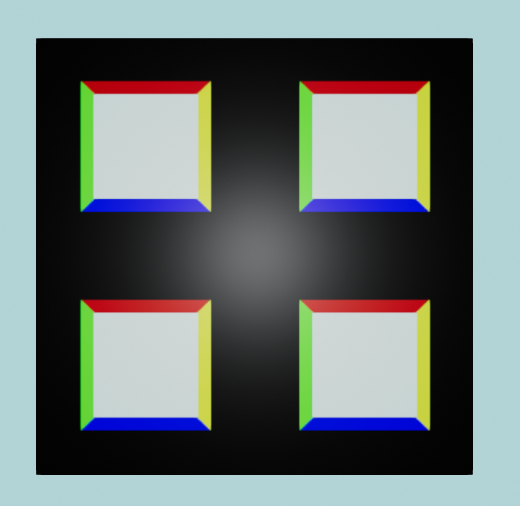{ style="max-height:200px;max-width:200px;border-radius:12px"}
	/// caption
	Four squares each with multi-coloured borders
	///

	Not only can you specify a border for each "rectangle", but you can actually specify a different value for the top, left, bottom and right sides (in this overload every argument except `transform` is required):

	```csharp
	using var colorMap = textureBuilder.CreateColorMap(
		TexturePattern.Rectangles(
			interiorSize: (64, 64),
			borderSize: (8, 8),
			paddingSize: (32, 32),
			interiorValue: new ColorVect(1f, 1f, 1f),
			borderRightValue: new ColorVect(1f, 1f, 0f),
			borderTopValue: new ColorVect(1f, 0f, 0f),
			borderLeftValue: new ColorVect(0f, 1f, 0f),
			borderBottomValue: new ColorVect(0f, 0f, 1f),
			paddingValue: new ColorVect(0f, 0f, 0f),
			repetitions: (2, 2)
		),
		includeAlpha: false
	);
	```

## Circle or Rectangle Normal Maps

=== "Rectangular Studs"

	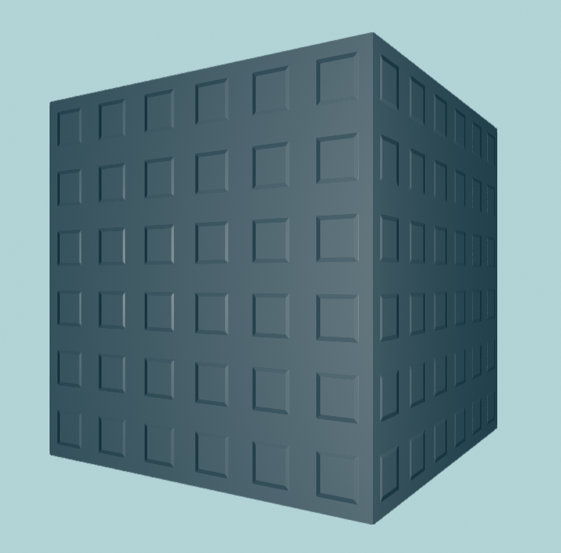{ style="max-height:200px;max-width:200px;border-radius:12px"}
	/// caption
	This cube has a flat color map but the normal map gives it the impression of having 'studs' on its surface
	///

	Normal maps are textures, but instead of the pixels representing colours (RGB) they represent directions (XYZ). In the real world, most surfaces aren't perfectly flat but actually have slight grooves and imperfections. Normal maps attempt to model those imperfections and patterns by specifying the *direction* each pixel of the surface is facing (relative to the overall surface plane) and are used when calculating lighting reflections to provide a more realistic-looking material. That means we can make "interesting" normal maps by specifying some pixels that don't face perfectly forward (relative to the surface).
	
	Normal maps in TinyFFR can be generated with `SphericalTranslation` texture patterns.

	??? abstract "Normal Map SphericalTranslation Explanation"
		Each `SphericalTranslation` is comprised of two angle parameters: An `AzimuthalOffset` and a `PolarOffset`.

		Any value greater than `0°` for `PolarOffset` (the second parameter) will "bend" the texture normal towards the direction determined by the `AzimuthalOffset` (the first parameter).
		
		* 	The first parameter (`AzimuthalOffset`) can be any angle and it represents the 2D orientation of the texel's normal direction. In other words, this parameter specifies the **direction of distortion** on the surface. 
		
			A value of `0°` points along the mesh surface's "U" axis (also known as its **tangent** direction). 
			
			A value of `90°` points along the mesh surface's "V" axis (also known as its **bitangent** direction).
			
			A value of `180°` points opposite to the mesh surface's "U" axis.
			
			A value of `270°` points opposite to the mesh surface's "V" axis.

		* 	The second parameter (`PolarOffset`) should be an angle between `0°`and `90°` and it represents **how distorted** the surface is. 
		
			A value of `0°` means the texel normal direction will point perfectly straight out from the surface (indicating a perfectly flat surface at this point). 
			
			A value of `90°` means the texel normal direction will be completely flattened against the surface (indicating a 100% distorted surface).

	For this first example, we will create a normal map that gives the impression of rectangular 'studs' sticking out of our surface by using the `Rectangles` texture pattern:

	```csharp
	using var normalMap = textureBuilder.CreateNormalMap(TexturePattern.Rectangles(
		interiorSize: (64, 64),
		borderSize: (8, 8),
		paddingSize: (32, 32),
		interiorValue: new SphericalTranslation(0f, 0f), // (1)!
		borderRightValue: new SphericalTranslation(0f, 45f), // (2)!
		borderTopValue: new SphericalTranslation(90f, 45f),
		borderLeftValue: new SphericalTranslation(180f, 45f),
		borderBottomValue: new SphericalTranslation(270f, 45f),
		paddingValue: new SphericalTranslation(0f, 0f),
		repetitions: (6, 6)
	));
	```

	1. 	The `interiorValue` and `paddingValue` specify the value in this pattern for all texels inside and outside the rectangle borders respectively.

		In this case, we want to specify that these interior and padding texels are perfectly flat (non-distorted), so we specify the `SphericalTranslation`'s `PolarOffset` as 0°.

	2.	We specify each border direction's coordinate `AzimuthalOffset` as being 90° offset from the previous (e.g. right is 0°, top is 90°, left is 180°, bottom is 270°).

		We then make these border texels point exactly 45° out from the surface by setting their `PolarOffset`s to 45°.

	To use it, the `normalMap` is supplied to `CreateStandardMaterial()` alongside your `colorMap`:

	```csharp
	using var material = materialBuilder.CreateStandardMaterial(
		colorMap: colorMap, 
		normalMap: normalMap
	);
	```

=== "Circular Indents"

	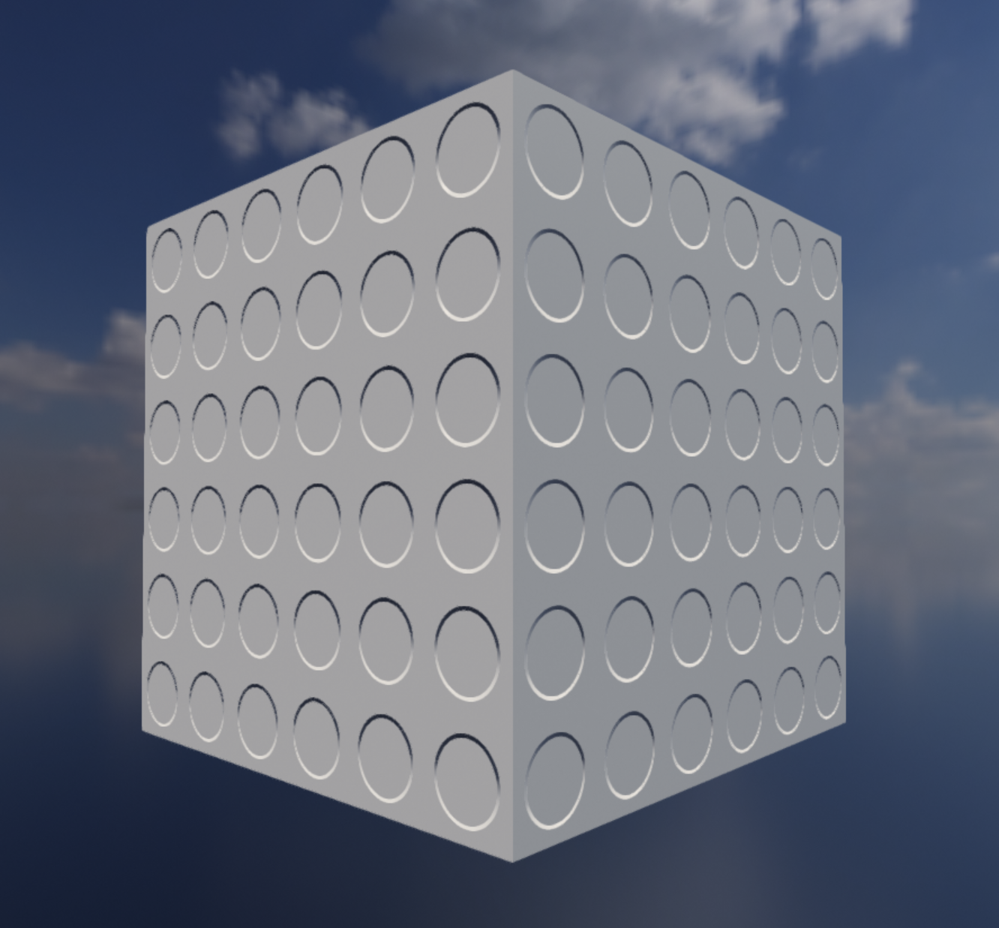{ style="max-height:200px;max-width:200px;border-radius:12px"}
	/// caption
	This surface shows circular indentations.
	///

	Like with the [Interpolated Circle example above](#__tabbed_2_2) we use the interpolatable functionality of `SphericalTranslation` to create a smooth interpolated circle:

	```csharp
	using var normalMap = textureBuilder.CreateNormalMap(TexturePattern.Circles(
		interiorValue: new SphericalTranslation(0f, 0f), // (1)!
		borderValueRight: new SphericalTranslation(180f, 45f), // (2)!
		borderValueTop: new SphericalTranslation(270f, 45f),
		borderValueLeft: new SphericalTranslation(0f, 45f),
		borderValueBottom: new SphericalTranslation(90f, 45f),
		paddingValue: new SphericalTranslation(0f, 0f),
		repetitions: (6, 6)
	));
	```

	1. 	The `interiorValue` and `paddingValue` specify the value in this pattern for all texels inside and outside the circle borders respectively.

		In this case, we want to specify that these interior and padding texels are perfectly flat (non-distorted), so we specify the `SphericalTranslation`'s `PolarOffset` as 0°.

	2.	We specify each border direction's coordinate `AzimuthalOffset` as being one of the 90° right-angle values.

		We deliberately flip the top/bottom and left/right borders from the [usual convention](conventions.md#2d-handedness-orientation) in order to create an "indented" rather than "outdented" effect.

	Compare also to [Occluded Circular Divots](#__tabbed_4_3) below.

## Line & Circle ORM Maps

When creating an ORM map from patterns, `CreateOcclusionRoughnessMetallicMap()` requires a pattern for each of the occlusion, roughness, and metallic components. If you only want to vary one or two of them, use a `PlainFill` pattern for the others. The default values (the same ones used when creating an ORM map from single values) are available as `ITextureBuilder.DefaultOcclusion`, `ITextureBuilder.DefaultRoughness`, and `ITextureBuilder.DefaultMetallic`.

=== "Metallic Strips"

	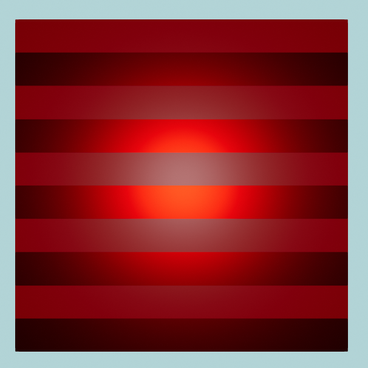{ style="max-height:200px;max-width:200px;border-radius:12px"}
	/// caption
	The lines along this surface alternate between metallic and non-metallic strips.
	///

	In this first example for ORM maps, we will vary just the metallic data. Specifically, we will use the `Lines` pattern to create metallic 'bands'/'strips' horizontally across our material surface:

	```csharp
	var metallicPattern = TexturePattern.Lines<Real>( // (1)!
		firstValue: 0f, // (2)!
		secondValue: 1f, // (3)!
		horizontal: true, // (4)!
		numRepeats: 5 // (5)!
	);

	using var ormMap = textureBuilder.CreateOcclusionRoughnessMetallicMap( // (6)!
		occlusionPattern: TexturePattern.PlainFill<Real>(ITextureBuilder.DefaultOcclusion),
		roughnessPattern: TexturePattern.PlainFill<Real>(ITextureBuilder.DefaultRoughness),
		metallicPattern: metallicPattern
	);

	using var material = materialBuilder.CreateStandardMaterial( // (7)!
		colorMap: colorMap, 
		ormOrOrmrMap: ormMap
	);
	```

	1. 	We must specify that this is a pattern of `Real` values (which is the type of value used to create metallic, roughness, or occlusion patterns).

		??? abstract "Why Real instead of just float?"
			`Real` is a TinyFFR type that thinly wraps floating point values with implicit conversions to and from `float`. Its name comes from the mathematical terminology for a [real number](https://en.wikipedia.org/wiki/Real_number) (which is what floating point values represent).
			
			`Real` implements our interpolatable interface (`IInterpolatable<>`) which means we can use it in patterns that interpolate (like the [interpolated circle example](#__tabbed_2_2) above).

			Eventually, when C# gets a way to implement interfaces on pre-existing types (i.e. via a 'shapes' or 'extension everything' proposal), we may be able to do away with `Real` entirely.

			You could also rely on type inference instead of specifying the type parameter explicitly if you specify your values (e.g. `firstValue`, `secondValue`, etc.) as `Real` rather than `float`; but the approach shown in the example tends to be cleaner.

	2.	A value of `0f` indicates that the first line in our pattern will be non-metallic.
	3.	A value of `1f` indicates that the second line in our pattern will be metallic. 
	
		Remember, metallic-map values should generally always only consist of 0f and 1f. Interim values are valid and defined behaviour, but are only really useful for special effects and transitions. A material can't really be "half-metallic" in the real world, and in a rendering context it tends to look odd.

	4.	This makes our lines horizontal. If you specify `false` for this parameter, the lines will be vertical instead.
	5.	This indicates how many times we'd like the pattern to repeat (i.e. how many times we want our `firstValue` and `secondValue` to band across the texture).

		Because we wrote `5`, we will see 10 bands in total (5 of `firstValue`/non-metallic and 5 of `secondValue`/metallic).

	6.	We want to vary only the metallic data, so we pass `PlainFill` patterns of the default occlusion and roughness values for the other two components.

		If you wanted a uniform ORM map with no patterns at all, you could instead use the overload that takes single values (e.g. `CreateOcclusionRoughnessMetallicMap(metallic: 1f)`); see [Creating Textures](creating_textures.md#map-creation-functions).

	7.	Finally we pass our `ormMap` to `CreateStandardMaterial()` just like we did with the `colorMap` and `normalMap`. 
	
		If you're not passing in a `normalMap` make sure you explicitly name the arguments to the method like we're doing here to make sure you don't accidentally pass your `ormMap` as a `normalMap`.

=== "Perturbed Metallic and Roughness"

	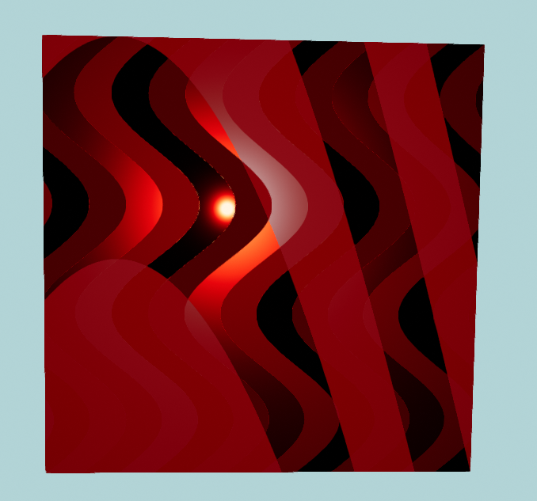{ style="max-height:200px;max-width:200px;border-radius:12px"}
	/// caption
	The larger lines are metallic and non-metallic bands. The thinner lines vary in their roughness value.

	Example is shown on a cube that is slightly rotated to best show off lighting at an oblique angle.
	///

	In this next example we will:
	
	1. Create a *metallic* pattern with curved lines,
	2. Create a *roughness* pattern with wavy lines,
	3. Overlay them over each other in to one ORM map.

	??? tip "Reminder: Flat Colouring"
		For this example, we have specified a simple flat colour map ("maroon"). 
		
		All the striations and banding effects shown in this example are just a result of defining differing values for the roughness and metallicness of our material. The underlying colour is all just maroon (dark red).

	Perturbation is an optional parameter to the `Lines` texture pattern that applies a sinusoidal (wave-like) distortion to the lines. There are two parameters to the texture pattern that affect perturbation:

	<span class="def-icon">:material-code-json:</span> `perturbationMagnitude`
	
	:	Defines how 'deep' the curves/waves are.
	
		A value of `0f` means no perturbation (this is the default). Generally speaking, values between `0f` and `0.5f` will look the best, but any value is permitted. 
		
		Higher values can start to simulate other materials like wood grains. 
		
		Negative values have all the same properties as positive values but reverse the direction of the waves.

	<span class="def-icon">:material-code-json:</span> `perturbationFrequency`
	
	:	Defines how many times the waves/curves will repeat.
	
		Any value is permitted. Values above `1f` make wave patterns, values below `1f` simply distort the lines in to a curve shape. 
	
		Negative values have all the same properties as positive values but reverse the direction of the curves.

	The thickness of each line and the overall size of the pattern can also be adjusted via the optional `lineThickness` and `colinearSize` arguments.

	```csharp
	var roughnessPattern = TexturePattern.Lines<Real>( // (1)!
		firstValue: 0f,
		secondValue: 0.7f,
		thirdValue: 0.3f,
		fourthValue: 1f,
		horizontal: false,
		numRepeats: 3,
		perturbationMagnitude: 0.1f,
		perturbationFrequency: 2f
	);
	var metallicPattern = TexturePattern.Lines<Real>(
		firstValue: 0f,
		secondValue: 1f,
		horizontal: true,
		numRepeats: 1,
		perturbationMagnitude: 2f,
		perturbationFrequency: -0.3f
	);

	using var ormMap = textureBuilder.CreateOcclusionRoughnessMetallicMap( // (2)!
		occlusionPattern: TexturePattern.PlainFill<Real>(ITextureBuilder.DefaultOcclusion),
		roughnessPattern: roughnessPattern, 
		metallicPattern: metallicPattern
	);
	```

	1. 	This line pattern uses four values to specify four roughness bands (`0f` is perfectly smooth, `1f` is maximally rough).

		`Lines` patterns can have up to ten values.

	2.	In this example we're passing in a roughness and metallic pattern to `CreateOcclusionRoughnessMetallicMap()` (and a plain fill of the default occlusion value). Make sure you name the arguments to avoid accidentally specifying the wrong type of pattern.

=== "Occluded Circular Divots"

	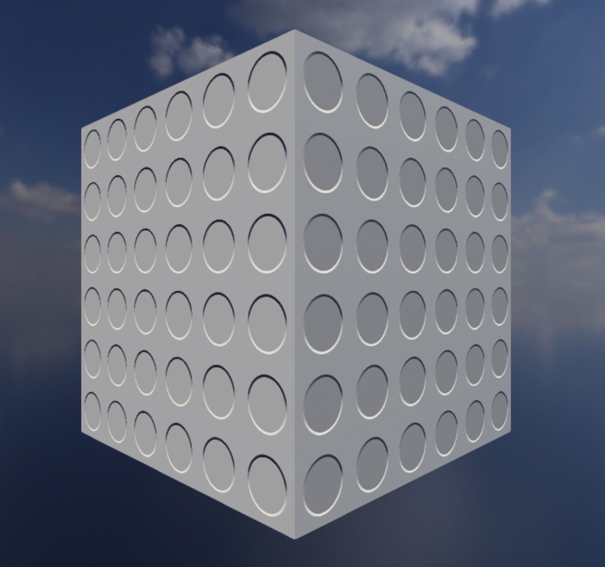{ style="max-height:200px;max-width:200px;border-radius:12px"}
	/// caption
	This surface shows circular divots where the interior of each divot has some ambient occlusion applied to dim the ambient lighting from the skybox.
	///

	This example builds on [Circular Indents](#__tabbed_3_2) above and adds some ambient occlusion inside the circular divots for additional realism.

	As a reminder, the actual surface geometry has not changed (it's still a plain cube mesh); but by clever usage of normal and occlusion mapping we can give the strong "effect" of surface detail.

	```csharp
	using var normalMap = textureBuilder.CreateNormalMap(TexturePattern.Circles( // (1)!
		interiorValue: new SphericalTranslation(0f, 0f),
		borderValueRight: new SphericalTranslation(180f, 45f),
		borderValueTop: new SphericalTranslation(270f, 45f),
		borderValueLeft: new SphericalTranslation(0f, 45f),
		borderValueBottom: new SphericalTranslation(90f, 45f),
		paddingValue: new SphericalTranslation(0f, 0f),
		repetitions: (6, 6)
	));

	using var ormMap = textureBuilder.CreateOcclusionRoughnessMetallicMap( // (2)!
		occlusionPattern: TexturePattern.Circles<Real>(
			interiorValue: 0.5f,
			borderValue: 0.75f,
			paddingValue: 1f,
			repetitions: (6, 6)
		),
		roughnessPattern: TexturePattern.PlainFill<Real>(ITextureBuilder.DefaultRoughness),
		metallicPattern: TexturePattern.PlainFill<Real>(ITextureBuilder.DefaultMetallic)
	);
	```

	1.	The normal pattern is identical to the one shown above in the [Circular Indents](#__tabbed_3_2) example.

	2.	We make a `Circles` pattern with the same dimensions/repetition count as our normal map, but specify the interiors of the circles as having 50% ambient reflectivity, the borders/rims as having 75%, and the outsides of the circles as having the standard 100%.

## Plain Fills & Gradients

=== "Roughness Gradient over Plain Metal"

	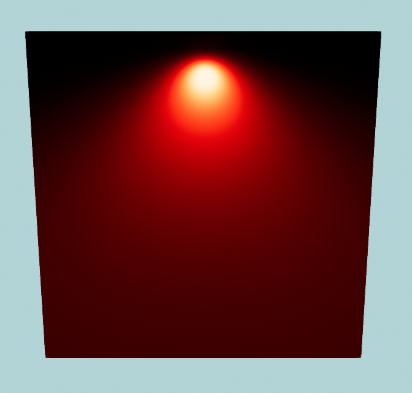{ style="max-height:200px;max-width:200px;border-radius:12px"}
	/// caption
	A single light is shining against this dark-red metal cube.

	The metal is shiniest at the top and rougher at the bottom.
	///

	In this example we will use a `PlainFill` to create a fully metallic surface, and then use a `GradientVertical` to vary the roughness from top-to-bottom:

	```csharp
	using var ormMap = textureBuilder.CreateOcclusionRoughnessMetallicMap(
		occlusionPattern: TexturePattern.PlainFill<Real>(ITextureBuilder.DefaultOcclusion),
		roughnessPattern: TexturePattern.GradientVertical<Real>(0f, 1f), // (1)!
		metallicPattern: TexturePattern.PlainFill<Real>(1f) // (2)!
	);

	using var material = materialBuilder.CreateStandardMaterial(
		colorMap: colorMap, 
		ormOrOrmrMap: ormMap
	);
	```

	1. This creates a vertical gradient from 0 (smooth) to 1 (rough) for the `roughnessPattern`.
	2. This sets a plain fill of 1 (metal) for the whole `metallicPattern`.

=== "Rainbow Square"

	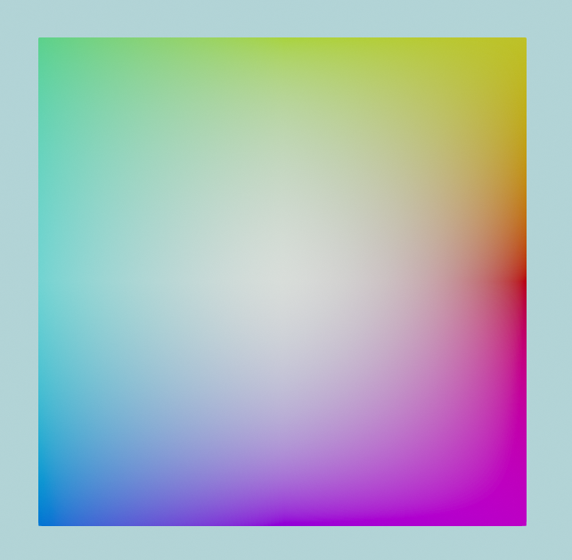{ style="max-height:200px;max-width:200px;border-radius:12px"}
	/// caption
	Rainbow color map created with a gradient texture pattern.
	///
	
	This example shows how to use the `Gradient()` pattern to create a rainbow color map. We're adjusting the hue angle for each colour by 45 degrees as we go around the 'circle' of the gradient:

	```csharp
	using var colorMap = textureBuilder.CreateColorMap(
		TexturePattern.Gradient(
			right:			ColorVect.FromHueSaturationLightness(0f, 1f, 0.5f),
			topRight:		ColorVect.FromHueSaturationLightness(45f, 1f, 0.5f),
			top:			ColorVect.FromHueSaturationLightness(90f, 1f, 0.5f),
			topLeft:		ColorVect.FromHueSaturationLightness(135f, 1f, 0.5f),
			left:			ColorVect.FromHueSaturationLightness(180f, 1f, 0.5f),
			bottomLeft:		ColorVect.FromHueSaturationLightness(225f, 1f, 0.5f),
			bottom:			ColorVect.FromHueSaturationLightness(270f, 1f, 0.5f),
			bottomRight:	ColorVect.FromHueSaturationLightness(315f, 1f, 0.5f),
			centre:			ColorVect.WhiteOpaque
		),
		includeAlpha: false
	);
	using var material = materialBuilder.CreateStandardMaterial(colorMap);
	```

??? info "Gradient and Plain Fill Pattern Types"
	There are multiple variants of `Gradient`/fill patterns available:
	
	<span class="def-icon">:material-code-block-parentheses:</span> `PlainFill()`

	:   The plain fill pattern does as its name implies. It takes a single argument that is the value for the full color, normal, occlusion, roughness, or metallic map.

		In the first example we're using it to create a metallic map that makes our material fully metallic all over.

	<span class="def-icon">:material-code-block-parentheses:</span> `GradientVertical()`

	:   This pattern interpolates between a `top` and `bottom` value and produces a vertical gradient.
	
		It can also take an optional `centre` value if you wish for a skewed/non-linear gradient.

	<span class="def-icon">:material-code-block-parentheses:</span> `GradientHorizontal()`

	:   This pattern interpolates between a `left` and `right` value and produces a horizontal gradient.
	
		It can also take an optional `centre` value if you wish for a skewed/non-linear gradient.

	<span class="def-icon">:material-code-block-parentheses:</span> `GradientRadial()`

	:   This pattern interpolates between an `inner` and `outer` gradient and produces a radial (circular) gradient.
	
		You can also specify whether to `fringeCorners`, i.e. whether the corners of the resultant map texture should go a little past the `outer` value. If `true` (the default) the corners of the map will 'fringe' past `outer`. If `false` the corners will be clamped to the `outer` value.

		The optional `innerOuterRatio` argument controls how quickly the gradient moves from the `inner` value to the `outer` value.

	<span class="def-icon">:material-code-block-parentheses:</span> `Gradient()`

	:   Finally, this more general purpose gradient pattern lets you specify a value at nine different points (the four corners, the four sides, and the centre).
	
		The pattern will interpolate between all nine values across the map texture.

	Every gradient pattern also takes an optional `resolution` argument specifying its width and height in texels.

## Grid Patterns

The `Grid` pattern draws evenly-spaced horizontal and vertical lines over a background, like a sheet of graph paper. The lines are laid out outwards from the centre of the pattern, so there is always a horizontal and vertical line passing through its exact centre.

The full form of the pattern lets you specify separate values for the two *centre* lines, the widely-spaced *major* lines, and the closely-spaced *minor* lines in between them:

```csharp
using var colorMap = textureBuilder.CreateColorMap(
	TexturePattern.Grid(
		centreLineValue: ColorVect.FromStandardColor(StandardColor.Red), // (1)!
		majorLineValue: ColorVect.WhiteOpaque,
		minorLineValue: new ColorVect(0.4f, 0.4f, 0.4f),
		backgroundValue: ColorVect.BlackOpaque,
		majorLineSpacing: 0.25f, // (2)!
		minorLineSpacing: 0.05f,
		centreLineThickness: 8, // (3)!
		majorLineThickness: 4,
		minorLineThickness: 2,
		resolution: 1024 // (4)!
	),
	includeAlpha: false
);
```

1.	These four lines set the value of each kind of line and the background. Where lines overlap, centre lines are drawn over major lines, which are drawn over minor lines.

2.	These two lines set the distance between neighbouring lines, as a fraction of the pattern's width. In this example there will be a major line every quarter of the texture, and a minor line every twentieth.

	Setting either spacing to `0f` removes that set of lines entirely.

3.	These three lines set the thickness of each kind of line, in texels.

4.	The width and height of the pattern in texels (grid patterns are always square).

For a simple grid where every line is the same, the shorter overload takes just one line value, a background value, and (optionally) a spacing and thickness. For example, the following creates an ORM map where the surface is metallic only along a grid of lines:

```csharp
using var ormMap = textureBuilder.CreateOcclusionRoughnessMetallicMap(
	occlusionPattern: TexturePattern.PlainFill<Real>(ITextureBuilder.DefaultOcclusion),
	roughnessPattern: TexturePattern.PlainFill<Real>(ITextureBuilder.DefaultRoughness),
	metallicPattern: TexturePattern.Grid<Real>(lineValue: 1f, backgroundValue: 0f, lineSpacing: 0.125f, lineThickness: 8)
);
```

## Transforms

Finally, every texture pattern (except `PlainFill`) takes a `Transform2D` parameter named `transform` that can be used to apply a rescaling, rotation, and shifting/movement to the final texture pattern.

* A `scaling` will take the pattern and shrink or expand it.
* A `rotation` will take the pattern and rotate it.
* A `translation` will take the pattern and shift/move it.
* You can supply any one of these "transformations", or all three, or anything in between(1).
 { .annotate }

	1. When supplying more than one type of transformation, they will always be applied in a specific order:

		1. Scaling first,
		2. Then rotation,
		3. Then translation.

We will start off with this untransformed color map:

```csharp
using var colorMap = textureBuilder.CreateColorMap(
	TexturePattern.ChequerboardBordered<ColorVect>(
		borderValue: StandardColor.Black,
		firstValue: StandardColor.Red,
		secondValue: StandardColor.Green,
		thirdValue: StandardColor.Blue,
		fourthValue: StandardColor.Purple,
		borderWidth: 8,
		transform: Transform2D.None // (1)!
	),
	includeAlpha: false
);
```

1. 	Only this line will change in the following three examples.

	(Supplying `Transform2D.None` to the `transform` argument is the same as supplying no argument at all.)

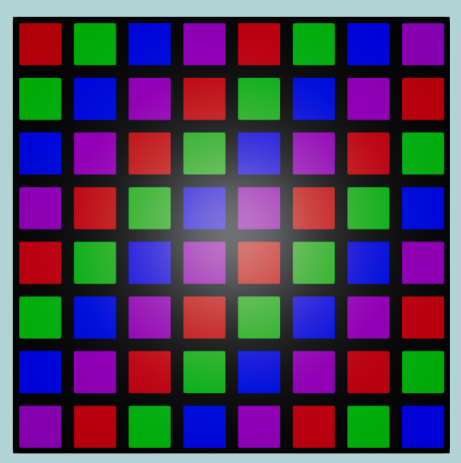{ style="max-height:200px;max-width:200px;border-radius:12px"}
/// caption
This color map has a transform of `None` applied, i.e. no transformation is made.

The  tabs below show the three different transformation types being applied to it:
///

=== "Scaling"

	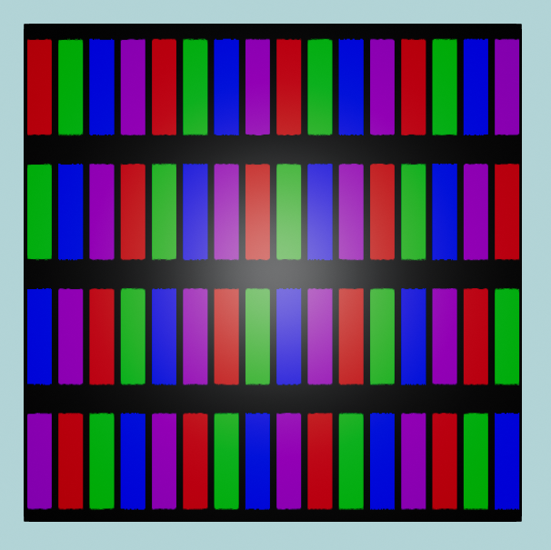{ style="max-height:200px;max-width:200px;border-radius:12px"}
	/// caption
	Scaling transform applied to the original color map. 
	///

	In this example we apply a scaling transformation of 50% in the horizontal direction and 200% in the vertical direction:
	
	```csharp
	using var colorMap = textureBuilder.CreateColorMap(
		TexturePattern.ChequerboardBordered<ColorVect>(
			borderValue: StandardColor.Black,
			firstValue: StandardColor.Red,
			secondValue: StandardColor.Green,
			thirdValue: StandardColor.Blue,
			fourthValue: StandardColor.Purple,
			borderWidth: 8,
			transform: new Transform2D(scaling: (0.5f, 2f)) // (1)!
		),
		includeAlpha: false
	);
	```

	1. This transform is specifying a 0.5x scaling in the X (horizontal) direction and a 2.0x scaling in the Y (vertical) direction.

	??? question "Why does scaling down the horizontal size *increase* the number of columns etc.?"
		This may or may not confuse you depending on your perception of the scaled image, but if it *does* confuse you, here's the explanation:
		
		Somewhat counterintuitively, *decreasing* the horizontal (X-axis) scaling of the pattern to 50% has __doubled__ the number of columns we see. Similarly, *increasing* the vertical (Y-axis) scaling to 200% has __halved__ the number of rows.

		Nonetheless, this is correct. Here's the explanation of what a scaling transform is doing: 
		
		* Imagine a scaling factor less than `1.0f` as like a vice grip 'squashing' the image. In this example we've 'squashed' the pattern along its X-axis to half its original width. The squashed pattern then simply repeats over and over left-to-right.
		* Imagine a scaling factor greater than `1.0f` like a pinch-and-zoom-in effect on the image. In this example we've 'expanded' the pattern along its Y-axis to double its original height. The bottom half of the expanded pattern is then lost past the bottom of our image.

		Another way to think of it is simply consider the size of each original square in the original, unscaled chequerboard pattern. Now look at what's happened to the size of each square post-scaling: Each square has become 50% as wide but 200% as tall.

	???+ note "Negative scaling factors"
		You can also flip the outcome (i.e. mirror the image vertically or horizontally) by supplying a negative scaling factor.

=== "Rotation"

	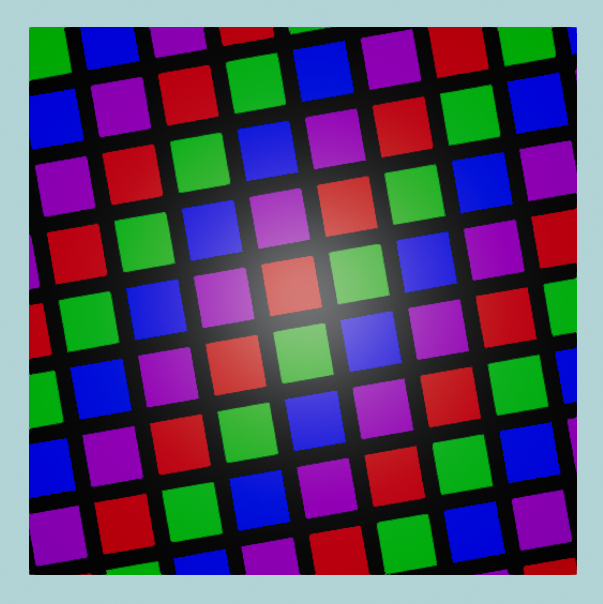{ style="max-height:200px;max-width:200px;border-radius:12px"}
	/// caption
	Rotation transform applied to the original color map. 
	///

	In this example we apply an anticlockwise rotation transform of 10°:
	
	```csharp
	using var colorMap = textureBuilder.CreateColorMap(
		TexturePattern.ChequerboardBordered<ColorVect>(
			borderValue: StandardColor.Black,
			firstValue: StandardColor.Red,
			secondValue: StandardColor.Green,
			thirdValue: StandardColor.Blue,
			fourthValue: StandardColor.Purple,
			borderWidth: 8,
			transform: new Transform2D(rotation: 10f) // (1)!
		),
		includeAlpha: false
	);
	```

	1. This transform is specifying a 10 degree rotation in the anticlockwise direction.

	???+ note "Clockwise Rotations"
		You can rotate clockwise by supplying a negative value for `rotation` in your `transform`.

		The reason positive values result in an anticlockwise rotation in TinyFFR is just a [convention](conventions.md), although it's worth noting this is ultimately just conforming to a [general convention in trigonometry](https://math.stackexchange.com/questions/1749279/why-are-the-trig-functions-defined-by-the-counterclockwise-path-of-a-circle).

=== "Translation"

	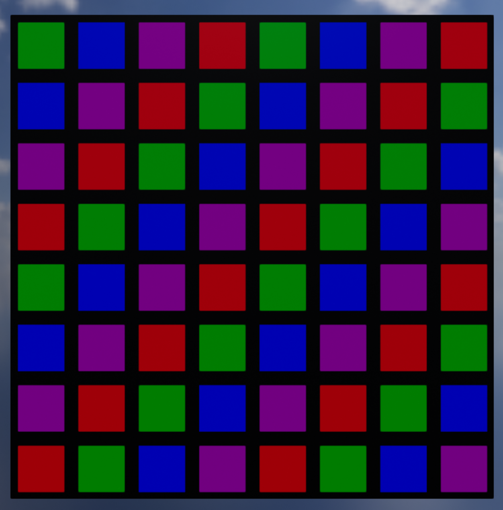{ style="max-height:200px;max-width:200px;border-radius:12px"}
	/// caption
	Translation transform applied to the original color map. 
	///

	In this example we shift the pattern right by 1/8 and down by 1/4:

	```csharp
	using var colorMap = textureBuilder.CreateColorMap(
		TexturePattern.ChequerboardBordered<ColorVect>(
			borderValue: StandardColor.Black,
			firstValue: StandardColor.Red,
			secondValue: StandardColor.Green,
			thirdValue: StandardColor.Blue,
			fourthValue: StandardColor.Purple,
			borderWidth: 8,
			transform: new Transform2D(translation: (1f / 8f, -1f / 4f)) // (1)!
		),
		includeAlpha: false
	);
	```

	1. 	This transform is specifying a positive shift of one eighth in the X/U direction and a negative shift of one quarter in the Y/V direction.

	The translation values for X and Y are specified as fractions of the entire pattern's width/height respectively, so usually you'll want to supply values in the range `[-1, 1]` (though any valid float is permitted).

	As per the [usual convention](conventions.md) a positive X value shifts right and a positive Y value shifts upward.
