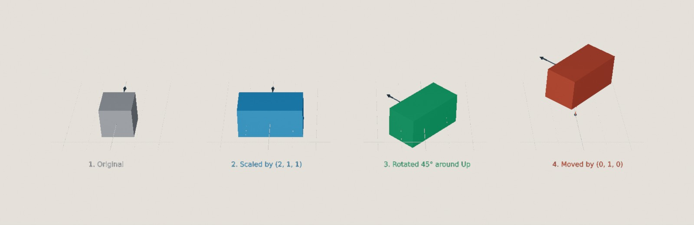

<div class="grid cards" markdown>

-   :chestnut:{ : style="margin-right:0.3em" } __In a nutshell...__

    * A `Transform` combines a `Scaling`, a `Rotation`, and a `Translation` (movement), always applied in that order. :material-arrow-right: [Transform](#transform)
    * Every model instance has a `Transform`, and transforms can also be applied to `Location`s and `BoundedRay`s. :material-arrow-right: [Applying Transforms](#applying-transforms)
    * Transforms can be combined in to a single transform with `*`, and converted to and from `Matrix4x4`. :material-arrow-right: [Combining Transforms](#combining-transforms), [Matrices](#matrices)

</div>

## Transform

A `Transform` describes three operations combined in to one:

* `Scaling`: A [`Vect`](vector_types.md#vect) giving how much to stretch or shrink along each axis (e.g. `(2, 1, 1)` doubles the width);
* `Rotation`: A [`Rotation`](angle_rotation_orientation.md#rotation) giving how to turn;
* `Translation`: A [`Vect`](vector_types.md#vect) giving how far to move (*translation* is the mathematical term for movement).

The three are always applied in that order: First the scaling, then the rotation, and finally the translation (movement). Scaling and rotation happen around the *transformation origin* (usually the world origin, or the object's own position), so the order matters. For example, stretching something along the X axis and then turning it gives a different result from turning it and then stretching it along the X axis.

`transform.To2D()` converts a transform to a `Transform2D`, the 2D equivalent.

[](transform_steps.jpg)
/// caption
A transform with a `Scaling` of `(2, 1, 1)`, a `Rotation` of 45° around `Up`, and a `Translation` of `(0, 1, 0)`, applied to a cube one step at a time.
///

```csharp
var transform = new Transform( // (1)!
	translation: new Vect(0f, 1f, 0f),
	rotation: 45f % Direction.Up,
	scaling: new Vect(2f, 1f, 1f)
);
var moveOnly = Transform.FromTranslationOnly(new Vect(0f, 1f, 0f)); // (2)!
var turnOnly = Transform.FromRotationOnly(45f % Direction.Up); // (3)!
var doubleSize = Transform.FromScalingOnly(2f); // (4)!
var none = Transform.None; // (5)!
var withoutScaling = transform with { Scaling = Vect.One }; // (6)!
```

1.	The transform shown in the image above. Each argument is optional, and defaults to no change (no movement, no rotation, and a scaling of `(1, 1, 1)`).

2.	A transform that only moves things.

3.	A transform that only rotates things.

4.	A transform that only scales things, by the same amount on every axis. Pass a `Vect` to scale each axis by a different amount.

5.	A transform that does nothing (i.e. no movement, no rotation, and a scaling of `(1, 1, 1)`).

6.	A copy of `transform` with its scaling reset. `Translation` and `Rotation` can be changed the same way.

A transform can also be deconstructed in to its three parts: `var (translation, rotation, scaling) = transform;`.

## Applying Transforms

Every [model instance](scene_objects.md#transform-position-rotation-scaling) has a `Transform`, made up of its `Position` (the translation), `Rotation`, and `Scaling`:

```csharp
instance.Transform = transform; // (1)!
var copy = factory.ObjectBuilder.CreateModelInstance(model, instance.Transform); // (2)!
```

1.	Sets the instance's position, rotation, and scaling all at once. Equivalent to `instance.SetTransform(transform)`.

2.	Creates a new instance of `model` with the same position, rotation, and scaling as `instance`.

Transforms can also be applied to some math types:

```csharp
var transformedLocation = location * transform; // (1)!
var aroundPivot = location.TransformedBy(transform, pivot); // (2)!
var transformedRay = boundedRay.TransformedAroundMiddleBy(transform); // (3)!
var undone = transformedLocation.TransformedByInverseOf(transform, Location.Origin); // (4)!
```

1.	`location` scaled and rotated around the world origin, then moved by the transform's translation. Equivalent to `location.TransformedAroundOriginBy(transform)` and `transform.AppliedTo(location)`.

2.	The same, but scaling and rotating around `pivot` instead of the world origin.

3.	A [`BoundedRay`](lines.md#boundedray) scaled and rotated around its own middle, then moved. (`boundedRay * transform` scales and rotates around its start point instead.)

4.	The original `location` again. Applying the *inverse* of a transform undoes it (by moving back, turning back, and then un-scaling). `transform.InverseAppliedTo(transformedLocation)` is equivalent.

	Note that floating-point error accrual means that anything transformed and then transformed again in inverse will almost never match *exactly* with the original value.

??? info "Transformation Origins"
	Scaling and rotation always happen *around* some point, the *transformation origin*, which doesn't move. For a model instance, this is the origin of its mesh, so a transform's rotation turns an instance on the spot rather than swinging it around the world origin.

	For a `Location`, the transformation origin is the world origin unless you pass a different one, so `location * transform` will usually move the location even if the transform has no translation (e.g. rotating (1, 0, 0) 90° around `Up` gives (0, 0, -1)).

## Combining Transforms

```csharp
var combined = first * second; // (1)!
var moreRotation = transform.WithAdditionalRotation(90f % Direction.Up); // (2)!
var bigger = transform.WithScalingMultipliedBy(2f); // (3)!
var moved = transform.WithAdditionalTranslation(new Vect(0f, 0f, 1f)); // (4)!
var halfway = Transform.Interpolate(start, end, 0.5f); // (5)!
```

1.	A single transform equivalent to applying `first` and *then* `second`. Equivalent to `first.TransformedBy(second)`. As with rotations the order matters; `second`'s scaling and rotation also apply to `first`'s translation (e.g. if `first` moves something 1m up and `second` doubles its size, the combined transform moves it 2m up).

2.	`transform` with a further rotation of 90° around `Up` added after its own rotation.

3.	`transform` with its scaling doubled. `WithScalingAdjustedBy()` adds to the scaling instead.

4.	`transform` with an extra 1m of forward movement.

5.	The transform halfway between `start` and `end` (with each of the scaling, rotation, and translation interpolated separately).

## Matrices

3D graphics usually represent transforms as 4x4 matrices. TinyFFR's `Transform` converts to and from `System.Numerics.Matrix4x4`:

```csharp
Matrix4x4 matrix = transform; // (1)!
Transform fromMatrix = matrix; // (2)!
```

1.	The transform as a matrix. Equivalent to `transform.ToMatrix()`.

2.	A transform created from a matrix. Equivalent to `new Transform(matrix)`.

A `Transform` is normally stored as its separate `Scaling`, `Rotation`, and `Translation`, so you always get back exactly the values you put in. However, a transform created from a matrix is stored as a matrix instead, as is one created by combining two transforms (unless the second one only moves things, with no rotation or scaling). `IsInternallyRepresentedByMatrix` tells you which is the case.

A matrix-represented transform still has exactly the right effect when applied to something, and its `Translation` is always exact. But its `Scaling` and `Rotation` have to be worked out from the matrix, so they may not be the values you'd expect; and when a non-uniform scaling and a rotation have been combined, no single scaling and rotation can describe the result exactly, so reading them back only gives an approximation.

`Transform.CoerceToComponentRepresentation(ref transform)` and `Transform.CoerceToMatrixRepresentation(ref transform)` switch a transform between the two forms.
