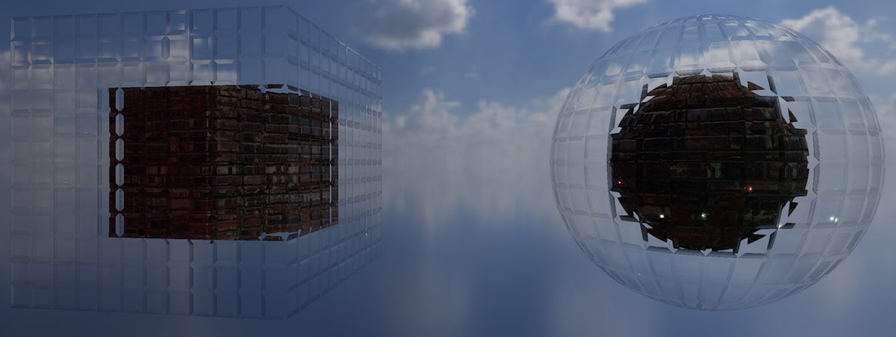
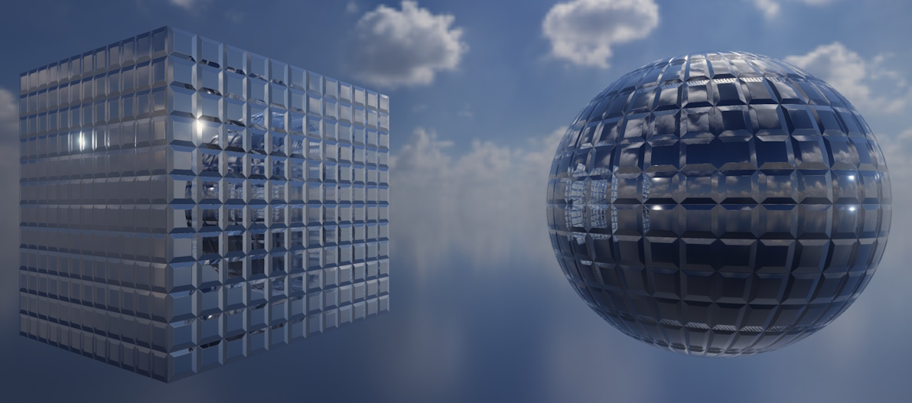
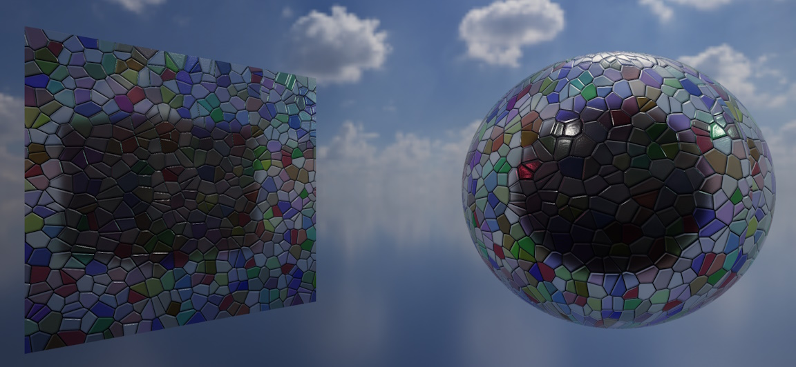

<div class="grid cards" markdown>

-   :chestnut:{ : style="margin-right:0.3em" } __In a nutshell...__

    * Transmissive materials are physically-based materials for surfaces that light passes through, such as glass, water, ice, or gemstones. :material-arrow-right: [Transmissive Materials](#transmissive-materials)
    * The combinations of absorption-transmission map data and ORMR map data define how the surface looks. :material-arrow-right: [Surface Properties](#surface-properties)
    * The refraction properties determine how light is absorbed or reflected. :material-arrow-right: [Refraction](#refraction)

</div>

{ : style="width:77%;" }
/// caption
A transmissive material showcasing a glass (refractive) effect.
///

{ : style="width:77%;" }
/// caption
A transmissive material showcasing a mirror (reflective) effect.
///

{ : style="width:77%;" }
/// caption
A transmissive material showcasing a stained-glass absorption effect.
///

## Transmissive Materials

```csharp
using var colorMap = factory.AssetLoader.LoadColorMap(@"Assets/glass_color.png");
using var atMap = factory.AssetLoader.LoadAbsorptionTransmissionMap(@"Assets/glass_at.png");
using var ormrMap = factory.AssetLoader.LoadOcclusionRoughnessMetallicReflectanceMap(@"Assets/glass_ormr.png");

using var material = factory.MaterialBuilder.CreateTransmissiveMaterial( // (1)!
	colorMap,
	atMap,
	ormrMap: ormrMap
);
```

1.	Creates a transmissive material from a color map, absorption-transmission map, and ORMR map. Naming the optional arguments (as here) makes it impossible to accidentally pass a map in the wrong position.

The *transmissive* material is TinyFFR's physically-based material for surfaces that light passes *through* (e.g. glass, water, ice, gemstones, clear plastics, and so on). As well as responding to light in the same physically plausible way as a [standard material](standard_materials.md), it models how light is absorbed (tinting what's seen through the surface), refracted (bending what's seen through the surface), and reflected (like a mirror or other reflective surfaces) as it passes through.

This is different to a standard material with a partially-transparent color map which simply blends the surface with whatever is behind it. A transmissive material looks far more realistic for genuinely see-through substances, at a markedly higher rendering cost.

Transmissive materials are created with `factory.MaterialBuilder.CreateTransmissiveMaterial()`. The basics of creating materials (including creation configs and lifetimes) are explained in [Creating Materials](creating_materials.md).

???+ warning "Higher Rendering Cost"
	Transmissive materials have a much higher rendering cost than standard materials, and therefore should be used sparingly if you intend to render your scenes with a smooth, realtime framerate.
	
???+ failure "Overlapping Transmissive Objects"
	TinyFFR is a realtime renderer and does not currently support more advanced techniques such as raycasting for transmissive objects.
	
	Stacking several transmissive objects in front of each other (from the camera's point of view) is therefore not well-supported right now. Doing so tends to make one or more of them disappear behind the others.

### Supported Maps

| Map                                                                          | Argument / Config Property                                   | Required | Effect                                                                                  |
| :--------------------------------------------------------------------------- | :----------------------------------------------------------- | :------- | :-------------------------------------------------------------------------------------- |
| [Color](texture_map_types.md#color-maps)                                     | `colorMap` / `ColorMap`                                      | Yes      | Tints the light reflecting off and passing through the surface.                         |
| [Absorption-Transmission](texture_map_types.md#absorption-transmission-maps) | `absorptionTransmissionMap` / `AbsorptionTransmissionMap`    | Yes      | Which colours of light the surface absorbs, and how much light passes through it at all. |
| [Normal](texture_map_types.md#normal-maps)                                   | `normalMap` / `NormalMap`                                    | No       | Small-scale bumps and grooves, which distort both reflections and what's seen through the surface. |
| [ORMR](texture_map_types.md#ormr-maps)                                       | `ormrMap` / `OcclusionRoughnessMetallicReflectanceMap`        | No       | Ambient occlusion, roughness, metallicness, and reflectance (which sets the index of refraction). |
| [Emissive](texture_map_types.md#emissive-maps)                               | `emissiveMap` / `EmissiveMap`                                | No       | Parts of the surface that glow with their own light.                                    |
| [Anisotropy](texture_map_types.md#anisotropy-maps)                           | `anisotropyMap` / `AnisotropyMap`                            | No       | Directional highlights, such as those on brushed surfaces.                              |

What each map type contains and how to load it is explained in [Texture Map Types](texture_map_types.md).

Note the following differences from standard materials:

* The absorption-transmission map is required. This (and not the color map) is what makes the surface see-through.
* Only a four-channel ORMR map is accepted; supplying a three-channel ORM map throws an exception. The reflectance data in the fourth channel is what determines how strongly the surface bends light (see below).
* Clearcoat maps are not supported.

???+ warning "Every Map Has a Cost"
	Each optional map you supply makes the material more expensive to render (TinyFFR selects a version of the material's shader that does exactly the work your chosen maps require, and no more). Only supply the maps a surface actually needs.

### Omitting Maps

When you leave out an optional map, the surface behaves as though it has that property's "neutral" value everywhere:

* No normal map: The surface is perfectly smooth.
* No ORMR map: The surface is non-metallic and unoccluded, with 50% reflectance (an index of refraction typical of glass), but is **fully rough**, which blurs everything seen through it (like heavily frosted glass). You'll therefore almost always want to supply an ORMR map; see [Surface Properties](#surface-properties) below.
* No emissive map: The surface does not glow.
* No anisotropy map: The surface has no anisotropic highlights.

## Surface Properties

The look of a transmissive surface depends mostly on three values from its [ORMR map](texture_map_types.md#ormr-maps), and two from its absorption-transmission map. The ORMR map supplies:

<span class="def-icon">:material-card-bulleted-outline:</span> Roughness

:   How smooth or rough the surface is at a microscopic level. This affects both the light reflecting off the surface *and* the light passing through it: At `0%` roughness reflections are mirror-sharp and everything seen through the surface is perfectly clear, whereas increasing the roughness progressively blurs both (giving a "frosted" look). At `100%` roughness (which is what you get if you omit the ORMR map entirely) what's seen through the surface is almost completely blurred.

<span class="def-icon">:material-card-bulleted-outline:</span> Reflectance

:   How reflective the surface is, which for transmissive materials also sets its *index of refraction* (i.e. how strongly it bends light passing through it). Higher reflectance values give both stronger reflections and stronger bending of light. 

	As with real-world transparent substances, every transmissive surface reflects more strongly when viewed at a glancing angle than when viewed head-on, and transmits more strongly when viewed head-on. The reflectance controls how strong the head-on reflection is.

	Some approximate reflectance values for common substances:

	| Substance | Index of Refraction | Reflectance |
	| :-------- | :------------------ | :---------- |
	| Ice       | 1.31                | 34%         |
	| Water     | 1.33                | 35%         |
	| Glass     | 1.5                 | 50%         |
	| Sapphire  | 1.77                | 70%         |

	The maximum reflectance (`100%`) corresponds to an index of refraction of roughly 2.33.

<span class="def-icon">:material-card-bulleted-outline:</span> Metallic

:   Whether the surface is a metal. Metals don't let any light through at all, so for see-through substances this should always be `0%`. 
	
	A fully metallic surface reflects all the light that reaches it; and its reflections are tinted by its color map rather than controlled by its reflectance value (which is ignored). This makes it possible to create mirrors (see below).

The [absorption-transmission map](texture_map_types.md#absorption-transmission-maps) then supplies two more values:

<span class="def-icon">:material-card-bulleted-outline:</span> Transmission (alpha channel)

:   How much of the light entering a (non-metallic) surface passes through it, rather than being scattered back out of the surface as it would be for an ordinary opaque material.

	At `100%` transmission the surface is fully see-through; what's behind it is seen (refracted, and blurred by the roughness) through the surface, tinted by the color map. At `0%` transmission nothing is seen through the surface at all, and it looks like an ordinary opaque surface of the color map's colour (but still with the reflections set by its roughness and reflectance). Values in between blend the two, giving a "milky" or translucent look like a frosted plastic, wax, or jade.

	Transmission doesn't affect reflections. A clear surface with 100% transmission still reflects its surroundings according to its reflectance (and more so at glancing angles, where less light is transmitted as a result). Transmission also has no effect on fully metallic surfaces, which never let light through.

<span class="def-icon">:material-card-bulleted-outline:</span> Absorption (color channels)

:   Which colours of light are absorbed as light travels through the surface, which tints what's seen through it. Absorption builds up with distance, so the same absorption gives a deeper tint for a thicker object (see `RefractionThickness` in [Refraction](#refraction) below). Black absorption absorbs nothing.

	Note that the color map *also* tints the transmitted light (as well as the surface's diffuse colour), so most see-through substances should use a white (or very pale) color map and control their tint via the absorption instead.

The following table shows how these values can be combined to create some common surfaces:

| Surface        | Roughness | Reflectance | Metallic | Transmission | Absorption               |
| :------------- | :-------- | :---------- | :------- | :----------- | :----------------------- |
| Clear glass    | 0%        | 50%         | 0%       | 100%         | None (black)             |
| Frosted glass  | 30%-50%   | 50%         | 0%       | 100%         | None (black)             |
| Tinted glass   | 0%        | 50%         | 0%       | 100%         | The colours to remove    |
| Water          | 0%        | 35%         | 0%       | 100%         | A slight amount of red   |
| Milky plastic  | 20%-40%   | 50%         | 0%       | 30%-70%      | None (black)             |
| Mirror         | 0%        | (Ignored)   | 100%     | 0%           | (Ignored)                |

=== "Clear Glass"

	```csharp
	using var colorMap = factory.TextureBuilder.CreateColorMap(ColorVect.WhiteOpaque, includeAlpha: false);
	using var atMap = factory.TextureBuilder.CreateAbsorptionTransmissionMap(absorption: ColorVect.BlackOpaque, transmission: 1f); // (1)!
	using var ormrMap = factory.TextureBuilder.CreateOcclusionRoughnessMetallicReflectanceMap(roughness: 0f, metallic: 0f, reflectance: 0.5f); // (2)!

	using var glass = factory.MaterialBuilder.CreateTransmissiveMaterial(colorMap, atMap, ormrMap: ormrMap, refractionThickness: 0.01f);
	```

	1.	A black absorption means no colours are absorbed, and a transmission of `1f` lets all light through.

	2.	Zero roughness gives a perfectly clear surface, and 50% reflectance gives the index of refraction of glass.

=== "Frosted Glass"

	```csharp
	using var colorMap = factory.TextureBuilder.CreateColorMap(ColorVect.WhiteOpaque, includeAlpha: false);
	using var atMap = factory.TextureBuilder.CreateAbsorptionTransmissionMap(absorption: ColorVect.BlackOpaque, transmission: 1f);
	using var ormrMap = factory.TextureBuilder.CreateOcclusionRoughnessMetallicReflectanceMap(roughness: 0.4f, metallic: 0f, reflectance: 0.5f); // (1)!

	using var frostedGlass = factory.MaterialBuilder.CreateTransmissiveMaterial(colorMap, atMap, ormrMap: ormrMap, refractionThickness: 0.01f);
	```

	1.	The only difference from clear glass is the roughness, which blurs everything seen through (and reflected by) the surface. Higher values make the glass more opaque-looking.

=== "Tinted Glass"

	```csharp
	using var colorMap = factory.TextureBuilder.CreateColorMap(ColorVect.WhiteOpaque, includeAlpha: false);
	using var atMap = factory.TextureBuilder.CreateAbsorptionTransmissionMap(absorption: new ColorVect(0.6f, 0f, 0.6f), transmission: 1f); // (1)!
	using var ormrMap = factory.TextureBuilder.CreateOcclusionRoughnessMetallicReflectanceMap(roughness: 0f, metallic: 0f, reflectance: 0.5f);

	using var bottleGlass = factory.MaterialBuilder.CreateTransmissiveMaterial(colorMap, atMap, ormrMap: ormrMap, refractionThickness: 0.005f);
	```

	1.	Absorbing red and blue light leaves green, giving the look of a green glass bottle. The more of each colour is absorbed (and the thicker the glass), the deeper the tint.

=== "Water"

	```csharp
	using var colorMap = factory.TextureBuilder.CreateColorMap(ColorVect.WhiteOpaque, includeAlpha: false);
	using var atMap = factory.TextureBuilder.CreateAbsorptionTransmissionMap(absorption: new ColorVect(0.3f, 0.05f, 0f), transmission: 1f); // (1)!
	using var ormrMap = factory.TextureBuilder.CreateOcclusionRoughnessMetallicReflectanceMap(roughness: 0f, metallic: 0f, reflectance: 0.35f); // (2)!

	using var water = factory.MaterialBuilder.CreateTransmissiveMaterial(colorMap, atMap, ormrMap: ormrMap, refractionThickness: 1f); // (3)!
	```

	1.	Water absorbs a little red light (and a very small amount of green), which is why deep water looks blue-green.

	2.	A reflectance of 35% gives the index of refraction of water.

	3.	A deep body of water uses the refraction model for solid objects (see [Refraction](#refraction) below), and the greater thickness means more of the red light is absorbed on the way through.

=== "Mirror"

	```csharp
	using var colorMap = factory.TextureBuilder.CreateColorMap(ColorVect.WhiteOpaque, includeAlpha: false); // (1)!
	using var atMap = factory.TextureBuilder.CreateAbsorptionTransmissionMap(absorption: ColorVect.WhiteOpaque, transmission: 0f); // (2)!
	using var ormrMap = factory.TextureBuilder.CreateOcclusionRoughnessMetallicReflectanceMap(roughness: 0f, metallic: 1f, reflectance: 1f); // (3)!

	using var mirror = factory.MaterialBuilder.CreateTransmissiveMaterial(colorMap, atMap, ormrMap: ormrMap, refractionThickness: 0.01f);
	```

	1.	For a fully metallic surface the color map tints the reflection; white gives a perfect (untinted) mirror.

	2.	No light passes through a mirror.

	3.	A fully metallic, perfectly smooth surface reflects everything around it with no blurring.

## Refraction

The following two options control how a transmissive material refracts light:

<span class="def-icon">:material-card-bulleted-outline:</span> `refractionThickness` / `RefractionThickness`

:   How thick the substance the surface is made of is modelled as being, in metres. Defaults to `0.1f`.

	Set this to roughly how far a typical ray of light would travel through the object before emerging out the other side; e.g. millimetres to centimetres for something thin like a pane of glass or a bubble, centimetres or metres for something solid like a block of ice or acrylic. Together with the absorption-transmission map, this determines how much light is absorbed on its way through (the further light travels through the substance, the more of it is absorbed).

	Thicknesses below `0.2f` use a refraction model designed for "thin" objects (which assumes light emerges very close to where it entered), whereas thicknesses of `0.2f` and above use a model designed for "solid" objects (which displaces what's seen through the surface more strongly).

<span class="def-icon">:material-card-bulleted-outline:</span> `quality` / `Quality`

:   How much of the scene the surface reflects and refracts:

	* `TransmissiveMaterialQuality.FullReflectionsAndRefraction` (the default): The surface refracts the other objects in the scene behind it, as well as the scene's backdrop.
	* `TransmissiveMaterialQuality.SkyboxOnlyReflectionsAndRefraction`: The surface reflects and refracts only the scene's skybox, ignoring the objects in the scene. This is considerably cheaper to render, and often indistinguishable for surfaces that mostly show the sky.

	Reflections of other *objects* in the scene (as opposed to the backdrop) additionally require the renderer's screen-space reflections to be enabled, i.e. a `ScreenSpaceEffectsQuality` of `Quality.High` or `Quality.VeryHigh` in its `RenderQualityConfig`.

## Transparency

If the material's color map has an alpha channel (i.e. it's a four-channel RGBA texture), the alpha can be used to make parts of the surface invisible or partially transparent, exactly as with [standard materials](standard_materials.md#transparency). How the alpha is used is set by the `alphaMode` argument (or `AlphaMode` config property):

<span class="def-icon">:material-card-bulleted-outline:</span> `TransmissiveMaterialAlphaMode.FullBlending`

:   The alpha genuinely blends the surface with whatever's behind it. Unlike standard materials, this is the default for transmissive materials.

	This requires the color map's alpha to be [premultiplied](texture_map_types.md#alpha-premultiplication).

<span class="def-icon">:material-card-bulleted-outline:</span> `TransmissiveMaterialAlphaMode.MaskOnly`

:   The alpha simply switches each texel on or off: Any texel with less than 40% alpha isn't drawn at all, and every other texel is drawn as normal. This is cheaper than `FullBlending`, and is ideal for cutting holes or shapes out of the surface.

Note that the color map's alpha has nothing to do with the see-through effect a transmissive material produces; that comes entirely from the absorption-transmission map. If the color map has no alpha channel, the alpha mode has no effect.

## Per-Instance Effects

If a transmissive material is created with `enablePerInstanceEffects: true` (or the `EnablePerInstanceEffects` config property), each object using it can alter its appearance individually at runtime via the object's `MaterialEffects` property. See [Material Effects](material_effects.md) for more information on using material effects.

A transmissive material supports the following effects:

* Transforming (moving, rotating, and scaling) its textures across the surface;
* Blending its color map towards a second color map;
* Blending its absorption-transmission map towards a second absorption-transmission map;
* Blending its ORMR map towards a second ORMR map, if the material has an ORMR map;
* Blending its emissive map towards a second emissive map, if the material has an emissive map.

## TransmissiveMaterialCreationConfig

```csharp
using var material = factory.MaterialBuilder.CreateTransmissiveMaterial(new TransmissiveMaterialCreationConfig {
	ColorMap = colorMap,
	AbsorptionTransmissionMap = atMap,
	OcclusionRoughnessMetallicReflectanceMap = ormrMap,
	RefractionThickness = 0.02f,
	Quality = TransmissiveMaterialQuality.FullReflectionsAndRefraction,
	Name = "Window Glass"
});
```

For reference, the following is every property on the `TransmissiveMaterialCreationConfig`:

<span class="def-icon">:material-card-bulleted-outline:</span> `ColorMap`

:   The color map. This property is required.

<span class="def-icon">:material-card-bulleted-outline:</span> `AbsorptionTransmissionMap`

:   The absorption-transmission map. This property is required.

<span class="def-icon">:material-card-bulleted-outline:</span> `NormalMap`

:   The normal map, or `null` for none. Defaults to `null`.

<span class="def-icon">:material-card-bulleted-outline:</span> `OcclusionRoughnessMetallicReflectanceMap`

:   The ORMR map, or `null` for none. Defaults to `null`. Must be a four-channel texture.

<span class="def-icon">:material-card-bulleted-outline:</span> `EmissiveMap`

:   The emissive map, or `null` for none. Defaults to `null`.

<span class="def-icon">:material-card-bulleted-outline:</span> `AnisotropyMap`

:   The anisotropy map, or `null` for none. Defaults to `null`.

<span class="def-icon">:material-card-bulleted-outline:</span> `RefractionThickness`

:   The modelled thickness of the surface, in metres (see [Refraction](#refraction)). Defaults to `0.1f`.

<span class="def-icon">:material-card-bulleted-outline:</span> `Quality`

:   How much of the scene the surface reflects and refracts (see [Refraction](#refraction)). Defaults to `TransmissiveMaterialQuality.FullReflectionsAndRefraction`.

<span class="def-icon">:material-card-bulleted-outline:</span> `AlphaMode`

:   How the color map's alpha channel is used (see [Transparency](#transparency)). Defaults to `TransmissiveMaterialAlphaMode.FullBlending`.

<span class="def-icon">:material-card-bulleted-outline:</span> `Name` / `EnablePerInstanceEffects`

:   The options common to every material type; see [Creating Materials](creating_materials.md#creation-configs).
