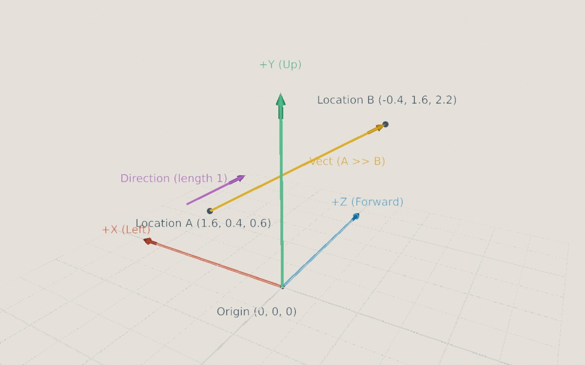

<div class="grid cards" markdown>

-   :chestnut:{ : style="margin-right:0.3em" } __In a nutshell...__

    * TinyFFR has three 3D vector types: `Location` (a point in space), `Vect` (a movement with a length), and `Direction` (a way of pointing, with no length). :material-arrow-right: [The Three Vector Types](#the-three-vector-types)
    * Each type only offers the operations that make sense for it, and converting between them is explicit. :material-arrow-right: [Location](#location), [Vect](#vect), [Direction](#direction), [Converting Between Types](#converting-between-types)
    * All three share common features: Component access, `System.Numerics` interop, parsing and formatting, and random generation. :material-arrow-right: [Common Features](#common-features)
    * `SphericalTranslation` describes a direction as an offset around a sphere. :material-arrow-right: [SphericalTranslation](#sphericaltranslation)

</div>

## The Three Vector Types


/// caption
TinyFFR's 3D axes: +X points left, +Y points up, and +Z points forward. `Location`s A and B are points in space; the `Vect` from A to B describes the movement between them (including its length); and the `Direction` points the same way with no particular length (it's always drawn here as length 1).
///

Everything in a TinyFFR scene is positioned along three axes, X, Y, and Z, that are all at right-angles to each other. By default +X points left, +Y points up, and +Z points forward, and distances are measured in metres. The point where all three axes meet, `(0, 0, 0)`, is the *origin*.

Many math libraries use a single "vector" type for everything. TinyFFR instead has three, because points, movements, and directions behave differently, and keeping them apart makes code clearer and prevents mistakes:

| Type | Represents | Has a position? | Has a length? | Example |
| :-- | :-- | :-- | :-- | :-- |
| `Location` | A point in space | Yes | No | Where an object is |
| `Vect` | A movement or offset | No | Yes | How far, and which way, an object moved this frame |
| `Direction` | A way of pointing | No | No (always 1) | Which way a camera is looking |

For example, adding two `Location`s together makes no sense (what is "London plus Paris"?), so TinyFFR doesn't allow it; but adding a `Vect` to a `Location` (moving a point) does, and gives another `Location`. Subtracting one `Location` from another gives the `Vect` between them, and a `Vect` has a `Direction` (and a length).

??? question "Why 'Vect' instead of 'Vector'?"
	* .NET already defines types named `Vector` (and `Vector3` etc.) in `System.Numerics`, and other libraries you're using alongside TinyFFR may define one too.
	* "Vector" also commonly means a resizable list in programming.
	* `Location` and `Direction` are technically vectors as well; `Vect` is specifically the vector that's neither a point nor a pure direction.

All three types are small, immutable `struct`s: Every operation returns a new value rather than modifying the existing one.

## Location

A `Location` is a single point in space: How far it is from the origin along each of the X, Y, and Z axes.

```csharp
var a = new Location(1f, 2f, 3f); // (1)!
Location b = (1f, 2f, 3f); // (2)!
var origin = Location.Origin; // (3)!
var c = a with { Y = 0f }; // (4)!
```

1.	A point 1m along X (left), 2m along Y (up), and 3m along Z (forward) from the origin.

2.	The same point, converted implicitly from a tuple.

3.	The origin, `(0, 0, 0)`.

4.	A copy of `a` with a different `Y` value.

```csharp
var moved = location + vect; // (1)!
var vectBetween = location1 >> location2; // (2)!
var directionTo = location1.DirectionTo(location2); // (3)!
var distance = location1.DistanceFrom(location2); // (4)!
var rotated = location.RotatedBy(rotation, pivot); // (5)!
```

1.	Moves `location` by `vect`. `location - vect` moves it the opposite way, and `location.MovedBy(vect)` is equivalent.

2.	The `Vect` that moves `location1` to `location2`. Equivalent to `location1.VectTo(location2)`, `location2 << location1`, and `location2 - location1`.

3.	The `Direction` from `location1` towards `location2`.

4.	The distance between the two locations, in metres.

5.	Rotates the location around `pivot`.

<span class="def-icon">:material-code-block-parentheses:</span> `VectTo(other)` / `VectFrom(other)`

:   The `Vect` that moves this location to `other` (or moves `other` to this location).

<span class="def-icon">:material-code-block-parentheses:</span> `DirectionTo(other)` / `DirectionFrom(other)`

:   The `Direction` from this location towards `other` (or from `other` towards this location). If the two locations are the same, the result is `Direction.None`.

<span class="def-icon">:material-code-block-parentheses:</span> `DistanceFrom(other)` / `DistanceSquaredFrom(other)` / `DistanceFromOrigin()` / `DistanceSquaredFromOrigin()`

:   The distance between this location and another (or the origin). The *squared* versions skip a square root, so are faster when you only need to compare distances (e.g. to find which object is nearest).

<span class="def-icon">:material-code-block-parentheses:</span> `IsWithinDistanceOf(other, distance)`

:   Whether this location is no more than `distance` from `other`.

<span class="def-icon">:material-code-block-parentheses:</span> `RotatedBy(rotation, pivot)` / `RotatedAroundOriginBy(rotation)`

:   Rotates this location around a pivot point (or the origin). The `*` operator with a `(pivot, rotation)` tuple does the same: `location * (pivot, rotation)`.

<span class="def-icon">:material-code-block-parentheses:</span> `ScaledFromOriginBy(scalar)`

:   Moves this location towards or away from the origin, scaling its distance by `scalar` (or by a `Vect`, scaling each axis separately).

<span class="def-icon">:material-code-block-parentheses:</span> `TransformedBy(transform, transformationOrigin)` / `TransformedAroundOriginBy(transform)`

:   Applies a `Transform` (scaling, rotation, and translation) to this location, around a given origin point (or the world origin). `TransformedByInverseOf()` and `TransformedAroundOriginByInverseOf()` undo a transform.

<span class="def-icon">:material-code-block-parentheses:</span> `Clamp(min, max)`

:   The closest point to this location on the straight line between `min` and `max`. (This isn't a per-axis clamp; to clamp a location inside a box, use `PositionedCuboid.FromOppositeCorners(min, max).ClosestPointTo(location)`.)

<span class="def-icon">:material-code-block-parentheses:</span> `Location.Interpolate(start, end, distance)`

:   A location `distance` of the way along the straight line from `start` to `end` (e.g. `0.5f` is halfway).

## Vect

A `Vect` is a movement or offset through space: It has a direction and a length, but no position.

```csharp
var v = new Vect(1f, -2f, 0f); // (1)!
Vect fromTuple = (1f, -2f, 0f); // (2)!
var uniform = new Vect(3f); // (3)!
var fromDirection = Direction.Up * 3f; // (4)!
var zero = Vect.Zero; // (5)!
```

1.	A movement of 1m along +X (left), 2m along -Y (down), and nothing along Z.

2.	The same `Vect`, converted implicitly from a tuple.

3.	A `Vect` with all three components set to `3f`, i.e. `(3, 3, 3)`. Useful for uniform scaling.

4.	A movement of 3m upwards. Equivalent to `Vect.FromDirectionAndDistance(Direction.Up, 3f)`.

5.	No movement at all, `(0, 0, 0)`. `Vect.One` is `(1, 1, 1)`.

```csharp
var length = vect.Length; // (1)!
var direction = vect.Direction; // (2)!
var sum = vect1 + vect2; // (3)!
var doubled = vect * 2f; // (4)!
var capped = vect.WithMaxLength(5f); // (5)!
var rotated = vect * rotation; // (6)!
```

1.	How far the `Vect` moves, in metres.

2.	Which way the `Vect` points. `Direction.None` if the `Vect` is `Vect.Zero`.

3.	The combined movement of moving along `vect1` and then `vect2`. Subtracting (`vect1 - vect2`) moves along `vect1` and then the reverse of `vect2`.

4.	A `Vect` pointing the same way but twice as long. `vect / 2f` halves it.

5.	The same `Vect`, shortened to 5m if it was any longer.

6.	The `Vect` rotated by a `Rotation`. Equivalent to `vect.RotatedBy(rotation)`.

<span class="def-icon">:material-card-bulleted-outline:</span> `Length` / `LengthSquared`

:   The length of the `Vect`, in metres. `LengthSquared` skips a square root, so is faster when you only need to compare lengths.

<span class="def-icon">:material-card-bulleted-outline:</span> `Direction`

:   The `Direction` the `Vect` points in.

<span class="def-icon">:material-card-bulleted-outline:</span> `Reversed`

:   The same movement in the opposite direction. The unary `-` operator does the same: `-vect`.

<span class="def-icon">:material-card-bulleted-outline:</span> `Absolute` / `Reciprocal` / `MaxComponent` / `MinComponent` / `MaxComponentMagnitude` / `MinComponentMagnitude`

:   Per-component helpers: `Absolute` makes every component positive; `Reciprocal` is `(1/X, 1/Y, 1/Z)` (or `null` if any component is zero); and the `Max`/`Min` properties return the largest or smallest component (or the largest or smallest ignoring sign).

<span class="def-icon">:material-code-block-parentheses:</span> `WithLength(length)` / `WithLengthIncreasedBy(amount)` / `WithLengthDecreasedBy(amount)` / `WithMaxLength(length)` / `WithMinLength(length)`

:   A `Vect` pointing the same way with a different length. `AsUnitLength` (or `WithLengthOne()`) sets the length to exactly 1.

<span class="def-icon">:material-code-block-parentheses:</span> `WithDirection(direction)`

:   A `Vect` with the same length, pointing in `direction` instead.

<span class="def-icon">:material-code-block-parentheses:</span> `ScaledBy(scalar)` / `ScaledBy(vect)` / `MultipliedBy(vect)` / `DividedBy(vect)`

:   Scales the `Vect` by a number, or each component separately by the components of another `Vect`. The `*` and `/` operators do the same: `vect * 2f`, `vect * new Vect(1f, 2f, 1f)`.

<span class="def-icon">:material-code-block-parentheses:</span> `Dot(other)` / `Cross(other)`

:   The [dot product](https://en.wikipedia.org/wiki/Dot_product) and [cross product](https://en.wikipedia.org/wiki/Cross_product) with another `Vect` or a `Direction`.

<span class="def-icon">:material-code-block-parentheses:</span> `ProjectedOnTo(direction)` / `LengthWhenProjectedOnTo(direction)`

:   The part of this `Vect` that points along `direction` (e.g. how much of an object's velocity is directed forwards), or just that part's length.

<span class="def-icon">:material-code-block-parentheses:</span> `OrthogonalizedAgainst(direction)` / `ParallelizedWith(direction)`

:   This `Vect` turned (keeping its length) so it's exactly at right-angles to `direction`, or exactly in line with it. These return `null` when there's no single answer (e.g. orthogonalizing against a direction the `Vect` already points along). See [Directions](#direction) for more detail.

<span class="def-icon">:material-code-block-parentheses:</span> `IsOrthogonalTo(other)` / `IsParallelTo(other)` / `IsApproximatelyOrthogonalTo(other)` / `IsApproximatelyParallelTo(other)`

:   Whether this `Vect` is at right-angles to (or in line with) another `Vect` or `Direction`. The exact versions are easily thrown off by tiny floating-point errors, so the *approximate* versions (which allow 0.1° of error by default) are usually the better choice.

<span class="def-icon">:material-code-block-parentheses:</span> `Clamp(min, max)`

:   The closest `Vect` to this one on the straight line between `min` and `max` (not a per-component clamp).

<span class="def-icon">:material-code-block-parentheses:</span> `Vect.Interpolate(start, end, distance)`

:   A `Vect` `distance` of the way between `start` and `end`.

## Direction

A `Direction` is a way of pointing, like an arrow with no position and no particular length. Internally a `Direction` always has a length of exactly 1 (it's a [unit vector](https://en.wikipedia.org/wiki/Unit_vector)), and TinyFFR maintains that for you.

```csharp
var forward = Direction.Forward; // (1)!
var diagonal = new Direction(1f, 1f, 0f); // (2)!
var towards = location1.DirectionTo(location2); // (3)!
var ofVect = vect.Direction; // (4)!
var none = Direction.None; // (5)!
```

1.	One of the six built-in axis directions: `Forward`, `Backward`, `Up`, `Down`, `Left`, and `Right`.

2.	A direction halfway between +X (left) and +Y (up). The values given are only the *ratio* between the axes; the actual `X`, `Y`, and `Z` are adjusted to make the length exactly 1 (here, roughly `(0.71, 0.71, 0)`).

3.	The direction pointing from one location towards another.

4.	The direction a `Vect` points in.

5.	The absence of any direction (all components zero). This is what you get from, e.g., the direction of `Vect.Zero`.

```csharp
var opposite = -direction; // (1)!
var angle = direction1 ^ direction2; // (2)!
var rotated = direction * rotation; // (3)!
var rotationBetween = direction1 >> direction2; // (4)!
var rotationAround = direction % 90f; // (5)!
var vect = direction * 3f; // (6)!
```

1.	The opposite direction. Equivalent to `direction.Flipped`.

2.	The angle between two directions, from 0° to 180°. Equivalent to `direction1.AngleTo(direction2)`.

3.	The direction rotated by a `Rotation`. Equivalent to `direction.RotatedBy(rotation)`.

4.	The `Rotation` that turns `direction1` in to `direction2`. Equivalent to `direction1.RotationTo(direction2)`.

5.	A `Rotation` of 90° around `direction` (as an axis). `90f % direction` is equivalent.

6.	A `Vect` pointing along `direction` with a length of 3m.

<span class="def-icon">:material-code-block-parentheses:</span> `AngleTo(other)` / `SignedAngleTo(other, clockwiseAxis)`

:   The angle between this direction and `other`. `AngleTo()` is always between 0° and 180°; `SignedAngleTo()` also tells you which way round the angle goes (positive when turning from this direction to `other` is a positive rotation around `clockwiseAxis`, i.e. clockwise when looking along it), so the result ranges from just over -180° to 180°.

<span class="def-icon">:material-code-block-parentheses:</span> `Dot(other)` / `Cross(other)`

:   The [dot product](https://en.wikipedia.org/wiki/Dot_product) and [cross product](https://en.wikipedia.org/wiki/Cross_product) with another `Direction` or a `Vect`.

<span class="def-icon">:material-code-block-parentheses:</span> `IsWithinAngleTo(other, angle)`

:   Whether this direction is no more than `angle` away from `other` (e.g. whether an enemy is within a camera's field of view).

<span class="def-icon">:material-code-block-parentheses:</span> `AnyOrthogonal()`

:   Some direction at right-angles to this one. There are infinitely many; this always picks the same one for a given direction. Useful when you need "any perpendicular direction" and don't care which.

<span class="def-icon">:material-code-block-parentheses:</span> `Direction.FromDualOrthogonalization(directionA, directionB)`

:   The direction at right-angles to both `directionA` and `directionB`, following the [right-hand rule](https://en.wikipedia.org/wiki/Right-hand_rule) (if your right index finger points along `directionA` and your middle finger along `directionB`, your thumb points along the result).

<span class="def-icon">:material-code-block-parentheses:</span> `OrthogonalizedAgainst(other)` / `ParallelizedWith(other)`

:   This direction adjusted so that it's exactly at right-angles to `other` (*orthogonalized*), or exactly in line with it (*parallelized*, either the same way or the opposite way, whichever is closer). Both return `null` when there's no single answer: When orthogonalizing a direction against one it already points exactly along (or exactly against), or parallelizing it with one it's already exactly at right-angles to. `OrthogonalizationOf()` and `ParallelizationOf()` do the same with the roles swapped.

<span class="def-icon">:material-code-block-parentheses:</span> `Direction.OrthogonalizeAll(primary, ref secondary, ref tertiary)`

:   Adjusts `secondary` and `tertiary` so that all three directions are mutually at right-angles, without changing `primary`. Useful for building a set of axes (e.g. forward, up, and right) from directions that are only roughly perpendicular.

<span class="def-icon">:material-code-block-parentheses:</span> `IsOrthogonalTo(other)` / `IsParallelTo(other)` / `IsApproximatelyOrthogonalTo(other)` / `IsApproximatelyParallelTo(other)`

:   Whether this direction is at right-angles to (or in line with) another. As with `Vect`, the *approximate* versions are usually the better choice.

<span class="def-icon">:material-code-block-parentheses:</span> `Clamp(target, maxAngle)` / `Clamp(min, max)` / `Clamp(plane, arcCentre, maxAngle, retainOrthogonalDimension)`

:   Restricts this direction to within `maxAngle` of `target` (i.e. within a cone); to the arc between `min` and `max`; or to an arc on a plane.

<span class="def-icon">:material-code-block-parentheses:</span> `Direction.Interpolate(start, end, distance)`

:   A direction `distance` of the way from `start` to `end`. Directions are interpolated by turning at a constant rate along the shortest arc between them, so the result is always a valid direction.

<span class="def-icon">:material-code-block-parentheses:</span> `Direction.FromPlaneAndPolarAngle(plane, zeroDegreesDirection, angle)`

:   The direction lying on `plane` that is `angle` anticlockwise from `zeroDegreesDirection` (when looking at the plane with its normal pointing towards you).

<span class="def-icon">:material-card-bulleted-outline:</span> `NearestOrientation` / `NearestOrientationCardinal` / `NearestOrientationIntercardinal` / `NearestOrientationDiagonal`

:   The nearest of the named *orientations* (such as `Forward`, `UpLeft`, or `DownRightBackward`) to this direction. `Direction.FromOrientation()` goes the other way, and `Direction.AllCardinals`, `AllIntercardinals`, `AllDiagonals`, and `AllOrientations` list them.

??? info "Fast Variants"
	Some methods (e.g. `OrthogonalizedAgainst()`, `ParallelizedWith()`, and `FromDualOrthogonalization()`) have `Fast` equivalents (`FastOrthogonalizedAgainst()` etc.). These skip checks for the cases that have no single answer (such as `Direction.None`, or directions that are already parallel), and return a non-`null` result. They're slightly faster, but their result is undefined when those checks would have failed, so only use them when you know the inputs are valid.

??? info "Renormalizing"
	Each operation on a `Direction` keeps it at unit length, but very long chains of operations (e.g. rotating the same direction by a small amount every frame for hours) can slowly accumulate floating-point error. `Direction.Renormalize(direction)` corrects any drift.

	If you already have components that you know are exactly unit length, `Direction.FromVector3PreNormalized()` skips the normalization done by the constructor (but produces an invalid `Direction` if the components aren't unit length).

## Converting Between Types

Converting between the three types is always explicit, because doing so changes what the value means:

```csharp
var vectFromOrigin = location.AsVect(); // (1)!
var locationFromVect = vect.AsLocation(); // (2)!
var vectFromDirection = direction.AsVect(); // (3)!
var directionOfVect = vect.Direction; // (4)!
```

1.	The `Vect` that moves the origin to `location`. Equivalent to `(Vect) location`.

2.	The `Location` reached by moving `vect` away from the origin. Equivalent to `(Location) vect`.

3.	A `Vect` of length 1 pointing along `direction`. `direction.AsVect(3f)` (or `direction * 3f`) gives a different length.

4.	The direction a `Vect` points in.

## Common Features

All three types (along with many other TinyFFR math types) share the following features:

<span class="def-icon">:material-card-bulleted-outline:</span> `X` / `Y` / `Z` and `this[Axis]`

:   The individual components. They can also be read with an indexer, e.g. `vect[Axis.Y]`. Indexing with two axes gives an `XYPair<float>` (e.g. `location[Axis.X, Axis.Z]`), and indexing with three gives a new value with its components rearranged (e.g. `vect[Axis.Z, Axis.Y, Axis.X]`; a rearranged `Direction` is re-normalized). Values can also be deconstructed: `var (x, y, z) = location;`.

<span class="def-icon">:material-code-block-parentheses:</span> `ToVector3()` / `FromVector3(vector)`

:   Converts to and from `System.Numerics.Vector3`, for use with other .NET or math libraries.

<span class="def-icon">:material-code-block-parentheses:</span> `ToString()` / `Parse(text)` / `TryParse(text, out result)`

:   Formats the value as text, such as `<1, 2, 3>`, and parses it back. `Vect` and `Direction` also offer `ToStringDescriptive()`, which adds a description (e.g. a `Direction` lists its nearest named orientation).

<span class="def-icon">:material-code-block-parentheses:</span> `Random()`

:   A random value. `Location.Random()` and `Vect.Random()` pick each component between -100 and 100 (or between two given values); `Location.Random(shape)` picks a point inside a shape. `Direction.Random()` picks any direction, and also has overloads that pick within a cone (`Random(coneCentre, maxAngle)`) or along a plane (`Random(plane)`).

<span class="def-icon">:material-card-bulleted-outline:</span> `IsPhysicallyValid`

:   Whether the value is valid: All components are finite numbers (not infinity or `NaN`), and for a `Direction`, its length is 1 (or it's `None`). `Direction.IsPhysicallyValidAndNotNone` also excludes `None`.

<span class="def-icon">:material-code-block-parentheses:</span> `==` / `Equals(other, tolerance)`

:   `==` compares values exactly. Because floating-point calculations often produce tiny rounding errors, comparing calculated values is usually better done with a tolerance: `location1.Equals(location2, 0.001f)`.

Each type can also be serialized to and from bytes (`SerializeToBytes()` and `DeserializeFromBytes()`).

## SphericalTranslation

A `SphericalTranslation` describes a direction as an offset from a reference direction, made of two angles:

* The `PolarOffset` is how far (as an angle) the result tilts away from a reference "pole" direction.
* The `AzimuthalOffset` is how far around the pole the result is turned (anticlockwise when the pole points towards you), starting from a reference "zero" direction.

```csharp
var translation = new SphericalTranslation(azimuthalOffset: 90f, polarOffset: 30f); // (1)!
var result = translation.Translate(azimuthZero: Direction.Forward, polarZero: Direction.Up); // (2)!
```

1.	An offset tilted 30° away from the pole, turned 90° around it.

2.	Resolves the offset to a `Direction`: Starting from `Up` (the pole), tilt 30° towards `Forward`, then turn 90° anticlockwise around `Up` (when looking down on it). `SphericalTranslation.ZeroZero` resolves to the pole direction itself.

This is a convenient way to describe directions relative to a surface, and is how TinyFFR describes the tilt of surface normals when creating normal maps (see [Creating Textures](creating_textures.md)).
