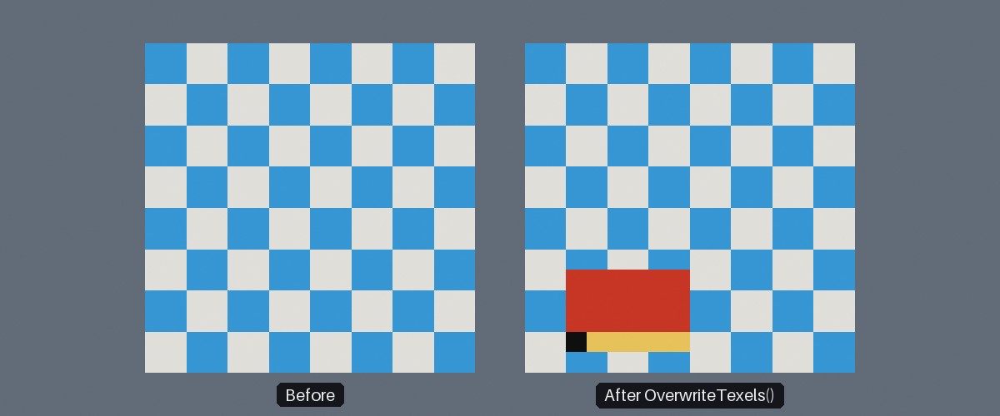

<div class="grid cards" markdown>

-   :chestnut:{ : style="margin-right:0.3em" } __In a nutshell...__

    * A texture created with `AllowsDynamicWrites = true` can have its texels overwritten at any time after creation. :material-arrow-right: [Writable Textures](#writable-textures)
    * `texture.OverwriteTexels()` replaces either the whole texture or a rectangular region of it. :material-arrow-right: [Overwriting Texels](#overwriting-texels)

</div>

[{ : style="width:77%;" }](writable_textures_overwrite.jpg)
/// caption
A 16x16 writable texture before (left) and after (right) overwriting a 6x4 region of it at offset `(2, 1)`. The first row of supplied texels is drawn yellow, and the very first texel black.
///

## Writable Textures

```csharp
using var texture = factory.TextureBuilder.CreateColorMap(
	TexturePattern.Chequerboard<ColorVect>(StandardColor.Blue, StandardColor.White),
	includeAlpha: false,
	TextureCreationConfig.ForColorMap() with { AllowsDynamicWrites = true } // (1)!
);

// Later...
var regionDimensions = new XYPair<int>(6, 4);
using var texelsLease = factory.ResourceAllocator.BorrowSpan<TexelRgb24>(regionDimensions.Area); // (2)!
var texels = texelsLease.Span;
texels.Fill(TexelRgb24.FromNormalizedFloats(1f, 0f, 0f));

texture.OverwriteTexels<TexelRgb24>(texels, regionDimensions, offset: new XYPair<int>(2, 1)); // (3)!
```

1.	Creates the texture with dynamic writes allowed. Any texture creation or loading function that takes a `TextureCreationConfig` can be used.

2.	This borrows a span without allocating on the managed heap, thus preventing GC stutter. Explained further in [Avoiding GC Stutter](avoiding_gc_stutter.md).

3.	Overwrites a 6x4 region of the texture, starting 2 texels from its left edge and 1 texel from its bottom edge, with red.

By default, a texture's contents are fixed once it's been created. A *writable* texture is one created with `AllowsDynamicWrites` set to `true` in its [`TextureCreationConfig`](loading_textures.md#texturecreationconfig), which enables its `OverwriteTexels()` method. This lets you change all or part of the texture's contents at any time, as often as you like, without having to create a new texture. Every material / object using the texture will have its appearance altered.

Writable textures are useful for any imagery that changes while your application runs, for example:

* Procedurally-generated or animated patterns;
* Video frames, or images streamed from another source;
* Surfaces the user can draw or paint on;
* Visualisations of changing data, such as heatmaps, minimaps, or graphs.

## Creating Writable Textures

Almost every texture loading or creation function that accepts a `TextureCreationConfig` can create a writable texture.

One exception is `CreateTextureFromCompressedData()`, as compressed textures can never be written to (see [Texture Compression](texture_compression.md)); and textures desiring mipmap generation. Mipmaps and compression can not be maintained for data that changes, so setting `AllowsDynamicWrites` to `true` also sets `GenerateMipMaps` to `false` and `CompressionQuality` to `null`. This means it's fine to use `AllowsDynamicWrites` alongside a preset such as `ForColorMap()` (as above), but explicitly enabling either of those *after* setting `AllowsDynamicWrites` to `true` will throw an exception.

## Overwriting Texels

A writable texture's dimensions and texel type (RGB or RGBA) are fixed when it's created; only the texels' values can be overwritten. You can check whether an existing texture is writable with its `AllowsDynamicWrites` property.

A writable texture has two `OverwriteTexels()` overloads:

<span class="def-icon">:material-code-block-parentheses:</span> `OverwriteTexels(newTexels)`

:   Replaces the texture's entire contents. `newTexels` must contain at least as many texels as the texture (i.e. `texture.Dimensions.Area`).

<span class="def-icon">:material-code-block-parentheses:</span> `OverwriteTexels(newTexels, dimensions, offset)`

:   Replaces a rectangular region of the texture, leaving the rest of it as it was. The region is `dimensions` texels in size, and starts `offset` texels from the texture's bottom-left corner. `newTexels` must contain at least `dimensions.X * dimensions.Y` texels.

	Overwriting only the part of the texture that has changed is cheaper than overwriting all of it.

* Texels are laid out row-by-row, starting from the **bottom** row, exactly as when [creating a texture from texel data](creating_textures.md#creating-textures-from-texel-data). For a region, the first texel supplied is the region's bottom-left texel.
* The texels may be `TexelRgb24` or `TexelRgba32`, regardless of the texture's own texel type; they are converted if necessary. Supplying texels of the same type as the texture avoids the conversion and is better for performance.
* The texels are copied as part of the call, so you can reuse or alter your buffer as soon as `OverwriteTexels()` returns.
* As when creating textures, passing a `Span<TTexel>` or an array usually requires specifying the texel type explicitly (e.g. `OverwriteTexels<TexelRgb24>(...)`).

`OverwriteTexels()` throws an `InvalidOperationException` if the texture wasn't created with `AllowsDynamicWrites` set to `true`; and an `ArgumentOutOfRangeException` if the region doesn't lie entirely within the texture (or if `newTexels` doesn't contain enough texels for the given target region).

???+ tip "Performance"
	`OverwriteTexels()` is fast enough for per-frame updates on reasonable numbers of texels, but can quickly expend your frame budget if you're attempting to update multiple mega-pixel-sized textures. Write only to regions you need to update, or split large updates across multiple frames.

???+ info "Overwritten Texels Are Not Processed"
	Any `ProcessingToApply` in the texture's `TextureCreationConfig` (flipping, negating, swizzling, alpha premultiplication, etc.) is applied only once, when the texture is created. Texels supplied to `OverwriteTexels()` are uploaded exactly as given.

	In particular, `CreateColorMap()` (with `includeAlpha: true`) premultiplies the alpha of the texels it creates, but `PrintColorMap()` does *not*. If your writable texture is an RGBA color map that's used by a blending material (see [Alpha Premultiplication](texture_map_types.md#alpha-premultiplication)), premultiply the texels yourself before overwriting (e.g. with `TextureUtils.PremultiplyAlphaForTexture()` or `TexelRgba32.WithPremultipliedAlpha()`). Use `TextureUtils.ProcessTexture()` to apply any other processing (see [Processing](creating_textures.md#processing)).
