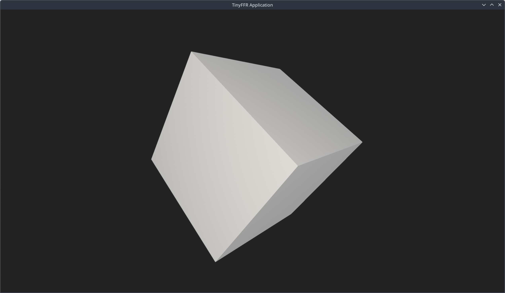

<div class="grid cards" markdown>

-   :octicons-beaker-16:{ : style="margin-right:0.3em" } __Overview__ [__View Code on Github &nbsp; :simple-github:__](https://github.com/Egodystonic/TinyFFR/tree/main/Examples/HelloCube){ : style="position: absolute; right: 1em;" }

    { align=right : style="max-width:50%; margin: 0em; margin-left: 1em;" }
    
    This example demonstrates the simplest possible application using TinyFFR. 
    
    This tutorial will show you how to get started with the basics of TinyFFR. In this example, we will:

	* Import TinyFFR;
	* Create a window;
	* Create a camera;
	* Create a cube;
	* Make the cube spin;
	* Render everything in realtime.

	It's assumed that you have a reasonable familiarity with C# and .NET.

</div>


## Project Setup

This example is set up as a [single-file C# script](https://learn.microsoft.com/en-us/dotnet/core/sdk/file-based-apps) for maximum simplicity. You can copy/paste the code shown here in to `hello_cube.cs` anywhere on your local file system.

This example requires the .NET 10 SDK or higher installed on your system.

#### Running the Application

Open a terminal or command prompt in the same directory as your `hello_cube.cs` and run: `dotnet run hello_cube.cs -c Release`. 

.NET will download TinyFFR from [nuget.org](https://www.nuget.org/packages/Egodystonic.TinyFFR/), compile your script, and run it. You should see a window pop up on your desktop showing a spinning cube.

## Annotated Code

This is the entirety of the "Hello Cube" example script. Click on the :material-message-question: icons next to each line to learn more.

```csharp
#:package Egodystonic.TinyFFR@*-* // (1)!

using Egodystonic.TinyFFR;
using Egodystonic.TinyFFR.Factory.Local;

using var factory = new LocalTinyFfrFactory(); // (2)!
var primaryDisplay = factory.DisplayDiscoverer.Primary ?? throw new InvalidOperationException("No display connected!"); // (3)!
using var window = factory.WindowBuilder.CreateWindow(primaryDisplay); // (4)!
using var scene = factory.SceneBuilder.CreateScene(); // (5)!
using var camera = factory.CameraBuilder.CreateCamera(initialPosition: (0f, 0f, -2f)); // (6)!
using var scenePrimitive = scene.AddPrimitive(); // (7)!

using var renderer = factory.RendererBuilder.CreateRenderer(scene, camera, window); // (8)!
using var appLoop = factory.ApplicationLoopBuilder.CreateLoop(); // (9)!

var cube = PositionedRotatedCuboid.UnitCubeAtOriginUnrotated; // (10)!
var cubeRotationPerSec = new Rotation(60f, Direction.Up) + new Rotation(25f, Direction.Right); // (11)!

while (!appLoop.Input.UserQuitRequested) { // (12)!
	var deltaTime = appLoop.IterateOnce().AsDeltaTime(); // (13)!
	
	cube = cube.RotatedBy(cubeRotationPerSec * deltaTime); // (14)!
	scenePrimitive.SetGeometryShape(cube); // (15)!
	
	renderer.Render(); // (16)!
}
```

1.	This imports TinyFFR in to our script, using .NET's `#:package` directive. 

	`@*` selects the latest published version of TinyFFR. See Microsoft's documentation for more info: [File-based-apps: #:package](https://learn.microsoft.com/en-us/dotnet/core/sdk/file-based-apps#package)

2.	This creates a local TinyFFR factory. The factory is the main "initialization point" of any TinyFFR application; every app needs one.

	The factory has various *builders* and *discoverers* that we'll use to create everything below.
	
	 The "local" factory type is currently the only type TinyFFR supplies, and it renders on the *local* system hardware.
	
3.	The `factory.DisplayDiscoverer` is an interface that discovers and enumerates all connected displays (monitors) on your local hardware.

	The `DisplayDiscoverer.Primary` property returns the primary display as a `Display?`; where the value is only `null` if no display whatsoever is connected to the machine.
	
	In the case where we have no connected display, we use the [null-coalescing operator](https://learn.microsoft.com/en-us/dotnet/csharp/language-reference/operators/null-coalescing-operator) to throw an exception and end early.
	
4.	This line creates a `Window` that will immediately show on your desktop. 

	`CreateWindow()` has only one required parameter: The `Display` to show the window on. We pass `primaryDisplay` from the line above.
	
5.	This line creates a `Scene` object.

	Everything we ever want to render in TinyFFR must be added to a *scene*. You can have multiple scenes, and objects can be added to one or more scenes. Scenes can basically be thought of as "containers" for everything we want to add to the world.
	
6.	Here we create a `Camera`. Cameras specify how and where a scene's render will be 'captured'. 

	Cameras are placed in the world and can be moved around. In the call to `CreateCamera()` here we set the camera's initial position in the world as `X: 0m`, `Y: 0m`, `Z: -2m`.
	
	By default, cameras in TinyFFR face forward, so by placing the camera 2 metres back from the world centre we'll get a good look at our cube (that will be placed in the world centre).
	
7.	Typically, most applications using TinyFFR will load or create meshes, textures, materials, models, animations, and so on.

	In addition however, we also have the option to create `ScenePrimitive`s which are much simpler objects: Basic shapes, lines, points, text etc. that require no textures/mesh geometry to be usable.
	
	For our "Hello Cube" tutorial we're going to use one scene primitive; created directly for the `scene`.
	
	We'll set the primitive's shape further down below.
	
8.	Rendering anything in TinyFFR requires a `Renderer`.

	In this case, we're creating a renderer that will take our `scene`, capture it with our `camera`, and display the output to our `window`.
	
9.	Realtime rendering typically works by rendering 30 or more frames per second in a tight loop.

	TinyFFR abstracts this loop in to an `ApplicationLoop` object, created via `factory.ApplicationLoopBuilder.CreateLoop()`.
	
10.	This line defines a `PositionedRotatedCuboid`: A cuboid shape (i.e. an object with width, height, and depth) that can also be positioned (placed in the world) and rotated.

	We initialize `cube` via the public static readonly field `UnitCubeAtOriginUnrotated`. As its name implies, this returns a 1m x 1m x 1m cube positioned at the world origin (center) with no rotation.
	
11.	Here we define a `Rotation` called `cubeRotationPerSec`. This will define how much the cube will rotate per second.

	The result is the combination of two individual rotations together: 60° around the up/down axis (`new Rotation(60f, Direction.Up)`) *plus* 25° around the left/right axis (`new Rotation(25f, Direction.Right)`). 
	
12.	This line starts our render loop as a `while` loop. 

	The loop will continue rendering frames until the user requests a quit (typically via the X button on a window or some key combination such as Alt+F4).
	
	User input is updated via the `appLoop` and exposed via `appLoop.Input`. Handling user input is explained in the [next tutorial](reacting_to_user_input.md); for now all you need to know is that `appLoop.Input.UserQuitRequested` will return `true` when the user wishes to exit the program.

13.	`appLoop.IterateOnce()` returns a `TimeSpan` telling you how long has elapsed since the previous frame.

	The `AsDeltaTime()` extension converts that to a `float` representing the 'deltaTime' as a number of seconds (e.g. at 60 FPS `deltaTime` will typically be `0.01667f`).
	
14.	Here we alter `cube` by rotating it by `cubeRotationPerSec * deltaTime`. 

	The multiplication by `deltaTime` is what makes the `cubeRotationPerSec` *actually* a per-second value, because `deltaTime` represents the fraction of a second that's actually elapsed since the previous frame.
	
15.	This sets `scenePrimitive`'s geometry to the latest version of our `cube`.

16.	Finally, now that our `scenePrimitive` has been altered, we render the latest frame (using the `renderer`'s target `scene`, `camera`, and `window`).

## Additional Notes

### Disposing Resources

Note that many lines above start with `using`; denoting that the resources returned by the factory need to be disposed. Because many things you'll create with TinyFFR represent real native memory or resources, you must dispose them when no longer needed.

[C#'s `using` syntax](https://learn.microsoft.com/en-us/dotnet/csharp/language-reference/statements/using) means that everything we create here will be disposed in reverse order, which is correct. 

### DeltaTime

Using `deltaTime` means your application's animation has the same speed regardless of your framerate. It also means the occasional dropped or hitched frame does not make your animation seemingly "jump" or "freeze".

In a toy example like "Hello Cube", this ultimately isn't that important. But for more complex applications you'll generally want consistency, so it's important to multiply any time-dependent code by your given `deltaTime`.
	
## Stuff to Tinker With

Sometimes the best way to learn is by just getting stuck-in, so before moving on to the next tutorial here are some things you can experiment with (with links to relevant documentation pages).

* [:material-book-open-page-variant: Creating / Managing Windows](../reference/creating_and_managing_windows.md): You could try programmatically changing the window's size or even its fullscreen state.
* [:material-book-open-page-variant: Camera Settings](../reference/camera_settings.md): You could try moving the camera or even animating it.
* [:material-book-open-page-variant: Scene Primitives](../reference/scene_primitives.md): You could change the scene primitive shape, colour, render style, or add more.
* [:material-book-open-page-variant: Scene Backdrops](../reference/scenes.md#backdrops): You could change the background colour of the scene, or even add a backdrop.

## Where to Get Support

As you work with TinyFFR you'll inevitably need some help; or maybe you'll want to request a feature or report a bug.

The [:simple-discord: Support](../support.md) page has links to the TinyFFR Discord server as well as the GitHub discussions + issues spaces; both are great places to seek help. Finally, every page on this site has a comments section at the bottom that is closely monitored-- check below to see if anyone's had the same issue as you!
