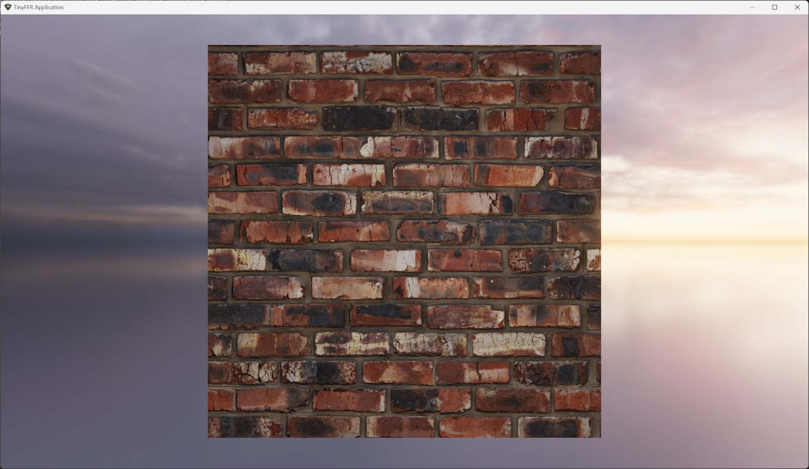
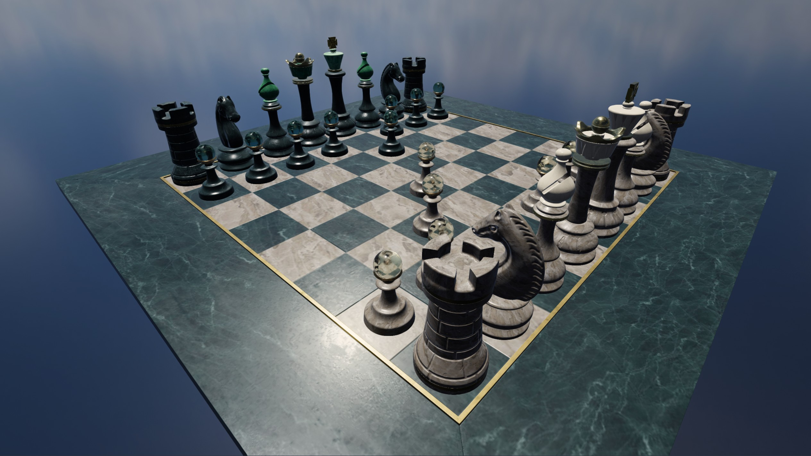

It's possible to load images/textures, backdrops, and 3D meshes from files using the `AssetLoader`.

!!! example "Continuing "Hello Cube""
	In the "Hello Cube" example we created a cube mesh with the `MeshBuilder` and used a test material with the `MaterialBuilder` like this:
	
	`#!csharp using var cubeMesh = meshBuilder.CreateMesh(new Cuboid(1f));`

	`#!csharp using var cubeMaterial = materialBuilder.CreateTestMaterial();`

	Following this tutorial, you will be able to replace both the mesh and material with downloaded alternatives.
	
## Material Loading

{ align=right : style="max-width:44%;" }

Firstly, let's replace the cube's material with something from the internet. 

* For this example we'll be using [Brick Wall 001 by Texture Haven on cc0-textures.com](https://cc0-textures.com/t/th-brick-wall-001). Click the link, download the .zip file, and extract it somewhere on your local disc.
* After extracting the .zip archive, you should have the following texture files:
	* `brick_wall_001_ao_4k.jpg` -- this is an ambient occlusion map
	* `brick_wall_001_diffuse_4k.jpg` -- this is a color/albedo/diffuse map
	* `brick_wall_001_displacement_4k.jpg` -- this is a displacement map (we will not be using this for now as TinyFFR does not currently support displacement mapping)
	* `brick_wall_001_nor_dx_4k.jpg` and `brick_wall_001_nor_gl_4k.jpg` -- these are normal maps in two separate formats (we will be using the 'gl' file)
	* `brick_wall_001_rough_4k.jpg` -- this is a roughness map
	
For more information on different texture map types and how they're supported by TinyFFR, see [Materials](materials.md); for now however this tutorial will demonstrate simply how to load these map textures to create a brick wall material.

Copy the following example, replacing `your_path/` with the path to the directory you extracted the texture files to:

```csharp
var assetLoader = factory.AssetLoader; // (1)!
var materialBuilder = factory.MaterialBuilder; // (2)!

using var brickColorMap = assetLoader.LoadColorMap(@"your_path/brick_wall_001_diffuse_4k.jpg"); // (3)!
using var brickNormalMap = assetLoader.LoadNormalMap(@"your_path/brick_wall_001_nor_gl_4k.jpg"); // (4)!
using var brickOrmMap = assetLoader.LoadOcclusionRoughnessMetallicMap( // (5)!
	occlusionFilePath: @"your_path/brick_wall_001_ao_4k.jpg",
	roughnessFilePath: @"your_path/brick_wall_001_rough_4k.jpg",
	metallicFilePath: assetLoader.BuiltInTexturePaths.DefaultMetallicMap
);
using var cubeMaterial = materialBuilder.CreateStandardMaterial( // (6)!
	colorMap: brickColorMap,
	normalMap: brickNormalMap,
	ormOrOrmrMap: brickOrmMap
);
```

1. 	The `AssetLoader` is the builder object supplied by the factory that assists in loading textures/materials, models, and any other file-based assets.
2.	We used the `MaterialBuilder` in "Hello World" to create a test material for the cube. We will use it again here to create our brick wall material instead.
3.	A color map is a texture file that describes the base color of each texel for a material.

	This line loads the brick wall color map (in this case called a 'diffuse' map) from disc on to the GPU's VRAM. 

	All `Load...Map` functions expect the file path(s) of the file(s) to load, and they return a `Texture` resource that must be disposed when no longer needed. Note that you must dispose of all `Material`s using those textures first, before disposing the tetxures themselves.

4.	Normal maps are textures, but instead of the pixels representing colours (RGB) they represent directions (XYZ). In the real world, most surfaces aren't perfectly flat but actually have slight grooves and imperfections. Normal maps attempt to model those imperfections and patterns by specifying the direction each pixel of the surface is facing (relative to the overall surface plane) and are used when calculating lighting reflections to provide a more realistic-looking material. That means we can make "interesting" normal maps by specifying some pixels that don't face perfectly forward (relative to the surface).

	This line loads the brick wall normal map in OpenGL format from disc on to the GPU's VRAM. 
	
	If you're ever only given a DirectX formatted normal map, you can supply an optional second bool parameter to `LoadNormalMap` indicating that the texture file is in DirectX format (TinyFFR will convert it for you).
	
5.	Occlusion maps are usually single-channel/monochromatic (e.g. greyscale, no colours). They indicate how ambient light typically bounces off a surface.

	Roughness maps are also usually single-channel, and they indicate how light diffuses/reflects off a surface.
	
	Metallic maps are also usually single-channel, and they indicate whether a material is metallic or dielectric (non-metallic) at each texel.

	In TinyFFR, occlusion, roughness, and metallic data is combined in to a single texture (called an **ORM map**). `LoadOcclusionRoughnessMetallicMap` makes it easy to load separate files in to a single combined map `Texture` resource that can be used as an ORM map.
	
	The bricks material has an occlusion and roughness map but no metallic map, so we use a built-in texture path via `assetLoader.BuiltInTexturePaths` to pass a pre-provided metallic map file to `LoadOcclusionRoughnessMetallicMap()`. 
	
	This built-in metallic map path is resolved to a plain non-metallic (e.g. dielectric) texture, meaning the bricks material will not look metallic. TinyFFR comes with tens of textures included in `BuiltInTexturePaths` for convenience/utility.
	
6.	This final step combines the color, normal, and ORM maps in to a standard material that we can then use to create a cube instance.

	The standard material type represents any opaque surface (e.g. one that does not let light through). Most parameters to `CreateStandardMaterial` are optional, only the `colorMap` is mandatory.
	
You should now be able to re-run the hello cube example using the new `cubeMaterial` and see the test material replaced with bricks.
	
??? info "Supported Texture Formats"
	TinyFFR integrates an open-source library "stb_image" and through that library supports various image formats.
	
	The list of supported file formats can be seen in [stb_image.h](https://github.com/nothings/stb/blob/master/stb_image.h):

	* JPEG/JPG
	* PNG
	* GIF
	* BMP
	* TGA
	* PSD
	* HDR
	* PIC
	* PNM

	TinyFFR does not currently support some more esoteric formats or compression types for the image formats listed above.	
	
## HDR (Backdrop) Loading

{ align=right : style="max-width:44%;" }

To load environment backdrops (sometimes known as [cubemaps](https://en.wikipedia.org/wiki/Cube_mapping)) we need a 360 HDR texture. We can then load that HDR file as a `BackdropTexture` resource via the `AssetLoader`, and set it as the backdrop for our `Scene` object.

For this example we'll be using ["Belfast Sunset (Pure Sky)" from PolyHaven](https://polyhaven.com/a/belfast_sunset_puresky). Click the link (make sure you choose the HDR format) and download the file to your local disc.

You can then set the backdrop for the cube scene like this (as before, replace `your_path/` with the path to the downloaded HDR file):

```csharp
using var sceneBackdrop = assetLoader.LoadBackdropTexture(@"your_path/belfast_sunset_puresky_4k.hdr");

scene.SetBackdrop(sceneBackdrop); // (1)!
```

1. 	If you're modifying the "Hello Cube" tutorial, it's best to load the `sceneBackdrop` before creating the `scene` itself, so that the C# auto-disposal mechanism (e.g. the `using` keyword) disposes the scene *before* disposing the backdrop texture. A more complete example might look like this:

	```csharp
	var sceneBuilder = factory.SceneBuilder;

	using var sceneBackdrop = assetLoader.LoadBackdropTexture(@"C:\Users\ben\Documents\Temp\treasure_chest\belfast_sunset_puresky_4k.hdr");
	using var scene = sceneBuilder.CreateScene();

	scene.Add(cube);
	scene.Add(light);
	scene.SetBackdrop(sceneBackdrop);
	```
	
## Mesh Loading	

{ align=right : style="max-width:44%;" }

It's also possible to import pre-built polygon meshes (usually authored with 3D modelling software).

* For this example, we will use ["Treasure Chest" from PolyHaven](https://polyhaven.com/a/treasure_chest). Click the link (select the "glTF" format, __not__ "Blend", which is the default); and extract the compressed archive to local disc.
* After extracting the .zip archive, you should have the following files:
	* `treasure_chest.bin` and `treasure_chest_4k.gltf` -- these files include the polygon data and some metadata about the treasure chest
	* `textures/treasure_chest_diff_4k.jpg` -- this is a diffuse (color) map
	* `textures/treasure_chest_nor_gl_4k.jpg` -- this is a normal map
	* `textures/treasure_chest_arm_4k.jpg` -- this is an ARM map

We can then load these files to create a mesh resource and associated material (once again, replace `your_path/` with the path to the extracted file contents):

```csharp
using var treasureChestMesh = assetLoader.LoadMesh(@"your_path/treasure_chest_4k.gltf"); // (1)!
using var treasureChestColorMap = assetLoader.LoadColorMap(@"your_path/textures/treasure_chest_diff_4k.jpg"); // (2)!
using var treasureChestNormalMap = assetLoader.LoadNormalMap(@"your_path/textures/treasure_chest_nor_gl_4k.jpg"); // (3)!
using var treasureChestOrmMap = assetLoader.LoadOcclusionRoughnessMetallicMap(@"your_path/textures/treasure_chest_arm_4k.jpg"); // (4)!
using var treasureChestMaterial = materialBuilder.CreateStandardMaterial( // (5)!
	colorMap: treasureChestColorMap,
	normalMap: treasureChestNormalMap,
	ormOrOrmrMap: treasureChestOrmMap
);

using var treasureChest = objectBuilder.CreateModelInstance(
	treasureChestMesh, 
	treasureChestMaterial, 
	initialPosition: (0f, -0.3f, 1f) // (6)!
);

scene.Add(treasureChest); // (7)!
```

1. 	Here we simply load the treasure chest mesh (via the `.gltf` file). 

	The load operation will fail if the `.bin` file is not present alongside the `.gltf` file.

2.	In this step we load the diffuse texture as our colour map. This is the same as when we loaded the diffuse map for the bricks material.

3.	Here we load the normal map. Make sure you're using the "GL"/OpenGL format, and not the "DX"/DirectX format.

4.	This is loading the ORM map for the treasure chest. 

	Note that in this model the map is labelled as an "ARM" map, this is the same as an ORM map (__A__ = Ambient Occlusion, __O__ = Occlusion; both refer to the same thing).
	
5.	Just like with the bricks texture we combine our loaded map textures in to a standard material.

6.	We set the initial position of our model instance slightly below the world origin (by 30cm). This is because the chest mesh's origin point is at its base, not at its centroid; so it will appear slightly above the camera without readjusting it downward slightly.

	(In TinyFFR by default the Y-axis is the up/down axis, and a negative Y value therefore indicates 'down').
	
	We also place the chest 1m in front of the camera.
	
7.	Finally, we add the treasure chest to the scene. 

	If you're modifying "Hello Cube" you may wish to *not* add the `cube` instance (otherwise the treasure chest will be inside the cube and hard to see). Alternatively you could move the cube behind the chest.

	Additionally, you may wish to modify the cube-rotation code to also rotate the treasure chest when holding down the spacebar (or some other key).
	
	
??? info "Supported Mesh Formats"
	TinyFFR integrates an open-source library "assimp" and through that library supports various 3D mesh/model file formats.
	
	The list of supported file formats can be seen in assimp's [FileFormats.md](https://github.com/assimp/assimp/blob/v5.3.1/doc/Fileformats.md):

	- 3D
	- [3DS](https://en.wikipedia.org/wiki/.3ds)
	- [3MF](https://en.wikipedia.org/wiki/3D_Manufacturing_Format)
	- AC
	- [AC3D](https://en.wikipedia.org/wiki/AC3D)
	- ACC
	- AMJ
	- ASE
	- ASK
	- B3D
	- [BLEND](https://en.wikipedia.org/wiki/.blend_(file_format))
	- [BVH](https://en.wikipedia.org/wiki/Biovision_Hierarchy)
	- CSM
	- COB
	- [DAE/Collada](https://en.wikipedia.org/wiki/COLLADA)
	- [DXF](https://en.wikipedia.org/wiki/AutoCAD_DXF)
	- ENFF
	- [FBX](https://en.wikipedia.org/wiki/FBX)
	- [glTF 1.0](https://en.wikipedia.org/wiki/GlTF#glTF_1.0) + GLB
	- [glTF 2.0](https://en.wikipedia.org/wiki/GlTF#glTF_2.0)
	- HMB
	- IFC-STEP
	- IRR / IRRMESH
	- [LWO](https://en.wikipedia.org/wiki/LightWave_3D)
	- LWS
	- LXO
	- [M3D](https://bztsrc.gitlab.io/model3d)
	- MD2
	- MD3
	- MD5
	- MDC
	- MDL
	- MESH / MESH.XML
	- MOT
	- MS3D
	- NDO
	- NFF
	- [OBJ](https://en.wikipedia.org/wiki/Wavefront_.obj_file)
	- [OFF](https://en.wikipedia.org/wiki/OFF_(file_format))
	- [OGEX](https://en.wikipedia.org/wiki/Open_Game_Engine_Exchange)
	- [PLY](https://en.wikipedia.org/wiki/PLY_(file_format))
	- PMX
	- PRJ
	- Q3O
	- Q3S
	- RAW
	- SCN
	- SIB
	- SMD
	- [STP](https://en.wikipedia.org/wiki/ISO_10303-21)
	- [STL](https://en.wikipedia.org/wiki/STL_(file_format))
	- TER
	- UC
	- VTA
	- X
	- [X3D](https://en.wikipedia.org/wiki/X3D)
	- XGL
	- ZGL

	TinyFFR does not currently support some more esoteric features of 3D model formats such as scenes, multi-material objects, or exported material systems. Support for some of the file formats listed above may be minimal.

## Model Loading	

{ align=right : style="max-width:44%;" }

The example above shows how to import a mesh and its material/textures as independent steps. However, for formats like `glTF`/`glb` (and many others), TinyFFR supports loading all contained models(1) as a single step, in to a `ResourceGroup`.
{ .annotate }

1.	A `Model` is defined as one `Mesh` and one `Material` combined.

In this example, we will use the ['Beautiful Game'](https://github.khronos.org/glTF-Assets/model/ABeautifulGame) asset provided by Khronos group. Click the link and download the `GLB`(1) formatted file.
{ .annotate }

1.	`GLB` is a binary-packed variant of `glTF` that contains all asset data in one file for convenience.

Then we can load everything from the packed `glb` file with `LoadAll()`:

```csharp
using var chessResources = assetLoader.LoadAll(@"your_path/ABeautifulGame.glb"); // (1)!
using var chessInstanceGroup = objectBuilder.CreateModelInstanceGroup(chessResources); // (2)!
scene.Add(chessInstanceGroup); // (3)!
```

1.	`LoadAll` will return a `ResourceGroup` that contains all the loaded `Mesh`, `Texture`, `Material`, and `Model` resources directly extracted from the given asset file.

	Disposing this group will dispose all those resources.
	
2.	`CreateModelInstance()` takes a `Mesh` and `Material` (or a `Model` representing those) and returns you a single `ModelInstance`.

	Following-on from that, `CreateModelInstanceGroup()` takes a `ResourceGroup` and creates a `ModelInstance` for every contained `Model`; returning them as a combined `ModelInstanceGroup`.
	
	You can enumerate over a `ModelInstanceGroup` to access all contained `ModelInstance`s. Disposing the `ModelInstanceGroup` disposes all contained `ModelInstance`s.
	
3.	This adds every `ModelInstance` from the `chessInstanceGroup` to the scene.

??? question "When to use `LoadAll()` vs `LoadMesh()` + `Load[...]Map()`?"
	When you have a combined-resource asset file (such as `.glb`), or when multiple models are packed in to a single sub-asset file, you have no choice but to use `LoadAll()` to access those embedded resources.
	
	However, for formats such as `.gltf` when you have singular mesh files and textures kept separately, you can choose to load those resources manually with the `LoadMesh()` and `Load[...]Map()` (or `LoadTexture()`) functions; *or* you can pass the `.gltf` file path to `LoadAll()` as before.
	
	Ultimately, "manual" loading of resources gives you the most control of how those textures/meshes are imported, but for complex models this can be cumbersome. TinyFFR gives you a variety of approaches for importing assets; for serious applications you/your team should define an asset export + import pipeline and test that every material and mesh/model type you need is working correctly using a well-defined loading approach.
