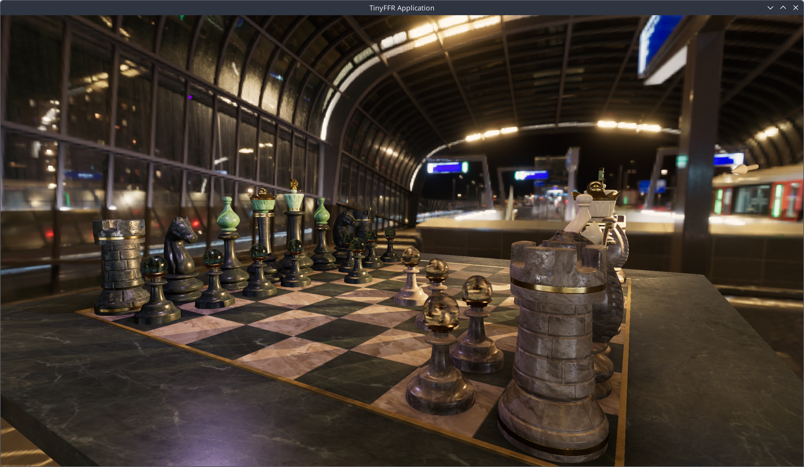

<div class="grid cards" markdown>

-   :octicons-beaker-16:{ : style="margin-right:0.3em" } __Overview__ [__View Code on Github &nbsp; :simple-github:__](https://github.com/Egodystonic/TinyFFR/tree/main/Examples/LoadingAssets){ : style="position: absolute; right: 1em;" }

    { align=right : style="max-width:50%; margin: 0em; margin-left: 1em;" }
    
    This tutorial builds on [Reacting to User Input](reacting_to_user_input.md). In this example, we will:

	* Load a chess set model from a glTF (`.glb`) file and add it to the scene;
	* Load a pre-baked backdrop texture, and toggle it on and off;
	* Use an inspector camera controller to orbit around the chess set;
	* Add point lights and spot lights at the camera's position.

	It's assumed that you've read the previous tutorials first, as things that were explained there won't be explained again in detail here.

</div>

## Project Setup

Like the previous tutorial, this example is set up as an ordinary .NET project. You can create one in an empty folder with the following two commands:

```
dotnet new console
dotnet add package Egodystonic.TinyFFR --prerelease
```

Alternatively, create a folder containing a `LoadingAssets.csproj` file with the following contents:

```xml
<Project Sdk="Microsoft.NET.Sdk">

	<PropertyGroup>
		<OutputType>Exe</OutputType>
		<TargetFramework>net10.0</TargetFramework>
		<ImplicitUsings>enable</ImplicitUsings>
		<Nullable>enable</Nullable>
	</PropertyGroup>

	<ItemGroup>
		<PackageReference Include="Egodystonic.TinyFFR" Version="*" />
	</ItemGroup>

	<ItemGroup>
		<None Update="ABeautifulGame.glb;metro_noord_4k.tffr" CopyToOutputDirectory="PreserveNewest" />
	</ItemGroup>

</Project>
```

### Asset Files

This example also needs two asset files, placed in your project folder (next to the `.csproj` file):

* [`ABeautifulGame.glb`](https://github.com/Egodystonic/TinyFFR/raw/main/Examples/LoadingAssets/ABeautifulGame.glb): A chess set model, in the glTF binary format.
* [`metro_noord_4k.tffr`](https://github.com/Egodystonic/TinyFFR/raw/main/Examples/LoadingAssets/metro_noord_4k.tffr): A backdrop texture (a 360° image of a metro station) that has been pre-baked for usage with TinyFFR. Baked assets are stored in a ready-to-use format, so they load much faster than the original files. 

??? note "Notes on the provided assets"
	The backdrop is baked at a low resolution to make it easy to download and store in TinyFFR's git repository. You may notice the backdrop being somewhat blurry/low-res; in a real application you'd bake it at a much higher quality level.
	
	The chess set model *isn't* baked in this example, as its baked file would be several hundred megabytes in size (the data in the provided `.glb` model is compressed; this compression is what contributes to its load time taking a few seconds).
	
	----
	
	Attribution for both files is as follows:
	
	* `ABeautifulGame.glb`: ["A Beautiful Game"](https://github.com/KhronosGroup/glTF-Sample-Assets/tree/main/Models/ABeautifulGame), from the Khronos Group [glTF Sample Assets](https://github.com/KhronosGroup/glTF-Sample-Assets) repository. Licensed under [CC BY 4.0](https://creativecommons.org/licenses/by/4.0/legalcode):
	
		* &copy; 2020, ASWF: MaterialX Project for the original model (crafted by Moeen Sayed and Mujtaba Sayed).
	
		* &copy; 2022, Ed Mackey: Conversion to glTF.
	
	* `metro_noord_4k.tffr`: ["Metro: Noord"](https://polyhaven.com/a/metro_noord) by Greg Zaal, from [Poly Haven](https://polyhaven.com). Licensed under [CC0](https://creativecommons.org/publicdomain/zero/1.0/). The file used here is the 4K HDRI baked with TinyFFR's asset bakery.

If you created a project with `dotnet new console`, also add the second `<ItemGroup>` shown above to your `.csproj` file. It copies the asset files next to your compiled application, so that they can be found whether you run it with `dotnet run` or from an IDE.

Then, replace the contents of `Program.cs` with the code shown below.

### Running the Application

Open a terminal or command prompt in your project folder and run: `dotnet run -c Release`.

Loading the chess set model takes a few seconds, after which a window will appear. The mouse cursor will be captured by the window, and the chess set will be mostly dark, awaiting scene lighting. The controls are:

| Input | Action |
| :-- | :-- |
| Mouse | Orbit around the chess set |
| Mouse wheel | Zoom in / out |
| B | Toggle the backdrop on / off |
| P | Add a point light at the camera's position |
| S | Add a spot light at the camera's position, pointing where the camera is looking |
| D | Delete all lights |
| Escape | Exit |

## Code

This is the entirety of the "Loading Assets" example's `Program.cs`.

```csharp
var backdropEnabled = false;

using var factory = new LocalTinyFfrFactory();
var primaryDisplay = factory.DisplayDiscoverer.Primary ?? throw new InvalidOperationException("No display connected!");
using var window = factory.WindowBuilder.CreateWindow(primaryDisplay);
using var camera = factory.CameraBuilder.CreateCamera();
using var cameraController = camera.CreateController<InspectorCameraController>(); // (1)!
var lights = factory.ResourceAllocator.CreateResourceGroup(disposeContainedResourcesWhenDisposed: true); // (2)!

Console.WriteLine("Loading metro backdrop + chess set; this may take a few seconds...");
using var backdrop = factory.AssetLoader.LoadBakedBackdropTexture("metro_noord_4k.tffr"); // (3)!
using var chessBundle = factory.AssetLoader.LoadBundledAsset("ABeautifulGame.glb"); // (4)!
using var chessInstances = factory.ObjectBuilder.CreateModelInstances(chessBundle); // (5)!

using var scene = factory.SceneBuilder.CreateScene();
using var renderer = factory.RendererBuilder.CreateRenderer(scene, camera, window);
using var loop = factory.ApplicationLoopBuilder.CreateLoop();

window.LockCursor = true;
cameraController.SetConstraints(chessBundle.CalculateCombinedBoundingBox()); // (6)!
scene.Add(chessInstances); // (18)!

while (!loop.Input.UserQuitRequested) {
	var deltaTime = loop.IterateOnce().AsDeltaTime();
	var kbm = loop.Input.KeyboardAndMouse;

	if (kbm.KeyWasPressedThisIteration(KeyboardOrMouseKey.Escape)) break;

	if (kbm.KeyWasPressedThisIteration(KeyboardOrMouseKey.B)) {
		backdropEnabled = !backdropEnabled;
		if (backdropEnabled) scene.SetBackdrop(backdrop); // (7)!
		else scene.SetBackdrop(SceneCreationConfig.DefaultInitialBackdropColor); // (8)!
	}

	if (kbm.KeyWasPressedThisIteration(KeyboardOrMouseKey.P)) {
		var pointLight = factory.LightBuilder.CreatePointLight( // (9)!
			position: camera.Position,
			color: ColorVect.RandomOpaque().WithSaturation(0.35f),
			brightnessPreset: PointLightBrightnessPreset.BulbTypical,
			castsShadows: true
		);
		lights.Add(pointLight); // (10)!
		scene.Add(pointLight); // (11)!
		scene.AddPrimitivePoint( // (12)!
			pointLight.Position, 
			new PrimitivePaintbrush(pointLight.Color.WithSaturation(1f))
		);
	}

	if (kbm.KeyWasPressedThisIteration(KeyboardOrMouseKey.S)) {
		var spotLight = factory.LightBuilder.CreateSpotLight( // (13)!
			position: camera.Position, 
			coneDirection: camera.ViewDirection, 
			brightnessPreset: SpotLightBrightnessPreset.DeskLamp,
			color: StandardColor.LightingIncandescentBulb,
			highQuality: true,
			castsShadows: true
		);
		lights.Add(spotLight);
		scene.Add(spotLight);
		scene.AddPrimitiveArrow( // (14)!
			spotLight.Position, 
			spotLight.ConeDirection, 
			new PrimitivePaintbrush(spotLight.Color)
		);
	}
	
	if (kbm.KeyWasPressedThisIteration(KeyboardOrMouseKey.D)) {
		scene.RemoveAll( // (15)!
			includeModelInstances: false, 
			includeLights: true, 
			includePrimitives: true
		);
		lights.Dispose(); // (16)!
		lights = factory.ResourceAllocator.CreateResourceGroup(disposeContainedResourcesWhenDisposed: true); // (17)!
	}

	cameraController.AdjustAllViaDefaultControls(kbm, deltaTime);
	cameraController.Progress(deltaTime);

	renderer.Render();
}

scene.RemoveAll();
lights.Dispose();

```

1.	In the previous example we used a `FreeFlyingCameraController` which let us move the camera around the scene freely.

	In this example we're using an `InspectorCameraController` which focuses the camera to always be looking at an object of interest, letting us zoom in and out and orbiting around it to inspect.
	
2.	This creates a `ResourceGroup` to contain all the lights we will add to the scene. A resource group is essentially a collection of resources in TinyFFR. 
	
	We could also just use a standard collection list a `List<>` or `Set<>`; but resource groups have a nice property of letting us dispose them to dispose all contained resources at once. If we used a standard  collection type we'd have to iterate through it and dispose all our lights manually.
	
3.	This loads the baked backdrop texture "metro_noord_4k" on to the GPU and returns a resource reference to it which we call `backdrop`.

	Disposing `backdrop` removes that data from the GPU's memory.

4.	This loads the chess-set `ModelBundle` -- that is a *bundle* of models that make up the final chess-set group (i.e. the chessboard, each piece, etc).

	All materials, meshes, and textures are decompressed and read from the file, linked together, and stored on the GPU. The returned `chessBundle` is a single resource that represents all of this data; disposing it removes all of that data from the GPU's VRAM again.

5.	The loaded `chessBundle` represents all the data for `ABeautifulGame.glb` loaded on the GPU, ready to be used.

	However, to actually add one copy of the chess set to our scene, we need to create a `ModelInstanceGroup` where each model in `chessBundle` is instantiated once and grouped together in to the resultant `chessInstances`.
	
	We can then add that set of instances to our scene and move/rotate/scale them if we choose to.
	
6.	This sets up the `InspectorCameraController` correctly to inspect the chess-set, according to the chess-set's size information.

	`SetConstraints(...)` modifies the camera controller's constraints (such as its min/max distance from the target object).
	
	`CalculateCombinedBoundingBox()` calculates how big the chess-set is altogether (including all pieces + the chessboard).
	
7.	This line sets the scene's backdrop to the `backdrop` file we loaded above (i.e. the metro station image).

8.	This returns the scene to its default backdrop colour (a dim grey).

9.	This line creates a new `PointLight`: That's a light type that radiates light all around itself equally in a sphere.

	We set the light's position to the camera's position, and set its colour to a random colour with a specific HSL saturation of 35%.
	
	We set the light's brightness to that of a typical lightbulb; and turn on its shadow casting.
	
10.	This adds the light to the `lights` resource group so we can keep track of it and dispose it later if necessary.

11.	This adds the light to the scene. Light objects do nothing on their own; they must be added to the scene you wish to illuminate.

12.	This is an optional step: We add a point in the scene indicating where the light is, for the sake of clarity. Light objects add light to a scene but don't have any actual physical/corporeal presence themselves, so adding something that visually indicates their position in the scene can be useful.

	The point is placed at the light's position, and set to the same colour as the light with an increased saturation (100%).
	
13.	This line creates a new `SpotLight`: That's a light type that directs radiated light in a cone/beam in one specific direction.

	We set the light's position to the camera's position, and have it's cone point in the same direction as the camera is looking.
	
	We set its brightness to that of a typical desk lamp and set its colour to that of a typical incandescent bulb.
	
	We turn on "high quality" mode (which more accurately physically models its light falloff around the cone at some cost to performance), and enable shadows.
	
14.	Just like with the point light above, we add a scene primitive to help make it obvious where the newly-added spotlight is in our scene.

	We use an arrow to indicate both the spotlight's position and its direction.
	
15.	When pressing the 'D' key we want to delete all lights. The first step is to remove them all from the scene; which is what this line does.

	We remove all lights and primitives, but not the model instances (so the chess set stays).
	
16.	Now that we've removed the lights from the scene, it's safe to dispose them. By disposing the `lights` resource group we dispose all contained light instances too.

17.	Finally, because we just disposed the `lights` resource group, we need to make a new one for the next batch of lights to be added to.

18.	This adds the chess instances to the scene. Creating the instance group by itself does not make it captured in the render; it must be added to the scene too.

## Stuff to Tinker With

Here are some things you can experiment with (with links to relevant documentation pages).

* [:material-book-open-page-variant: Camera Settings](../reference/camera_settings.md): You could add a Depth-of-Field effect, or change the field-of-view.
* [:material-book-open-page-variant: Fog](../reference/fog.md): You could try adding fog to the scene.
* [:material-book-open-page-variant: Render Quality](../reference/render_quality.md): You could adjust the quality settings of the scene.
* [:material-book-open-page-variant: Scenes](../reference/scenes.md#backdrops): You could try rotating the backdrop.
* [:material-book-open-page-variant: Point Lights](../reference/point_lights.md) | [:material-book-open-page-variant: Spot Lights](../reference/spot_lights.md): You could try changing the lights' colour, brightness, or range; or making a light move around the scene.
* [:material-book-open-page-variant: Bundled Assets](../reference/bundled_assets.md): You could try loading a different model file of your own.
* [:material-book-open-page-variant: Scene Objects](../reference/scene_objects.md): You could add multiple instances of models or multiple different models to the scene, giving them their own position, rotation, and size.
* [:material-book-open-page-variant: Backdrop Textures](../reference/backdrop_textures.md): You could try loading a different backdrop.
* [:material-book-open-page-variant: Pre-Baking Assets](../reference/pre-baking_assets.md): You could try baking the chess set yourself, with compressed textures, and comparing how long it takes to load.
* [:material-book-open-page-variant: Asynchronous Loading](../reference/asynchronous_loading.md): You could try loading the asset files asynchronously.
