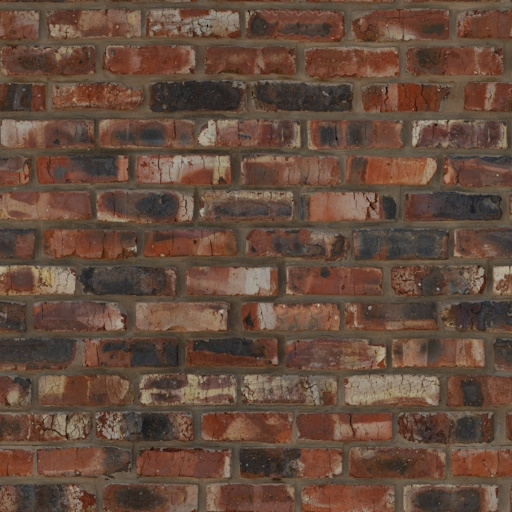
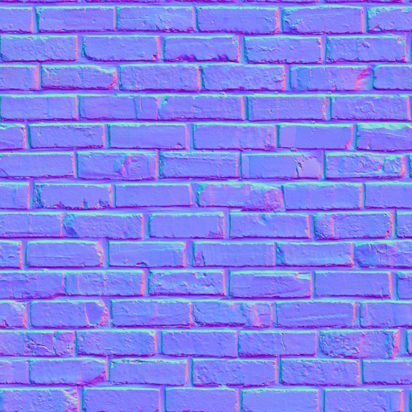
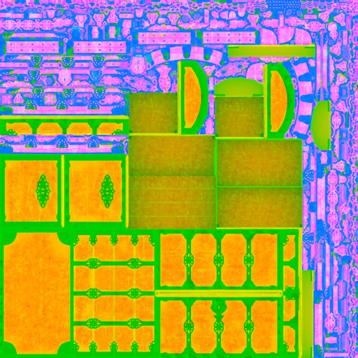
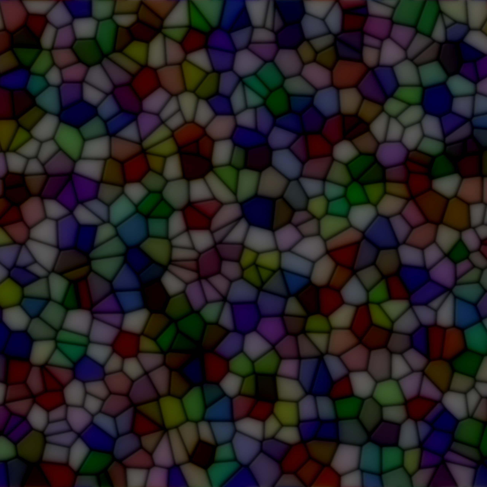
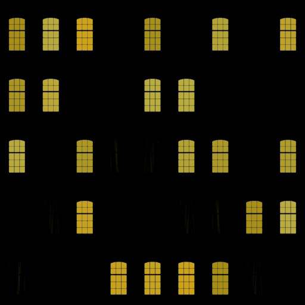
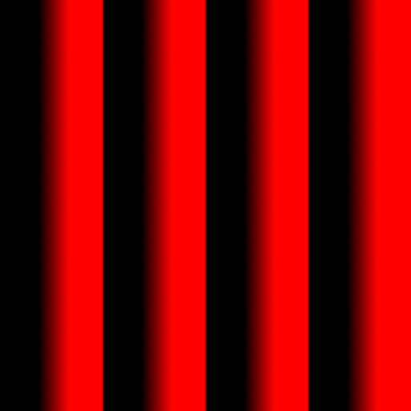

TinyFFR (short for "Tiny **Fixed-Function** Renderer") doesn’t use a programmable material pipeline; instead, it provides a small set of prebuilt material models based on predefined texture map types.

The following page explains the supported map types and material types and documents how to load/import/generate them.

## Map Types

All materials in TinyFFR are comprised of one or more texture "map" files. Texture files can have their data interpreted differently according to their map type. The map type defines how a texture's texel data is interpreted when rendered as part of a material.

The `AssetLoader` makes it easy to load texture files for all supported map types, detailed below:

### Color Maps

{ align=left : style="max-height:128px;" }

| AssetLoader Method           | `LoadColorMap(...)`                           |
| ---------------------------: | :-------------------------------------------- |
| Expected Channel Count       | 3 (RGB) or 4 (RGBA)                           |
| Expected Linear or sRGB      | Assumed sRGB                                  |

Also known as albedo or diffuse maps. When a texture is interpreted as a color map its data will be used to set the albedo/diffuse (e.g. the "base") color of a material.

When alpha data is present, the RGB channels are expected to be premultiplied (unless alpha is just being used as a on/off mask). Additionally, the way the alpha data is used depends on the material type and configuration (see corresponding material documentation below).

### Normal Maps

{ align=left : style="max-height:128px;" }

| AssetLoader Method           | `LoadNormalMap(...)`                          |
| ---------------------------: | :-------------------------------------------- |
| Expected Channel Count       | 3 (RGB)                                       |
| Expected Linear or sRGB      | Assumed linear                                |

Normal maps define how light bounces off a surface by defining which way the surface is 'facing' at each texel (relative to the surface's underlying polygon normal).

Normal maps are expected in OpenGL format. If using DirectX-formatted texture files, you can supply an optional `isDirectXFormat: true` argument to `LoadNormalMap()`. This adds a small increase in load time as the library will correct the data before passing it to the GPU.

The normal map is interpreted as a unit-length 3D vector where R, G, and B channels map to X, Y, and Z components in a normalized range (e.g. \[0 to 255\] maps to \[-1, 1\]). +X points towards the positive mesh tangent direction; +Y points towards the positive mesh bitangent direction; +Z points out of the texture, up away from the surface. Normal maps' Z component should always be positive or 0, never negative (i.e. the blue channel should always be >= 128).

### ORM(R) Maps

{ align=left : style="max-height:128px;" }

| AssetLoader Method           | `LoadOcclusionRoughnessMetallicMap(...)` / `LoadOcclusionRoughnessMetallicReflectanceMap(...)` |
| ---------------------------: | :--------------------------------------------------------------------------------------------- |
| Expected Channel Count       | 3 (RGB) or 4 (RGBA)                                                                            |
| Expected Linear or sRGB      | Assumed linear                                                                                 |

ORM maps (also known as ARM maps) combine the Ambient-**O**clusion, **R**oughness and **M**etallic information about a surface in to the red, green, and blue texture channels of a single texture.

ORMR maps are the same, but with the addition of **R**eflectance data in the alpha channel.

* The **Ambient Occlusion** data is used to determine how strongly ambient lighting (from the skybox/scene background) illuminates the material surface. Max value (255 or 1.0) indicates full ambient illumination, min value (0) indicates none whatsoever (e.g. fully occluded).
* The **Roughness** data is used to indicate how rough or smooth the material surface is; which in turn is used to determine how "glossy" or "shiny" it looks under lighting. Max value (255 or 1.0) indicates an extremely rough surface, min value (0) indicates a perfectly smooth one.
* The **Metallic** data is used to determine which parts of a material surface are comprised of metal (or metal-like substances). For realistic-looking materials every texel in a metallic map should either be max (255 or 1.0) to indicate metal or min (0) to indicate non-metal (also known as dielectric).
* The **Reflectance** data is optional (except for transmissive materials). 
	* For opaque surfaces this data indicates how much of the surrounding specular light is reflected back off the material. Max value (255 or 1.0) indicates the surface reflects a high amount of specular highlights, min value (0) indicates the surface reflects none.
	* For transmissive surfaces this data indicates the index of refraction of the surface, with higher values translating to a higher IoR.
	* Real-world materials tend to be in the range \[35% - 100%\], so for realistic surfaces stay within that range. The 50% value will behave like most common materials.

Sometimes ORM data will be supplied as multiple separate texture files (usually monochromatic, i.e. single-channel). The `AssetLoader` offers overloads of `LoadOcclusionRoughnessMetallicMap(...)` / `LoadOcclusionRoughnessMetallicReflectanceMap()` that make it easy to combine multiple files in to a single ORM/ORMR map.

Additionally, sometimes you may have only one or two of the required data textures (e.g. only roughness data, or no occlusion data, etc). In these instances it's possible to pass sensible default built-in texture files via `AssetLoader.BuiltInTexturePaths`:

* `AssetLoader.BuiltInTexturePaths.DefaultOcclusionMap`: Resolves to an occlusion texture that simply allows all ambient light to affect a material surface.
* `AssetLoader.BuiltInTexturePaths.DefaultRoughnessMap`: Resolves to a roughness texture that represents 40% roughness, a common 'default' value for materials that otherwise lack roughness information.
* `AssetLoader.BuiltInTexturePaths.DefaultMetallicMap`: Resolves to a metallic texture that represents a non-metallic surface (i.e. entirely dielectric).
* `AssetLoader.BuiltInTexturePaths.DefaultReflectanceMap`: Resolves to a reflectance texture that represents a typical reflectance of common materials (50% reflectance).

### Absorption-Transmission Maps

{ align=left : style="max-height:128px;" }

| AssetLoader Method           | `LoadAbsorptionTransmissionMap(...)`          |
| ---------------------------: | :-------------------------------------------- |
| Expected Channel Count       | 4 (RGBA)                                      |
| Expected Linear or sRGB      | Assumed sRGB                                  |

Absorption-transmission (AT) maps are only used for transmissive materials. They define how light passes through the surface of an object via two properties:

* The RGB channels define the absorption of the material: This indicates which light wavelengths (colours) are absorbed. The inverse of this value is therefore "seen" through the material; e.g. if the absorption map is pure yellow (255/255/0) only blue light will pass through the material surface.
* The alpha channel defines the transmission of the material: This indicates the intensity of light overall permitted through the material surface. A max value (255 or 1.0) indicates the surface is fully transparent and a min value (0) indicates the surface is fully opaque.

Commonly, absorption and transmission data may be delievered as two separate texture files; an overload of `LoadAbsorptionTransmissionMap()` allows passing a separate file path for each.

Additionally, you may wish to use a traditional colour map as an "inverse" absorption map: `LoadAbsorptionTransmissionMap()` allows you to specify an optional `invertAbsorption: true` argument for this purpose.

Finally, in cases where you do not have absorption or transmission data, some sensible defaults are provided via `AssetLoader.BuiltInTexturePaths`:

* `AssetLoader.BuiltInTexturePaths.DefaultAbsorptionMap`: Resolves to an absorption texture that allows all light colours to pass through (i.e. the texture itself is completely black, indicating no wavelengths are absorbed by the material surface).
* `AssetLoader.BuiltInTexturePaths.DefaultTransmissionMap`: Resolves to a transmission texture that allows 50% of light to pass through.
* `AssetLoader.BuiltInTexturePaths.DefaultAbsorptionTransmissionMap`: This resolves to an RGBA texture map that combines `DefaultAbsorptionMap` in the RGB channels and `DefaultTransmissionMap` in the alpha channel.

### Emissive Maps

{ align=left : style="max-height:128px;" }

| AssetLoader Method           | `LoadEmissiveMap(...)`                        |
| ---------------------------: | :-------------------------------------------- |
| Expected Channel Count       | 3 (RGB) or 4 (RGBA)                           |
| Expected Linear or sRGB      | Assumed sRGB                                  |

Emissive maps are used to create materials whose surfaces appear to emit light. The colour of each texel determines the colour of the light emitted at the corresponding point on the material surface.

* If a 3-channel (RGB) texture is provided, all emissive parts of the material surface are shown with maximum intensity. 
* If a 4-channel (RGBA) texture is provided, the alpha channel is used to control the emissive intensity; where a max value (255 or 1.0) indicates full intensity and a min value (0) indicates no emissive light at all.

If a separate intensity texture is desired, an overload of `LoadEmissiveMap()` allows provision of a separate colour and intensity map.

### Anisotropy Maps

{ align=left : style="max-height:128px;" }

| AssetLoader Method           | `LoadAnisotropyMapVectorFormatted(...)` / `LoadAnisotropyMapRadialAngleFormatted(...)` |
| ---------------------------: | :------------------------------------------------------------------------------------- |
| Expected Channel Count       | 3 (RGB)                                                                                |
| Expected Linear or sRGB      | Assumed linear                                                                         |

Anisotropy maps are used to indicate non-uniformity in the way a (typically metallic) surface reflects specular light highlights. A common example of this kind of effect in the real world can be seen in brushed metals.

TinyFFR internally stores anisotropy data as a 3-channel map where the red & green channels are the X and Y components of a unit vector pointing in the anisotropic direction of the surface in tangent-space and the blue channel indicates the strength of the anisotropy.

=== ":material-arrow-expand: Vector-formatted data"

	If your anisotropy data is stored in a texture already in the tangent-vector format, you can use `LoadAnisotropyMapVectorFormatted()`. 
	
	If you have only the X/Y tangent-vector data in the red & green channels but **not** strength data in the blue or alpha channel, you can still use `LoadAnisotropyMapVectorFormatted()` and pass `null` for the `strengthChannel` argument: All the data will be interpreted as maximum strength.
	
	Alternatively, if you have separate strength and tangent-vector data files, an overload of `LoadAnisotropyMapVectorFormatted()` is provided that lets you supply both file paths separately to be combined.

=== ":material-radar: Angle-formatted data"

	Your anisotropy data may instead be stored as radial angle data (where a single channel's data indicates the 'angle' of the anisotropy). In this case, you should use `LoadAnisotropyMapRadialAngleFormatted()`. 
 
	The arguments to `LoadAnisotropyMapRadialAngleFormatted()` are used to specify exactly how the data should be interpreted:
	
	<span class="def-icon">:material-code-json:</span> `zeroDirection`

	:   This argument specifies which direction on the 2D plane is considered '0'/'255' in the texel data.
	
	<span class="def-icon">:material-code-json:</span> `encodedRange`

	:   This argument specifies whether the \[0-255\] range in the texel data maps to \[0°-360°\] or \[0°-180°\].
	
	<span class="def-icon">:material-code-json:</span> `encodedAnticlockwise`

	:   This argument specifies the angle moves anticlockwise from 0 to 255, or whether it moves clockwise.
	
	<span class="def-icon">:material-code-json:</span> `strengthChannel`

	:   This argument specifies which channel in the texture file indicates anisotropic strength. You may pass `null` if no such data is present (in which case all the data will be interpreted as maximum strength).
	
		Alternatively, if you have separate strength and tangent-vector data files, an overload of `LoadAnisotropyMapRadialAngleFormatted()` is provided that lets you supply both file paths separately to be combined.
		
	Note that preprocessing of angle-formatted data to the vector-format that TinyFFR uses internally can take some time. A static method `IAssetLoader.ConvertRadialAngleToVectorFormatAnisotropy()` is provided in case you wish to offline-process angle-formatted data for faster consumption; this method allows you to convert a span of texels from the former format to the latter.
	
### Clearcoat Maps

{ align=left : style="max-height:128px;" }

| AssetLoader Method           | `LoadClearCoatMap(...)`                       |
| ---------------------------: | :-------------------------------------------- |
| Expected Channel Count       | 2 (RG)                                        |
| Expected Linear or sRGB      | Assumed linear                                |

Clearcoat maps are used to create an "overcoat" of plastic/wax over some types of materials.

TinyFFR uses a two-channel texture internally to support clearcoat maps.

* The first (red) channel represents the coat thickness; where a max value (255 or 1.0) indicates full thickness and a min value (0) indicates no clearcoat at all.
* The second (green) channel represents the coat roughness; where a max value (255 or 1.0) indicates a fully rough coat and a min value (0) indicates a fully glossy/smooth coat.

In the case where you have a separate thickness and roughness texture, an overload of `LoadClearCoatMap()` is available that can combine two separate texture files.

If you only have one data channel (e.g. only roughness or only thickness), you can use sensible default built-in texture files via `AssetLoader.BuiltInTexturePaths`:

* `AssetLoader.BuiltInTexturePaths.DefaultClearCoatThicknessMap`: Resolves to a clearcoat thickness texture that indicates a maximally-thick coat.
* `AssetLoader.BuiltInTexturePaths.DefaultClearCoatRoughnessMap`: Resolves to a clearcoat roughness texture that indicates a fully glossy/smooth coat.

## Material Types

### Standard Materials

Most objects in a typical scene will use a standard material. Standard material surfaces support the following map types:

* Color maps
* Normal maps
* ORM/ORMR maps
* Emissive maps
* Anisotropy maps
* Clearcoat maps

In fact, the only map type *not* supported by standard materials is the absorption-transmission map.

???+ tip "Fewer Maps is Better for Performance"
	Only supply map types that you actually need. Most typical objects only require a color, normal, and ORM map.
	
	Adding more maps to a standard material increases its rendering cost, and having many complex materials in your scene will likely reduce overall framerate.

Only the color map is mandatory, all other maps are optional.

When creating a standard material, you may optionally supply an ORM or ORMR map, either is fine. When using an ORM map, a default reflectance value will be used.

If your color map has an alpha channel, you may wish to specify the `StandardMaterialAlphaMode`. `MaskOnly` is the default, and interprets the alpha data as essentially turning various texels on/off for rendering (any texel below 40% alpha will be culled entirely, all other texels will be rendered opaque). Alternatively, `FullBlending` properly blends your object surface with the rest of the scene (but is more computationally expensive). `FullBlending` expects premultiplied alpha.

### Transmissive Materials

Transmissive materials must be considered if you want to use absorption-transmission maps or create realtime refractive or reflective surfaces. Transmissive materials support the following map types:

* Color maps
* Absorption-transmission maps
* Normal maps
* ORM/ORMR maps
* Emissive maps
* Anisotropy maps

Only clearcoat maps are not supported on transmissive materials.

???+ tip "Transmissive Materials are more Expensive"
	Transmissive materials are much more computationally expensive to render. Adding many transmissive materials to your scene will almost certainly reduce overall framerate.

	As with standard materials, only supply map types that you actually need.
	
The color map and absorption-transmission maps are mandatory. All other maps are optional.

If your color map has an alpha channel, you may wish to specify the `TransmissiveMaterialAlphaMode`. Unlike with a standard material, `FullBlending` is the default for transmissive materials. See above for an explanation of `FullBlending` vs `MaskOnly`.

When creating a transmissive material, you may also optionally supply a `refractionThickness` and a `TransmissiveMaterialQuality`.

* The `refractionThickness` value indicates how 'thick' (in meters) the surface should be modeled as. This affects how much light is absorbed (in conjunction with the absorption-transmission map).
* The `quality` value is set to `FullReflectionsAndRefraction` by default; enabling full screen-space refraction and reflection. If you don't need this, you could consider setting the quality to `SkyboxOnlyReflectionsAndRefraction` which will make the material instead only reflect/refract the scene background texture (this is less computationally expensive to render).

???+ warning "Renderer Quality Overrides Material Quality"
	Note that refractions/reflections may be disabled entirely by the overall quality settings set on your [Renderer](scenes_and_rendering.md#renderers).

### Simple Materials

Simple materials are unaffected by [lights](lighting.md). They only support color maps.

These materials are useful if you don't want or need more complex PBR rendering techniques, or want to render more diagnostic/analytical scenes.

Because they're unaffected by lighting you don't need to worry about how your scene will be lit.

When using a color map with alpha present, objects using simple materials are always blended with the scene (never masked).

### Test Material

`CreateTestMaterial()` creates either a simple or standard material depending on whether `ignoresLighting` is `false` or `true`. 

The output material is always the same: A UV-test color map (with a subtle normal map pattern if `ignoresLighting` was `false`).

## Material Effects

When creating any material (except the test material) you can optionally enable per-instance effects. 

???+ tip "Material Effects are more Expensive"
	Enabling effects on a material automatically makes it much more expensive to render; even if you don't use those effects on any objects.
	
	Only enable material effects occasionally and judiciously.

When enabled on a material, you can control the following parameters in real-time per-object for all objects using that material:

* Material transform (e.g. scale/rotation/translation of the textures on the surface).
* Blend textures (e.g. blending between two map textures) for any of the following types: Color maps, ORM/ORMR maps, emissive maps, absorption-transmission maps.

To use per-material effects on an object, make sure that object is using a material with effects enabled, and then access the effects controller via `myObjectInstance.MaterialEffects`. This property returns `null` if the current material set on the object does not support effects.

You can use the effects controller like this:

```csharp
var effectsController = myObjectInstance.MaterialEffects;
if (effectsController is { } c) { // (1)!
	c.SetTransform(new Transform2D(...)); // (2)!
	c.SetBlendTexture(MaterialEffectMapType.Color, destinationColorMap); // (3)!
	c.SetBlendDistance(MaterialEffectMapType.Color, 0.5f); // (4)!
}
```

1.	This is a C# null check, we only try to use the effects controller if it's non-null (indicating that the material supports effects).

2.	This sets the material transform (allowing you to dynamically scale, rotatate, or move the surface's texture maps in realtime).

3.	This sets a 'target'/destination color map texture. You can then blend (interpolate) between the color map the texture was created with and this new destination color map using the `SetBlendDistance()` function.

	Attempting to set/control a blend texture for a map type that the material wasn't originally created with has no effect.
	
4.	This sets the 'distance' between the starting color map of the material and our new destination color map to 50%. `0f` resets the material's color map to its starting state; `1f` completely replaces it with the new color map.

	If you haven't set a destination texture for this map type yet, the results are undefined (but safe).

## Loading & Combining Textures Manually

As well as using the `Load[...]Map()` methods described above, you can load texture data "raw" with `LoadTexture()`. When loading texture data this way you must at least specify whether the texture was authored in a linear or sRGB colourspace (via the `isLinearColorspace` argument). You can then use the returned `Texture` resource as any map type you desire.

#### LoadCombinedTexture(...)

Additionally, if you need to combine textures in to a single resource, you can use `LoadCombinedTexture(...)` to combine up to four separate files in to a single RGB or RGBA texture. Each `LoadCombinedTexture()` overload requires you to specify a `TextureCombinationConfig` that determines how the source files should be combined.

Some overloads of `LoadCombinedTexture()` also allow you to specify a pre-processing `TextureProcessingConfig` for each individual component texture. These configs are applied before the final combination processing.

[See below](#texture-config-objects) for more information on the various config objects.

### Built-In Textures

`AssetLoader.BuiltInTexturePaths` provides a collection of `ReadOnlySpan<char>` properties that can be passed to any texture-loading methods on the asset loader just like any other file path. These built-in texture paths represent pre-provided utility textures built in to TinyFFR that can be useful when creating maps:

<span class="def-icon">:material-card-bulleted-outline:</span> `Default[...]Map`

:	Various default maps that can be used to create sensible default texture resources for your materials. A default map is provided for every map type TinyFFR supports.

<span class="def-icon">:material-card-bulleted-outline:</span> `Rgba[...]Percent`

:	Each property represents an RGBA texture with every channel set to the same value. 

	The value chosen depends on the percentage specified in the property name (e.g. `Rgba100Percent` represents a texture with channel values 255/255/255/255, `Rgba0Percent` represents 0/0/0/0, `Rgba50Percent` represents 128/128/128/128, etc).
	
<span class="def-icon">:material-card-bulleted-outline:</span> `White`, `Black`, `Red`, `Green`, `Blue`, `RedGreen`, `GreenBlue`, `RedBlue`

:	Represents various RGB textures:

	* `White`: 255/255/255
	* `Black`: 0/0/0
	* `Red`: 255/0/0
	* `Green`: 0/255/0
	* `Blue`: 0/0/255
	* `RedGreen`: 255/255/0
	* `GreenBlue`: 0/255/255
	* `RedBlue`: 255/0/255
	
<span class="def-icon">:material-card-bulleted-outline:</span> `[...]Opaque`

:	Same as above, but RGBA with the alpha channel set to 255.

<span class="def-icon">:material-card-bulleted-outline:</span> `[...]Transparent`

:	Same as above, but RGBA with the alpha channel set to 0.

<span class="def-icon">:material-card-bulleted-outline:</span> `UvTestingTexture`

:	The color map used by the test material.


## Texture Config Objects

### TextureReadConfig

You can optionally provide a `TextureReadConfig` to some overloads of `LoadTexture()`. This struct controls how a texture file is read from disc:

<span class="def-icon">:material-card-bulleted-outline:</span> `FilePath`

:	This is the file path of the texture file to read.

<span class="def-icon">:material-card-bulleted-outline:</span> `IncludeWAlphaChannel`

:	Defaults to `true`. 

	If `true`, and the texture file includes an alpha channel, the alpha data will be included in the `Texture` resource loaded on the GPU.
	
	However, if you wish to exclude alpha data even when present, set this value to `false`.
	
### TextureCreationConfig

Many method overloads on the `AssetLoader` and `TextureBuilder` take a `TextureCreationConfig`. This struct can be used to control how a texture is created on the GPU when loaded:

<span class="def-icon">:material-card-bulleted-outline:</span> `GenerateMipMaps`

:	Defaults to `true`.

	`GenerateMipMaps` should generally be left as `true` unless the image/texture needs to retain maximum quality at all distances from the camera. 

	[Mipmaps](https://en.wikipedia.org/wiki/Mipmap) are a technique used to improve performance and reduce aliasing of objects at distance.

	You may also wish to disable mipmap generation to reduce video RAM consumption in constrained scenarios.
	
<span class="def-icon">:material-card-bulleted-outline:</span> `IsLinearColorspace`

:	This property has no default value (it is required to be specified).

	If `true`, the texture data is interpreted as being in a linear colourspace, otherwise the texture data is interpreted in sRGB.
	
	As a rule of thumb, data-oriented texture maps (such as normal maps, ORM maps, anisotropy maps, and clearcoat maps) are typically in linear colourspace; whereas texture maps that contain colour data (such as color maps, absorption-transmission maps, and emissive maps) are typically in sRGB colourspace.

<span class="def-icon">:material-card-bulleted-outline:</span> `ProcessingToApply`

:	This is a `TextureProcessingConfig` that indicates how, if at all, the texture data should be processed before being loaded on to the GPU.

	By default this is set to `TextureProcessingConfig.None`; see below for more information on this type.

### TextureProcessingConfig

A `TextureProcessingConfig` object is used to determine if and how texture data should be pre-processed before being loaded. It has the following properties and methods:

<span class="def-icon">:material-card-bulleted-outline:</span> `FlipX` / `FlipY`

:	Defaults to `false`. If set to `true`, the texture will be mirrored/flipped along its horizontal/X-axis (`FlipX`) and/or vertical/Y-axis (`FlipY`).

<span class="def-icon">:material-card-bulleted-outline:</span> `InvertXRedChannel` / `InvertYGreenChannel` / `InvertZBlueChannel` / `InvertWAlphaChannel`

:	Defaults to `false`. If set to `true`, the corresponding channel of the texture will be negated/inverted.

	Negation in this context means inverting the strength of the colour for each pixel; i.e. if a pixel had 100% strength of this colour it will now have 0%; if it had 80% it will have 20%; and so on.

	This is mostly useful when dealing with image maps that are defining things other than colour/albedo/diffuse values (such as ORM maps and normal maps). If the channel for a given value in such a map was exported with a reversed meaning, this parameter can be used to invert/reverse it back.

	For example, if we want to use a "glossiness" map that defines `0f` as fully rough and `1f` as fully smooth we will need to invert that value for use in TinyFFR as a roughness map.

<span class="def-icon">:material-card-bulleted-outline:</span> `XRedFinalOutputSource` / `YGreenFinalOutputSource` / `ZBlueFinalOutputSource` / `WAlphaFinalOutputSource`

:	These properties can be used to swap the channels of a texture (i.e. you can swap Red and Green, or copy Blue to Alpha, etc) (also known as "[swizzling](https://community.khronos.org/t/what-is-texture-swizzling/66666)").

	Each property determines the source data for the final value of its corresponding channel. For example, setting `XRedFinalOutputSource` to `ColorChannel.G` means the **green** data channel will be copied to the **red** channel.
	
	These copy/swizzle operations happen as the very final step in texture processing, after flipping/inverting has occured.
	
	By default, each property is set to its own channel (e.g. `XRedFinalOutputSource` is set to `ColorChannel.R`, `YGreenFinalOutputSource` is set to `ColorChannel.G`, and so on).
	
<span class="def-icon">:material-code-block-parentheses:</span> `Flip(...)`

:   This static method (e.g. `TextureProcessingConfig.Flip(...)`) helps create a processing config that applies a flip only.

<span class="def-icon">:material-code-block-parentheses:</span> `Invert(...)`

:   This static method (e.g. `TextureProcessingConfig.Invert(...)`) helps create a processing config that applies channel inversions only.

<span class="def-icon">:material-code-block-parentheses:</span> `Swizzle(...)`

:   This static method (e.g. `TextureProcessingConfig.Swizzle(...)`) helps create a processing config that applies channel swaps/swizzling only.

<span class="def-icon">:material-card-bulleted-outline:</span> `None`

:	This static property (e.g. `TextureProcessingConfig.None`) returns a processing config object that represents zero/no processing to be applied.

### TextureCombinationConfig

This config object type is used when combining multiple textures in to one. It determines how the source files should be compiled in to the output:

```csharp
/* This example shows a config that indicates the Red channel should be used from each source texture (a/b/c/d) 
 * to comprise the output texture's R/G/B/A channels. */
var combinationConfig = new TextureCombinationConfig(
	new TextureCombinationSource(TextureCombinationSourceTexture.TextureA, ColorChannel.R),
	new TextureCombinationSource(TextureCombinationSourceTexture.TextureB, ColorChannel.R),
	new TextureCombinationSource(TextureCombinationSourceTexture.TextureC, ColorChannel.R),
	// This last line is optional depending on whether you want the output texture to include an alpha channel
	new TextureCombinationSource(TextureCombinationSourceTexture.TextureD, ColorChannel.R)
);

/* This slightly terser example copies texture A's Red and Green channels to the output texture's R/G channels 
 * and texture B's Red and Green channels to the output texture's B/A channels. */
var combinationConfig = new TextureCombinationConfig(
	TextureCombinationSourceTexture.TextureA, ColorChannel.R,
	TextureCombinationSourceTexture.TextureA, ColorChannel.G,
	TextureCombinationSourceTexture.TextureB, ColorChannel.R,
	// This last line is optional depending on whether you want the output texture to include an alpha channel
	TextureCombinationSourceTexture.TextureB, ColorChannel.G
);

/* This final example uses a string to specify how the textures should be combined.
 * This has the same effect as the other approaches above but is arguably easier to read.
 * The format of the string is 6 or 8 characters (depending on if the output should include alpha or not)
 * and each destination channel is specified in the order RGBA by two characters
 * (e.g. 'aR' indicates the output red is given by red channel of texture A, 
 * 'bG' indicates the output green is given by green channel of texture B, and so on). */
var combinationConfig = new TextureCombinationConfig("aRbGcBdA");
```

## Generating Textures

As well as loading textures from files, it's possible to instead programmatically create `Texture` resources with the `TextureBuilder` (accessible via `factory.TextureBuilder` or `factory.AssetLoader.TextureBuilder`):

`textureBuilder.CreateTexture()` is the most "fundamental" method that allows you to create a `Texture` using simply a `ReadOnlySpan<>` of texels. The span must be of a valid texel type (usually `ReadOnlySpan<TexelRgb24>` or `ReadOnlySpan<TexelRgba32>`).

It's also possible to create a 1x1 plain texture passing in a single `TexelRgb24`/`TexelRgba32` instead of a span.

???+ info "Texture Patterns"

	Many methods on the `TextureBuilder` can also take a `TexturePattern<T>` argument. Texture patterns are created via the static `TexturePattern` class and are essentially mini-algorithms that define how to auto-generate texture data.

	Texture patterns are explained in detail in the reference docs: [Texture Patterns](/reference/texture_patterns.md).

### Generating Map Textures

<span class="def-icon">:material-code-block-parentheses:</span> `CreateColorMap(...)`

:   Color maps are generated using `ColorVect`s. You must also specify whether or not to `includeAlpha` (e.g. whether the output `Texture` will be RGB or RGBA).

	If you wish to incorporate alpha in to your color map, you should be using premultiplied color vects. `colorVect.WithPremultipliedAlpha()` can be used to achieve this.

<span class="def-icon">:material-code-block-parentheses:</span> `CreateNormalMap(...)`

:   Normal maps are generated using `SphericalTranslation`s. The translation represents the azimuthal and polar offset applied to a default normal vector.

	Any value greater than `0°` for `PolarOffset` will "bend" the texture normal towards the direction determined by the `AzimuthalOffset`.
		
	* 	`AzimuthalOffset` can be any angle and it represents the 2D orientation of the texel's normal direction. In other words, this parameter specifies the **direction of distortion** on the surface. 
	
		The mapping of angle to actual world direction depends on the mesh you're using(1) and any rotation of the model instance. For a non-rotated `Cuboid` built using the standard method shown previously in "Hello Cube" the [standard convention](/tutorials/conventions.md/#2d-handedness-orientation) applies(2).
		{ .annotate }

		1. 	A value of `0°` points along the mesh's "U" axis (also known as its **tangent** direction). 
		
			A value of `90°` points along the mesh's "V" axis (also known as its **bitangent** direction).

			See [Meshes](/tutorials/meshes.md/#meshvertex) for more information on U/V axes.

		2.	So, for a standard `Cuboid` mesh, `0°` means the normal points rightward, `90°` upward, `180°` leftward, and `270°` downward along the surface.

	* 	`PolarOffset` should be an angle between `0°`and `90°` and it represents **how distorted** the surface is. 
	
		A value of `0°` means the texel normal direction will point perfectly straight out from the surface (indicating a perfectly flat surface at this point). 
		
		A value of `90°` means the texel normal direction will be completely flattened against the surface (indicating a 100% distorted surface).
		
<span class="def-icon">:material-code-block-parentheses:</span> `CreateOcclusionRoughnessMetallicMap(...)` / `CreateOcclusionRoughnessMetallicReflectanceMap(...)`

:   ORM/ORMR maps are generated using `Real`s (`Real` is implicitly convertible to/from `float`). 

	Every value is expected to be in the range `0f` to `1f`.

<span class="def-icon">:material-code-block-parentheses:</span> `CreateAbsorptionTransmissionMap(...)`

:   AT maps are generated using `ColorVect`s for the absorption data and `Real`s for the transmission data (`Real` is implicitly convertible to/from `float`). 

	The alpha channel for every `ColorVect` value is ignored.
	
	Every `Real` value is expected to be in the range `0f` to `1f`.
	
<span class="def-icon">:material-code-block-parentheses:</span> `CreateEmissiveMap(...)`

:   Emissive maps are generated using `ColorVect`s for the color data and `Real`s for the intensity data (`Real` is implicitly convertible to/from `float`). 

	The alpha channel for every `ColorVect` value is ignored.
	
	Every `Real` value is expected to be in the range `0f` to `1f`.
	
<span class="def-icon">:material-code-block-parentheses:</span> `CreateAnisotropyMap(...)`

:   Anisotropy maps are generated using `Angle`s for the anisotropy direction data and `Real`s for the anisotropy strength data (`Real` is implicitly convertible to/from `float`). 

	The `Angle` for every direction value is converted to a tangent-space vector according to the [standard convention](/tutorials/conventions.md#2d-handedness-orientation).
	
	Every `Real` value is expected to be in the range `0f` to `1f`.
	
<span class="def-icon">:material-code-block-parentheses:</span> `CreateClearCoatMap(...)`

:   Clearcoat maps are generated using `Real`s (`Real` is implicitly convertible to/from `float`). 

	Every value is expected to be in the range `0f` to `1f`.
	
#### Default Texture Values

`ITextureBuilder` has some static properties/methods that can be useful for supplying default values or precalculating texel data when generating textures.

## Reading & Modifying Texture Data

The factory's `AssetLoader` lets you read texture data in to a texel buffer. You can use this to modify a loaded texture's data and then pass it to `CreateTexture()` in the same way:

```csharp
var assLoad = factory.AssetLoader;

var textureMetadata = assLoad.ReadTextureMetadata(@"Path\To\tex.jpg"); // (1)!
var texelBuffer = factory.ResourceAllocator
	.CreatePooledMemoryBuffer<TexelRgb24>(textureMetadata.Width * textureMetadata.Height);

assLoad.ReadTexture(@"Path\To\tex.jpg", texelBuffer.Span); // (2)!

// Do stuff with texelBuffer here

// Optional: Load the texture on to the GPU with the material builder
using var colorMap = assLoad.TextureBuilder.CreateTexture(
	texelBuffer.Span, 
	dimensions: textureMetadata.Dimensions, 
	isLinearColorspace: false
);

// Don't forget to return the rented buffer
factory.ResourceAllocator.ReturnPooledMemoryBuffer(texelBuffer);
```

1. `ReadTextureMetadata()` will tell you the width and height of the texture in texels. You can then use this data to allocate a texel buffer.
2. `ReadTexture()` will read a texture's texel data in to a preallocated buffer.

You can also use `ReadCombinedTexture()` instead of [LoadCombinedTexture()](#loadcombinedtexture) to read the output data in to a texel buffer instead of creating a `Texture` resource.
