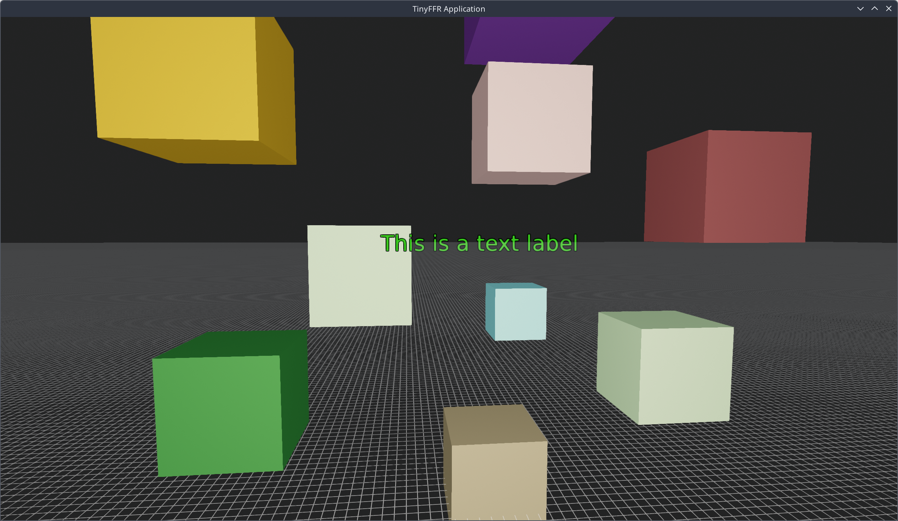

<div class="grid cards" markdown>

-   :octicons-beaker-16:{ : style="margin-right:0.3em" } __Overview__ [__View Code on Github &nbsp; :simple-github:__](https://github.com/Egodystonic/TinyFFR/tree/main/Examples/UserInput){ : style="position: absolute; right: 1em;" }

    { align=right : style="max-width:50%; margin: 0em; margin-left: 1em;" }
    
    This tutorial builds on [Hello Cube](hello_cube.md). In this example, we will:

	* Use a camera controller to fly the camera around the world;
	* Add, remove, and rescale cubes in the scene;
	* Let the user type a text label in to the scene when Enter is pressed;
	* Exit the application when pressing Escape.

	It's assumed that you've read the [Hello Cube](hello_cube.md) tutorial first, as things that were explained there won't be explained again in detail here.

</div>

## Project Setup

Unlike Hello Cube, this example is set up as an ordinary .NET project. You can create one in an empty folder with the following two commands:

```
dotnet new console
dotnet add package Egodystonic.TinyFFR --prerelease
```

Alternatively, create a folder containing a `UserInput.csproj` file with the following contents:

```xml
<Project Sdk="Microsoft.NET.Sdk">

	<PropertyGroup>
		<OutputType>Exe</OutputType>
		<TargetFramework>net10.0</TargetFramework>
		<ImplicitUsings>enable</ImplicitUsings>
		<Nullable>enable</Nullable>
	</PropertyGroup>

	<ItemGroup>
		<PackageReference Include="Egodystonic.TinyFFR" Version="*" />
	</ItemGroup>

</Project>
```

Then, replace the contents of `Program.cs` with the code shown below.

### Running the Application

Open a terminal or command prompt in your project folder and run: `dotnet run -c Release`.

A window will appear showing a chequered ground plane, and the mouse cursor will be captured by the window. The controls are:

| Input | Action |
| :-- | :-- |
| Mouse | Look around (while not typing) |
| Arrow keys | Fly forward/backward/left/right (while not typing) |
| Right Shift / Right Ctrl | Fly up / down (while not typing) |
| Space | Add a cube in front of the camera |
| Enter | Start typing a text label in front of the camera; press Enter again to confirm it |
| Backspace | Remove everything from the scene (or, while typing, delete the last character) |
| Mouse wheel | Grow / shrink the last cube you added (5cm per stop) |
| Escape | Exit |

## Annotated Code

This is the entirety of the "User Input" example's `Program.cs`. Click on the :material-message-question: icons next to each line to learn more.

```csharp
using System.Text;
using Egodystonic.TinyFFR;
using Egodystonic.TinyFFR.Environment.Input;
using Egodystonic.TinyFFR.Factory.Local;
using Egodystonic.TinyFFR.Resources.Memory;
using Egodystonic.TinyFFR.World;

// Variables & constants
// (1)!
const string PlaceholderText = "Awaiting Text Input...";
var inProgressTextPrimitive = (ScenePrimitive?) null;
var inProgressTextLocation = new Location();
var inProgressTextChars = (INonDisposableArrayPoolBackedList<char>?) null;
var mostRecentlyAddedCubePrimitive = (ScenePrimitive?) null;
var mostRecentlyAddedCubeShape = PositionedRotatedCuboid.UnitCubeAtOriginUnrotated;
var groundPlaneShape = new Plane(Direction.Up, Location.Origin);

// Setup
using var factory = new LocalTinyFfrFactory();
var primaryDisplay = factory.DisplayDiscoverer.Primary ?? throw new InvalidOperationException("No display connected!");
using var window = factory.WindowBuilder.CreateWindow(primaryDisplay);
using var scene = factory.SceneBuilder.CreateScene();
using var camera = factory.CameraBuilder.CreateCamera();
using var cameraController = camera.CreateController<FreeFlyingCameraController>(); // (2)!
using var renderer = factory.RendererBuilder.CreateRenderer(scene, camera, window);
using var loop = factory.ApplicationLoopBuilder.CreateLoop();

window.LockCursor = true; // (3)!
cameraController.Position = (0f, 1f, -3f); // (4)!
scene.AddPrimitiveShape(groundPlaneShape); // (5)!

// Loop
while (!loop.Input.UserQuitRequested) {
	var deltaTime = loop.IterateOnce().AsDeltaTime();
	var kbm = loop.Input.KeyboardAndMouse; // (6)!

	if (kbm.KeyWasPressedThisIteration(KeyboardOrMouseKey.Escape)) break; // (7)!

	var spawnLocation = camera.Position 
		+ camera.GetRelativeOrientationDirection(Orientation.Forward) * 2f; // (8)!

	if (inProgressTextChars is not { } list) { // (9)!
		if (kbm.KeyWasPressedThisIteration(KeyboardOrMouseKey.Backspace)) { // (10)!
			scene.RemoveAll(); // (11)!
			scene.AddPrimitiveShape(groundPlaneShape); // (12)!
			mostRecentlyAddedCubePrimitive = null; // (13)!
		}
	
		if (kbm.KeyWasPressedThisIteration(KeyboardOrMouseKey.Space)) {
			mostRecentlyAddedCubeShape = new PositionedRotatedCuboid( // (14)!
				new Cuboid(0.5f), 
				spawnLocation, 
				Rotation.None
			);
			mostRecentlyAddedCubePrimitive = scene.AddPrimitiveShape( // (15)!
				mostRecentlyAddedCubeShape, 
				new PrimitivePaintbrush(ColorVect.RandomOpaque())
			);
		}
		
		if (kbm.MouseScrollWheelDelta != 0 && mostRecentlyAddedCubePrimitive is { } primitive) { // (16)!
			var adjustedShape = mostRecentlyAddedCubeShape
				.WithAllExtentsAdjustedBy(-kbm.MouseScrollWheelDelta * 0.05f); // (17)!
			if (adjustedShape.SmallestExtent >= 0.05f) { // (18)!
				mostRecentlyAddedCubeShape = adjustedShape; // (19)!
				primitive.SetGeometryShape(mostRecentlyAddedCubeShape); // (20)!
			}
		}

		if (kbm.KeyWasPressedThisIteration(KeyboardOrMouseKey.Return)) {
			inProgressTextChars = factory.ResourceAllocator.GetSharedScratchList<char>(); // (21)!
			inProgressTextLocation = spawnLocation; // (22)!
			inProgressTextPrimitive = scene.AddPrimitiveString( // (23)!
				inProgressTextLocation, 
				PlaceholderText, 
				ScenePrimitiveSize.VeryLarge
			);
			loop.EnableInputTextTranscription = true; // (24)!
		}
		
		cameraController.AdjustAllViaDefaultControls(kbm, deltaTime); // (25)!
		cameraController.Progress(deltaTime); // (26)!
	}
	else { // (27)!
		list.AddRange(kbm.TranscribedText); // (28)!
		if (kbm.KeyWasPressedThisIteration(KeyboardOrMouseKey.Backspace) && list.Count > 0) { // (29)!
			list.RemoveAt(list.Count - 1);
		}
		inProgressTextPrimitive!.Value.SetGeometryString( // (30)!
			inProgressTextLocation, 
			list.Count > 0 ? list.BackingSpan : PlaceholderText, 
			ScenePrimitiveSize.VeryLarge
		);

		if (kbm.KeyWasPressedThisIteration(KeyboardOrMouseKey.Return)) { // (31)!
			inProgressTextPrimitive!.Value.SetPaintbrush(new PrimitivePaintbrush(StandardColor.Green, StandardColor.Black));
			loop.EnableInputTextTranscription = false;
			inProgressTextPrimitive = null;
			inProgressTextChars = null;
		}
	}

	renderer.Render();
}
```

1.	The variables declared here are each explained at the point they're used below.

2.	Here we create a camera *controller* attached to `camera`. Whereas camera objects in TinyFFR have fundamental controls allowing you to position, rotate, orient them etc, a *camera controller* lets you operate a camera according to a specific control scheme (either via user input or programmatically).

	In this case we're creating a `FreeFlyingCameraController`, which makes it easy to "fly" the camera around the scene, using the keyboard to move the camera and the mouse to re-orient it.
	
3.	Setting `window.LockCursor` to `true` means that as soon as the window gets focus it will "steal" and lock the mouse cursor inside it.

	This is useful for applications where want the mouse to control the camera.
	
4.	Now that we have a camera controller controlling `camera`, we must set our target position etc. via the controller.

5.	This adds a ground plane to the scene (shown as an infinitely-large grid). 

	You don't necessarily *need* this, but it helps maintain a sense of orientation when moving the camera around.
	
6.	This sets `kbm` as a reference to the latest keyboard and mouse input data.

	Iterating the loop via `loop.IterateOnce()` updates system-wide input; and the latest state + events are made available via `loop.Input`.
	
7.	This asks if the 'Escape' key was pressed by the user in this frame.

	If it was, we `break` our application loop, which will ultimately cause the program to end.
	
8.	This sets a position in the scene where we'll spawn a cube or text instance, if the user has requested one.

	We calculate the `spawnLocation` as being two metres in front of the camera: We take the camera's current position (`camera.Position`) then add (`+`) the camera's current forward direction (`camera.GetRelativeOrientationDirection(Orientation.Forward)`) multiplied by two metres (`* 2f`).
	
9.	This if-statement checks whether we're currently editing a newly-created text label. If we're not, `inProgressTextChars` will be null.

10.	This if-statement asks whether the user pressed their 'Backspace' key in this frame.

11.	As its name implies, this removes everything from the `scene` (including all the `ScenePrimitive`s we've added so far).

12.	Because we just removed everything from the scene, we need to re-add our ground plane primitive.

13.	We null-out the most-recently-added cube instance as it's no longer part of the scene.

14.	This sets the `mostRecentlyAddedCubeShape` variable to a 0.5m x 0.5m x 0.5m cube, placed at `spawnLocation` with no rotation.

	We set the variable so we can re-use and modify the shape later if the user moves their mouse scroll wheel.
	
15.	This adds a new cube to the scene, using the `mostRecentlyAddedCubeShape` as its shape definition, and a random opaque colour for its colour.

16.	This asks if the user has moved the mousewheel this frame (`MouseScrollWheelDelta` will be positive when the user scrolls down, negative when scrolling up, and `0` when no scrolling occurs).

	It also asks if the `mostRecentlyAddedCubePrimitive` is not null, indicating that there is at least one cube primitive in the scene.
	
17.	This adjusts the extents (the width, height, and depth) of `mostRecentlyAddedCubeShape` by 5cm multiplied by the negative of `MouseScrollWheelDelta`; and stores the result in `adjustedShape`.

	This means that if we scroll up the shape gets larger, and if we scroll down the shape gets smaller.
	
18.	This line basically checks that the shape hasn't got too small; if it's smaller than 5cm x 5cm x 5cm we won't change anything in the scene.

	`SmallestExtent` returns whichever is smallest of the width, height, or depth.
	
19.	Once we're inside this if-block we're intending to update the most recently added primitive, so here we first update its shape description.

20.	This line does the actual update of the scene primitive by setting its geometry to the newly-updated cube shape.

21.	This sets `inProgressTextChars` to a *shared scratch list* of `char`s. 

	TinyFFR generally tries to make it easy to avoid creating GC pressure as it can lead to stuttering. The `ResourceAllocator` can give us an `IList<char>` that is reusable, that it calls a 'shared scratch' list.
	
	The returned list will be empty, and we'll use it store the text characters the user enters in subsequent frames.
	
	You don't have to use this; if GC stops are not as important to you a regular `List<char>` will work fine too.

22.	We retain the location we're spawning this label at so we can modify the label later as the user enters more text.

23.	This adds a new type of scene primitive, a string. We set the primitive's location as the `inProgressTextLocation`, set its text to `PlaceholderText`, and make the text size `VeryLarge`.

24.	This tells the application loop that we want to transcribe all user input in to text until disabled again.

	Text transcription mode makes it easy to capture text-based input strings; it accounts for the user's locale, things like modifier keys, caps-lock, etc.
	
25.	This adjusts all target parameters of the `FreeFlyingCameraController` according to the user's keyboard + mouse input.

	By default, the mouse moves the camera's orientation and the keyboard makes it fly through space (see [Running the Application](#running-the-application) above for the default control scheme).
	
26.	The line above changed the target parameters of the camera controller; but to actually move the camera *towards* those targets we must invoke `Progress()`.

27.	We enter this if-block only when `inProgressTextChars` is not null; indicating that the user is currently entering text.

28.	This adds all the transcribed text from the user registered during this frame to the scratch `list`.

29.	If the user presses the 'Backspace' key while entering text (and the scratch `list` has at least one character), we delete the most-recent character.

30.	Here we update the `inProgressTextPrimitive` with the latest text stored in `list`.

	`list.BackingSpan` lets us access the `Span<char>` that backs the list, meaning we can avoid allocating a new array of chars.
	
31.	Finally, when the user presses 'Return' in text-edit mode we commit their text by changing it to a green colour with black outline, disable text-transcription mode, and null-out the two in-progress text data tracking variables.

	Disabling text-transcription mode is important because it can "swallow" inputs when enabled (i.e. user input is redirected towards text capture).

## Stuff to Tinker With

Here are some things you can experiment with (with links to relevant documentation pages).

* [:material-book-open-page-variant: Gamepad Input](../reference/gamepad_input.md): You could try adding game controller support.
* [:material-book-open-page-variant: Free-Flying Camera Controller](../reference/camera_controller_free_flying.md): You could try writing your own control scheme instead of using the default controls for the camera controller; or change the smoothing and other factors of the controller's behaviour.
* [:material-book-open-page-variant: Camera Controllers](../reference/camera_controllers.md): You could try swapping in a different camera controller type entirely.
