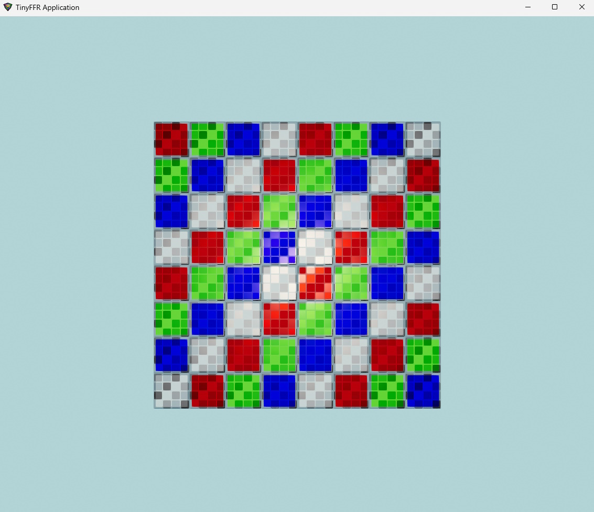
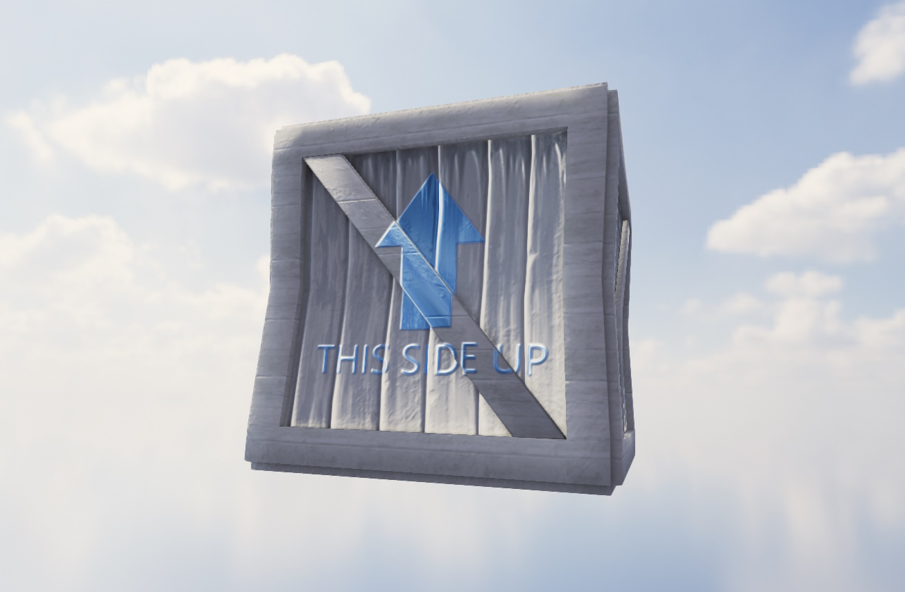

#  TinyFFR

A **Tiny** **F**ixed **F**unction **R**enderer library for C#/.NET 9.

* Distributed via NuGet
* Free for commercial and non-commercial use (see license)
* Features:
  * Physically-based rendering (via [filament](https://github.com/google/filament))
  * Asset loading (via [assimp](https://github.com/assimp/assimp) and [stb_image](https://github.com/nothings/stb))
  * Window management and input handling (via [SDL](https://github.com/libsdl-org/SDL))
  * Fully-abstracted math & geometry API - no pre-existing 3D or linear algebra knowledge required
  * Zero-GC design

> [!CAUTION]
> TinyFFR is currently in early prerelease. There will be bugs. Please have patience and consider reporting any issues you find in this repository.

## Manual

Manual is available at [tinyffr.dev](https://tinyffr.dev).

## Examples

### Hello Cube

This is a complete example; the code shown below is all that is required to render the given image (and rotate it when holding the spacebar):



```csharp
// The factory object is used to create all other resources
using var factory = new LocalTinyFfrFactory();

// Create a cuboid mesh and load an instance of it in to the world with a test material
using var mesh = factory.AssetLoader.MeshBuilder.CreateMesh(new Cuboid(1f)); // 1m cube
using var instance = factory.ObjectBuilder.CreateModelInstance(mesh, factory.AssetLoader.MaterialBuilder.TestMaterial);

// Create a light to illuminate the cube
using var light = factory.LightBuilder.CreatePointLight(Location.Origin);

// Create a window to render to, a scene to render, a camera to capture the scene, and a renderer to render it all
using var window = factory.WindowBuilder.CreateWindow(factory.DisplayDiscoverer.Primary!.Value);
using var scene = factory.SceneBuilder.CreateScene();
using var camera = factory.CameraBuilder.CreateCamera();
using var renderer = factory.RendererBuilder.CreateRenderer(scene, camera, window);

// Add the cube instance and light to the scene
scene.Add(instance);
scene.Add(light);

// Put the cube 2m in front of the camera
instance.SetPosition(new Location(0f, 0f, 2f));

// Keep rendering at 60Hz until the user closes the window
// If we're holding space down, rotate the cube
using var loop = factory.ApplicationLoopBuilder.CreateLoop(60);
while (!loop.Input.UserQuitRequested) {
	var dt = (float) loop.IterateOnce().TotalSeconds;

	if (loop.Input.KeyboardAndMouse.KeyIsCurrentlyDown(KeyboardOrMouseKey.Space)) {
		instance.RotateBy(new Rotation(angle: 90f, axis: Direction.Down) * dt);
	}

	renderer.Render();
}
```

----

### Asset Loading

This snippet demonstrates how to load texture and mesh files:



```csharp
var loader = factory.AssetLoader;

// Load albedo, normal, and occlusion/roughness/metallic map from specular-model PNG files
using var albedo = loader.LoadTexture("Crate.png");
using var normal = loader.LoadTexture("CreateNormals.png");
using var orm = loader.LoadAndCombineOrmTextures(roughnessMapFilePath: "CrateSpecular.png", metallicMapFilePath: "CrateSpecular.png", config: new() { InvertYGreenChannel = true });

// Create material
using var mat = loader.MaterialBuilder.CreateOpaqueMaterial(albedo, normal, orm);

// Load .obj mesh and scale it down
using var mesh = loader.LoadMesh("Crate.obj", new MeshCreationConfig { LinearRescalingFactor = 0.03f });

// Load HDR cubemap
using var cubemap = loader.LoadEnvironmentCubemap("SkyClouds.hdr");
```
